# vSPACE: (e)voting in a Scalable Privacy-Aware and Confidential Environment - Tech Spec v0.1 (Draft)


## Table of Contents

- [1. Introduction](#1-introduction)
  - [1.1 Executive Summary](#11-executive-summary)
    - [1.1.1 Project Overview](#111-project-overview)
    - [1.1.2 Core Business Problem](#112-core-business-problem)
    - [1.1.3 Key Stakeholders and Users](#113-key-stakeholders-and-users)
    - [1.1.4 Business Impact and Value Proposition](#114-business-impact-and-value-proposition)
  - [1.2 System Overview](#12-system-overview)
    - [1.2.1 Project Context](#121-project-context)
      - [Business Context and Market Positioning](#business-context-and-market-positioning)
      - [Seven-Repository Ecosystem Architecture](#seven-repository-ecosystem-architecture)
      - [Integration with Existing Enterprise Landscape](#integration-with-existing-enterprise-landscape)
    - [1.2.2 High-Level Description](#122-high-level-description)
      - [Primary System Capabilities](#primary-system-capabilities)
      - [Major System Components](#major-system-components)
      - [Core Technical Approach](#core-technical-approach)
    - [1.2.3 Success Criteria](#123-success-criteria)
      - [Measurable Objectives](#measurable-objectives)
      - [Critical Success Factors](#critical-success-factors)
      - [Key Performance Indicators](#key-performance-indicators)
  - [1.3 Scope](#13-scope)
    - [1.3.1 In-Scope](#131-in-scope)
      - [Core Features and Functionalities](#core-features-and-functionalities)
      - [Primary User Workflows](#primary-user-workflows)
      - [Essential Integrations](#essential-integrations)
      - [Key Technical Requirements](#key-technical-requirements)
      - [Implementation Boundaries](#implementation-boundaries)
    - [1.3.2 Out-of-Scope](#132-out-of-scope)
      - [Explicitly Excluded Features and Capabilities](#explicitly-excluded-features-and-capabilities)
      - [Future Phase Considerations](#future-phase-considerations)
      - [Integration Points Not Covered](#integration-points-not-covered)
      - [Unsupported Use Cases](#unsupported-use-cases)
      - [References](#references)
      - [Repository Files Examined](#repository-files-examined)
      - [Repository Folders Examined](#repository-folders-examined)
      - [External Sources](#external-sources)
- [2. Product Requirements](#2-product-requirements)
  - [2.1 FEATURE CATALOG](#21-feature-catalog)
    - [2.1.1 Feature Classification Summary](#211-feature-classification-summary)
    - [2.1.2 ElectionGuard Core2 Feature Details](#212-electionguard-core2-feature-details)
      - [F-001: Modular Arithmetic Engine](#f-001-modular-arithmetic-engine)
      - [F-002: ElGamal Encryption System](#f-002-elgamal-encryption-system)
      - [F-003: Chaum-Pedersen Zero-Knowledge Proofs](#f-003-chaum-pedersen-zero-knowledge-proofs)
      - [F-004: Hash and HMAC Primitives](#f-004-hash-and-hmac-primitives)
      - [F-005: Precomputation Engine](#f-005-precomputation-engine)
      - [F-006: Election Manifest Management](#f-006-election-manifest-management)
      - [F-007: Ballot Lifecycle Management](#f-007-ballot-lifecycle-management)
      - [F-008: Encryption Workflow Orchestration](#f-008-encryption-workflow-orchestration)
      - [F-009: Cross-Language Binding Layer](#f-009-cross-language-binding-layer)
      - [F-010: MongoDB Persistence Layer](#f-010-mongodb-persistence-layer)
      - [F-011: CLI Tooling](#f-011-cli-tooling)
      - [F-012: Cross-Platform Build System](#f-012-cross-platform-build-system)
    - [2.1.3 vSPACE Extension Feature Details](#213-vspace-extension-feature-details)
      - [F-100: SAAC Protocol Implementation](#f-100-saac-protocol-implementation)
      - [F-101: Multi-Holder BBS Credentials](#f-101-multi-holder-bbs-credentials)
      - [F-102: Credential-to-Ballot Binding](#f-102-credential-to-ballot-binding)
      - [F-103: One-Show Enforcement](#f-103-one-show-enforcement)
      - [F-104: Entra Verified ID Bridge](#f-104-entra-verified-id-bridge)
      - [F-105: vSpaceVote.com Voter-Facing PWA](#f-105-vspacevotecom-voter-facing-pwa)
      - [F-106: vSpaceWallet.com Credential Wallet PWA](#f-106-vspacewalletcom-credential-wallet-pwa)
      - [F-107: Cross-Origin Communication Protocol](#f-107-cross-origin-communication-protocol)
      - [F-108: NLWeb Conversational Interfaces](#f-108-nlweb-conversational-interfaces)
      - [F-109: Augmented Election Record](#f-109-augmented-election-record)
      - [F-110: vSPACE Verifier Extension](#f-110-vspace-verifier-extension)
      - [F-111: FDVSS-1 Dynamic Guardians (Optional)](#f-111-fdvss-1-dynamic-guardians-optional)
      - [F-112: Authenticated Networking Layer](#f-112-authenticated-networking-layer)
  - [2.2 FUNCTIONAL REQUIREMENTS](#22-functional-requirements)
    - [2.2.1 Cryptographic Foundation Requirements (F-001 – F-005)](#221-cryptographic-foundation-requirements-f-001-f-005)
      - [Technical Specifications](#technical-specifications)
      - [Validation Rules](#validation-rules)
    - [2.2.2 Election Domain Requirements (F-006 – F-008)](#222-election-domain-requirements-f-006-f-008)
      - [Technical Specifications](#technical-specifications-1)
    - [2.2.3 Anonymous Credential Authentication Requirements (F-100 – F-101)](#223-anonymous-credential-authentication-requirements-f-100-f-101)
      - [Technical Specifications](#technical-specifications-2)
      - [Validation Rules](#validation-rules-1)
    - [2.2.4 Credential Binding and One-Show Requirements (F-102 – F-103)](#224-credential-binding-and-one-show-requirements-f-102-f-103)
      - [Technical Specifications](#technical-specifications-3)
    - [2.2.5 Identity Management Requirements (F-104)](#225-identity-management-requirements-f-104)
      - [Validation Rules](#validation-rules-2)
    - [2.2.6 User Application Requirements (F-105 – F-107)](#226-user-application-requirements-f-105-f-107)
      - [Technical Specifications](#technical-specifications-4)
    - [2.2.7 Conversational and Agentic Interface Requirements (F-108)](#227-conversational-and-agentic-interface-requirements-f-108)
      - [Validation Rules](#validation-rules-3)
    - [2.2.8 Verification and Audit Requirements (F-109 – F-110)](#228-verification-and-audit-requirements-f-109-f-110)
      - [Technical Specifications](#technical-specifications-5)
    - [2.2.9 Advanced Extension Requirements (F-111 – F-112)](#229-advanced-extension-requirements-f-111-f-112)
  - [2.3 FEATURE RELATIONSHIPS](#23-feature-relationships)
    - [2.3.1 Feature Dependency Map](#231-feature-dependency-map)
    - [2.3.2 Integration Points](#232-integration-points)
    - [2.3.3 Shared Components and Common Services](#233-shared-components-and-common-services)
  - [2.4 IMPLEMENTATION CONSIDERATIONS](#24-implementation-considerations)
    - [2.4.1 Technical Constraints](#241-technical-constraints)
    - [2.4.2 Performance Requirements](#242-performance-requirements)
    - [2.4.3 Security Implications](#243-security-implications)
    - [2.4.4 Scalability and Maintenance Considerations](#244-scalability-and-maintenance-considerations)
  - [2.5 TRACEABILITY MATRIX](#25-traceability-matrix)
    - [2.5.1 Feature-to-Phase Traceability](#251-feature-to-phase-traceability)
    - [2.5.2 Requirement-to-Feature Cross-Reference](#252-requirement-to-feature-cross-reference)
    - [2.5.3 Phase Gate Acceptance Summary](#253-phase-gate-acceptance-summary)
  - [2.6 ASSUMPTIONS AND CONSTRAINTS](#26-assumptions-and-constraints)
    - [2.6.1 Assumptions](#261-assumptions)
    - [2.6.2 Constraints](#262-constraints)
  - [2.7 REFERENCES](#27-references)
      - [Repository Files Examined](#repository-files-examined-1)
      - [Repository Folders Examined](#repository-folders-examined-1)
      - [External Sources](#external-sources-1)
- [3. Technology Stack](#3-technology-stack)
  - [3.1 PROGRAMMING LANGUAGES](#31-programming-languages)
    - [3.1.1 Language-to-Component Mapping](#311-language-to-component-mapping)
      - [C++17 — Core Cryptographic Library (Existing)](#c17-core-cryptographic-library-existing)
      - [C (C99) — ABI Facades (Existing)](#c-c99-abi-facades-existing)
      - [C# / .NET 10.0 — Managed Bindings, CLI, and UI (Existing)](#c-net-100-managed-bindings-cli-and-ui-existing)
      - [TypeScript 5.0+ — WebAssembly Bindings (Existing)](#typescript-50-webassembly-bindings-existing)
      - [JavaScript (ES2022) — Angular Demo (Existing)](#javascript-es2022-angular-demo-existing)
      - [Python 3.9+ — vSPACE Extension Layer (Proposed)](#python-39-vspace-extension-layer-proposed)
      - [Rust — vSPACE Verifier Extension (Proposed)](#rust-vspace-verifier-extension-proposed)
      - [Cryptol — Formal Specification (Proposed)](#cryptol-formal-specification-proposed)
    - [3.1.2 Language Summary Matrix](#312-language-summary-matrix)
  - [3.2 FRAMEWORKS & LIBRARIES](#32-frameworks-libraries)
    - [3.2.1 Core C++ Frameworks and Libraries (Existing)](#321-core-c-frameworks-and-libraries-existing)
      - [HACL* Library Wrapper Architecture](#hacl-library-wrapper-architecture)
    - [3.2.2 .NET Ecosystem Libraries (Existing)](#322-net-ecosystem-libraries-existing)
    - [3.2.3 TypeScript / npm Ecosystem (Existing)](#323-typescript-npm-ecosystem-existing)
    - [3.2.4 Angular Demo Libraries (Existing)](#324-angular-demo-libraries-existing)
    - [3.2.5 vSPACE Python Frameworks and Libraries (Proposed)](#325-vspace-python-frameworks-and-libraries-proposed)
      - [FastHTML — Progressive Web Application Framework](#fasthtml-progressive-web-application-framework)
      - [vSPACE Python Library Dependencies](#vspace-python-library-dependencies)
  - [3.3 OPEN SOURCE DEPENDENCIES](#33-open-source-dependencies)
    - [3.3.1 Package Registries and Management](#331-package-registries-and-management)
    - [3.3.2 C++ Third-Party Dependencies (via CPM)](#332-c-third-party-dependencies-via-cpm)
    - [3.3.3 .NET Package Dependencies (via NuGet)](#333-net-package-dependencies-via-nuget)
    - [3.3.4 npm Package Dependencies](#334-npm-package-dependencies)
    - [3.3.5 Proposed Python Dependencies (via pip/Poetry)](#335-proposed-python-dependencies-via-pippoetry)
    - [3.3.6 Proposed NLWeb Integration](#336-proposed-nlweb-integration)
  - [3.4 THIRD-PARTY SERVICES](#34-third-party-services)
    - [3.4.1 Microsoft Entra Verified ID (Proposed)](#341-microsoft-entra-verified-id-proposed)
    - [3.4.2 Azure OpenAI Service (Proposed)](#342-azure-openai-service-proposed)
    - [3.4.3 NLWeb Protocol Service (Proposed)](#343-nlweb-protocol-service-proposed)
    - [3.4.4 Azure Infrastructure Services (Proposed)](#344-azure-infrastructure-services-proposed)
  - [3.5 DATABASES & STORAGE](#35-databases-storage)
    - [3.5.1 Database Architecture Overview](#351-database-architecture-overview)
    - [3.5.2 MongoDB 6.0.3 — Primary Document Database (Existing — Development)](#352-mongodb-603-primary-document-database-existing-development)
    - [3.5.3 Azure Cosmos DB — MongoDB API (Proposed — Production)](#353-azure-cosmos-db-mongodb-api-proposed-production)
    - [3.5.4 Azure AI Search — Vector Store (Proposed)](#354-azure-ai-search-vector-store-proposed)
    - [3.5.5 Azure Key Vault — Secret Management (Proposed)](#355-azure-key-vault-secret-management-proposed)
    - [3.5.6 Browser IndexedDB — Client-Side Credential Storage (Proposed)](#356-browser-indexeddb-client-side-credential-storage-proposed)
  - [3.6 DEVELOPMENT & DEPLOYMENT](#36-development-deployment)
    - [3.6.1 Build System](#361-build-system)
      - [CMake — C++ Build System](#cmake-c-build-system)
      - [GNU Make — Workflow Automation](#gnu-make-workflow-automation)
      - [Emscripten — WebAssembly Build](#emscripten-webassembly-build)
  - [.NET Build Tools](#net-build-tools)
  - [npm/Node.js Build](#npmnodejs-build)
    - [3.6.2 Static Analysis and Security Tooling](#362-static-analysis-and-security-tooling)
    - [3.6.3 Development Environment](#363-development-environment)
      - [VS Code Dev Container](#vs-code-dev-container)
      - [Docker Development Image](#docker-development-image)
    - [3.6.4 Containerisation](#364-containerisation)
    - [3.6.5 CI/CD Pipeline](#365-cicd-pipeline)
      - [CI Build Matrix](#ci-build-matrix)
      - [Release Pipeline](#release-pipeline)
      - [Dependency Management](#dependency-management)
      - [Proposed vSPACE Infrastructure as Code](#proposed-vspace-infrastructure-as-code)
    - [3.6.6 Platform Support Matrix](#366-platform-support-matrix)
  - [3.7 TECHNOLOGY STACK DEVIATIONS FROM DEFAULTS](#37-technology-stack-deviations-from-defaults)
  - [3.8 TECHNOLOGY INTEGRATION MAP](#38-technology-integration-map)
    - [3.8.1 Component Integration Overview](#381-component-integration-overview)
    - [3.8.2 Cross-Component Compatibility Requirements](#382-cross-component-compatibility-requirements)
    - [3.8.3 Security Integration Considerations](#383-security-integration-considerations)
      - [References](#references-1)
      - [Repository Files Examined](#repository-files-examined-2)
      - [Repository Folders Examined](#repository-folders-examined-2)
      - [External Sources](#external-sources-2)
- [4. Process Flowchart](#4-process-flowchart)
  - [4.1 HIGH-LEVEL SYSTEM WORKFLOW](#41-high-level-system-workflow)
    - [4.1.1 End-to-End Election Lifecycle](#411-end-to-end-election-lifecycle)
    - [4.1.2 Five-Layer Process Integration](#412-five-layer-process-integration)
    - [4.1.3 Actor Touchpoints and System Boundaries](#413-actor-touchpoints-and-system-boundaries)
  - [4.2 CORE ELECTIONGUARD PROCESS FLOWS](#42-core-electionguard-process-flows)
    - [4.2.1 Election Setup and Manifest Management](#421-election-setup-and-manifest-management)
      - [Validation Rules](#validation-rules-4)
    - [4.2.2 Key Ceremony Workflow](#422-key-ceremony-workflow)
      - [Key Ceremony Decision Points](#key-ceremony-decision-points)
      - [Timing Constraints](#timing-constraints)
    - [4.2.3 Ballot Encryption Pipeline](#423-ballot-encryption-pipeline)
      - [Encryption Pipeline Step Details](#encryption-pipeline-step-details)
      - [Critical Constraint: Precomputation and Nonce Exclusivity](#critical-constraint-precomputation-and-nonce-exclusivity)
    - [4.2.4 Tally Accumulation and Decryption](#424-tally-accumulation-and-decryption)
      - [FDPSS Guardian Rotation (F-111, Optional)](#fdpss-guardian-rotation-f-111-optional)
  - [4.3 vSPACE AUTHENTICATION WORKFLOWS](#43-vspace-authentication-workflows)
    - [4.3.1 Voter Registration and Identity Verification](#431-voter-registration-and-identity-verification)
      - [Registration Validation Rules](#registration-validation-rules)
      - [Performance Targets](#performance-targets)
    - [4.3.2 Credential Presentation and Ballot Binding](#432-credential-presentation-and-ballot-binding)
      - [Binding Protocol Three-Property Guarantee](#binding-protocol-three-property-guarantee)
      - [Credential Presentation Timing Budget](#credential-presentation-timing-budget)
    - [4.3.3 Cross-Origin Communication Protocol](#433-cross-origin-communication-protocol)
      - [Cross-Origin Security Rules](#cross-origin-security-rules)
    - [4.3.4 Voter Journey Through vSpaceVote.com](#434-voter-journey-through-vspacevotecom)
      - [Route-Level Requirements](#route-level-requirements)
      - [Offline Behaviour](#offline-behaviour)
  - [4.4 VERIFICATION AND AUDIT WORKFLOWS](#44-verification-and-audit-workflows)
    - [4.4.1 Augmented Verification Pipeline](#441-augmented-verification-pipeline)
      - [Verification Performance Targets](#verification-performance-targets)
    - [4.4.2 NLWeb Conversational Query Processing](#442-nlweb-conversational-query-processing)
      - [NLWeb Security Constraints](#nlweb-security-constraints)
  - [4.5 STATE TRANSITION DIAGRAMS](#45-state-transition-diagrams)
    - [4.5.1 Ballot State Machine](#451-ballot-state-machine)
      - [State Transition Rules](#state-transition-rules)
    - [4.5.2 Credential Lifecycle States](#452-credential-lifecycle-states)
      - [Temporal Phases](#temporal-phases)
    - [4.5.3 Election Lifecycle States](#453-election-lifecycle-states)
    - [4.5.4 Key Ceremony States](#454-key-ceremony-states)
- [5. System Architecture](#5-system-architecture)
  - [5.1 HIGH-LEVEL ARCHITECTURE](#51-high-level-architecture)
    - [5.1.1 System Overview](#511-system-overview)
      - [Architecture Style and Rationale](#architecture-style-and-rationale)
      - [Key Architectural Principles](#key-architectural-principles)
      - [System Boundaries and Major Interfaces](#system-boundaries-and-major-interfaces)
    - [5.1.2 Core Components](#512-core-components)
    - [5.1.3 Data Flow Description](#513-data-flow-description)
      - [Standard ElectionGuard Data Flow (Nine-Step Pipeline)](#standard-electionguard-data-flow-nine-step-pipeline)
      - [vSPACE Extension Insertion Points](#vspace-extension-insertion-points)
      - [Serialisation Formats and Data Transformation](#serialisation-formats-and-data-transformation)
    - [5.1.4 External Integration Points](#514-external-integration-points)
  - [5.2 COMPONENT DETAILS](#52-component-details)
    - [5.2.1 Cryptographic Foundation — Layer 1](#521-cryptographic-foundation-layer-1)
      - [Purpose and Responsibilities](#purpose-and-responsibilities)
      - [Technologies and Frameworks](#technologies-and-frameworks)
      - [Key Interfaces](#key-interfaces)
      - [Source File Inventory](#source-file-inventory)
      - [HACL* Wrapper Modules](#hacl-wrapper-modules)
      - [Scaling Considerations](#scaling-considerations)
    - [5.2.2 Election Domain Model — Layer 2](#522-election-domain-model-layer-2)
      - [Purpose and Responsibilities](#purpose-and-responsibilities-1)
      - [Key Interfaces and Data Persistence](#key-interfaces-and-data-persistence)
      - [Encryption Pipeline Sequence](#encryption-pipeline-sequence)
    - [5.2.3 Anonymous Credential Authentication — Layer 3](#523-anonymous-credential-authentication-layer-3)
      - [Purpose and Responsibilities](#purpose-and-responsibilities-2)
      - [Technologies and Dual Implementation](#technologies-and-dual-implementation)
      - [Credential Presentation Flow](#credential-presentation-flow)
      - [One-Show Enforcement Mechanism](#one-show-enforcement-mechanism)
    - [5.2.4 Identity and Credential Management — Layer 4](#524-identity-and-credential-management-layer-4)
      - [Purpose and Responsibilities](#purpose-and-responsibilities-3)
      - [Entra Bridge Architecture](#entra-bridge-architecture)
      - [Binding Layer Protocol](#binding-layer-protocol)
    - [5.2.5 Presentation and Agentic Interface — Layer 5](#525-presentation-and-agentic-interface-layer-5)
  - [vSpaceVote.com — Voter-Facing PWA](#vspacevotecom-voter-facing-pwa)
  - [vSpaceWallet.com — Credential Wallet PWA](#vspacewalletcom-credential-wallet-pwa)
      - [NLWeb Conversational AI Instances](#nlweb-conversational-ai-instances)
    - [5.2.6 Verification Tier](#526-verification-tier)
      - [Purpose and Responsibilities](#purpose-and-responsibilities-4)
      - [Augmented 13-Step Verification Pipeline](#augmented-13-step-verification-pipeline)
    - [5.2.7 Persistence and Storage Architecture](#527-persistence-and-storage-architecture)
      - [Tiered Storage Strategy](#tiered-storage-strategy)
  - [5.3 TECHNICAL DECISIONS](#53-technical-decisions)
    - [5.3.1 Architecture Style Decisions](#531-architecture-style-decisions)
      - [Decision: Layered + Modular Extension Architecture](#decision-layered-modular-extension-architecture)
      - [Decision: Layered Credential Architecture (BBS for Storage, SAAC for Presentation)](#decision-layered-credential-architecture-bbs-for-storage-saac-for-presentation)
    - [5.3.2 Communication Pattern Choices](#532-communication-pattern-choices)
      - [Decision: Cross-Origin Protocol for PWA Communication](#decision-cross-origin-protocol-for-pwa-communication)
      - [Decision: Shared Uvicorn ASGI Process for FastHTML and NLWeb](#decision-shared-uvicorn-asgi-process-for-fasthtml-and-nlweb)
    - [5.3.3 Data Storage Strategy](#533-data-storage-strategy)
      - [Decision: MongoDB with Cosmos DB Migration Path](#decision-mongodb-with-cosmos-db-migration-path)
    - [5.3.4 Security Mechanism Selection](#534-security-mechanism-selection)
  - [5.4 CROSS-CUTTING CONCERNS](#54-cross-cutting-concerns)
    - [5.4.1 Monitoring and Observability](#541-monitoring-and-observability)
    - [5.4.2 Logging and Tracing Strategy](#542-logging-and-tracing-strategy)
    - [5.4.3 Error Handling Patterns](#543-error-handling-patterns)
    - [5.4.4 Authentication and Authorization Framework](#544-authentication-and-authorization-framework)
    - [5.4.5 Performance Requirements and Targets](#545-performance-requirements-and-targets)
    - [5.4.6 Disaster Recovery and Resilience](#546-disaster-recovery-and-resilience)
      - [Election-Day Resilience Architecture](#election-day-resilience-architecture)
      - [State Machine Integrity](#state-machine-integrity)
  - [5.5 DEPLOYMENT ARCHITECTURE](#55-deployment-architecture)
    - [5.5.1 Azure Resource Topology](#551-azure-resource-topology)
    - [5.5.2 Containerised Deployment Topology](#552-containerised-deployment-topology)
    - [5.5.3 Build System Architecture](#553-build-system-architecture)
  - [5.6 ASSUMPTIONS AND RISK ARCHITECTURE](#56-assumptions-and-risk-architecture)
    - [5.6.1 Architectural Assumptions](#561-architectural-assumptions)
    - [5.6.2 Architectural Constraints](#562-architectural-constraints)
      - [References](#references-2)
      - [Repository Files Examined](#repository-files-examined-3)
      - [Repository Folders Examined](#repository-folders-examined-3)
      - [External References](#external-references)
- [6. SYSTEM COMPONENTS DESIGN](#6-system-components-design)
  - [6.1 Core Services Architecture](#61-core-services-architecture)
- [6. SYSTEM COMPONENTS DESIGN](#6-system-components-design-1)
  - [6.1 Core Services Architecture](#61-core-services-architecture-1)
    - [6.1.1 Service Components](#611-service-components)
      - [6.1.1.1 Service Inventory and Boundaries](#6111-service-inventory-and-boundaries)
      - [6.1.1.2 Inter-Service Communication Patterns](#6112-inter-service-communication-patterns)
      - [6.1.1.3 Service Discovery Mechanisms](#6113-service-discovery-mechanisms)
      - [6.1.1.4 Load Balancing Strategy](#6114-load-balancing-strategy)
      - [6.1.1.5 Error Handling and Circuit Breaker Patterns](#6115-error-handling-and-circuit-breaker-patterns)
      - [6.1.1.6 Retry and Fallback Mechanisms](#6116-retry-and-fallback-mechanisms)
    - [6.1.2 Scalability Design](#612-scalability-design)
      - [6.1.2.1 Horizontal and Vertical Scaling Approach](#6121-horizontal-and-vertical-scaling-approach)
      - [6.1.2.2 Auto-Scaling Triggers and Rules](#6122-auto-scaling-triggers-and-rules)
      - [6.1.2.3 Resource Allocation Strategy](#6123-resource-allocation-strategy)
      - [6.1.2.4 Performance Optimisation Techniques](#6124-performance-optimisation-techniques)
      - [6.1.2.5 Capacity Planning Guidelines](#6125-capacity-planning-guidelines)
    - [6.1.3 Resilience Patterns](#613-resilience-patterns)
      - [6.1.3.1 Temporal Separation — Primary Resilience Mechanism](#6131-temporal-separation-primary-resilience-mechanism)
      - [6.1.3.2 Fault Tolerance Mechanisms](#6132-fault-tolerance-mechanisms)
      - [6.1.3.3 State Machine Integrity](#6133-state-machine-integrity)
      - [6.1.3.4 Data Redundancy Approach](#6134-data-redundancy-approach)
      - [6.1.3.5 Failover Configurations](#6135-failover-configurations)
      - [6.1.3.6 Service Degradation Policies](#6136-service-degradation-policies)
    - [6.1.4 Security Architecture at the Service Level](#614-security-architecture-at-the-service-level)
      - [6.1.4.1 Actor-Based Authentication](#6141-actor-based-authentication)
      - [6.1.4.2 Content Security and Network Hardening](#6142-content-security-and-network-hardening)
    - [6.1.5 Architectural Constraints](#615-architectural-constraints)
      - [References](#references-3)
      - [Repository Files Examined](#repository-files-examined-4)
      - [Repository Folders Examined](#repository-folders-examined-4)
      - [Technical Specification Sections Referenced](#technical-specification-sections-referenced)
      - [External References](#external-references-1)
  - [6.2 Database Design](#62-database-design)
    - [6.2.1 Storage Architecture Overview](#621-storage-architecture-overview)
      - [6.2.1.1 Tiered Storage Strategy](#6211-tiered-storage-strategy)
      - [6.2.1.2 Development Database Configuration](#6212-development-database-configuration)
      - [6.2.1.3 Storage Architecture Diagram](#6213-storage-architecture-diagram)
    - [6.2.2 Schema Design](#622-schema-design)
      - [6.2.2.1 Collection Architecture](#6221-collection-architecture)
      - [6.2.2.2 Polymorphic Discriminator Pattern](#6222-polymorphic-discriminator-pattern)
      - [6.2.2.3 Entity-Relationship Diagram](#6223-entity-relationship-diagram)
      - [6.2.2.4 Entity Relationship Summary](#6224-entity-relationship-summary)
    - [6.2.3 Data Models](#623-data-models)
      - [6.2.3.1 Base Entity — DatabaseRecord](#6231-base-entity-databaserecord)
      - [6.2.3.2 Core Entity Definitions](#6232-core-entity-definitions)
      - [Election Entity](#election-entity)
      - [KeyCeremonyRecord Entity](#keyceremonyrecord-entity)
      - [BallotRecord Entity](#ballotrecord-entity)
      - [BallotUpload Entity](#ballotupload-entity)
      - [TallyRecord Entity](#tallyrecord-entity)
      - [6.2.3.3 Supplementary Artifact Entities](#6233-supplementary-artifact-entities)
    - [6.2.4 Indexing Strategy](#624-indexing-strategy)
      - [6.2.4.1 Existing Index Definitions](#6241-existing-index-definitions)
      - [6.2.4.2 vSPACE Index Definitions](#6242-vspace-index-definitions)
      - [6.2.4.3 Index Design Principles](#6243-index-design-principles)
    - [6.2.5 Data Access Layer](#625-data-access-layer)
      - [6.2.5.1 Connection Management](#6251-connection-management)
      - [Health Check Mechanisms](#health-check-mechanisms)
      - [6.2.5.2 Generic Repository Pattern](#6252-generic-repository-pattern)
      - [CRUD Operation Catalogue](#crud-operation-catalogue)
      - [Automatic Query Augmentation](#automatic-query-augmentation)
      - [Error Handling](#error-handling)
      - [6.2.5.3 Typed Service Layer](#6253-typed-service-layer)
      - [6.2.5.4 Field Name Constants Registry](#6254-field-name-constants-registry)
    - [6.2.6 Production Database — Azure Cosmos DB](#626-production-database-azure-cosmos-db)
      - [6.2.6.1 Migration Path](#6261-migration-path)
      - [6.2.6.2 Production Data Tier Services](#6262-production-data-tier-services)
      - [6.2.6.3 Cosmos DB Scaling Configuration](#6263-cosmos-db-scaling-configuration)
      - [6.2.6.4 Replication Architecture](#6264-replication-architecture)
    - [6.2.7 Additional Storage Tiers](#627-additional-storage-tiers)
      - [6.2.7.1 Azure Key Vault — HSM-Backed Secret Storage](#6271-azure-key-vault-hsm-backed-secret-storage)
      - [6.2.7.2 Browser IndexedDB — Client-Side Credential Storage](#6272-browser-indexeddb-client-side-credential-storage)
      - [6.2.7.3 Azure AI Search — Vector Store](#6273-azure-ai-search-vector-store)
      - [6.2.7.4 Guardian Private Key Storage — File System](#6274-guardian-private-key-storage-file-system)
    - [6.2.8 Data Management](#628-data-management)
      - [6.2.8.1 Soft Delete and Data Retention](#6281-soft-delete-and-data-retention)
      - [6.2.8.2 State Machine Persistence](#6282-state-machine-persistence)
      - [6.2.8.3 Serialisation Formats](#6283-serialisation-formats)
      - [6.2.8.4 Migration Procedures](#6284-migration-procedures)
    - [6.2.9 Compliance and Security](#629-compliance-and-security)
      - [6.2.9.1 SAFE-D Data Governance](#6291-safe-d-data-governance)
      - [6.2.9.2 Privacy Controls](#6292-privacy-controls)
      - [6.2.9.3 Access Control Model](#6293-access-control-model)
      - [6.2.9.4 Fault Tolerance and Backup](#6294-fault-tolerance-and-backup)
      - [6.2.9.5 Data Redundancy](#6295-data-redundancy)
    - [6.2.10 Performance Optimisation](#6210-performance-optimisation)
      - [6.2.10.1 Query Optimisation Patterns](#62101-query-optimisation-patterns)
      - [6.2.10.2 Connection Pooling Configuration](#62102-connection-pooling-configuration)
      - [6.2.10.3 Performance Targets](#62103-performance-targets)
      - [6.2.10.4 Data Flow Through Storage Tiers](#62104-data-flow-through-storage-tiers)
    - [6.2.11 Dependency Versions](#6211-dependency-versions)
      - [References](#references-4)
      - [Repository Files Examined](#repository-files-examined-5)
      - [Repository Folders Examined](#repository-folders-examined-5)
      - [Technical Specification Sections Referenced](#technical-specification-sections-referenced-1)
      - [External References](#external-references-2)
  - [6.3 Integration Architecture](#63-integration-architecture)
    - [6.3.1 API Design](#631-api-design)
      - [6.3.1.1 Protocol Specifications](#6311-protocol-specifications)
      - [Internal Cross-Language Binding Protocols](#internal-cross-language-binding-protocols)
      - [6.3.1.2 Authentication Methods](#6312-authentication-methods)
      - [Voter Authentication Pipeline](#voter-authentication-pipeline)
      - [Guardian Mutual TLS Authentication](#guardian-mutual-tls-authentication)
      - [6.3.1.3 Authorization Framework](#6313-authorization-framework)
      - [OAuth2 Integration for Entra Verified ID](#oauth2-integration-for-entra-verified-id)
      - [6.3.1.4 Rate Limiting Strategy](#6314-rate-limiting-strategy)
      - [6.3.1.5 Versioning Approach](#6315-versioning-approach)
      - [6.3.1.6 API Endpoint Specifications](#6316-api-endpoint-specifications)
    - [6.3.2 Message Processing](#632-message-processing)
      - [6.3.2.1 Event Processing Patterns](#6321-event-processing-patterns)
      - [6.3.2.2 Credential Presentation Timing Pipeline](#6322-credential-presentation-timing-pipeline)
      - [6.3.2.3 Cross-Origin Message Flow](#6323-cross-origin-message-flow)
      - [Cross-Origin Security Enforcement](#cross-origin-security-enforcement)
      - [6.3.2.4 Ballot State Machine Message Processing](#6324-ballot-state-machine-message-processing)
      - [6.3.2.5 Batch Processing Flows](#6325-batch-processing-flows)
      - [6.3.2.6 Error Handling Strategy](#6326-error-handling-strategy)
      - [Critical Integration Error Scenarios](#critical-integration-error-scenarios)
    - [6.3.3 External Systems](#633-external-systems)
      - [6.3.3.1 Third-Party Integration Patterns](#6331-third-party-integration-patterns)
      - [6.3.3.2 Microsoft Entra Verified ID Integration](#6332-microsoft-entra-verified-id-integration)
      - [Entra Integration Requirements](#entra-integration-requirements)
      - [Voter Registration Sequence](#voter-registration-sequence)
      - [6.3.3.3 Azure Infrastructure Service Contracts](#6333-azure-infrastructure-service-contracts)
      - [Cosmos DB Integration Contract](#cosmos-db-integration-contract)
      - [6.3.3.4 NLWeb Protocol Service Integration](#6334-nlweb-protocol-service-integration)
      - [NLWeb Security Constraints](#nlweb-security-constraints-1)
      - [6.3.3.5 External Service Discovery](#6335-external-service-discovery)
      - [6.3.3.6 Serialisation and Data Exchange Formats](#6336-serialisation-and-data-exchange-formats)
    - [6.3.4 Integration Resilience and Failover](#634-integration-resilience-and-failover)
      - [6.3.4.1 Retry and Fallback Mechanisms](#6341-retry-and-fallback-mechanisms)
      - [6.3.4.2 Service Degradation Hierarchy](#6342-service-degradation-hierarchy)
    - [6.3.5 Cross-Component Compatibility Matrix](#635-cross-component-compatibility-matrix)
      - [6.3.5.1 Full Integration Compatibility Map](#6351-full-integration-compatibility-map)
      - [6.3.5.2 Security Integration Considerations](#6352-security-integration-considerations)
    - [6.3.6 Augmented Election Record Integration](#636-augmented-election-record-integration)
      - [6.3.6.1 Record Structure](#6361-record-structure)
      - [6.3.6.2 Augmented Verification Pipeline](#6362-augmented-verification-pipeline)
      - [References](#references-5)
      - [Repository Files Examined](#repository-files-examined-6)
      - [Repository Folders Examined](#repository-folders-examined-6)
      - [Technical Specification Sections Referenced](#technical-specification-sections-referenced-2)
      - [External References](#external-references-3)
  - [6.4 Security Architecture](#64-security-architecture)
    - [6.4.1 Authentication Framework](#641-authentication-framework)
      - [6.4.1.1 Identity Management Model](#6411-identity-management-model)
      - [6.4.1.2 Voter Authentication Pipeline](#6412-voter-authentication-pipeline)
      - [6.4.1.3 Multi-Factor and Multi-Holder Credential Architecture](#6413-multi-factor-and-multi-holder-credential-architecture)
      - [6.4.1.4 Session Management and Token Handling](#6414-session-management-and-token-handling)
      - [6.4.1.5 Credential Lifecycle Management](#6415-credential-lifecycle-management)
    - [6.4.2 Authorization System](#642-authorization-system)
      - [6.4.2.1 Layered Authorization Model](#6421-layered-authorization-model)
      - [6.4.2.2 Role-Based Access Control](#6422-role-based-access-control)
      - [6.4.2.3 Policy Enforcement Points](#6423-policy-enforcement-points)
      - [6.4.2.4 Audit Logging and Accountability](#6424-audit-logging-and-accountability)
    - [6.4.3 Data Protection](#643-data-protection)
      - [6.4.3.1 Cryptographic Primitives and Encryption Standards](#6431-cryptographic-primitives-and-encryption-standards)
      - [6.4.3.2 Key Management Architecture](#6432-key-management-architecture)
      - [6.4.3.3 Data Masking and Privacy Controls](#6433-data-masking-and-privacy-controls)
      - [6.4.3.4 Secure Communication Channels](#6434-secure-communication-channels)
    - [6.4.4 Security Infrastructure](#644-security-infrastructure)
      - [6.4.4.1 Security Zones and Trust Boundaries](#6441-security-zones-and-trust-boundaries)
      - [6.4.4.2 Security CI/CD Pipeline](#6442-security-cicd-pipeline)
      - [6.4.4.3 NLWeb AI Safety Controls](#6443-nlweb-ai-safety-controls)
      - [6.4.4.4 Cross-Origin Security Enforcement](#6444-cross-origin-security-enforcement)
      - [6.4.4.5 Vulnerability Management](#6445-vulnerability-management)
    - [6.4.5 Compliance Framework](#645-compliance-framework)
      - [6.4.5.1 SAFE-D Compliance](#6451-safe-d-compliance)
      - [6.4.5.2 Standards Alignment](#6452-standards-alignment)
      - [6.4.5.3 Architectural Security Constraints](#6453-architectural-security-constraints)
      - [6.4.5.4 Security Decision Matrix](#6454-security-decision-matrix)
    - [6.4.6 Service Degradation Security Impact](#646-service-degradation-security-impact)
      - [References](#references-6)
      - [Repository Files Examined](#repository-files-examined-7)
      - [Repository Folders Examined](#repository-folders-examined-7)
      - [Technical Specification Sections Referenced](#technical-specification-sections-referenced-3)
      - [External References](#external-references-4)
  - [6.5 Monitoring and Observability](#65-monitoring-and-observability)
    - [6.5.1 Monitoring Infrastructure](#651-monitoring-infrastructure)
      - [6.5.1.1 Multi-Tier Observability Architecture](#6511-multi-tier-observability-architecture)
      - [6.5.1.2 Metrics Collection](#6512-metrics-collection)
      - [6.5.1.3 Log Aggregation](#6513-log-aggregation)
      - [6.5.1.4 Distributed Tracing](#6514-distributed-tracing)
      - [6.5.1.5 Alert Management](#6515-alert-management)
      - [6.5.1.6 Dashboard Design](#6516-dashboard-design)
      - [Dashboard Layout Specifications](#dashboard-layout-specifications)
    - [6.5.2 Observability Patterns](#652-observability-patterns)
      - [6.5.2.1 Health Checks](#6521-health-checks)
      - [6.5.2.2 Performance Metrics](#6522-performance-metrics)
      - [6.5.2.3 Business Metrics](#6523-business-metrics)
      - [6.5.2.4 SLA Monitoring](#6524-sla-monitoring)
      - [6.5.2.5 Capacity Tracking](#6525-capacity-tracking)
    - [6.5.3 Service Degradation Monitoring](#653-service-degradation-monitoring)
      - [6.5.3.1 Five-Level Degradation Hierarchy](#6531-five-level-degradation-hierarchy)
      - [6.5.3.2 Degradation Detection and Alerting](#6532-degradation-detection-and-alerting)
      - [6.5.3.3 Failover Monitoring](#6533-failover-monitoring)
    - [6.5.4 Security-First Logging Controls](#654-security-first-logging-controls)
      - [6.5.4.1 Absolute Logging Prohibitions](#6541-absolute-logging-prohibitions)
      - [6.5.4.2 Permitted Logging Data](#6542-permitted-logging-data)
      - [6.5.4.3 Exception Metadata Management](#6543-exception-metadata-management)
    - [6.5.5 Error Propagation and Status Code Monitoring](#655-error-propagation-and-status-code-monitoring)
      - [6.5.5.1 Cross-Boundary Error Translation](#6551-cross-boundary-error-translation)
      - [6.5.5.2 Integration Boundary Error Flow](#6552-integration-boundary-error-flow)
      - [6.5.5.3 Critical Error Scenario Monitoring](#6553-critical-error-scenario-monitoring)
    - [6.5.6 MAUI UI Client-Side Observability](#656-maui-ui-client-side-observability)
      - [6.5.6.1 Application Lifecycle Monitoring](#6561-application-lifecycle-monitoring)
      - [6.5.6.2 Crash Detection and Recovery](#6562-crash-detection-and-recovery)
    - [6.5.7 NLWeb AI Safety Monitoring](#657-nlweb-ai-safety-monitoring)
      - [6.5.7.1 NLWeb-Specific Monitoring Controls](#6571-nlweb-specific-monitoring-controls)
      - [6.5.7.2 NLWeb Data Isolation Verification](#6572-nlweb-data-isolation-verification)
    - [6.5.8 CI/CD Observability Pipeline](#658-cicd-observability-pipeline)
      - [6.5.8.1 Security Analysis Workflows](#6581-security-analysis-workflows)
      - [6.5.8.2 Static and Dynamic Analysis Tools](#6582-static-and-dynamic-analysis-tools)
      - [6.5.8.3 Performance Benchmarking in CI](#6583-performance-benchmarking-in-ci)
    - [6.5.9 Incident Response Framework](#659-incident-response-framework)
      - [6.5.9.1 Alert Routing](#6591-alert-routing)
      - [6.5.9.2 Escalation Procedures](#6592-escalation-procedures)
      - [6.5.9.3 Runbook Index](#6593-runbook-index)
      - [6.5.9.4 Post-Mortem Process](#6594-post-mortem-process)
      - [6.5.9.5 Improvement Tracking](#6595-improvement-tracking)
    - [6.5.10 Monitoring Architecture Summary](#6510-monitoring-architecture-summary)
      - [6.5.10.1 Applicability Statement](#65101-applicability-statement)
      - [6.5.10.2 Pre-Release Status Acknowledgement](#65102-pre-release-status-acknowledgement)
      - [References](#references-7)
      - [Repository Files Examined](#repository-files-examined-8)
      - [Repository Folders Examined](#repository-folders-examined-8)
      - [Technical Specification Sections Referenced](#technical-specification-sections-referenced-4)
      - [External References](#external-references-5)
  - [6.6 Testing Strategy](#66-testing-strategy)
    - [6.6.1 Testing Approach](#661-testing-approach)
      - [6.6.1.1 Unit Testing](#6611-unit-testing)
      - [Testing Frameworks and Tools](#testing-frameworks-and-tools)
      - [Test Organisation Structure](#test-organisation-structure)
      - [Mocking Strategy](#mocking-strategy)
      - [Test Naming Conventions](#test-naming-conventions)
      - [Test Data Management](#test-data-management)
      - [6.6.1.2 Integration Testing](#6612-integration-testing)
      - [Service Integration Test Approach](#service-integration-test-approach)
      - [API Testing Strategy (vSPACE Proposed)](#api-testing-strategy-vspace-proposed)
      - [Database Integration Testing](#database-integration-testing)
      - [External Service Mocking](#external-service-mocking)
      - [6.6.1.3 End-to-End Testing](#6613-end-to-end-testing)
      - [E2E Test Scenarios](#e2e-test-scenarios)
      - [Test Data Setup and Teardown](#test-data-setup-and-teardown)
      - [Performance Testing Requirements](#performance-testing-requirements)
      - [Cross-Platform Test Coverage](#cross-platform-test-coverage)
    - [6.6.2 Test Automation](#662-test-automation)
      - [6.6.2.1 CI/CD Integration](#6621-cicd-integration)
      - [Workflow Inventory](#workflow-inventory)
      - [6.6.2.2 Pull Request Build Matrix](#6622-pull-request-build-matrix)
      - [6.6.2.3 Automated Test Triggers](#6623-automated-test-triggers)
      - [6.6.2.4 Sanitiser Pipeline Sequence](#6624-sanitiser-pipeline-sequence)
      - [6.6.2.5 Failed Test and Flaky Test Handling](#6625-failed-test-and-flaky-test-handling)
    - [6.6.3 Security Testing](#663-security-testing)
      - [6.6.3.1 Static Security Analysis](#6631-static-security-analysis)
      - [6.6.3.2 Dynamic Security Analysis](#6632-dynamic-security-analysis)
      - [6.6.3.3 Security Testing Requirements Matrix](#6633-security-testing-requirements-matrix)
      - [6.6.3.4 Vulnerability Management Integration](#6634-vulnerability-management-integration)
    - [6.6.4 vSPACE-Specific Testing Requirements](#664-vspace-specific-testing-requirements)
      - [6.6.4.1 Phase Gate Acceptance Test Criteria](#6641-phase-gate-acceptance-test-criteria)
      - [6.6.4.2 vSPACE Test Infrastructure](#6642-vspace-test-infrastructure)
      - [6.6.4.3 Networking Layer Test Strategy](#6643-networking-layer-test-strategy)
    - [6.6.5 Quality Metrics](#665-quality-metrics)
      - [6.6.5.1 Code Coverage](#6651-code-coverage)
      - [6.6.5.2 Quality Gates](#6652-quality-gates)
      - [6.6.5.3 Performance Test Thresholds](#6653-performance-test-thresholds)
      - [6.6.5.4 Verification Pipeline Quality Targets](#6654-verification-pipeline-quality-targets)
    - [6.6.6 Test Environment Architecture](#666-test-environment-architecture)
      - [6.6.6.1 Development Environment](#6661-development-environment)
      - [6.6.6.2 Test Environment Topology](#6662-test-environment-topology)
      - [6.6.6.3 Test Data Flow](#6663-test-data-flow)
    - [6.6.7 Testing Strategy Summary](#667-testing-strategy-summary)
      - [6.6.7.1 Test Framework Matrix](#6671-test-framework-matrix)
      - [6.6.7.2 Analysis Tool Matrix](#6672-analysis-tool-matrix)
      - [6.6.7.3 Applicability Statement](#6673-applicability-statement)
      - [References](#references-8)
      - [Repository Files Examined](#repository-files-examined-9)
      - [Repository Folders Examined](#repository-folders-examined-9)
      - [Technical Specification Sections Referenced](#technical-specification-sections-referenced-5)
      - [External References](#external-references-6)
- [7. User Interface Design](#7-user-interface-design)
  - [7.1 UI SURFACE OVERVIEW](#71-ui-surface-overview)
    - [7.1.1 UI Surface Classification](#711-ui-surface-classification)
    - [7.1.2 UI Surface Relationship Map](#712-ui-surface-relationship-map)
  - [7.2 CORE UI TECHNOLOGIES](#72-core-ui-technologies)
    - [7.2.1 .NET MAUI Application Framework (Existing)](#721-net-maui-application-framework-existing)
    - [7.2.2 Angular Browser Demo Framework (Existing)](#722-angular-browser-demo-framework-existing)
    - [7.2.3 FastHTML Progressive Web Application Framework (Proposed)](#723-fasthtml-progressive-web-application-framework-proposed)
      - [Justification for FastHTML over JavaScript-based Frameworks](#justification-for-fasthtml-over-javascript-based-frameworks)
  - [7.3 .NET MAUI ADMIN/GUARDIAN APPLICATION](#73-net-maui-adminguardian-application)
    - [7.3.1 Shell Navigation Architecture](#731-shell-navigation-architecture)
    - [7.3.2 Complete Screen Inventory](#732-complete-screen-inventory)
      - [Authentication Screens](#authentication-screens)
      - [Administrator Screens](#administrator-screens)
      - [Tally Process and Results Screens](#tally-process-and-results-screens)
      - [Guardian Screens](#guardian-screens)
      - [Modal Popups](#modal-popups)
    - [7.3.3 Reusable Controls](#733-reusable-controls)
    - [7.3.4 Presentation Logic — Value Converters](#734-presentation-logic-value-converters)
    - [7.3.5 Styling Architecture](#735-styling-architecture)
      - [Color System (Colors.xaml)](#color-system-colorsxaml)
      - [Application Styles (EgStyles.xaml)](#application-styles-egstylesxaml)
      - [Implicit Control Styles (Styles.xaml)](#implicit-control-styles-stylesxaml)
    - [7.3.6 UI Services Layer](#736-ui-services-layer)
    - [7.3.7 Localization](#737-localization)
    - [7.3.8 Application Bootstrap](#738-application-bootstrap)
  - [7.4 ANGULAR BROWSER DEMO](#74-angular-browser-demo)
    - [7.4.1 Purpose and Scope](#741-purpose-and-scope)
    - [7.4.2 Application Architecture](#742-application-architecture)
    - [7.4.3 Key Technical Constraints](#743-key-technical-constraints)
  - [7.5 vSpaceVote.com — VOTER-FACING PROGRESSIVE WEB APPLICATION](#75-vspacevotecom-voter-facing-progressive-web-application)
    - [7.5.1 Route Architecture](#751-route-architecture)
    - [7.5.2 Voter Journey Flow](#752-voter-journey-flow)
      - [Selection Validation Rules](#selection-validation-rules)
    - [7.5.3 PWA Capabilities](#753-pwa-capabilities)
    - [7.5.4 NLWeb Conversational Interface (F-108)](#754-nlweb-conversational-interface-f-108)
  - [7.6 vSpaceWallet.com — CREDENTIAL WALLET PROGRESSIVE WEB APPLICATION](#76-vspacewalletcom-credential-wallet-progressive-web-application)
    - [7.6.1 Core Wallet Functions](#761-core-wallet-functions)
    - [7.6.2 Storage Architecture](#762-storage-architecture)
    - [7.6.3 NLWeb Conversational Interface](#763-nlweb-conversational-interface)
  - [7.7 CROSS-ORIGIN COMMUNICATION PROTOCOL (F-107)](#77-cross-origin-communication-protocol-f-107)
    - [7.7.1 Same-Browser Flow (Primary)](#771-same-browser-flow-primary)
    - [7.7.2 Cross-Device Flow (QR Fallback)](#772-cross-device-flow-qr-fallback)
    - [7.7.3 Cross-Origin Security Rules](#773-cross-origin-security-rules)
  - [7.8 UI / BACKEND INTERACTION BOUNDARIES](#78-ui-backend-interaction-boundaries)
    - [7.8.1 MAUI Application ↔ Backend](#781-maui-application-backend)
    - [7.8.2 vSpaceVote.com ↔ Backend](#782-vspacevotecom-backend)
    - [7.8.3 vSpaceWallet.com ↔ Backend](#783-vspacewalletcom-backend)
    - [7.8.4 Angular Demo ↔ Backend](#784-angular-demo-backend)
  - [7.9 VISUAL DESIGN AND ACCESSIBILITY](#79-visual-design-and-accessibility)
    - [7.9.1 MAUI Application Visual Design](#791-maui-application-visual-design)
      - [Theme and Color System](#theme-and-color-system)
      - [Page Layout System](#page-layout-system)
    - [7.9.2 FastHTML PWA Visual Design (Proposed)](#792-fasthtml-pwa-visual-design-proposed)
    - [7.9.3 Accessibility Standards](#793-accessibility-standards)
      - [MAUI Accessibility Features](#maui-accessibility-features)
      - [FastHTML PWA Accessibility Features (F-105-RQ-003: WCAG 2.1 AA)](#fasthtml-pwa-accessibility-features-f-105-rq-003-wcag-21-aa)
  - [7.10 PERFORMANCE REQUIREMENTS](#710-performance-requirements)
    - [7.10.1 UI Response Targets](#7101-ui-response-targets)
    - [7.10.2 Credential Flow Timing Budget](#7102-credential-flow-timing-budget)
  - [7.11 UI SECURITY CONSTRAINTS](#711-ui-security-constraints)
    - [7.11.1 Content Security Policy](#7111-content-security-policy)
    - [7.11.2 Data Boundary Enforcement](#7112-data-boundary-enforcement)
    - [7.11.3 Client-Side Credential Protection](#7113-client-side-credential-protection)
  - [7.12 UI USE CASE SUMMARY](#712-ui-use-case-summary)
      - [References](#references-9)
- [8. Infrastructure](#8-infrastructure)
  - [8.1 DEPLOYMENT ENVIRONMENT](#81-deployment-environment)
    - [8.1.1 Target Environment Assessment](#811-target-environment-assessment)
      - [Environment Type and Justification](#environment-type-and-justification)
      - [Compute Resource Requirements](#compute-resource-requirements)
      - [Compliance and Regulatory Considerations](#compliance-and-regulatory-considerations)
    - [8.1.2 Azure Resource Topology](#812-azure-resource-topology)
    - [8.1.3 Environment Management](#813-environment-management)
      - [Infrastructure as Code Strategy](#infrastructure-as-code-strategy)
      - [Environment Promotion Strategy](#environment-promotion-strategy)
      - [Configuration Management](#configuration-management)
    - [8.1.4 Geographic Distribution and Failover](#814-geographic-distribution-and-failover)
  - [8.2 CLOUD SERVICES](#82-cloud-services)
    - [8.2.1 Cloud Provider Selection and Justification](#821-cloud-provider-selection-and-justification)
    - [8.2.2 Core Service Inventory](#822-core-service-inventory)
      - [Tier 1 — Presentation Services](#tier-1-presentation-services)
      - [Tier 2 — Backend Application Services (AKS)](#tier-2-backend-application-services-aks)
      - [Tier 3 — Data and Infrastructure Services](#tier-3-data-and-infrastructure-services)
      - [Tier 4 — External Services](#tier-4-external-services)
    - [8.2.3 High Availability Design](#823-high-availability-design)
      - [Service Degradation Hierarchy](#service-degradation-hierarchy)
      - [Failover Configurations](#failover-configurations)
    - [8.2.4 Cost Optimisation Strategy](#824-cost-optimisation-strategy)
    - [8.2.5 Security and Compliance Considerations](#825-security-and-compliance-considerations)
  - [8.3 CONTAINERISATION](#83-containerisation)
    - [8.3.1 Container Platform Selection](#831-container-platform-selection)
    - [8.3.2 Container Image Strategy](#832-container-image-strategy)
      - [Production Build Image — `Dockerfile`](#production-build-image-dockerfile)
      - [Development Container — `.devcontainer/Dockerfile`](#development-container-devcontainerdockerfile)
      - [Proposed vSPACE Production Containers](#proposed-vspace-production-containers)
    - [8.3.3 Docker Compose Development Services](#833-docker-compose-development-services)
    - [8.3.4 Container Security](#834-container-security)
  - [8.4 ORCHESTRATION](#84-orchestration)
    - [8.4.1 Production Orchestration — Azure Kubernetes Service](#841-production-orchestration-azure-kubernetes-service)
      - [AKS Cluster Service Inventory](#aks-cluster-service-inventory)
    - [8.4.2 Service Discovery Mechanisms](#842-service-discovery-mechanisms)
    - [8.4.3 Auto-Scaling Configuration](#843-auto-scaling-configuration)
    - [8.4.4 Development Orchestration — Docker Compose](#844-development-orchestration-docker-compose)
  - [8.5 CI/CD PIPELINE](#85-cicd-pipeline)
    - [8.5.1 Build Pipeline](#851-build-pipeline)
      - [Source Control and Workflow Architecture](#source-control-and-workflow-architecture)
      - [Workflow Inventory](#workflow-inventory-1)
      - [Build Matrix — Pull Request Workflow](#build-matrix-pull-request-workflow)
      - [Sanitiser Pipeline](#sanitiser-pipeline)
      - [Dependency Management](#dependency-management-1)
    - [8.5.2 Release Pipeline](#852-release-pipeline)
      - [Release Build Matrix](#release-build-matrix)
      - [Publishing Targets](#publishing-targets)
    - [8.5.3 Deployment Pipeline](#853-deployment-pipeline)
      - [Proposed Environment Promotion Workflow](#proposed-environment-promotion-workflow)
      - [Rollback Procedures](#rollback-procedures)
    - [8.5.4 Quality Gates](#854-quality-gates)
  - [8.6 BUILD SYSTEM ARCHITECTURE](#86-build-system-architecture)
    - [8.6.1 Layered Build Automation](#861-layered-build-automation)
    - [8.6.2 CMake Build Configuration](#862-cmake-build-configuration)
    - [8.6.3 Cross-Platform Build Matrix](#863-cross-platform-build-matrix)
    - [8.6.4 Makefile Target Summary](#864-makefile-target-summary)
  - [8.7 INFRASTRUCTURE MONITORING](#87-infrastructure-monitoring)
    - [8.7.1 Multi-Tier Observability Architecture](#871-multi-tier-observability-architecture)
    - [8.7.2 Dashboard Architecture](#872-dashboard-architecture)
    - [8.7.3 Alert Management](#873-alert-management)
      - [Incident Response Escalation](#incident-response-escalation)
    - [8.7.4 Performance Metrics and SLA Monitoring](#874-performance-metrics-and-sla-monitoring)
    - [8.7.5 Security-First Logging Controls](#875-security-first-logging-controls)
    - [8.7.6 CI/CD Observability](#876-cicd-observability)
  - [8.8 DISASTER RECOVERY](#88-disaster-recovery)
    - [8.8.1 Temporal Separation — Primary Resilience Pattern](#881-temporal-separation-primary-resilience-pattern)
    - [8.8.2 Fault Tolerance Matrix](#882-fault-tolerance-matrix)
    - [8.8.3 Backup and Data Redundancy](#883-backup-and-data-redundancy)
  - [8.9 RESOURCE SIZING GUIDELINES](#89-resource-sizing-guidelines)
    - [8.9.1 Capacity Planning Parameters](#891-capacity-planning-parameters)
    - [8.9.2 Infrastructure Cost Estimation Framework](#892-infrastructure-cost-estimation-framework)
    - [8.9.3 External Dependencies](#893-external-dependencies)
  - [8.10 MAINTENANCE PROCEDURES](#810-maintenance-procedures)
    - [8.10.1 Vulnerability Management](#8101-vulnerability-management)
    - [8.10.2 Dependency Update Cadence](#8102-dependency-update-cadence)
    - [8.10.3 Runbook Index](#8103-runbook-index)
  - [8.11 REFERENCES](#811-references)
      - [Repository Files Examined](#repository-files-examined-10)
      - [Repository Folders Examined](#repository-folders-examined-10)
      - [Technical Specification Sections Referenced](#technical-specification-sections-referenced-6)
      - [External References](#external-references-7)
- [9. Appendices](#9-appendices)
  - [9.1 ADDITIONAL TECHNICAL INFORMATION](#91-additional-technical-information)
    - [9.1.1 ElectionGuard C++ Status Code Reference](#911-electionguard-c-status-code-reference)
    - [9.1.2 Cryptographic Constants Reference](#912-cryptographic-constants-reference)
    - [9.1.3 Build System Configuration Flags](#913-build-system-configuration-flags)
    - [9.1.4 Performance Budget Reference](#914-performance-budget-reference)
      - [Credential Presentation Pipeline (275 ms Budget)](#credential-presentation-pipeline-275-ms-budget)
      - [System-Wide Performance Targets](#system-wide-performance-targets)
    - [9.1.5 Feature ID Quick Reference](#915-feature-id-quick-reference)
      - [ElectionGuard Core2 Features (Existing)](#electionguard-core2-features-existing)
      - [vSPACE Extension Features (Proposed)](#vspace-extension-features-proposed)
    - [9.1.6 MongoDB / Cosmos DB Collection Reference](#916-mongodb-cosmos-db-collection-reference)
    - [9.1.7 Architectural Constraint Summary](#917-architectural-constraint-summary)
    - [9.1.8 External Standards and Protocol Versions](#918-external-standards-and-protocol-versions)
    - [9.1.9 Technology Version Matrix](#919-technology-version-matrix)
      - [C++ Core Dependencies (via CPM.cmake 0.31.0)](#c-core-dependencies-via-cpmcmake-0310)
  - [.NET Dependencies (via Directory.Packages.props)](#net-dependencies-via-directorypackagesprops)
      - [vSPACE Python Dependencies (Proposed, via pip/Poetry)](#vspace-python-dependencies-proposed-via-pippoetry)
    - [9.1.10 Repository-to-vSPACE Extension Mapping](#9110-repository-to-vspace-extension-mapping)
    - [9.1.11 Augmented Verification Pipeline — 13-Step Reference](#9111-augmented-verification-pipeline-13-step-reference)
      - [Verification Performance Targets at Scale (1M Ballots)](#verification-performance-targets-at-scale-1m-ballots)
    - [9.1.12 Security Zone Architecture](#9112-security-zone-architecture)
    - [9.1.13 Credential Lifecycle State Machine](#9113-credential-lifecycle-state-machine)
    - [9.1.14 CI/CD Workflow Quick Reference](#9114-cicd-workflow-quick-reference)
    - [9.1.15 Makefile Target Quick Reference](#9115-makefile-target-quick-reference)
  - [9.2 GLOSSARY](#92-glossary)
  - [9.3 ACRONYMS](#93-acronyms)
  - [9.4 REFERENCES](#94-references)
      - [Repository Files Examined](#repository-files-examined-11)
      - [Repository Folders Examined](#repository-folders-examined-11)
      - [Technical Specification Sections Referenced](#technical-specification-sections-referenced-7)
      - [External Sources Referenced](#external-sources-referenced)


# 1. Introduction

## 1.1 Executive Summary

### 1.1.1 Project Overview

**ElectionGuard Core2** (`electionguard-core2`) is the production-grade C++17 implementation of the ElectionGuard open-source SDK, version 2.0.0, maintained by the Election Technology Initiative under the MIT License (Copyright © Microsoft Corporation). This monorepo contains the ElectionGuard 2.0+ code, with core functionality implemented in C++ for performance and interoperability. It provides functionality for all ElectionGuard workflows including key ceremony, ballot encryption, tally, ballot decryption, and verification, and is designed to be integrated into existing (or new) voting system software. The repository implements the ElectionGuard Specification 1.1.0 and currently holds pre-release status.

**vSPACE** (e-Voting in a Scalable Privacy-Aware and Confidential Environment) is a large-scale production framework that extends the ElectionGuard SDK ecosystem with two critical capabilities currently absent from its architecture:

| Capability | Description |
|---|---|
| **Anonymous Credential Authentication** | Voter authentication compatible with the EU Digital Identity Wallet paradigm, using SAAC and Multi-Holder BBS protocols |
| **Entra Verified ID Integration** | Decentralised identity issuance, presentation, and verification using W3C Verifiable Credentials and the `did:web` method |

vSPACE targets Technology Readiness Levels 4–6 (Simulation-Validated through Subsystem-Demonstrated) and is classified as Research Pre-Release (Draft for Academic and Production Extension, Version 1.1, dated 7 March 2026). The system is deployed across two domains—**vSpaceVote.com** (voter-facing PWA) and **vSpaceWallet.com** (credential wallet PWA)—hosted on Microsoft Azure (App Service + AKS + Cosmos DB + AI Search).

Critically, vSPACE does not replace ElectionGuard—it wraps it. Every ElectionGuard workflow (key ceremony, ballot encryption, casting, spoiling, tallying, decryption, verification) remains intact. vSPACE adds a **pre-encryption authentication layer** and a **post-verification audit layer**, both cryptographically decoupled from the ballot contents themselves.

### 1.1.2 Core Business Problem

Electronic voting systems face a fundamental tension between four simultaneous guarantees:

1. **Ballot secrecy** — individual votes must remain confidential
2. **Integrity** — every ballot must be accurately counted and verifiable
3. **Authentication** — only authorised voters may cast ballots
4. **Unlinkability** — no entity can correlate a voter's identity to their encrypted ballot

The ElectionGuard SDK leverages homomorphic encryption to ensure that votes recorded by electronic systems of any type remain encrypted, secure, and secret. Results can be published online or made available to third-party organizations for secure validation, and allow individual voters to confirm their votes were correctly counted. ElectionGuard thus addresses ballot secrecy and integrity through ElGamal homomorphic encryption over a 4096-bit prime modulus group and Chaum-Pedersen zero-knowledge proofs. However, its architecture does not prescribe an authentication mechanism that preserves voter anonymity during the credential-presentation-to-ballot-encryption pipeline.

vSPACE addresses this architectural gap by integrating two recent cryptographic constructions from CRYPTO 2025:

| Construction | Source | Contribution |
|---|---|---|
| Server-Aided Anonymous Credentials (SAAC) | ePrint 2025/513 | Unlinkable, pairing-free credential presentation on NIST curves |
| Multi-Holder Anonymous Credentials from BBS | ePrint 2024/1874 | Theft-resistant credential shares across multiple devices |

Together, these provide a voter authentication pipeline that is **unlinkable** (no correlation between authentication event and encrypted ballot), **pairing-free-compatible** (deployable on standardised NIST P-256/P-384 curves), and **theft-resistant** (credential shares distributed across multiple holder devices prevent single-point-of-compromise identity theft).

### 1.1.3 Key Stakeholders and Users

The combined ElectionGuard Core2 and vSPACE ecosystem serves the following stakeholder groups:

| Stakeholder Group | Role | Primary System Interaction |
|---|---|---|
| **Voters** | End users casting ballots | vSpaceVote.com PWA for ballot marking; vSpaceWallet.com for credential management |
| **Election Administrators** | Set up elections, manage guardian committees | CLI tool (`apps/electionguard-cli/`), API endpoints, Entra Verified ID tenant configuration |
| **Guardians (Trustees)** | Key ceremony participants, provide decryption shares | Key ceremony workflow, optional FDVSS-1 dynamic committee operations |
| **Third-Party Verifiers** | Independent election verification | Rust verifier (`electionguard-verifier`), augmented election record |
| **Election Observers** | Monitor election integrity | NLWeb query interface, audit API endpoints |
| **Developers / Integrators** | Build voting system software using the SDK | C++ / C / .NET / TypeScript / WASM APIs via `include/electionguard/` and `bindings/` |

### 1.1.4 Business Impact and Value Proposition

The combined system delivers value across four dimensions:

**Democratic Integrity Enhancement.** ElectionGuard is an open source software development kit (SDK) that makes voting more secure, transparent and accessible. ElectionGuard supports a variety of use cases, with the primary use case being to generate verifiable end-to-end (E2E) encrypted elections. The ElectionGuard process can also be used for other use cases such as privacy enhanced risk-limiting audits (RLAs). vSPACE extends this value proposition by adding anonymous authentication that prevents voter coercion and identity theft.

**EU Digital Identity Alignment.** The SAAC construction's alignment with the BBS# protocol (a leading candidate for eIDAS 2.0 wallets) positions the system for cross-border election scenarios such as EU Parliament elections, where credential interoperability is critical. The integration with Microsoft Entra Verified ID provides enterprise-grade W3C Verifiable Credential infrastructure.

**Agentic Web Readiness.** Every NLWeb instance is also a Model Context Protocol (MCP) server, allowing websites to make their content discoverable and accessible to agents and other participants in the MCP ecosystem if they choose. Both vSpaceVote.com and vSpaceWallet.com become first-class participants in the emerging agentic web, enabling election monitoring bots, accessibility tools, and third-party verification services to interact programmatically.

**Open Source Ecosystem Growth.** This library and all linked ElectionGuard projects are licensed under the MIT license. There is no fee for using ElectionGuard. The MIT licensing ensures that voting system vendors, election commissions, and civic technology organisations can adopt and extend the platform without licensing friction.

---

## 1.2 System Overview

### 1.2.1 Project Context

#### Business Context and Market Positioning

ElectionGuard occupies a unique position in the election technology landscape as the only open-source, production-grade SDK providing end-to-end verifiable encryption for electronic voting. The 2023 roadmap targets a fully updated version of the core ElectionGuard specification as well as a new approach to the core software deliverables—instead of a "reference implementation" approach in Python, pursuing a C++ core that can deliver native performance across all target platforms.

vSPACE extends this market position into the decentralised identity and privacy-preserving authentication space, bridging two previously disconnected domains: homomorphic election encryption and anonymous credential-based authentication. This positions the combined system at the intersection of three rapidly evolving standards ecosystems:

| Standards Domain | Relevant Standards | vSPACE Alignment |
|---|---|---|
| Election Verification | ElectionGuard Spec 1.1.0 | Full compliance; augmented election record |
| Digital Identity | W3C VC, DID, eIDAS 2.0 | Entra Verified ID with `did:web`; SAAC on NIST curves |
| Agentic Web | NLWeb, MCP, Schema.org | Conversational interfaces for both PWAs |

#### Seven-Repository Ecosystem Architecture

A precise understanding of the seven ElectionGuard repositories is essential for identifying where vSPACE integrates, what it extends, and what it must not modify. The `electionguard-core2` repository is the most active (452 commits) and serves as the production SDK within this ecosystem.

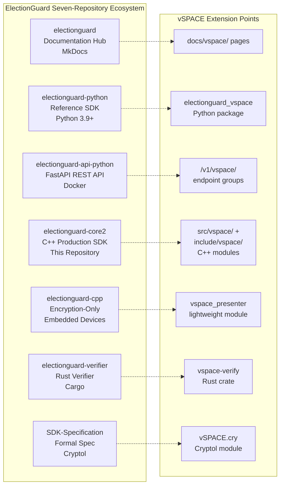

#### Integration with Existing Enterprise Landscape

ElectionGuard Core2 is designed as an integration-ready SDK rather than a standalone application. It is designed to be integrated into existing (or new) voting system software and includes a variety of interop layers to provide functionality to languages including C, .NET, and Java. The repository provides multiple interoperability surfaces:

- **C ABI Facades** (`src/electionguard/facades/` — 19 files): Complete C wrapper layer using opaque handles (`eg_*` types) with `extern "C"` linkage, translating C++ exceptions into status codes defined in `include/electionguard/status.h`
- **.NET Standard Bindings** (`bindings/netstandard/`): Full Visual Studio solution multi-targeting `netstandard2.0` and `net10.0` for broad .NET ecosystem compatibility
- **TypeScript/WebAssembly Bindings** (`bindings/typescript/`): npm package providing a TypeScript facade over an Emscripten/WASM module with webpack bundling
- **WASM Bindings** (`src/electionguard/wasm/` — 6 files): Emscripten/Embind bindings for ballots, election, encryption, group, manifest, and precomputation modules

vSPACE extends this landscape with Azure-native deployment (App Service, AKS, Cosmos DB), Microsoft Entra Verified ID for decentralised identity, and NLWeb for conversational AI interfaces—all while preserving the existing integration surface unchanged.

### 1.2.2 High-Level Description

#### Primary System Capabilities

The combined ElectionGuard Core2 + vSPACE system provides the following layered capabilities:

**Layer 1 — Cryptographic Foundation** (ElectionGuard Core2, existing):
The native C++ core library (`src/electionguard/` — 25+ source files) implements the complete ElectionGuard cryptographic protocol. This includes modular arithmetic over a 4096-bit prime modulus group (`group.cpp`, with the small prime `Q = 2^256 − 189` as defined in `include/electionguard/constants.h`), ElGamal encryption with support for homomorphic addition and partial decryption (`elgamal.cpp`), Chaum-Pedersen zero-knowledge proofs for ballot well-formedness (`chaum_pedersen.cpp` — disjunctive, ranged, and constant proofs), SHA-256 hashing (`hash.cpp`), HMAC (`hmac.cpp`), and cryptographically secure random number generation backed by DRBG (`random.cpp`). The cryptographic primitives are built on the HACL\* library from Project Everest (`libs/hacl/`, pinned version 0.6.0), providing formally verified big-number arithmetic, HMAC, DRBG, SHA-2, and secure memory erasure.

**Layer 2 — Election Domain Model** (ElectionGuard Core2, existing):
The election lifecycle is modelled through immutable domain objects: election manifests defining contests and candidates (`manifest.cpp`/`manifest.hpp`), election contexts carrying cryptographic parameters and the joint public key (`election.cpp`), and ballots with full state management for plaintext, encrypted, cast, and spoiled states (`ballot.cpp`, `ballot_compact.cpp`). The encryption workflow is orchestrated by `EncryptionDevice` and `EncryptionMediator` in `encrypt.cpp`, with precomputation support for performance (`precompute_buffers.cpp`, `DEFAULT_PRECOMPUTE_SIZE = 5000`).

**Layer 3 — Anonymous Credential Authentication** (vSPACE, new):
The `vspace-auth` subsystem implements SAAC and Multi-Holder BBS protocols as both a Python package (`electionguard_vspace`) extending `electionguard-python` and a C++ library (`libvspace-auth`) linking with `electionguard-core2`. The layered credential architecture uses BBS-based multi-holder credentials for theft-resistant storage and distribution, while the inner presentation layer uses SAAC for standards-compliant, pairing-free credential showing. A credential re-derivation protocol bridges the two layers.

**Layer 4 — Identity and Credential Management** (vSPACE, new):
The `vspace-entra` bridge handles all communication with Microsoft Entra Verified ID services for W3C Verifiable Credential issuance and presentation. The `vspace-bind` layer implements the credential-to-ballot binding protocol using Pedersen commitments and Schnorr-like sigma protocols, ensuring each ballot is associated with exactly one valid credential presentation without breaking anonymity.

**Layer 5 — Presentation and Agentic Interface** (vSPACE, new):
Two FastHTML Progressive Web Applications provide voter-facing (vSpaceVote.com) and credential management (vSpaceWallet.com) interfaces. NLWeb is an open project designed to simplify the creation of natural language interfaces for websites—making it easy to turn any site into an AI-powered app. Two NLWeb instances provide conversational query capabilities over election data and credential state, functioning simultaneously as MCP servers for agent interoperability.

#### Major System Components

The following diagram illustrates the principal components and their interactions across the five layers:

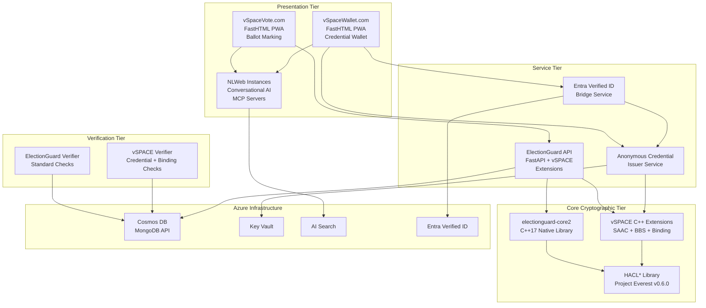

#### Core Technical Approach

The system's technical approach is governed by the following architectural principles, drawn from `docs/Design_and_Architecture.md`:

| Principle | Implementation |
|---|---|
| **Cross-Platform** | CI pipeline across Linux, macOS, Windows, Android, iOS, and WebAssembly |
| **C++17 with C ABI** | Modern C++ core with stable C public API as a first-class citizen |
| **PIMPL Pattern** | Pointer-to-Implementation for stable API while evolving internals |
| **Immutable Objects** | Preferred throughout for thread safety and functional-style composition |
| **Layered Architecture** | Math primitives → encryption functions → higher-level workflows |
| **No Multiple Inheritance** | Intentionally avoided for simplicity and clarity |
| **Safety-First** | Smart pointers, move semantics, static analysis (clang-tidy, cppcheck), dynamic analysis (AddressSanitizer, Valgrind) |

vSPACE extends these principles with additional design constraints: **SAFE-D compliance** (Safe, Accountable, Fair, Explainable, Data-governed), **non-invasive extension** (no modification to any existing ElectionGuard module, parameter, or API), **cryptographic decoupling** (authentication layer operates outside the encryption boundary), and **backward compatibility** (standard ElectionGuard verifiers can still verify core election properties by ignoring the `vspace_record` section of the augmented election record).

### 1.2.3 Success Criteria

#### Measurable Objectives

The vSPACE extension defines phased success criteria mapped to Technology Readiness Levels:

| Phase | TRL | Key Objective | Measurable Target |
|---|---|---|---|
| Phase 1 — Foundation | 3 | End-to-end simulated election | 10 voters, 3 guardians, 2-of-3 threshold with verifiable augmented record |
| Phase 2 — Entra Integration | 4 | Real Entra VC issuance | 100 voters with live Entra Verified ID credential flows |
| Phase 3 — Production Hardening | 5 | C++ performance targets | Credential verification < 50 ms on single-core Intel Xeon E5-2680 |
| Phase 4 — Validation | 6 | Large-scale simulation | 1,000,000 voters within 24 hours (16-core, 64 GB RAM) |

#### Critical Success Factors

1. **Cryptographic Correctness.** C++ implementations in `src/vspace/` must produce bit-identical outputs to the Python reference implementations for all test vectors, ensuring no implementation divergence between prototyping and production paths.
2. **Performance at Scale.** The system must support `DEFAULT_MAX_BALLOTS = 1,000,000` (as defined in `include/electionguard/constants.h`) with acceptable latency. Docker deployment must start and pass health checks within 60 seconds.
3. **Security Audit Clearance.** Phase 4 requires a third-party security audit report with no critical findings and formal security analysis reviewed by at least one external cryptographer.
4. **Interoperability.** At least one non-Microsoft wallet (e.g., EUDI Wallet Reference Implementation) must successfully interoperate with the vSPACE credential flow, validating cross-platform credential portability.
5. **Backward Compatibility.** Standard ElectionGuard verifiers that predate vSPACE must be able to verify core election integrity properties from the augmented election record without modification.

#### Key Performance Indicators

| KPI | Target | Measurement Method |
|---|---|---|
| Credential presentation verification latency | < 50 ms per presentation | Benchmarked on commodity hardware via `test/` benchmarking infrastructure |
| Election record verification completeness | 100% of standard + vSPACE proofs | Automated verification suite (Rust `vspace-verify` crate) |
| Cross-platform build success rate | 100% across Linux, macOS, Windows | GitHub Actions CI matrix (`.github/` workflows) |
| API response time (ballot encryption) | < 200 ms per ballot | Load testing against `electionguard-api-python` with vSPACE binding layer |
| NLWeb query response accuracy | 100% grounded in published election record | RAG constraint enforcement with cryptographic provenance hashing |

---

## 1.3 Scope

### 1.3.1 In-Scope

#### Core Features and Functionalities

The following capabilities constitute the must-have deliverables for the combined system:

**ElectionGuard Core2 — Existing Capabilities (Preserved Unchanged):**

| Capability | Implementation Location | Description |
|---|---|---|
| Key Ceremony | `src/electionguard/election.cpp` | Guardian threshold key generation with Feldman commitments |
| Ballot Encryption | `src/electionguard/encrypt.cpp` | ElGamal encryption under joint public key with precomputation |
| Cast/Spoil Management | `src/electionguard/ballot.cpp` | Ballot state transitions and compact serialisation |
| Homomorphic Tallying | `src/electionguard/` core modules | Additive accumulation of encrypted selections |
| Decryption Ceremony | `src/electionguard/` core modules | Guardian share combination for tally decryption |
| Zero-Knowledge Proofs | `src/electionguard/chaum_pedersen.cpp` | Disjunctive, ranged, and constant Chaum-Pedersen proofs |
| Election Manifest | `src/electionguard/manifest.cpp` | Contest and candidate definition with JSON serialisation |

**vSPACE Extension — New Capabilities:**

| Capability | Component | Description |
|---|---|---|
| SAAC Protocol | `vspace-auth` | Oblivious issuance and publicly verifiable presentation on NIST P-256 |
| Multi-Holder BBS | `vspace-auth` | Credential splitting, threshold presentation, theft resistance |
| Entra VC Bridge | `vspace-entra` | Issuance/presentation callbacks, DID document management, OAuth2 token acquisition |
| Credential-Ballot Binding | `vspace-bind` | Pedersen commitment linking credential serial number to encryption nonce |
| One-Show Enforcement | `vspace-bind` | VRF-derived serial numbers preventing double voting |
| Augmented Verification | `vspace-verify` | Credential validity, serial uniqueness, binding proof checks |
| NLWeb Interfaces | Both PWAs | Conversational query over election data and credential state |
| FastHTML PWAs | vSpaceVote.com, vSpaceWallet.com | Voter ballot marking and credential wallet applications |
| FDVSS-1 Dynamic Guardians | Optional extension | Dynamic guardian committee membership via fully dynamic verifiable secret sharing |

#### Primary User Workflows

The complete election data flow, illustrating where vSPACE inserts into the standard ElectionGuard pipeline, proceeds as follows:

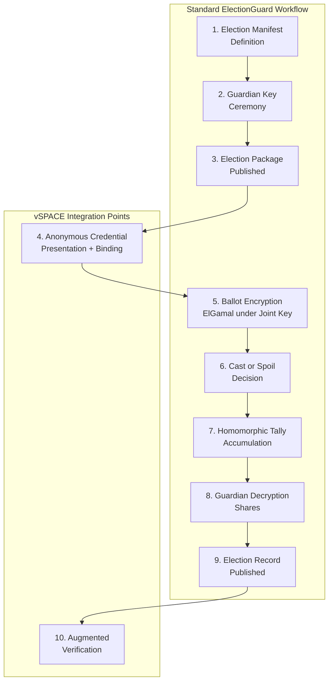

At **step 4**, vSPACE inserts the anonymous credential presentation: the voter proves eligibility without revealing identity, generating a one-show serial number and a Pedersen commitment binding the credential to the ballot encryption nonce. At **step 10**, vSPACE augments verification: the verifier additionally checks that each cast ballot has a valid, unique credential-binding token and that no credential produced more than one cast ballot.

#### Essential Integrations

| Integration | Protocol | Purpose |
|---|---|---|
| Microsoft Entra Verified ID | REST API (`verifiedid.did.msidentity.com`) | VC issuance and presentation verification |
| Azure Cosmos DB | MongoDB API | Election record, credential metadata, serial number persistence |
| Azure AI Search | Vector search | NLWeb content indexing for both PWA instances |
| Azure Key Vault | REST API | SAAC issuer parameters, guardian CA keys, Entra SP credentials |
| HACL\* (Project Everest) | Linked library (v0.6.0) | Big-number arithmetic, HMAC, DRBG, SHA-2, secure memory erasure |
| NLWeb / MCP | REST + JSON (Schema.org) | Conversational interfaces and agent interoperability |

#### Key Technical Requirements

**Build System and Platform Support:**
The repository uses CMake 3.14+ with CPM 0.31.0 for package management and GNU Make for workflow automation. A C++17 standard compliant compiler is required to build the core library. Supported platforms include Linux (Debian-based), macOS (Xcode), Windows (MSVC 2022), Android (API Level 26+, NDK 25), iOS (12+), and WebAssembly (Emscripten).

**Third-Party Dependencies:**

| Dependency | Version | Purpose |
|---|---|---|
| HACL\* (hacl-packages) | 0.6.0 | Formally verified cryptographic primitives |
| nlohmann_json | 3.11.3 | JSON serialisation for election records |
| spdlog | 1.9.2 | Structured logging |
| HowardHinnant/date | 3.0.1 | ISO 8601 timestamp handling |
| doctest | 2.4.12 | C++ unit testing framework |
| Google Benchmark | 1.5.2 | Performance benchmarking |

**vSPACE Additional Dependencies:** FastHTML (ASGI/Uvicorn/Starlette/HTMX), NLWeb reference implementation (Python/MIT), Microsoft MSAL, ecdsa, pycryptodome (P-256 operations), and Rust toolchain for the verifier extension.

#### Implementation Boundaries

**System Boundaries:**
The system boundary encompasses the complete election lifecycle from manifest definition through augmented verification. The boundary includes all cryptographic operations (key generation, encryption, proof generation, decryption, verification), all credential operations (issuance, derivation, presentation, binding), and all user-facing interfaces (PWAs, NLWeb, CLI). Network infrastructure, physical polling-place hardware, and voter device security are external to the system boundary.

**User Groups Covered:**
All six stakeholder groups identified in Section 1.1.3 are covered: voters (via PWAs), election administrators (via CLI and API), guardians (via key ceremony and decryption workflows), third-party verifiers (via Rust verifier), election observers (via NLWeb and audit endpoints), and developers (via C++/C/.NET/TypeScript/WASM APIs).

**Geographic and Market Coverage:**
The system is designed for global deployment with specific alignment to two regulatory contexts: (1) EU jurisdictions via eIDAS 2.0 compatibility and SAAC/BBS alignment with the BBS# protocol, and (2) US jurisdictions via support for privacy-enhanced risk-limiting audits as an initial adoption path. Azure deployment supports multi-region replication through Cosmos DB for globally distributed election records.

**Data Domains Included:**
Election manifests and metadata, encrypted ballots and tallies, guardian public keys and decryption shares, Chaum-Pedersen proofs, anonymous credential public parameters, one-show serial numbers, binding commitments and proofs, Entra Verified ID credential metadata (public components only), and NLWeb-indexed election record content.

### 1.3.2 Out-of-Scope

#### Explicitly Excluded Features and Capabilities

The following elements are explicitly excluded from the vSPACE extension scope. These boundaries are architecturally enforced by the non-invasive extension principle: vSPACE does not modify any existing ElectionGuard module, parameter, or API.

| Excluded Element | Rationale |
|---|---|
| ElGamal encryption scheme or parameters | Core ElectionGuard cryptographic primitive; treated as black box |
| Guardian key ceremony (threshold Shamir sharing with Feldman commitments) | Specification-defined protocol; FDVSS-1 is an optional, additive extension only |
| Ballot encryption algorithm or nonce derivation | Governed by ElectionGuard Specification 1.1.0 |
| Chaum-Pedersen ZK proof constructions | Formally specified in `ElectionGuard-SDK-Specification` Cryptol module |
| Homomorphic tally accumulation logic | Core mathematical operation; no modification needed |
| Decryption share generation or combination | Guardian protocol integrity must be preserved |
| Existing API endpoints in `electionguard-api-python` | vSPACE endpoints are additive (`/v1/vspace/`) |
| Existing election record format fields | vSPACE augments with `vspace_record` section; existing fields unchanged |

#### Future Phase Considerations

The following capabilities are identified for potential future development beyond the current TRL 4–6 scope:

- **Full eIDAS 2.0 certification** — Requires formal certification process beyond the current interoperability demonstration
- **Hardware Security Module (HSM) integration** — Production HSM support for SAAC issuer key storage (currently Azure Key Vault software-protected)
- **Post-quantum credential migration** — Transitioning anonymous credential schemes to lattice-based constructions when standards mature
- **Real-time coercion resistance** — Advanced protocols beyond one-show enforcement for active coercion scenarios
- **Offline voting** — All cryptographic operations are intentionally server-dependent; offline ballot encryption is not supported

#### Integration Points Not Covered

- Direct integration with specific ballot-marking device (BMD) hardware vendors
- Precinct scanner firmware interfaces (ElectionGuard-cpp patterns exist but vSPACE presenter module is minimal)
- Voter registration database synchronisation (vSPACE consumes eligibility status via Entra VCs but does not manage voter rolls)
- Election Management System (EMS) back-office workflows beyond manifest definition and result publication

#### Unsupported Use Cases

| Use Case | Status | Notes |
|---|---|---|
| Production elections | Not supported | This repository is pre-release software to showcase the ElectionGuard API implemented in a native language. It is not feature complete (YET) and should not (currently) be used for production applications. |
| Single-device anonymous credentials | Fallback only | Multi-holder threshold is the primary design; single-device mode reduces security guarantees |
| Non-Azure cloud deployment | Not tested | Architecture assumes Azure services (App Service, AKS, Cosmos DB, Key Vault, AI Search, Entra) |
| Backward compatibility with ElectionGuard 1.0 | Not supported | ElectionGuard 2.0 mathematical functions differ significantly from 1.0 (per `docs/Backwards_Compatibility.md`) |

---

#### References

#### Repository Files Examined

- `README.md` — Project overview, capabilities, pre-release status, platform support, build instructions
- `CMakeLists.txt` — Project version (2.0.0), build configuration, C++17 requirement, CPM dependency bootstrap
- `src/CMakeLists.txt` — Library dependencies (nlohmann_json 3.11.3, spdlog 1.9.2, date 3.0.1), compile features
- `docs/Design_and_Architecture.md` — Design philosophy, PIMPL pattern, HACL\* dependency, lifecycle rules, concurrency model
- `docs/Backwards_Compatibility.md` — ElectionGuard 1.0 vs 2.0 incompatibilities and serialisation differences
- `include/electionguard/constants.h` — Cryptographic constants (Q = 2^256 − 189, 4096-bit P, MAX_P_LEN, DEFAULT_MAX_BALLOTS, DEFAULT_PRECOMPUTE_SIZE)
- `include/electionguard/status.h` — Status code definitions (`eg_electionguard_status_t`)
- `include/electionguard/export.h` — Symbol visibility macros (EG_API, EG_INTERNAL_API)
- `LICENSE` — MIT License, Copyright (c) Microsoft Corporation

#### Repository Folders Examined

- `src/electionguard/` — 25+ C++ source files implementing cryptographic foundation and election domain model
- `src/electionguard/facades/` — 19 C ABI facade files providing opaque-handle C wrappers
- `src/electionguard/wasm/` — 6 Emscripten/Embind binding files for WebAssembly targets
- `src/electionguard-db/` — MongoDB Docker Compose configuration and initialisation scripts
- `include/electionguard/` — 40+ public C/C++ API header files
- `bindings/netstandard/` — .NET Standard solution with encryption, election setup, decryption, tests, benchmarks
- `bindings/typescript/` — npm package with TypeScript facade, webpack bundling, Mocha/Chai tests
- `libs/hacl/` — HACL\* cryptographic library (Project Everest, v0.6.0)
- `apps/electionguard-cli/` — .NET 10 CLI tool for election artifact management
- `apps/angular-demo/` — Angular browser demonstration application
- `test/` — Native C++ test and benchmark infrastructure
- `data/` — Sample election manifests and ballot fixtures
- `.github/` — CI/CD workflows (CodeQL, PR validation, release publishing, sanitiser verification), Dependabot configuration

#### External Sources

- ElectionGuard GitHub Organisation: https://github.com/Election-Tech-Initiative
- ElectionGuard Core2 Repository: https://github.com/Election-Tech-Initiative/electionguard-core2
- ElectionGuard SDK Specification: https://github.com/Election-Tech-Initiative/ElectionGuard-SDK-Specification
- Microsoft NLWeb Announcement (Build 2025): https://news.microsoft.com/source/features/company-news/introducing-nlweb-bringing-conversational-interfaces-directly-to-the-web/
- NLWeb GitHub Repository: https://github.com/microsoft/NLWeb
- vSPACE PRD v1.1 (7 March 2026) — Primary reference document for all vSPACE extension specifications
- SAAC Paper: Chairattana-Apirom et al., ePrint 2025/513 (CRYPTO 2025)
- Multi-Holder BBS Paper: Flamini, Lee, Lysyanskaya, ePrint 2024/1874 (CRYPTO 2025)

# 2. Product Requirements

This section defines the discrete, testable product features for the combined ElectionGuard Core2 and vSPACE system. Each feature is cataloged with unique identifiers, functional requirements, acceptance criteria, and traceability to implementation artifacts. Requirements are organized into two domains: the existing ElectionGuard Core2 capabilities (preserved unchanged) and the vSPACE extension features (new).

## 2.1 FEATURE CATALOG

### 2.1.1 Feature Classification Summary

All features are classified by domain, category, priority level, and implementation status. ElectionGuard Core2 features (F-001 through F-012) represent existing capabilities in the `electionguard-core2` repository. vSPACE features (F-100 through F-112) represent the proposed extension layer defined in the vSPACE PRD v1.1.

| Feature ID | Feature Name | Category | Priority |
|---|---|---|---|
| F-001 | Modular Arithmetic Engine | Cryptographic Foundation | Critical |
| F-002 | ElGamal Encryption System | Cryptographic Foundation | Critical |
| F-003 | Chaum-Pedersen ZK Proofs | Cryptographic Foundation | Critical |
| F-004 | Hash and HMAC Primitives | Cryptographic Foundation | Critical |
| F-005 | Precomputation Engine | Performance Optimization | High |
| F-006 | Election Manifest Management | Election Domain | Critical |
| F-007 | Ballot Lifecycle Management | Election Domain | Critical |
| F-008 | Encryption Workflow Orchestration | Election Domain | Critical |
| F-009 | Cross-Language Binding Layer | Interoperability | High |
| F-010 | MongoDB Persistence Layer | Infrastructure | High |
| F-011 | CLI Tooling | Infrastructure | Medium |
| F-012 | Cross-Platform Build System | Infrastructure | High |

| Feature ID | Feature Name | Category | Priority |
|---|---|---|---|
| F-100 | SAAC Protocol Implementation | Anonymous Credential Auth | Critical |
| F-101 | Multi-Holder BBS Credentials | Anonymous Credential Auth | High |
| F-102 | Credential-to-Ballot Binding | Credential Binding | Critical |
| F-103 | One-Show Enforcement | Credential Binding | Critical |
| F-104 | Entra Verified ID Bridge | Identity Management | High |
| F-105 | vSpaceVote.com Voter PWA | User Applications | High |
| F-106 | vSpaceWallet.com Credential PWA | User Applications | High |
| F-107 | Cross-Origin Communication | User Applications | High |
| F-108 | NLWeb Conversational Interfaces | Agentic Web | Medium |
| F-109 | Augmented Election Record | Verification & Audit | Critical |
| F-110 | vSPACE Verifier Extension | Verification & Audit | Critical |
| F-111 | FDVSS-1 Dynamic Guardians | Advanced Extensions | Low |
| F-112 | Authenticated Networking | Advanced Extensions | Medium |

| Feature ID | Status | Target Phase | TRL |
|---|---|---|---|
| F-001 – F-012 | In Development | Existing | N/A |
| F-100, F-101 | Proposed | Phase 1 | 3 |
| F-102, F-103 | Proposed | Phase 1 | 3 |
| F-104 | Proposed | Phase 2 | 4 |
| F-105, F-106, F-107 | Proposed | Phase 2 | 4 |
| F-108 | Proposed | Phase 2 | 4 |
| F-109, F-110 | Proposed | Phase 3 | 5 |
| F-111, F-112 | Proposed | Phase 3 | 5 |

### 2.1.2 ElectionGuard Core2 Feature Details

The following features represent the existing capabilities within the `electionguard-core2` repository. These are preserved unchanged by the vSPACE extension and serve as the foundational layer upon which all new features depend. The repository is currently in pre-release status, as noted in `README.md`.

#### F-001: Modular Arithmetic Engine

**Overview:** Implements modular arithmetic over a 4096-bit prime modulus group as specified in the ElectionGuard Specification 1.1.0. The engine provides `ElementModP` and `ElementModQ` types with canonical constants defined in `include/electionguard/constants.h` (small prime Q = 2^256 − 189, large prime P as a 4096-bit value).

**Business Value:** Provides the mathematically verified algebraic foundation for all ElectionGuard cryptographic operations, ensuring correctness of encryption and proof generation.

**Technical Context:** Implemented in `src/electionguard/group.cpp` and `include/electionguard/group.hpp`, backed by the HACL* library from Project Everest (`libs/hacl/`, v0.6.0) for formally verified big-number arithmetic. Supports random element sampling, serialisation, and secure memory erasure.

**Dependencies:**

| Dependency Type | Dependency |
|---|---|
| System Dependency | HACL* library v0.6.0 (`libs/hacl/`) |
| System Dependency | C++17 compliant compiler |
| External Dependency | None |

#### F-002: ElGamal Encryption System

**Overview:** Implements the ElGamal public-key encryption scheme with support for key pair generation, ciphertext creation, homomorphic addition of ciphertexts, and both full and partial decryption. Includes hashed ElGamal for payload protection of extended data.

**Business Value:** Provides the core ballot secrecy guarantee — encrypted selections cannot be decrypted without cooperation from a threshold of guardians.

**Technical Context:** Implemented in `src/electionguard/elgamal.cpp` and `include/electionguard/elgamal.hpp`. Ciphertext operations support the additive homomorphism required for tally accumulation. Hashed ElGamal variant protects extended ballot data fields.

**Dependencies:**

| Dependency Type | Dependency |
|---|---|
| Prerequisite Feature | F-001 (Modular Arithmetic Engine) |
| Prerequisite Feature | F-004 (Hash and HMAC Primitives) |
| System Dependency | HACL* library v0.6.0 |

#### F-003: Chaum-Pedersen Zero-Knowledge Proofs

**Overview:** Implements the Chaum-Pedersen zero-knowledge proof system for demonstrating ballot well-formedness without revealing ballot contents. Supports disjunctive proofs (selection is 0 or 1), ranged proofs (selection count within limits), and constant proofs (value equals a known constant).

**Business Value:** Enables any third party to verify that ballots are correctly formed without accessing the plaintext votes, ensuring election integrity is publicly verifiable.

**Technical Context:** Implemented in `src/electionguard/chaum_pedersen.cpp` and `include/electionguard/chaum_pedersen.hpp`. A generic proof validator interface is stubbed for future extensibility.

**Dependencies:**

| Dependency Type | Dependency |
|---|---|
| Prerequisite Feature | F-001 (Modular Arithmetic Engine) |
| Prerequisite Feature | F-004 (Hash and HMAC Primitives) |

#### F-004: Hash and HMAC Primitives

**Overview:** Provides domain-separated SHA-256 hashing with specification-aligned hash-prefix constants, and HMAC-SHA-256 message authentication. These primitives are used throughout the system for deterministic nonce derivation, ballot code generation, proof construction, and data integrity verification.

**Technical Context:** Hashing is implemented in `src/electionguard/hash.cpp` and `include/electionguard/hash.hpp`. HMAC is implemented in `src/electionguard/hmac.cpp` and `include/electionguard/hmac.hpp`, backed by HACL* SHA-256. Cryptographically secure random generation is provided by `src/electionguard/random.cpp` using DRBG with OS entropy seeding.

**Dependencies:**

| Dependency Type | Dependency |
|---|---|
| System Dependency | HACL* library v0.6.0 |

#### F-005: Precomputation Engine

**Overview:** Implements a thread-safe precomputation buffer system that pre-generates cryptographic values (exponentiation results) to accelerate ballot encryption at runtime. Uses a singleton pattern with configurable buffer size (`DEFAULT_PRECOMPUTE_SIZE = 5000` as defined in `include/electionguard/constants.h`).

**Business Value:** Enables high-throughput ballot encryption at polling places by amortising expensive modular exponentiation operations across pre-generated buffers.

**Technical Context:** Implemented in `src/electionguard/precompute_buffers.cpp` and `include/electionguard/precompute_buffers.hpp`. Discrete log cache in `src/electionguard/discrete_log.cpp` supports tally decryption with `DLOG_MAX_SIZE = 1,000,000`.

**Dependencies:**

| Dependency Type | Dependency |
|---|---|
| Prerequisite Feature | F-001 (Modular Arithmetic Engine) |

#### F-006: Election Manifest Management

**Overview:** Defines the election structure including contests, candidates, ballot styles, geopolitical units, and party information. Supports deterministic hashing for integrity verification, structural validation, and multi-format serialisation (JSON, BSON, MsgPack).

**Technical Context:** Implemented in `src/electionguard/manifest.cpp` and `include/electionguard/manifest.hpp`. Provides enum/string conversions for ElectionGuard types and comprehensive validation of manifest structure.

**Dependencies:**

| Dependency Type | Dependency |
|---|---|
| Prerequisite Feature | F-004 (Hash and HMAC Primitives) |
| System Dependency | nlohmann_json 3.11.3 |

#### F-007: Ballot Lifecycle Management

**Overview:** Models the complete ballot state machine from plaintext selection through encryption, submission, and final cast or spoil decision. Supports compact ballot representations for storage efficiency and manifest-driven reconstruction.

**Technical Context:** Implemented in `src/electionguard/ballot.cpp`, `include/electionguard/ballot.hpp`, `src/electionguard/ballot_compact.cpp`, and `src/electionguard/ballot_compact.hpp`. Ballot code chaining is provided by `src/electionguard/ballot_code.cpp`. Deterministic nonce sequences are generated via `src/electionguard/nonces.cpp`.

**Dependencies:**

| Dependency Type | Dependency |
|---|---|
| Prerequisite Feature | F-002 (ElGamal Encryption) |
| Prerequisite Feature | F-006 (Election Manifest) |

#### F-008: Encryption Workflow Orchestration

**Overview:** Provides the complete ballot encryption pipeline through `EncryptionDevice` (stateful metadata container for authorized hardware) and `EncryptionMediator` (orchestration of ballot/contest/selection encryption). Handles normalization, extended-data encoding, and precompute-buffer consumption.

**Technical Context:** Implemented in `src/electionguard/encrypt.cpp` and `include/electionguard/encrypt.hpp`. The `EncryptionDevice` carries device UUID, session UUID, launch code, and location metadata. The `CiphertextElectionContext` in `src/electionguard/election.cpp` provides `ContextConfiguration` with `DEFAULT_MAX_BALLOTS = 1,000,000` and configurable `allowOverVotes`. The PIMPL pattern ensures API stability.

**Dependencies:**

| Dependency Type | Dependency |
|---|---|
| Prerequisite Feature | F-002 (ElGamal Encryption) |
| Prerequisite Feature | F-003 (Chaum-Pedersen ZK Proofs) |
| Prerequisite Feature | F-005 (Precomputation Engine) |
| Prerequisite Feature | F-006 (Election Manifest) |
| Prerequisite Feature | F-007 (Ballot Lifecycle) |

#### F-009: Cross-Language Binding Layer

**Overview:** Provides interoperability surfaces for C, .NET, TypeScript, and WebAssembly consumers. The C ABI facade (`src/electionguard/facades/` — 19 files) exposes opaque `eg_*` handles with `extern "C"` linkage and status code translation. .NET Standard bindings (`bindings/netstandard/`) multi-target `netstandard2.0` and `net10.0`. TypeScript/WASM bindings (`bindings/typescript/`) provide an npm package with webpack bundling. The interop generator (`src/interop-generator/`) uses metadata (`EgInteropClasses.json`) for automated code generation.

**Dependencies:**

| Dependency Type | Dependency |
|---|---|
| Prerequisite Feature | All F-001 through F-008 |
| System Dependency | Emscripten (WASM targets) |

#### F-010: MongoDB Persistence Layer

**Overview:** Provides database persistence for election data using MongoDB 6.0.3 via Docker Compose. Four collections (`key_ceremonies`, `elections`, `ballots`, `tallies`) with indexes for polymorphic filtering by `DataType`, operational identifiers, and state fields. Administrative UI via mongo-express on port 8181.

**Technical Context:** Configured in `src/electionguard-db/` with Docker Compose and `mongo-init.js` initialisation script.

**Dependencies:**

| Dependency Type | Dependency |
|---|---|
| External Dependency | MongoDB 6.0.3 (Docker) |
| External Dependency | mongo-express |

#### F-011: CLI Tooling

**Overview:** A .NET 10 global tool (`apps/electionguard-cli/`) for creating election artifacts, encrypting ballots, generating synthetic test ballots, and performing verification operations from the command line.

**Dependencies:**

| Dependency Type | Dependency |
|---|---|
| Prerequisite Feature | F-009 (.NET bindings) |
| System Dependency | .NET 10 runtime |

#### F-012: Cross-Platform Build System

**Overview:** CMake 3.14+ build system with CPM 0.31.0 package manager, GNU Make workflow automation, and CI/CD via GitHub Actions. Supports Linux (Debian-based), macOS (Xcode), Windows (MSVC 2022), Android (API Level 26+, NDK 25), iOS (12+), and WebAssembly (Emscripten). Testing uses doctest 2.4.12 (C++), NUnit (.NET), and Google Benchmark 1.5.2.

**Dependencies:**

| Dependency Type | Dependency |
|---|---|
| System Dependency | CMake 3.14+, C++17 compiler |
| External Dependency | HACL* 0.6.0, nlohmann_json 3.11.3 |
| External Dependency | spdlog 1.9.2, date 3.0.1 |

### 2.1.3 vSPACE Extension Feature Details

The following features constitute the vSPACE extension layer. vSPACE does not modify any existing ElectionGuard module, parameter, or API — it adds a pre-encryption authentication layer and a post-verification audit layer, both cryptographically decoupled from ballot contents.

#### F-100: SAAC Protocol Implementation

**Overview:** Implements the Server-Aided Anonymous Credentials protocol from ePrint 2025/513 (CRYPTO 2025). Provides oblivious issuance (authority cannot link issuance to presentation) and publicly verifiable, multi-show anonymous credentials on pairing-free NIST P-256/P-384 curves. The election authority acts as the SAAC issuer; the voter's device acts as the holder.

**Business Value:** Enables voter authentication that is unlinkable — no entity can correlate a voter's authentication event to their encrypted ballot — while operating on standardised curves supported by browser libraries and hardware security modules.

**User Benefits:** Voters can prove their eligibility without revealing their identity, preserving ballot secrecy through the entire credential-presentation-to-ballot-encryption pipeline.

**Technical Context:** Python module: `electionguard_vspace.saac` (extending `electionguard-python`). C++ library: `libvspace-auth` with headers under `include/vspace/saac.hpp` and source under `src/vspace/saac.cpp`, using HACL* for P-256 field arithmetic.

**Dependencies:**

| Dependency Type | Dependency |
|---|---|
| Prerequisite Feature | F-001 (Modular Arithmetic Engine) |
| Prerequisite Feature | F-004 (Hash and HMAC Primitives) |
| System Dependency | HACL* v0.6.0 (P-256 operations) |
| External Dependency | ecdsa, pycryptodome (Python) |

#### F-101: Multi-Holder BBS Credentials

**Overview:** Implements the Multi-Holder Anonymous Credentials from BBS Signatures protocol from ePrint 2024/1874 (CRYPTO 2025). Credential shares are distributed across multiple devices (e.g., voter's smartphone and a polling-place device). Presenting the credential requires cooperation from a configurable threshold of devices, preventing single-point-of-compromise identity theft.

**Business Value:** Provides credential-theft resistance by ensuring no single compromised device can impersonate a voter. The multi-holder threshold is configurable per election (1-of-2 for accessibility, 2-of-2 for high security).

**Technical Context:** Python module: `electionguard_vspace.multiholder`. C++ module: `include/vspace/multiholder.hpp` and `src/vspace/multiholder.cpp`. Uses pairing-based BBS signatures (BLS12-381), with a credential re-derivation bridge converting multi-holder BBS shares to SAAC presentations at voting time without materialising the full BBS credential on any single device.

**Dependencies:**

| Dependency Type | Dependency |
|---|---|
| Prerequisite Feature | F-100 (SAAC Protocol) |
| Prerequisite Feature | F-001 (Modular Arithmetic) |
| System Dependency | HACL* (BLS12-381 arithmetic) |

#### F-102: Credential-to-Ballot Binding

**Overview:** Implements the protocol that cryptographically binds the anonymous credential presentation to the ElectionGuard ballot encryption. Uses a Pedersen commitment `C = g^r · h^s` where `r` is the ballot encryption nonce and `s` is derived from the credential presentation's one-show serial number. A zero-knowledge proof (conjunction of Schnorr-like sigma protocols, Fiat-Shamir transformed) demonstrates that `C` commits to both the ballot's `r` and the credential's `s`.

**Business Value:** Satisfies three simultaneous properties: ballot stuffing prevention (each ballot requires a valid credential), unlinkability (no voter-to-ballot correlation), and ballot secrecy preservation (ElectionGuard's homomorphic encryption unaffected).

**Technical Context:** Python module: `electionguard_vspace.binding`. Wraps `electionguard.encrypt` to add binding commitment and proof generation. C++ module: `include/vspace/binding.hpp` and `src/vspace/binding.cpp`.

**Dependencies:**

| Dependency Type | Dependency |
|---|---|
| Prerequisite Feature | F-100 (SAAC Protocol) |
| Prerequisite Feature | F-008 (Encryption Workflow) |
| Prerequisite Feature | F-004 (Hash Primitives) |

#### F-103: One-Show Enforcement

**Overview:** Implements a mechanism ensuring each voter can cast at most one ballot per election. A verifiable random function (VRF) is evaluated by the voter on the election identifier under a key derived from their credential, producing a deterministic but unlinkable serial number. This serial number is published alongside the encrypted ballot, enabling anyone to verify that no serial number appears twice.

**Technical Context:** Serial number derivation is integrated within `electionguard_vspace.binding` and `electionguard_vspace.saac`. The serial number registry is persisted in the `vspace_serial_numbers` MongoDB collection.

**Dependencies:**

| Dependency Type | Dependency |
|---|---|
| Prerequisite Feature | F-100 (SAAC Protocol) |
| Prerequisite Feature | F-004 (Hash Primitives) |
| Integration Requirement | F-010 (MongoDB Persistence) |

#### F-104: Entra Verified ID Bridge

**Overview:** Handles all communication with Microsoft Entra Verified ID services for W3C Verifiable Credential issuance and presentation via the `did:web` method. Implements a three-phase model: Registration (VC issuance attesting voter eligibility), Credential Derivation (oblivious protocol bridging Entra VC to SAAC anonymous credential), and Voting (only the anonymous credential is used — the Entra VC is never presented to the voting system).

**Business Value:** Provides enterprise-grade, standards-compliant identity verification while preserving complete unlinkability between voter identity and ballot through the oblivious credential derivation protocol.

**Technical Context:** Implemented as a FastAPI sub-application mounting into `electionguard-api-python` with endpoints under `/v1/vspace/entra/`. Consumes the Issuance API (`createIssuanceRequest`), Presentation API (`createPresentationRequest`), and Admin API at `verifiedid.did.msidentity.com`. Custom `VoterEligibilityCredential` contract. DID document registered at `did:web` (e.g., `https://vspacevote.com/.well-known/did.json`). OAuth2 token acquisition via MSAL with `VerifiableCredential.Create.All` permission.

**Dependencies:**

| Dependency Type | Dependency |
|---|---|
| Prerequisite Feature | F-100 (SAAC Protocol) |
| External Dependency | Microsoft Entra Verified ID |
| External Dependency | MSAL Python library |
| External Dependency | Azure AD tenant (Premium P2) |
| Integration Requirement | F-010 (MongoDB Persistence) |

#### F-105: vSpaceVote.com Voter-Facing PWA

**Overview:** A Progressive Web Application built with FastHTML for ballot marking, credential presentation, and election participation. Deployed to Azure App Service with PWA capabilities (service worker, web manifest, offline caching of election manifest). Uses HTMX-based server-rendered partials (<2KB per interaction) for sequential, server-validated voter interactions.

**Technical Context:** FastHTML application on ASGI (Uvicorn + Starlette). Routes: `/` (landing with NLWeb search), `/auth/present` (credential presentation), `/ballot/mark` (ballot marking), `/ballot/review` (review), `/ballot/encrypt` (encryption + cast/spoil), `/ballot/confirm` (tracking code). PicoCSS for WCAG 2.1 AA accessibility. Content-Security-Policy headers allow only same-origin scripts.

**Dependencies:**

| Dependency Type | Dependency |
|---|---|
| Prerequisite Feature | F-102 (Credential-to-Ballot Binding) |
| Prerequisite Feature | F-008 (Encryption Workflow) |
| External Dependency | FastHTML framework |
| External Dependency | Azure App Service |
| Integration Requirement | F-107 (Cross-Origin Communication) |

#### F-106: vSpaceWallet.com Credential Wallet PWA

**Overview:** A credential management PWA on a separate domain from vSpaceVote.com to enforce the same-origin security boundary between credential management and ballot operations. Handles credential receipt/storage (IndexedDB, encrypted), multi-holder credential share coordination, and credential lifecycle management. Manages the Entra Verified ID issuance callback flow and SAAC oblivious credential derivation.

**Technical Context:** Separate FastHTML application on its own Azure App Service instance. Primary credential share stored in browser IndexedDB (encrypted with device-derived key). Secondary share delivered to backup device or polling-place kiosk.

**Dependencies:**

| Dependency Type | Dependency |
|---|---|
| Prerequisite Feature | F-100 (SAAC Protocol) |
| Prerequisite Feature | F-101 (Multi-Holder BBS) |
| Prerequisite Feature | F-104 (Entra VC Bridge) |
| External Dependency | FastHTML framework |
| Integration Requirement | F-107 (Cross-Origin Communication) |

#### F-107: Cross-Origin Communication Protocol

**Overview:** Mediates interaction between vSpaceVote.com and vSpaceWallet.com via a carefully designed cross-origin protocol. Supports same-browser flow (`window.postMessage` with origin whitelist) and cross-device flow (QR code-based challenge-response via authenticated WebSocket). Signed postMessage responses use credential-derived keys.

**Technical Context:** Same-browser: vSpaceVote opens vSpaceWallet in popup/iframe, passes cryptographic challenge (random nonce bound to election identifier and session), receives credential presentation proof. Cross-device: QR code containing challenge, scanned by vSpaceWallet device, result returned via server-mediated WebSocket channel.

**Dependencies:**

| Dependency Type | Dependency |
|---|---|
| Prerequisite Feature | F-105 (vSpaceVote.com PWA) |
| Prerequisite Feature | F-106 (vSpaceWallet.com PWA) |

#### F-108: NLWeb Conversational Interfaces

**Overview:** Two NLWeb instances provide conversational AI query capabilities over election data (vSpaceVote.com) and credential state (vSpaceWallet.com). Each instance simultaneously functions as a Model Context Protocol (MCP) server for agent interoperability. The vSpaceVote instance indexes election manifests, published records, tally results, and verification reports. The vSpaceWallet instance indexes credential types, issuance status, and wallet configuration.

**Business Value:** Enables voters, observers, journalists, and auditors to query election data and credential status using natural language. Positions both PWAs as first-class participants in the emerging agentic web.

**Technical Context:** Vector store: Azure AI Search. LLM: Azure OpenAI Service. Schema.org types: `Event`, custom `VoteAction`, `Report`, `GovernmentOrganization`, `DigitalDocument`, `Action`, custom `VerifiableCredential`. Custom tools: `BallotLookupTool`, `TallyExplorerTool`, `CredentialStatusTool`. MCP transport: JSON over REST. Strict RAG constraints prevent hallucination; read-only during voting periods; all responses include cryptographic provenance hashes.

**Dependencies:**

| Dependency Type | Dependency |
|---|---|
| Prerequisite Feature | F-109 (Augmented Election Record) |
| External Dependency | Azure AI Search |
| External Dependency | Azure OpenAI Service |
| External Dependency | NLWeb reference implementation |

#### F-109: Augmented Election Record

**Overview:** Extends the standard ElectionGuard JSON election record with an additional `vspace_record` section containing: the anonymous credential issuer's public parameters, one-show serial numbers (one per cast ballot), binding commitments (one per cast ballot), binding proofs (one per cast ballot), and SAAC auxiliary information public components. Backward compatible — standard ElectionGuard verifiers ignore the `vspace_record` section.

**Technical Context:** Python module: `electionguard_vspace.record`. Augmented record stored in MongoDB (`vspace_credentials`, `vspace_serial_numbers`, `vspace_bindings` collections).

**Dependencies:**

| Dependency Type | Dependency |
|---|---|
| Prerequisite Feature | F-102 (Credential-to-Ballot Binding) |
| Prerequisite Feature | F-103 (One-Show Enforcement) |
| Integration Requirement | F-010 (MongoDB Persistence) |

#### F-110: vSPACE Verifier Extension

**Overview:** Extends the `electionguard-verifier` (Rust) with additional checks for anonymous credential validity, one-show serial number uniqueness, and binding proof correctness. Implemented as a Rust crate `vspace-verify` with modules `saac_verify.rs`, `binding_verify.rs`, and `serial_verify.rs`. Can be used standalone or integrated with the existing Rust verifier pipeline.

**Technical Context:** Rust crate depending on the existing `electionguard-verifier` or operating standalone against the augmented election record. Checks: (a) credential presentation validity, (b) serial number uniqueness across all cast ballots, (c) binding proof linking commitment to both ballot and credential, (d) SAAC auxiliary information consistency.

**Dependencies:**

| Dependency Type | Dependency |
|---|---|
| Prerequisite Feature | F-109 (Augmented Election Record) |
| Prerequisite Feature | F-003 (ZK Proofs, for verification logic) |
| System Dependency | Rust toolchain (Cargo) |

#### F-111: FDVSS-1 Dynamic Guardians (Optional)

**Overview:** Optionally extends the guardian key ceremony with Fully Dynamic Verifiable Secret Sharing (FDVSS-1), replacing the static Feldman commitment scheme with a dynamic sharing mechanism that allows guardians to join and leave the committee without re-keying. FDPSS redistribution protocol enables single-round guardian rotation. Activated via `dynamic_committee=true` parameter on the key ceremony endpoint.

**Technical Context:** Integration at the `electionguard-api-python` layer. Information-theoretic security for the sharing phase. FDPSS redistribution bound to the tally accumulation phase. Based on the ePrint 2026/011 manuscript (withdrawn).

**Dependencies:**

| Dependency Type | Dependency |
|---|---|
| Prerequisite Feature | F-001 (Modular Arithmetic) |
| Prerequisite Feature | F-112 (Authenticated Networking) |

#### F-112: Authenticated Networking Layer

**Overview:** Provides TLS 1.3 with mutual authentication for all guardian communication (key ceremony messages, FDVSS-1 share distributions, decryption share exchanges). Includes certificate pinning (SHA-256 public key pins), election-specific CA, DoS-resistant gossip protocol (Bracha's reliable broadcast, O(n log n) complexity), and UC Framework verification.

**Technical Context:** Abstract `AuthenticatedChannel` interface with `SimulatedChannel` (testing) and `ProductionTLSChannel` (production) implementations. Dependency injection enables swapping between implementations. Python `cryptography` library v43.0+.

**Dependencies:**

| Dependency Type | Dependency |
|---|---|
| External Dependency | Python cryptography ≥ 43.0 |
| System Dependency | TLS 1.3 infrastructure |

## 2.2 FUNCTIONAL REQUIREMENTS

### 2.2.1 Cryptographic Foundation Requirements (F-001 – F-005)

| Requirement ID | Description | Acceptance Criteria | Priority |
|---|---|---|---|
| F-001-RQ-001 | ElementModP arithmetic shall operate on a 4096-bit prime modulus group with constants defined in `constants.h` | Modular addition, subtraction, multiplication, and exponentiation produce correct results for all test vectors | Must-Have |
| F-001-RQ-002 | ElementModQ arithmetic shall operate with small prime Q = 2^256 − 189 | All Q-space operations are bounded within the 256-bit field; overflow produces correct modular reduction | Must-Have |
| F-001-RQ-003 | Random element sampling shall use DRBG-backed generation seeded from OS entropy | Generated elements pass statistical randomness tests; entropy source is validated at initialisation | Must-Have |
| F-002-RQ-001 | ElGamal encryption shall produce ciphertexts that support homomorphic addition | Sum of N ciphertexts decrypts to sum of N plaintexts for all N ≤ DEFAULT_MAX_BALLOTS | Must-Have |
| F-002-RQ-002 | Hashed ElGamal shall protect extended ballot data payloads | Extended data encrypts and decrypts correctly with no information leakage to non-key-holders | Must-Have |
| F-003-RQ-001 | Disjunctive Chaum-Pedersen proofs shall verify that encrypted selections are 0 or 1 | All valid proofs pass verification; all invalid proofs (selection > 1) fail verification | Must-Have |
| F-003-RQ-002 | Ranged proofs shall verify selection counts within contest limits | Proof verification rejects ballots exceeding the contest selection limit | Must-Have |
| F-004-RQ-001 | SHA-256 hashing shall implement domain separation with spec-aligned prefix constants | Hash outputs match ElectionGuard Specification 1.1.0 test vectors | Must-Have |
| F-005-RQ-001 | Precomputation buffer shall maintain at least DEFAULT_PRECOMPUTE_SIZE (5,000) pre-generated values | Buffer refills automatically without blocking the encryption pipeline | Should-Have |
| F-005-RQ-002 | Discrete log cache shall support lookup up to DLOG_MAX_SIZE (1,000,000) | Cache hit rate exceeds 99% for tally values within the configured max ballot count | Should-Have |

#### Technical Specifications

| Requirement ID | Input Parameters | Output/Response | Performance Criteria |
|---|---|---|---|
| F-001-RQ-001 | Two ElementModP values | ElementModP result | < 1 ms per operation |
| F-002-RQ-001 | Plaintext, public key, nonce | Ciphertext (alpha, beta) | < 200 ms per ballot |
| F-003-RQ-001 | Ciphertext, proof parameters | Boolean validity | < 50 ms per proof |
| F-005-RQ-001 | Buffer size configuration | Pre-generated triplets | Background thread, non-blocking |

#### Validation Rules

| Requirement ID | Business Rule | Security Requirement |
|---|---|---|
| F-001-RQ-001 | Constants must match ElectionGuard Spec 1.1.0 | HACL* formally verified arithmetic |
| F-001-RQ-003 | DRBG must be reseeded per session | Secure memory erasure of intermediate values |
| F-002-RQ-001 | Homomorphic property must hold for all ballots | Key material protected via PIMPL pattern |
| F-004-RQ-001 | Domain separation prevents cross-context hash collisions | No raw hash output exposed via public API |

### 2.2.2 Election Domain Requirements (F-006 – F-008)

| Requirement ID | Description | Acceptance Criteria | Priority |
|---|---|---|---|
| F-006-RQ-001 | Election manifest shall validate contest/candidate structure and produce deterministic hashes | Same manifest input always produces identical hash; structurally invalid manifests are rejected | Must-Have |
| F-006-RQ-002 | Manifest serialisation shall support JSON, BSON, and MsgPack formats | Round-trip serialisation preserves all fields and produces identical objects | Must-Have |
| F-007-RQ-001 | Ballot state machine shall enforce valid transitions: plaintext → encrypted → submitted (cast/spoiled/challenged) | Invalid state transitions throw exceptions; state is immutable once set | Must-Have |
| F-007-RQ-002 | Compact ballot representation shall reconstruct full ballot from manifest reference | Reconstructed ballot matches original encrypted ballot byte-for-byte | Should-Have |
| F-008-RQ-001 | EncryptionMediator shall orchestrate complete ballot encryption including all contest and selection proofs | Every encrypted ballot passes the full Chaum-Pedersen verification suite | Must-Have |
| F-008-RQ-002 | Ballot code chaining shall produce sequential, verifiable ballot codes across all encrypted ballots | Each ballot code is derivable from its predecessor and device hash | Must-Have |
| F-008-RQ-003 | System shall support up to DEFAULT_MAX_BALLOTS (1,000,000) encrypted ballots per election context | No memory exhaustion or performance degradation at max ballot count | Must-Have |

#### Technical Specifications

| Requirement ID | Input Parameters | Output/Response | Data Requirements |
|---|---|---|---|
| F-006-RQ-001 | Raw manifest JSON | Validated manifest with hash | ElectionGuard Spec 1.1.0 format |
| F-007-RQ-001 | Plaintext ballot, election context | State-managed ballot object | Immutable domain objects |
| F-008-RQ-001 | Plaintext ballot, manifest, context | Encrypted ballot with proofs | Nonce sequences from `nonces.cpp` |
| F-008-RQ-003 | Election context configuration | Up to 1M ballots | `ContextConfiguration` in `election.hpp` |

### 2.2.3 Anonymous Credential Authentication Requirements (F-100 – F-101)

| Requirement ID | Description | Acceptance Criteria | Priority |
|---|---|---|---|
| F-100-RQ-001 | SAAC issuance protocol shall be oblivious — the issuer cannot link a credential issuance event to a later presentation | No statistical correlation between issuance and presentation transcripts under the DDH assumption | Must-Have |
| F-100-RQ-002 | SAAC presentation shall produce publicly verifiable proofs on NIST P-256 curves | Presentation proofs verify correctly using only the issuer's public parameters and NIST P-256 operations | Must-Have |
| F-100-RQ-003 | SAAC auxiliary information generation shall be anonymous — the server-aided protocol reveals no voter-identifying data | Auxiliary information is indistinguishable between any two eligible voters | Must-Have |
| F-100-RQ-004 | C++ implementation shall produce bit-identical outputs to Python reference for all test vectors | Byte-level comparison of outputs from both implementations passes for the complete test vector suite | Must-Have |
| F-101-RQ-001 | Credential splitting shall distribute shares across a configurable number of holder devices | Share reconstruction produces valid credential with any t-of-n threshold combination | Must-Have |
| F-101-RQ-002 | Threshold presentation shall require cooperation from the configured number of devices | Presentation fails with fewer than threshold devices; succeeds with exactly threshold devices | Must-Have |
| F-101-RQ-003 | Credential re-derivation bridge shall convert BBS multi-holder shares to SAAC presentation without materialising full BBS credential | No single device holds the complete BBS credential at any point during the re-derivation process | Must-Have |

#### Technical Specifications

| Requirement ID | Input Parameters | Output/Response | Performance Criteria |
|---|---|---|---|
| F-100-RQ-001 | Voter attributes, blinded commitment | Anonymous credential | < 500 ms issuance latency |
| F-100-RQ-002 | Credential, election ID, aux info | Presentation proof | < 50 ms verification (C++) |
| F-101-RQ-001 | Credential, threshold (t, n) | n credential shares | < 200 ms per split operation |
| F-101-RQ-002 | t shares, challenge | Threshold presentation | < 100 ms cooperative proof |

#### Validation Rules

| Requirement ID | Business Rule | Security Requirement |
|---|---|---|
| F-100-RQ-001 | Obliviousness is mandatory for voter privacy | DDH assumption on NIST P-256 |
| F-100-RQ-002 | Pairing-free operations only for SAAC layer | No BLS12-381 operations in presentation |
| F-101-RQ-001 | Threshold configurable: 1-of-2 to 2-of-2 | Information-theoretic share secrecy |
| F-101-RQ-003 | Full BBS credential never materialised | Secure memory erasure of partial shares |

### 2.2.4 Credential Binding and One-Show Requirements (F-102 – F-103)

| Requirement ID | Description | Acceptance Criteria | Priority |
|---|---|---|---|
| F-102-RQ-001 | Pedersen commitment shall correctly bind the ballot encryption nonce `r` to the credential serial number `s` | Commitment `C = g^r · h^s` is verifiable given the published generators and proof | Must-Have |
| F-102-RQ-002 | Zero-knowledge binding proof shall demonstrate commitment links to both ballot and credential without revealing either | Proof passes verification; extraction of `r` or `s` from proof is computationally infeasible | Must-Have |
| F-102-RQ-003 | Binding layer shall wrap `electionguard.encrypt` without modifying its internal behaviour | All standard ElectionGuard ballot proofs remain valid; binding is additive only | Must-Have |
| F-103-RQ-001 | VRF serial number derivation shall be deterministic given the credential and election identifier | Same credential + election ID always produces the same serial number | Must-Have |
| F-103-RQ-002 | Serial number uniqueness check shall reject any ballot whose serial number already exists in the registry | Duplicate serial numbers are detected and the second ballot is rejected prior to casting | Must-Have |
| F-103-RQ-003 | Serial number shall be unlinkable to voter identity | No information about the voter's credential or identity can be derived from the published serial number | Must-Have |

#### Technical Specifications

| Requirement ID | Input Parameters | Output/Response | Performance Criteria |
|---|---|---|---|
| F-102-RQ-001 | Nonce r, serial s, generators g, h | Commitment C | < 10 ms per commitment |
| F-102-RQ-002 | Commitment, ballot, credential | Binding proof | < 50 ms proof generation |
| F-103-RQ-001 | Credential key, election ID | 256-bit serial number | < 5 ms per derivation |
| F-103-RQ-002 | Serial number, registry | Accept/Reject | < 10 ms per lookup |

### 2.2.5 Identity Management Requirements (F-104)

| Requirement ID | Description | Acceptance Criteria | Priority |
|---|---|---|---|
| F-104-RQ-001 | Issuance flow shall trigger `VoterEligibilityCredential` creation via Entra `createIssuanceRequest` API | Voter receives VC in Microsoft Authenticator wallet with correct claims (election ID, precinct, blinded commitment) | Must-Have |
| F-104-RQ-002 | Presentation flow shall verify voter VC via Entra `createPresentationRequest` callback | Verified claims including blinded commitment are received at callback URL; invalid VCs are rejected | Must-Have |
| F-104-RQ-003 | Oblivious credential derivation shall bridge Entra VC to SAAC anonymous credential | SAAC credential is correctly derived from blinded commitment in VC; Entra service cannot link VC to SAAC credential | Must-Have |
| F-104-RQ-004 | DID document shall be resolvable at `did:web` well-known URL | `https://vspacevote.com/.well-known/did.json` resolves to valid DID document with election authority public keys | Must-Have |
| F-104-RQ-005 | OAuth2 token acquisition shall use MSAL with `VerifiableCredential.Create.All` permission | Valid access tokens are acquired for all Entra API calls; token refresh is handled automatically | Must-Have |

#### Validation Rules

| Requirement ID | Business Rule | Security Requirement |
|---|---|---|
| F-104-RQ-001 | VC issuance only after identity verification | Blinded commitment prevents Entra linkage |
| F-104-RQ-002 | VC presentation only during credential derivation | VC never presented to voting system |
| F-104-RQ-003 | Credential derivation occurs pre-election day | No cloud dependency on election day |
| F-104-RQ-005 | Azure AD app with admin consent required | Least-privilege API permissions |

### 2.2.6 User Application Requirements (F-105 – F-107)

| Requirement ID | Description | Acceptance Criteria | Priority |
|---|---|---|---|
| F-105-RQ-001 | Ballot marking interface shall render all eligible contests with server-side validation of selection limits | Over-selections are rejected; under-selections produce warnings; UI updates via HTMX partials | Must-Have |
| F-105-RQ-002 | PWA service worker shall cache election manifest for offline review while requiring server connection for all cryptographic operations | Cached manifest loads offline; ballot encryption, credential presentation, and nonce generation fail gracefully without server | Must-Have |
| F-105-RQ-003 | Ballot review page shall present plain-language summary with accessibility-focused audio description | WCAG 2.1 AA compliance verified; screen reader navigation of all ballot choices | Must-Have |
| F-105-RQ-004 | Tracking code display shall include QR code and link to public election record | Tracking code resolves to correct ballot in the published election record | Should-Have |
| F-106-RQ-001 | Credential storage shall use encrypted IndexedDB with device-derived key | Credential data is unreadable without device authentication; encrypted at rest | Must-Have |
| F-106-RQ-002 | Multi-holder share coordination shall support threshold presentation protocol | Primary and secondary shares produce valid combined presentation | Must-Have |
| F-106-RQ-003 | Credential lifecycle dashboard shall display status, expiration, and re-issuance options | All credential states (active, expired, revoked) are correctly displayed | Should-Have |
| F-107-RQ-001 | postMessage protocol shall enforce origin whitelist (vSpaceVote.com and vSpaceWallet.com only) | Messages from non-whitelisted origins are silently dropped | Must-Have |
| F-107-RQ-002 | Cross-device QR flow shall fall back when same-browser postMessage is unavailable | QR code containing challenge is scannable; credential presentation completes via WebSocket relay | Must-Have |

#### Technical Specifications

| Requirement ID | Input Parameters | Output/Response | Performance Criteria |
|---|---|---|---|
| F-105-RQ-001 | Voter selections | HTMX partial (<2KB) | < 200 ms server response |
| F-105-RQ-002 | Election manifest | Cached manifest | Offline load < 500 ms |
| F-106-RQ-001 | Credential data, device key | Encrypted IndexedDB entry | Encryption < 50 ms |
| F-107-RQ-001 | postMessage event | Validated or dropped | Origin check < 1 ms |

### 2.2.7 Conversational and Agentic Interface Requirements (F-108)

| Requirement ID | Description | Acceptance Criteria | Priority |
|---|---|---|---|
| F-108-RQ-001 | NLWeb `ask` method shall return Schema.org-typed JSON responses grounded in indexed election record content | Every response item maps to a valid Schema.org type; no response contains information absent from the vector store | Must-Have |
| F-108-RQ-002 | MCP server endpoint shall expose `ask` tool for agent interoperability | External MCP clients can discover and invoke the `ask` method; responses conform to NLWeb protocol specification | Must-Have |
| F-108-RQ-003 | NLWeb shall operate in read-only mode during active voting periods | No state-changing operations (ballot casting, credential presentation) can be triggered via NLWeb queries | Must-Have |
| F-108-RQ-004 | All NLWeb responses shall include cryptographic provenance hashes linking to source data items | Each response embeds a hash verifiable against the authentic election record content in the vector store | Should-Have |
| F-108-RQ-005 | Custom tools (BallotLookupTool, TallyExplorerTool, CredentialStatusTool) shall resolve queries against published data only | BallotLookupTool resolves tracking codes; TallyExplorerTool navigates tally tree; CredentialStatusTool checks serial numbers without revealing voter identity | Should-Have |

#### Validation Rules

| Requirement ID | Business Rule | Security Requirement |
|---|---|---|
| F-108-RQ-001 | Responses must be 100% grounded in published record | Strict RAG constraints prevent hallucination |
| F-108-RQ-003 | Read-only enforcement during voting windows | Rate limiting at ASGI middleware layer |
| F-108-RQ-005 | No voter-identifying data in tool responses | CredentialStatusTool reveals only serial presence |

### 2.2.8 Verification and Audit Requirements (F-109 – F-110)

| Requirement ID | Description | Acceptance Criteria | Priority |
|---|---|---|---|
| F-109-RQ-001 | Augmented election record shall include `vspace_record` section with all required vSPACE cryptographic artifacts | Record contains issuer public parameters, all serial numbers, all binding commitments, all binding proofs, and SAAC auxiliary information | Must-Have |
| F-109-RQ-002 | Standard ElectionGuard verifiers shall process the augmented record without error by ignoring the `vspace_record` section | Existing `electionguard-verifier` produces valid result on augmented records | Must-Have |
| F-110-RQ-001 | vSPACE verifier shall validate SAAC presentation proofs for all cast ballots | All valid presentations pass; any invalid presentation causes verification failure | Must-Have |
| F-110-RQ-002 | vSPACE verifier shall detect duplicate one-show serial numbers | If any two cast ballots share a serial number, verification fails with descriptive error | Must-Have |
| F-110-RQ-003 | vSPACE verifier shall validate binding proofs linking commitments to ballots and credentials | All valid binding proofs pass; tampered commitments or mismatched bindings cause failure | Must-Have |

#### Technical Specifications

| Requirement ID | Input Parameters | Output/Response | Performance Criteria |
|---|---|---|---|
| F-109-RQ-001 | Complete election data + vSPACE data | Augmented JSON record | Serialisation < 5 s for 1M ballots |
| F-110-RQ-001 | Augmented election record | Pass/Fail per ballot | < 50 ms per presentation verification |
| F-110-RQ-002 | List of serial numbers | Pass/Fail (uniqueness) | O(n log n) sort-based check |
| F-110-RQ-003 | Binding proofs, commitments, ballots | Pass/Fail per ballot | < 50 ms per binding verification |

### 2.2.9 Advanced Extension Requirements (F-111 – F-112)

| Requirement ID | Description | Acceptance Criteria | Priority |
|---|---|---|---|
| F-111-RQ-001 | FDVSS-1 shall generate guardian key shares with information-theoretic security | Share reconstruction with t-of-n threshold recovers the election private key correctly | Could-Have |
| F-111-RQ-002 | FDPSS redistribution shall transfer a compromised guardian's share to a replacement in a single round | Redistribution completes without revealing any information about the election private key | Could-Have |
| F-112-RQ-001 | All guardian communication shall use mutually authenticated TLS 1.3 sessions | Connections without valid mutual certificates are rejected; certificate pinning is enforced | Should-Have |
| F-112-RQ-002 | Broadcast channel shall tolerate t < n/3 Byzantine faults with O(n log n) message complexity | Consensus is reached in the presence of up to floor((n-1)/3) faulty guardians | Should-Have |

## 2.3 FEATURE RELATIONSHIPS

### 2.3.1 Feature Dependency Map

The following diagram illustrates the dependency relationships between all product features. Arrows indicate "enables" relationships (the source feature must be available for the target feature to function).

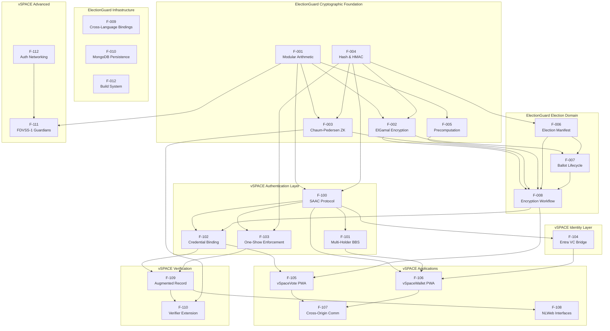

### 2.3.2 Integration Points

The following table documents the key integration points between vSPACE features and external systems.

| Integration Point | vSPACE Feature(s) | Protocol / Technology |
|---|---|---|
| Entra Verified ID Issuance API | F-104 | REST POST to `createIssuanceRequest` |
| Entra Verified ID Presentation API | F-104 | REST POST to `createPresentationRequest` |
| Entra Admin API | F-104 | REST API at `verifiedid.did.msidentity.com` |
| Azure Cosmos DB (MongoDB API) | F-010, F-103, F-109 | MongoDB wire protocol |
| Azure AI Search | F-108 | Vector search API |
| Azure OpenAI Service | F-108 | LLM inference API |
| Azure Key Vault | F-100, F-104, F-112 | REST API for key/secret management |
| HACL* Library (P-256, BLS12-381) | F-100, F-101, F-102 | Linked C library v0.6.0 |
| NLWeb Reference Implementation | F-108 | Python service with MCP endpoints |
| FastHTML / Starlette / Uvicorn | F-105, F-106 | ASGI Python framework stack |
| MSAL Python | F-104 | OAuth2 token acquisition library |
| ElectionGuard Verifier (Rust) | F-110 | Cargo crate dependency |
| ElectionGuard Python SDK | F-100 – F-104, F-109 | Python package import |

### 2.3.3 Shared Components and Common Services

The following components and services are shared across multiple features.

| Shared Component | Consuming Features | Description |
|---|---|---|
| HACL* Cryptographic Library | F-001 – F-005, F-100 – F-102 | Formally verified big-number arithmetic, HMAC, DRBG, SHA-2, secure memory erasure |
| MongoDB Persistence Layer | F-010, F-103, F-104, F-109 | Election records, credential metadata, serial numbers, binding commitments |
| ASGI Middleware Stack | F-105, F-106, F-108 | Authentication, rate limiting, CORS, TLS termination shared across FastHTML and NLWeb |
| Azure Key Vault | F-100, F-104, F-112 | SAAC issuer parameters, Entra SP credentials, guardian CA keys |
| Serialisation Framework | F-006 – F-009, F-109 | nlohmann_json 3.11.3 for JSON; BSON/MsgPack for compact storage |
| Election Context Configuration | F-008, F-102, F-105 | `CiphertextElectionContext` with joint public key, max ballots, and election parameters |
| Domain-Separated Hashing | F-004, F-100, F-102, F-103 | SHA-256 with spec-aligned prefix constants used in proofs, commitments, and serial derivation |

## 2.4 IMPLEMENTATION CONSIDERATIONS

### 2.4.1 Technical Constraints

| Feature(s) | Constraint | Impact |
|---|---|---|
| F-001 – F-005 | C++17 standard required; HACL* v0.6.0 is pinned | Compiler and library versions are non-negotiable for cryptographic correctness |
| F-100, F-101 | SAAC requires pairing-free curves (NIST P-256); Multi-Holder BBS requires pairing-based curves (BLS12-381) | Layered architecture required — BBS for storage/distribution, SAAC for presentation |
| F-102 | Binding protocol must wrap `electionguard.encrypt` without modifying its internals | Non-invasive extension principle enforced architecturally |
| F-104 | Azure AD Premium P2 or Microsoft Entra Suite licensing required | Deployment dependency on Microsoft licensing |
| F-108 | NLWeb reference implementation is Python-based | Must share ASGI process with FastHTML for infrastructure efficiency |
| F-111 | FDVSS-1 based on withdrawn ePrint 2026/011 manuscript | Implementation carries academic risk; optional feature flag mitigates |
| All vSPACE features | Pre-release software — not for production elections | All features are research-grade TRL 4–6 |

### 2.4.2 Performance Requirements

| Feature | Performance Target | Measurement Method |
|---|---|---|
| F-008 | < 200 ms per ballot encryption | Load testing via `test/` benchmarking infrastructure |
| F-100 | < 50 ms credential presentation verification (C++, single-core Intel Xeon E5-2680) | Phase 3 benchmarking with Google Benchmark 1.5.2 |
| F-100 | < 500 ms credential issuance latency | End-to-end timing in Phase 1 test suite |
| F-102 | < 50 ms binding proof generation and verification | Benchmarked alongside ballot encryption |
| F-103 | < 10 ms serial number derivation and lookup | MongoDB index performance testing |
| F-105 | < 200 ms server response for HTMX partials (<2KB) | Browser network timing during simulation |
| F-108 | 100% response grounding in published record | RAG constraint enforcement with provenance hashing |
| F-109 | < 5 seconds for 1M-ballot augmented record serialisation | Phase 4 simulation on 16-core, 64GB machine |
| F-012 | 100% cross-platform build success rate | GitHub Actions CI matrix across Linux, macOS, Windows |

### 2.4.3 Security Implications

| Feature | Security Consideration | Mitigation |
|---|---|---|
| F-100 | Obliviousness depends on DDH assumption on NIST P-256 | Formally specified in Cryptol (`vSPACE.cry`); peer-reviewed at CRYPTO 2025 |
| F-101 | Pairing-based BBS introduces separate cryptographic assumption | BBS credential never materialised on single device; layered with SAAC |
| F-102 | Binding proof must not leak ballot content or voter identity | Fiat-Shamir transformed sigma protocols in random oracle model |
| F-104 | Entra VC contains voter-identifying information | VC consumed only during pre-election derivation; never enters voting system |
| F-105 | Client-side state could be tampered with | Server is sole source of truth; no client-side encryption or state |
| F-106 | Credential storage in browser IndexedDB | Encrypted with device-derived key; same-origin security boundary |
| F-107 | Cross-origin postMessage could be intercepted | Origin whitelist enforcement; credential-derived signing keys |
| F-108 | LLM-powered NLWeb could hallucinate election results | Strict RAG constraints; read-only during voting; cryptographic provenance |
| F-111 | FDVSS-1 from withdrawn manuscript | Optional flag; information-theoretic security for sharing phase verified |
| F-112 | Guardian communication vulnerable to MitM | Mutual TLS 1.3; election-specific CA; certificate pinning |

### 2.4.4 Scalability and Maintenance Considerations

| Feature | Scalability Approach | Maintenance Requirement |
|---|---|---|
| F-005 | Precompute buffer (5,000) amortises encryption cost | Buffer size tunable per deployment via configuration |
| F-008 | DEFAULT_MAX_BALLOTS = 1,000,000 | Election context configuration per deployment |
| F-100 – F-101 | Phase 3 C++ with HACL* for production performance | Python reference maintained alongside C++ for test vector generation |
| F-104 | Credential derivation occurs pre-election day | No cloud dependency on election day; Entra availability risk mitigated |
| F-105, F-106 | Azure App Service with auto-scaling (100K concurrent voters target) | Azure Front Door for CDN and DDoS protection |
| F-108 | Azure AI Search for vector store scalability | Index refresh after election record publication |
| F-010 | Azure Cosmos DB with global multi-region replication | New vSPACE collections extend existing schema |
| All | MIT license consistency across all extensions | Changes tracked via GitHub PR workflow |

## 2.5 TRACEABILITY MATRIX

### 2.5.1 Feature-to-Phase Traceability

This matrix maps each feature to its implementation phase, acceptance gate, and primary verification method.

| Feature ID | Phase | Gate Criteria | Verification Method |
|---|---|---|---|
| F-001 – F-012 | Existing | Pre-release CI passing | GitHub Actions CI matrix; doctest 2.4.12 |
| F-100 | Phase 1 | Unit tests pass for SAAC issuance/presentation | Python unit tests; Colab notebook |
| F-101 | Phase 1 | Unit tests pass for split/reconstruct | Python unit tests; 10-voter simulation |
| F-102 | Phase 1 | Binding protocol unit tests pass | Integration test with `electionguard-python` |
| F-103 | Phase 1 | Serial number uniqueness verified in simulation | 10-voter end-to-end simulation |
| F-104 | Phase 2 | Entra sandbox flows complete successfully | Entra sandbox integration tests (pytest) |
| F-105 | Phase 2 | FastHTML skeleton deployed and functional | 100-voter simulation with live Entra VCs |
| F-106 | Phase 2 | Credential receipt/storage functional | Credential lifecycle integration tests |
| F-107 | Phase 2 | Cross-origin protocol functional | Cross-browser manual and automated tests |
| F-108 | Phase 2 | NLWeb instances deployed with domain-specific config | Query accuracy validation against published record |
| F-109 | Phase 3 | Augmented record validates with both verifiers | Rust verifier extension test suite |
| F-110 | Phase 3 | All test election records correctly verified | Automated verification suite; C++ bit-identical outputs |
| F-111 | Phase 3 | FDVSS-1 sharing and redistribution functional | Guardian rotation simulation |
| F-112 | Phase 3 | Mutual TLS 1.3 communication established | UC Framework verification artifacts |

### 2.5.2 Requirement-to-Feature Cross-Reference

| Requirement Range | Feature ID | Domain |
|---|---|---|
| F-001-RQ-001 – F-001-RQ-003 | F-001 | Cryptographic Foundation |
| F-002-RQ-001 – F-002-RQ-002 | F-002 | Cryptographic Foundation |
| F-003-RQ-001 – F-003-RQ-002 | F-003 | Cryptographic Foundation |
| F-004-RQ-001 | F-004 | Cryptographic Foundation |
| F-005-RQ-001 – F-005-RQ-002 | F-005 | Performance Optimization |
| F-006-RQ-001 – F-006-RQ-002 | F-006 | Election Domain |
| F-007-RQ-001 – F-007-RQ-002 | F-007 | Election Domain |
| F-008-RQ-001 – F-008-RQ-003 | F-008 | Election Domain |
| F-100-RQ-001 – F-100-RQ-004 | F-100 | Anonymous Credential Auth |
| F-101-RQ-001 – F-101-RQ-003 | F-101 | Anonymous Credential Auth |
| F-102-RQ-001 – F-102-RQ-003 | F-102 | Credential Binding |
| F-103-RQ-001 – F-103-RQ-003 | F-103 | Credential Binding |
| F-104-RQ-001 – F-104-RQ-005 | F-104 | Identity Management |
| F-105-RQ-001 – F-105-RQ-004 | F-105 | User Applications |
| F-106-RQ-001 – F-106-RQ-003 | F-106 | User Applications |
| F-107-RQ-001 – F-107-RQ-002 | F-107 | User Applications |
| F-108-RQ-001 – F-108-RQ-005 | F-108 | Conversational AI |
| F-109-RQ-001 – F-109-RQ-002 | F-109 | Verification & Audit |
| F-110-RQ-001 – F-110-RQ-003 | F-110 | Verification & Audit |
| F-111-RQ-001 – F-111-RQ-002 | F-111 | Advanced Extensions |
| F-112-RQ-001 – F-112-RQ-002 | F-112 | Advanced Extensions |

### 2.5.3 Phase Gate Acceptance Summary

| Phase | TRL | Timeline | Gate Conditions |
|---|---|---|---|
| Phase 1 — Foundation | 3 | Months 1–4 | All SAAC, Multi-Holder, and binding unit tests pass. 10-voter, 3-guardian, 2-of-3 threshold simulation produces verifiable augmented election record. Colab notebook executes on T4 GPU. |
| Phase 2 — Entra Integration | 4 | Months 3–6 | Entra sandbox issuance/presentation flows succeed. Oblivious credential derivation works. 100-voter simulation with live Entra VCs. FastHTML skeletons deployed. |
| Phase 3 — Production Hardening | 5 | Months 5–9 | C++ bit-identical to Python. Credential verification < 50 ms. Rust verifier validates all records. Docker health < 60 s. |
| Phase 4 — Validation | 6 | Months 8–12 | 1M-voter simulation in 24 hours (16-core, 64GB). External cryptographer review. No critical audit findings. Non-Microsoft wallet interoperability. |

## 2.6 ASSUMPTIONS AND CONSTRAINTS

### 2.6.1 Assumptions

| ID | Assumption | Impact If Invalid |
|---|---|---|
| A-001 | SAAC and Multi-Holder BBS constructions are composable via layered architecture | Fallback to single-device SAAC with conventional device security |
| A-002 | Microsoft Entra Verified ID sandbox is available for Phase 2 testing | Phase 2 gate cannot be met without Entra tenant access |
| A-003 | HACL* v0.6.0 provides sufficient P-256 and BLS12-381 support for vSPACE C++ implementation | May require supplementary cryptographic library in Phase 3 |
| A-004 | Azure AD Premium P2 licensing is available for deployment | Entra VC bridge (F-104) requires specific licensing tier |
| A-005 | NLWeb reference implementation remains maintained and MIT-licensed | Custom implementation may be required if project is archived |
| A-006 | FastHTML framework is stable enough for production PWA deployment | Alternative Python web framework would require re-implementation |

### 2.6.2 Constraints

| ID | Constraint | Rationale |
|---|---|---|
| C-001 | No modification to any existing ElectionGuard module, parameter, or API | Non-invasive extension principle; backward compatibility |
| C-002 | All vSPACE features must be additive (new endpoints, new collections, new record sections) | Existing verifiers must work without modification |
| C-003 | Deployment assumes Microsoft Azure infrastructure | Architecture depends on Azure App Service, AKS, Cosmos DB, Key Vault, AI Search, and Entra |
| C-004 | Pre-release status — not for production elections | Repository README explicitly states this limitation |
| C-005 | SAFE-D compliance (Safe, Accountable, Fair, Explainable, Data-governed) | Foundational design constraints, not optional quality attributes |
| C-006 | MIT license alignment across all extensions | Consistent with ElectionGuard ecosystem licensing |

## 2.7 REFERENCES

#### Repository Files Examined

- `include/electionguard/constants.h` — Cryptographic constants (Q = 2^256 − 189, 4096-bit P, DEFAULT_MAX_BALLOTS = 1,000,000, DEFAULT_PRECOMPUTE_SIZE = 5,000)
- `include/electionguard/encrypt.hpp` — EncryptionDevice class definition, PIMPL pattern, serialisation interface
- `include/electionguard/election.hpp` — ContextConfiguration, CiphertextElectionContext
- `include/electionguard/group.hpp` — ElementModP, ElementModQ type definitions
- `include/electionguard/elgamal.hpp` — ElGamal key pair, ciphertext, hashed ElGamal definitions
- `include/electionguard/chaum_pedersen.hpp` — Disjunctive, ranged, and constant proof types
- `include/electionguard/ballot.hpp` — Ballot state machine and serialisation
- `include/electionguard/manifest.hpp` — Contest, candidate, ballot style definitions
- `README.md` — Pre-release status declaration, platform requirements

#### Repository Folders Examined

- `src/electionguard/` — 25+ C++ source files implementing cryptographic foundation and election domain
- `src/electionguard/facades/` — 19 C ABI facade files for cross-language interoperability
- `src/electionguard/wasm/` — 6 Emscripten/Embind WebAssembly binding files
- `src/electionguard-db/` — MongoDB Docker Compose configuration and `mongo-init.js`
- `include/electionguard/` — 40+ public C/C++ API header files
- `bindings/netstandard/` — .NET Standard solution with multi-targeting
- `bindings/typescript/` — npm package with TypeScript facade
- `libs/hacl/` — HACL* cryptographic library (Project Everest, v0.6.0)
- `apps/electionguard-cli/` — .NET 10 CLI tool
- `test/` — Native C++ test and benchmark infrastructure
- `.github/` — CI/CD workflows (CodeQL, PR validation, release, sanitiser verification)

#### External Sources

- vSPACE PRD v1.1 (7 March 2026) — Primary reference for all vSPACE extension feature specifications
- Tech Spec Section 1.1 (Executive Summary) — Project overview, stakeholders, business impact
- Tech Spec Section 1.2 (System Overview) — Architecture layers, component model, success criteria, KPIs
- Tech Spec Section 1.3 (Scope) — In-scope features, out-of-scope items, implementation boundaries
- Microsoft Entra Verified ID documentation: https://learn.microsoft.com/en-us/entra/verified-id/
- NLWeb GitHub Repository: https://github.com/nlweb-ai/NLWeb
- FastHTML official documentation: https://fastht.ml/
- SAAC Paper: Chairattana-Apirom et al., ePrint 2025/513 (CRYPTO 2025)
- Multi-Holder BBS Paper: Flamini, Lee, Lysyanskaya, ePrint 2024/1874 (CRYPTO 2025)
- FDVSS-1 Paper: Li, Zou, Qian, Zhang, ePrint 2026/011 (withdrawn)
- ElectionGuard Core2 Repository: https://github.com/Election-Tech-Initiative/electionguard-core2

# 3. Technology Stack

This section provides the authoritative reference for all technology choices across the combined ElectionGuard Core2 and vSPACE system. Each choice is grounded in evidence from the repository configuration files, build system manifests, and the vSPACE PRD v1.1. The technology stack spans two distinct domains: the **existing** ElectionGuard Core2 monorepo (production C++ SDK with managed bindings) and the **proposed** vSPACE extension layer (Python/Rust services, FastHTML PWAs, Azure infrastructure). Where the actual stack diverges from the default technology template, deviations are documented with justification.

## 3.1 PROGRAMMING LANGUAGES

### 3.1.1 Language-to-Component Mapping

The system employs eight programming languages across its cryptographic core, binding layers, extension services, and formal specification tiers. Each language selection is driven by performance requirements, ecosystem alignment, or interoperability constraints.

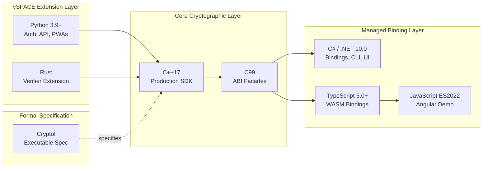

#### C++17 — Core Cryptographic Library (Existing)

C++17 is the primary implementation language for the ElectionGuard 2.0 production SDK. The standard is enforced in `src/CMakeLists.txt` (line 48: `target_compile_features ... cxx_std_17`) with extensions disabled (`CMAKE_CXX_EXTENSIONS OFF`). Over 25 source files in `src/electionguard/` implement all cryptographic primitives, the election domain model, encryption workflows, and serialisation. The codebase employs the PIMPL (Pointer-to-Implementation) pattern for API stability, immutable objects for thread safety, smart pointers and move semantics for memory safety, and avoids multiple inheritance for clarity.

**Selection Criteria:**
- **Performance:** Native execution is essential for cryptographic operations over a 4096-bit prime modulus group where modular exponentiation dominates runtime.
- **Interoperability:** C++17 compiles to all target platforms (Linux, macOS, Windows, Android, iOS, WebAssembly) and provides the base for C ABI facades.
- **Formal Verification Alignment:** The HACL\* dependency (Project Everest) produces formally verified C code; C++17 wraps it with RAII semantics without sacrificing the verification guarantees.
- **Compiler Support:** MSVC, Clang, and GCC are all validated in the CI matrix (`.github/workflows/pull-request.yml`).

#### C (C99) — ABI Facades (Existing)

C99 provides the stable Application Binary Interface through 19 facade files in `src/electionguard/facades/` using `extern "C"` linkage. Opaque handle types (`eg_*`) expose the C++ implementation through status code error translation defined in `include/electionguard/status.h`. The C99 standard is also used for the test binary (`test/CMakeLists.txt`).

**Selection Criteria:**
- **Universal FFI Compatibility:** Every major language runtime can call C functions, making C99 the natural choice for the cross-language boundary.
- **ABI Stability:** C ABI is immutable across compiler versions, ensuring that binding consumers (.NET, Java, TypeScript/WASM) are insulated from C++ internal changes.

#### C# / .NET 10.0 — Managed Bindings, CLI, and UI (Existing)

C# is used across three distinct roles: .NET Standard bindings for the cryptographic library (`bindings/netstandard/`, targeting `netstandard2.0` and `net10.0`), a .NET 10 CLI tool for election artifact management (`apps/electionguard-cli/ElectionGuard.CLI.csproj`), and a .NET MAUI cross-platform UI application (`src/electionguard-ui/`). The .NET 10 SDK is installed across all CI platforms (`.github/workflows/pull-request.yml` and `pull-request-ui.yml`).

**Selection Criteria:**
- **Enterprise Ecosystem:** .NET provides a broad enterprise deployment surface for election system integrators.
- **Cross-Platform UI:** .NET MAUI delivers a single UI codebase across Windows, macOS, iOS, and Android, replacing the need for platform-specific native applications.
- **Tooling Maturity:** Central package management via `Directory.Packages.props` ensures version consistency across all .NET projects in the monorepo.

#### TypeScript 5.0+ — WebAssembly Bindings (Existing)

TypeScript 5.0.4+ (`bindings/typescript/package.json`) provides type-safe facades over the Emscripten/WASM module, compiled to ES2021 with CommonJS module format. The npm package `@infernored/electionguard-experimental` (v1.75.9) delivers the ElectionGuard cryptographic API to browser and Node.js environments.

**Selection Criteria:**
- **Type Safety:** TypeScript's static type system ensures that WASM bindings are consumed correctly by downstream web applications.
- **Browser Deployment:** WebAssembly allows the cryptographic core to run in browser environments with near-native performance.

#### JavaScript (ES2022) — Angular Demo (Existing)

The Angular 15.2.x demonstration application (`apps/angular-demo/`) targets ES2022 as configured in `apps/angular-demo/tsconfig.json`. This serves as a reference integration showcasing how a web application consumes the TypeScript/WASM bindings.

#### Python 3.9+ — vSPACE Extension Layer (Proposed)

Python is the primary language for all vSPACE extension services, the `electionguard_vspace` package, FastAPI endpoint groups, FastHTML PWA applications, and NLWeb instance configuration. The selection aligns with the entire ElectionGuard Python ecosystem (`electionguard-python`, `electionguard-api-python`), ensuring that the same developers who implement SAAC credential logic can build the voter-facing UI without language context-switching.

**Selection Criteria:**
- **Ecosystem Cohesion:** The ElectionGuard reference SDK (`electionguard-python`) and API (`electionguard-api-python`) are Python-centric; vSPACE maintains this uniformity.
- **FastHTML Alignment:** FastHTML's pure-Python approach eliminates the impedance mismatch between backend cryptographic operations and frontend rendering.
- **NLWeb Compatibility:** The NLWeb reference implementation is Python-based, enabling shared ASGI infrastructure with FastHTML under a single Uvicorn process.
- **Rapid Prototyping:** Python's conciseness supports the Phase 1 research-grade implementation targeting TRL 3, with subsequent hardening to C++ in Phase 3.

#### Rust — vSPACE Verifier Extension (Proposed)

Rust is used for the `vspace-verify` crate, extending the existing `electionguard-verifier` with anonymous credential validity checks, one-show serial number uniqueness verification, and binding proof correctness. Modules include `saac_verify.rs`, `binding_verify.rs`, and `serial_verify.rs`.

**Selection Criteria:**
- **Ecosystem Match:** The existing `electionguard-verifier` is written in Rust; extending it in the same language preserves the dependency chain and build system.
- **Memory Safety:** Rust's ownership model provides memory safety guarantees critical for verification code that processes untrusted election records.

#### Cryptol — Formal Specification (Proposed)

Cryptol is used for the formal executable specification of the vSPACE binding protocol, VRF serial number derivation, and augmented election record validation logic. The proposed `vSPACE.cry` module extends the existing `Formal/cryptol/ElectionGuard.cry` in the `ElectionGuard-SDK-Specification` repository.

**Selection Criteria:**
- **Specification Continuity:** The ElectionGuard specification already uses Cryptol; vSPACE maintains this formal verification approach.
- **Executable Verification:** Cryptol specifications can be executed against test vectors, providing automated correctness checking.

### 3.1.2 Language Summary Matrix

| Language | Standard / Version | Component | Status | Compilers / Runtimes |
|---|---|---|---|---|
| C++ | C++17 | Core cryptographic SDK | Existing | MSVC 2022, Clang 14, GCC, Xcode |
| C | C99 | ABI facade layer | Existing | Same as C++ (cross-compiled) |
| C# | .NET 10.0 / netstandard2.0 | Bindings, CLI, MAUI UI | Existing | .NET 10 SDK |
| TypeScript | 5.0.4+ (ES2021) | WASM bindings | Existing | tsc, Node.js 18+ |
| JavaScript | ES2022 | Angular demo | Existing | Angular CLI 15.2.x |
| Python | 3.9+ | vSPACE extensions, PWAs, API | Proposed | CPython, Uvicorn ASGI |
| Rust | Stable (2021 edition) | Verifier extension | Proposed | Cargo |
| Cryptol | Latest | Formal specification | Proposed | Cryptol toolchain |

---

## 3.2 FRAMEWORKS & LIBRARIES

### 3.2.1 Core C++ Frameworks and Libraries (Existing)

The C++ core relies on a carefully curated set of dependencies managed through CPM.cmake 0.31.0 (bootstrapped in root `CMakeLists.txt` line 34). All dependencies are pinned to specific versions for reproducibility.

| Library | Version | Source | Purpose | Justification |
|---|---|---|---|---|
| **HACL\*** (Project Everest) | 0.6.0 (commit `04883d6`) | `libs/hacl/CMakeLists.txt` | Formally verified big-number arithmetic (256-bit, 4096-bit), HMAC-SHA-2, DRBG, SHA-2 streaming, secure memory erasure | Eliminates GMP dependency; provides formal verification guarantees for all cryptographic primitives; deployed in Firefox, Linux kernel, and Wireguard |
| **nlohmann_json** | 3.11.3 | `src/CMakeLists.txt` lines 15–20 | JSON serialisation for election records, manifests, and ballot data | Industry-standard C++ JSON library with header-only integration; supports the multiple serialisation formats (JSON, BSON, MsgPack) required by the election domain model |
| **spdlog** | 1.9.2 | `src/CMakeLists.txt` lines 22–27 | Structured logging across all library components | High-performance, header-only logging with pattern formatting; critical for debugging cryptographic workflows without impacting performance |
| **HowardHinnant/date** | 3.0.1 | `src/CMakeLists.txt` lines 9–13 | ISO 8601 timestamp handling for election events and ballot code generation | Pre-C++20 date/time library providing the precision and format compliance required for election record timestamps |
| **doctest** | 2.4.12 | `test/CMakeLists.txt` (via CPM) | C++ unit testing framework | Lightweight, single-header testing framework with fast compilation; used across the entire `test/` infrastructure |
| **Google Benchmark** | 1.5.2 | `test/CMakeLists.txt` (via CPM) | Performance benchmarking for cryptographic operations | Google's micro-benchmarking framework; essential for validating that credential verification meets the < 50 ms target |
| **pthreads** | System | `CMakeLists.txt` line 51 | Threading support for precomputation buffers and concurrent encryption | System threading primitive; required for the `PrecomputeBuffers` singleton pattern |

#### HACL* Library Wrapper Architecture

The HACL\* integration in `libs/hacl/` provides C++ RAII wrappers around the HACL C APIs. The wrapper layer includes 18 files covering the following formally verified primitives:

| HACL Module | Wrapper File(s) | Cryptographic Function | Application in ElectionGuard |
|---|---|---|---|
| `Hacl_Bignum256` | `Bignum256.hpp/cpp` | 256-bit modular arithmetic with Montgomery context (PIMPL) | ElementModQ operations (Q = 2^256 − 189) |
| `Hacl_Bignum4096` | `Bignum4096.hpp/cpp` | 4096-bit modular arithmetic (64-bit and 32-bit limb variants) | ElementModP operations (4096-bit prime P) |
| `Hacl_HMAC` | `HMAC.hpp/cpp` | SHA2-256/384/512, BLAKE2s-32, BLAKE2b-32, SHA1 | Ballot code generation, proof construction |
| `Hacl_HMAC_DRBG` | `DRBG.hpp/cpp` | HMAC-DRBG state management | Cryptographically secure nonce generation |
| `Hacl_Streaming_SHA2` | `SHA2.hpp/cpp` | Incremental SHA-256/384/512 hashing | Domain-separated hashing with spec-aligned prefixes |
| `Lib` | `Lib.hpp/cpp` | Secure memory zeroisation, OS randomness | Key material cleanup, entropy seeding |

### 3.2.2 .NET Ecosystem Libraries (Existing)

The .NET projects use central package management via `src/electionguard-ui/Directory.Packages.props`, ensuring version consistency across the MAUI UI, .NET Standard bindings, and CLI tool.

**MAUI UI Framework Stack:**

| Package | Version | Purpose |
|---|---|---|
| Microsoft.Maui.Controls | 8.0.93 | Cross-platform MAUI framework |
| Microsoft.Maui.Core | 9.0.21 | MAUI core runtime |
| Microsoft.UI.Xaml | 2.8.6 | Windows UI layer |
| CommunityToolkit.Maui | 5.3.0 | MAUI UI helpers and extensions |
| CommunityToolkit.Mvvm | 8.2.1 | MVVM architectural support |
| Newtonsoft.Json | 13.0.3 | JSON serialisation |
| MongoDB.Driver | 2.19.1 | Database access for election data |

**Observability and Distribution:**

| Package | Version | Purpose |
|---|---|---|
| Microsoft.AppCenter.Analytics | 5.0.2 | Usage telemetry |
| Microsoft.AppCenter.Crashes | 5.0.2 | Crash reporting |
| Microsoft.AppCenter.Distribute | 5.0.2 | App distribution |
| MetroLog.Maui / MetroLog.Net6 | 2.1.0 | Structured logging |
| Microsoft.Extensions.Logging.Debug | 7.0.0 | Debug-level logging |

**Testing:**

| Package | Version | Purpose |
|---|---|---|
| Shouldly | 4.1.0 | Fluent assertion library |
| NUnit | (project reference) | .NET test framework |

### 3.2.3 TypeScript / npm Ecosystem (Existing)

The TypeScript bindings package (`bindings/typescript/package.json`) is published as `@infernored/electionguard-experimental` v1.75.9 and uses webpack for module bundling.

| Package | Version | Category | Purpose |
|---|---|---|---|
| typescript | ^5.0.4 | Compiler | TypeScript-to-JavaScript compilation |
| webpack | ^5.79.0 | Bundling | Module bundling for browser/Node.js distribution |
| webpack-cli | ^5.0.1 | Tooling | CLI interface for webpack |
| mocha | ^10.2.0 | Testing | Test framework |
| chai | ^4.3.7 | Testing | Assertion library |
| ts-loader | ^9.4.2 | Bundling | TypeScript webpack integration |
| ts-node | ^10.9.1 | Runtime | TypeScript execution in Node.js |
| tsembind | ^1.1.0 | Types | Embind type definitions for WASM interop |
| @types/emscripten | ^1.39.6 | Types | Emscripten type definitions |
| @types/mocha | ^10.0.1 | Types | Mocha type definitions |
| @types/node | ^18.15.12 | Types | Node.js type definitions |
| copyfiles | ^2.4.1 | Build | WASM artifact copying during build |
| prettier | ^2.8.7 | Formatting | Code formatting enforcement |
| file-loader | ^6.2.0 | Bundling | Webpack file loading |

### 3.2.4 Angular Demo Libraries (Existing)

The Angular demonstration application (`apps/angular-demo/`) showcases WASM integration with the following stack:

| Package | Version | Purpose |
|---|---|---|
| @angular/\* | 15.2.x | Angular framework suite |
| @angular-builders/custom-webpack | (dev dep) | Custom webpack configuration integration |
| rxjs | (runtime) | Reactive programming for Angular |
| zone.js | (runtime) | Angular change detection |
| tslib | (runtime) | TypeScript runtime helpers |
| Karma / Jasmine | (dev dep) | Angular testing infrastructure |

The custom webpack configuration disables Node core module fallbacks (`crypto`, `fs`, `os`, `path`, `perf_hooks`, `worker_threads`) and sets `Cross-Origin-Opener-Policy` and `Cross-Origin-Embedder-Policy` headers for SharedArrayBuffer and pthread support in the WASM module.

### 3.2.5 vSPACE Python Frameworks and Libraries (Proposed)

The vSPACE extension layer introduces a Python-centric web and cryptographic stack. Framework choices are driven by the vSPACE PRD v1.1 requirements for server-as-source-of-truth architecture, ASGI infrastructure sharing, and Python ecosystem cohesion.

#### FastHTML — Progressive Web Application Framework

FastHTML is a new next-generation web framework for fast, scalable web applications with minimal, compact code. FastHTML is a framework that deals with all these issues: it returns to the roots of the web, leveraging ASGI and HTMX, and is usable by both experienced developers and new coders. Out of the box FastHTML provides authentication, database access, styles (via PicoCSS), and more.

| Property | Value |
|---|---|
| PyPI Package | `python-fasthtml` |
| Version | 0.12.x (latest stable) |
| License | Apache 2.0 |
| Runtime | ASGI (Uvicorn + Starlette) |
| Interactivity | HTMX (server-rendered HTML partials) |
| CSS | PicoCSS (built-in, WCAG 2.1 AA accessible) |

**Justification for FastHTML over React (Default Stack):**

1. **Language Unification:** FastHTML keeps the entire web layer in Python, consistent with the ElectionGuard Python ecosystem, eliminating the impedance mismatch between backend cryptographic operations and frontend rendering.
2. **ASGI Infrastructure Sharing:** FastHTML's Starlette foundation means it shares the same ASGI server that NLWeb runs on, enabling both vSpaceVote.com and vSpaceWallet.com to serve their web UI and NLWeb conversational interface from a single Uvicorn process.
3. **Server-as-Source-of-Truth:** For e-voting interfaces, HTMX's approach of swapping server-rendered HTML partials ensures the server validates every voter action against election rules and cryptographic constraints. There is no client-side state that could become desynchronised, and no client-side JavaScript that could be tampered with to alter ballot encryption behaviour.
4. **Accessibility:** PicoCSS provides semantic HTML styling meeting WCAG 2.1 AA standards, critical for election applications.
5. **Security Surface Reduction:** Content-Security-Policy headers allow only same-origin scripts, consistent with FastHTML's architecture where all interactivity is driven by HTML attributes.

#### vSPACE Python Library Dependencies

| Library | Purpose | Justification |
|---|---|---|
| **FastAPI** | REST API framework for `electionguard-api-python` extensions | Existing API framework in the ElectionGuard ecosystem; vSPACE adds endpoints under `/v1/vspace/` |
| **MSAL Python** | OAuth2 token acquisition for Microsoft Entra Verified ID | Required for `VerifiableCredential.Create.All` permission and admin consent on the Entra API |
| **ecdsa** | NIST P-256 elliptic curve operations | SAAC protocol implementation requires pairing-free curve arithmetic |
| **pycryptodome** | Cryptographic operations (P-256) | Complements `ecdsa` for broader cryptographic primitive support |
| **cryptography** | ≥ 43.0 — TLS 1.3, X.509 certificate handling | Guardian mutual TLS authentication, certificate pinning, election-specific CA management |
| **Uvicorn** | ASGI server | Production ASGI server shared between FastHTML and NLWeb |
| **Starlette** | ASGI framework layer | Middleware stack (authentication, rate limiting, CORS, TLS termination) |
| **PicoCSS** | Accessible semantic HTML styling | Bundled with FastHTML; provides WCAG 2.1 AA compliance for voter-facing PWAs |

---

## 3.3 OPEN SOURCE DEPENDENCIES

### 3.3.1 Package Registries and Management

The system uses four distinct package management ecosystems, each with its own registry and versioning strategy:

| Ecosystem | Package Manager | Registry | Lockfile / Pinning Strategy |
|---|---|---|---|
| C++ | CPM.cmake 0.31.0 | GitHub (direct repository references) | CPM hash-based pinning; HACL\* pinned to commit `04883d6` |
| .NET | NuGet | nuget.org | Central Package Management (`Directory.Packages.props`) |
| TypeScript/JavaScript | npm | npmjs.com | `package.json` with semver ranges |
| Python (proposed) | pip / Poetry | PyPI | `pyproject.toml` with version constraints |

### 3.3.2 C++ Third-Party Dependencies (via CPM)

All C++ dependencies are fetched at configure time via CPM.cmake, with repository URLs and version tags specified in the respective `CMakeLists.txt` files:

| Dependency | Version | Repository | License | Security Notes |
|---|---|---|---|---|
| hacl-packages | 0.6.0 (commit `04883d6`) | `github.com/cryspen/hacl-packages` | Apache 2.0 / MIT (generated C) | Formally verified for memory safety, functional correctness, and secret independence |
| nlohmann/json | 3.11.3 | `github.com/nlohmann/json` | MIT | Header-only; no native code execution risk |
| gabime/spdlog | 1.9.2 | `github.com/gabime/spdlog` | MIT | Header-only logging; no network access |
| HowardHinnant/date | 3.0.1 | `github.com/HowardHinnant/date` | MIT | Date parsing; no crypto or network operations |
| doctest/doctest | 2.4.12 | `github.com/doctest/doctest` | MIT | Test-only dependency; not included in production builds |
| google/benchmark | 1.5.2 | `github.com/google/benchmark` | Apache 2.0 | Benchmark-only dependency; not included in production builds |

### 3.3.3 .NET Package Dependencies (via NuGet)

All .NET packages are version-locked through `Directory.Packages.props` with central package management enabled. Key security considerations include:

- **MongoDB.Driver 2.19.1:** Used for election data persistence; must be configured with authentication and TLS in production.
- **Newtonsoft.Json 13.0.3:** JSON serialisation; `TypeNameHandling` must remain at `None` to prevent deserialisation attacks.
- **Microsoft.AppCenter.\* 5.0.2:** Telemetry services; must be disabled or reconfigured for production election deployments where data sovereignty is critical.

### 3.3.4 npm Package Dependencies

The TypeScript bindings publish as `@infernored/electionguard-experimental` v1.75.9. All runtime dependencies are development-only (the production artifact is a bundled WASM module with TypeScript type definitions). The `tsembind` 1.1.0 package provides type-safe bindings to the Emscripten Embind module.

### 3.3.5 Proposed Python Dependencies (via pip/Poetry)

| Package | Version Constraint | License | Security Notes |
|---|---|---|---|
| python-fasthtml | ≥ 0.12 | Apache 2.0 | Pure Python; minimal attack surface |
| fastapi | ≥ 0.100 | MIT | Existing ecosystem dependency |
| msal | ≥ 1.24 | MIT | Microsoft authentication library; handles OAuth2 token lifecycle |
| ecdsa | ≥ 0.18 | MIT | Pure Python EC operations; no native extensions |
| pycryptodome | ≥ 3.19 | BSD-2-Clause / Public Domain | C-extension cryptographic library |
| cryptography | ≥ 43.0 | Apache 2.0 / BSD | OpenSSL-backed; critical for TLS 1.3 mutual authentication |
| uvicorn | ≥ 0.23 | BSD-3-Clause | ASGI server |
| starlette | ≥ 0.27 | BSD-3-Clause | ASGI framework (implicit via FastHTML) |

### 3.3.6 Proposed NLWeb Integration

Main reference implementation for NLWeb, implemented in Python. NLWeb simplifies the process of building conversational interfaces for websites. It natively supports MCP (Model Context Protocol), allowing the same natural language APIs to serve both humans and AI agents. The NLWeb reference implementation is sourced from `github.com/microsoft/NLWeb` under the MIT license. NLWeb uses the MIT License.

| Property | Value |
|---|---|
| Repository | `github.com/microsoft/NLWeb` |
| License | MIT |
| Language | Python |
| Supported Vector Stores | Azure AI Search, Qdrant, Elasticsearch, PostgreSQL, and others |
| Supported LLMs | OpenAI, Azure OpenAI, Anthropic, and others |

---

## 3.4 THIRD-PARTY SERVICES

### 3.4.1 Microsoft Entra Verified ID (Proposed)

Microsoft Entra Verified ID provides the W3C Verifiable Credential infrastructure for voter identity verification and credential issuance. It serves as the identity layer above the anonymous credential layer, providing initial identity verification while the SAAC layer provides unlinkable authentication at voting time.

| API Endpoint | Purpose | Phase |
|---|---|---|
| `https://verifiedid.did.msidentity.com/v1.0/verifiableCredentials/createIssuanceRequest` | VC issuance during voter registration | Phase 2 |
| `https://verifiedid.did.msidentity.com/v1.0/verifiableCredentials/createPresentationRequest` | VC presentation during credential derivation | Phase 2 |
| `https://verifiedid.did.msidentity.com` (Admin API) | Service provisioning, DID document registration, credential contract management | Phase 2 |

**Integration Requirements:**
- **Licensing:** Azure AD Premium P2 or Microsoft Entra Suite (constraint C-003)
- **Permission:** `VerifiableCredential.Create.All` with admin consent
- **DID Method:** `did:web` at `https://vspacevote.com/.well-known/did.json`
- **Custom Credential:** `VoterEligibilityCredential` contract with display and rules definitions
- **OAuth2:** MSAL Python for token acquisition against the Entra APIs

**Justification over Auth0 (Default Stack):**
Auth0 provides standard OAuth2/OIDC authentication but does not support W3C Verifiable Credentials, `did:web` decentralised identifiers, or the oblivious credential derivation protocol required for unlinkable voter authentication. Entra Verified ID is the only enterprise-grade service that bridges conventional identity verification with W3C VC issuance, enabling the SAAC anonymous credential derivation pipeline.

### 3.4.2 Azure OpenAI Service (Proposed)

Azure OpenAI Service provides the LLM inference backend for NLWeb query understanding and response generation across both PWA domains.

| Property | Value |
|---|---|
| Purpose | RAG-based natural language queries over election data |
| Constraint | Strict RAG mode; read-only during active voting periods |
| Security | All responses include cryptographic provenance hashes linking to source data |
| Data Isolation | No access to decryption keys, guardian shares, or voter identity data |

**Justification over Langchain (Default Stack):**
The vSPACE architecture uses NLWeb's built-in LLM pipeline (which natively supports Azure OpenAI) rather than Langchain for orchestration. This decision aligns with the Microsoft Azure ecosystem requirement (constraint C-003) and leverages NLWeb's Schema.org-typed response format, MCP server capability, and domain-specific tool calling — features that would require significant custom development with Langchain.

### 3.4.3 NLWeb Protocol Service (Proposed)

Today Microsoft is introducing NLWeb, an open project designed to simplify the creation of natural language interfaces for websites—making it easy to turn any site into an AI-powered app. Every NLWeb instance also acts as an MCP server (and soon A2A) and supports a core method, ask, which allows a natural language question to be posed to a website.

Two NLWeb instances are deployed — one for vSpaceVote.com (election operations) and one for vSpaceWallet.com (credential management):

| Instance | Domain | Schema.org Types | Custom Tools |
|---|---|---|---|
| vSpaceVote NLWeb | vSpaceVote.com | `Event`, `VoteAction` (custom), `Report`, `GovernmentOrganization` | `BallotLookupTool`, `TallyExplorerTool` |
| vSpaceWallet NLWeb | vSpaceWallet.com | `DigitalDocument`, `Action`, `VerifiableCredential` (custom) | `CredentialStatusTool` |

### 3.4.4 Azure Infrastructure Services (Proposed)

The complete Azure service topology supports the production deployment architecture:

| Azure Service | SKU / Tier | Purpose | Justification |
|---|---|---|---|
| **Azure App Service** | Premium v3, Linux | FastHTML PWA hosting (vSpaceVote.com, vSpaceWallet.com) | Auto-scaling for 100K concurrent voters per regional deployment |
| **Azure Kubernetes Service (AKS)** | Standard | ElectionGuard API, NLWeb, credential issuer, guardian relay | Container orchestration for microservice architecture |
| **Azure Front Door** | Standard | Global CDN, DDoS protection, TLS termination | Managed certificates, HSTS preloading, geographic routing |
| **Azure Monitor + Application Insights** | Standard | Observability with election-specific dashboards | Custom metrics for credential presentation latency, ballot throughput |
| **Azure Key Vault** | Standard | Signing keys, Entra SP credentials, guardian CA keys, SAAC issuer parameters | HSM-backed key storage for production deployments |
| **Azure AI Search** | Standard | Vector store backend for NLWeb instances | Indexes election manifests, published records, credential state |

**Justification over AWS (Default Stack):**
The architecture assumes Microsoft Azure infrastructure (constraint C-003) due to deep integration with Microsoft Entra Verified ID (which requires an Azure AD tenant), Azure OpenAI Service for NLWeb LLM inference, and the existing Microsoft-aligned ElectionGuard ecosystem. Azure Cosmos DB's MongoDB API provides a seamless migration path from the existing MongoDB 6.0.3 development database.

---

## 3.5 DATABASES & STORAGE

### 3.5.1 Database Architecture Overview

The system employs a tiered storage strategy with MongoDB as the primary document database, Azure Cosmos DB for production-grade global distribution, and specialised storage services for vector search, key management, and client-side credential persistence.

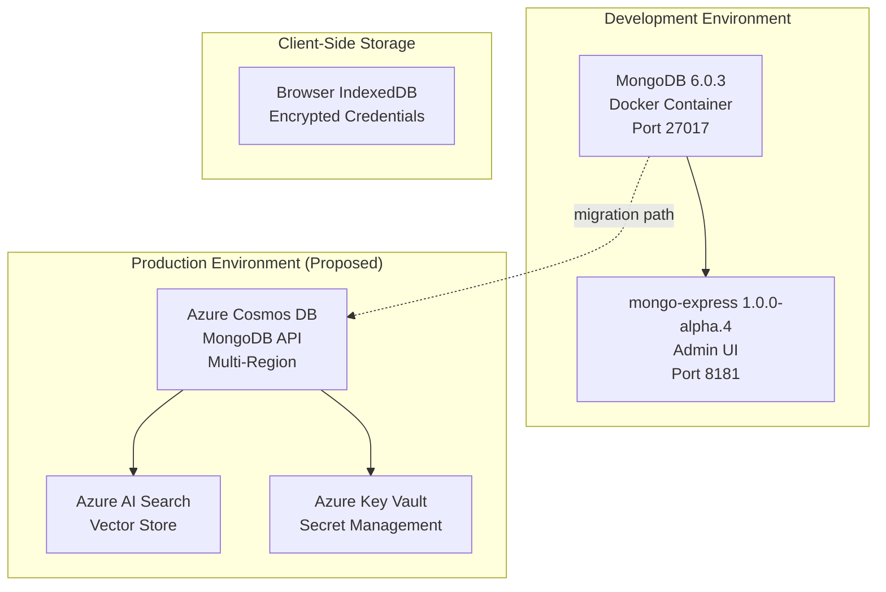

### 3.5.2 MongoDB 6.0.3 — Primary Document Database (Existing — Development)

MongoDB serves as the development and testing database, configured via Docker Compose in `src/electionguard-db/docker-compose.db.yml`.

| Property | Value |
|---|---|
| Docker Image | `mongo:6.0.3` |
| Container Name | `electionguard2-db` |
| Port | 27017 |
| Database | `ElectionGuardDb` |
| Admin UI | mongo-express 1.0.0-alpha.4 (port 8181) |
| Init Script | `src/electionguard-db/mongo-init.js` |
| Environment | `EG_DB_PASSWORD`, `EG_DB_DIR` (from `.env`: `EG_DB_DIR=../../database`) |

**Existing Collections:**

| Collection | Purpose | Index Strategy |
|---|---|---|
| `key_ceremonies` | Guardian key ceremony state | `DataType` polymorphic filter |
| `elections` | Election metadata and manifests | Operational identifiers |
| `ballots` | Encrypted ballot storage | State field indexes |
| `tallies` | Tally accumulation and results | Election reference |

**vSPACE Additional Collections (Proposed):**

| Collection | Purpose | Index Strategy |
|---|---|---|
| `vspace_credentials` | Anonymous credential public parameters | Credential identifier, election reference |
| `vspace_serial_numbers` | One-show serial number registry | Unique index on serial number for double-vote prevention |
| `vspace_bindings` | Credential-to-ballot binding commitments and proofs | Ballot reference, verification status |

**Justification over other databases:**
MongoDB aligns with the existing `electionguard-api-python` persistence layer and the MongoDB.Driver 2.19.1 already used in the .NET MAUI UI. The document model naturally represents the election domain's hierarchical data structures (manifests containing contests containing selections) without impedance mismatch.

### 3.5.3 Azure Cosmos DB — MongoDB API (Proposed — Production)

Azure Cosmos DB with the MongoDB API provides the production-grade persistence layer, offering globally distributed, multi-region replication of election records. The MongoDB API wire compatibility ensures that existing MongoDB client code (both Python and .NET) requires zero modification for production deployment.

| Property | Value |
|---|---|
| API | MongoDB API (wire-compatible) |
| Replication | Multi-region, automatic failover |
| Consistency | Strong (configurable to bounded staleness for read-heavy verification workloads) |
| Scaling | Auto-scale throughput based on election-day traffic patterns |

### 3.5.4 Azure AI Search — Vector Store (Proposed)

Azure AI Search serves as the vector store backend for both NLWeb instances, indexing election manifests, published records, tally results, verification reports, and credential state as Schema.org-typed items. Index refresh occurs after election record publication; the search service operates in read-only mode during active voting periods.

### 3.5.5 Azure Key Vault — Secret Management (Proposed)

Azure Key Vault stores all sensitive cryptographic material with HSM-backed protection:

| Secret Category | Contents |
|---|---|
| Election Authority Signing Keys | Keys used for election record signing |
| Entra Verified ID SP Credentials | Service principal credentials for Entra API access |
| Guardian Certificate CA Private Key | Election-specific CA for mutual TLS 1.3 |
| SAAC Issuer Parameters | Anonymous credential issuer secret keys |

### 3.5.6 Browser IndexedDB — Client-Side Credential Storage (Proposed)

The vSpaceWallet.com PWA stores the voter's primary anonymous credential share in the browser's IndexedDB, encrypted with a key derived from the voter's device credentials. The same-origin security boundary between vSpaceWallet.com and vSpaceVote.com ensures that ballot operations cannot directly access credential storage.

---

## 3.6 DEVELOPMENT & DEPLOYMENT

### 3.6.1 Build System

The build system employs a layered architecture with CMake as the primary C++ build tool, GNU Make as the workflow automation hub, and platform-specific toolchains for managed bindings.

#### CMake — C++ Build System

| Property | Value | Source |
|---|---|---|
| Minimum Version | 3.14 (3.16 for some features) | Root `CMakeLists.txt` line 1 |
| Package Manager | CPM.cmake 0.31.0 | Root `CMakeLists.txt` line 34 |
| Project Version | 2.0.0 | `CMakeLists.txt` lines 7–10 |
| Spec Test Version | 0.95.0 | `cmake/options.cmake` line 9 |

**Build Configuration Options** (from `cmake/options.cmake`):

| Option | Default | Purpose |
|---|---|---|
| `CMAKE_BUILD_TYPE` | Debug | Debug/Release build selection |
| `BUILD_SHARED_LIBS` | ON | Shared vs. static library output |
| `EXPORT_INTERNALS` | OFF | Export internal headers for testing |
| `USE_32BIT_MATH` | OFF | 32-bit optimised arithmetic for constrained platforms |
| `USE_TEST_PRIMES` | OFF | Smaller primes for accelerated test execution |
| `CODE_COVERAGE` | OFF | Coverage instrumentation |
| `USE_DYNAMIC_ANALYSIS` | OFF | Valgrind integration |

#### GNU Make — Workflow Automation

The root `Makefile` serves as the workflow automation hub, detecting OS and architecture at invocation time and providing unified build targets:

| Target Category | Examples | Purpose |
|---|---|---|
| Core Build | `build`, `build-release` | CMake configure + build |
| WASM | `build-wasm` | Emscripten cross-compilation |
| Testing | `test`, `sanitize-asan` | Test execution and sanitiser runs |
| Environment | `environment`, `environment-ui` | Dev environment setup |
| Data | `fetch-sample-data` | Download sample election manifests |

#### Emscripten — WebAssembly Build

| Property | Value | Source |
|---|---|---|
| Version | 3.1.35 | `Makefile` line 21 |
| Binding | Embind (`-lembind`) | WASM build configuration |
| Features | MODULARIZE, WASM_BIGINT, ALLOW_MEMORY_GROWTH, SINGLE_FILE | Webpack-compatible module output |
| WASM Sources | 6 files in `src/electionguard/wasm/` | ballots, election, encryption, group, manifest, precomputation |

## .NET Build Tools

| Tool | Version | Source | Purpose |
|---|---|---|---|
| Cake | 3.0.0 | `.config/dotnet-tools.json` | .NET build orchestration |
| JetBrains ReSharper CLI | 2025.3.3 | `.config/dotnet-tools.json` | Code analysis and formatting |
| nvika | 4.0.0 | `.config/dotnet-tools.json` | Build diagnostics aggregation |
| .NET SDK | 10.0.x | CI workflow configuration | Primary .NET build toolchain |

## npm/Node.js Build

| Script | Command | Purpose |
|---|---|---|
| `build` | `tsc && copyfiles ...` | TypeScript compilation + WASM artifact copy |
| `build:wasm` | (CMake-based) | Emscripten build pipeline |
| `pack` | `webpack` | Bundle for distribution |
| `test` | `mocha` | Run TypeScript test suite |

### 3.6.2 Static Analysis and Security Tooling

The repository employs a defence-in-depth approach to code quality and security, combining static analysis, dynamic analysis, and formal verification:

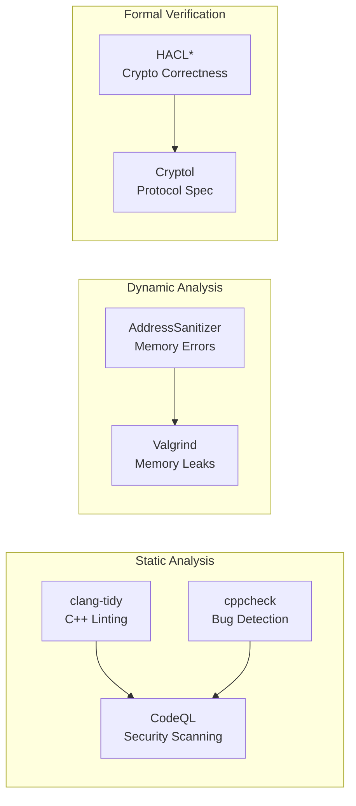

| Tool | Category | Trigger | Configuration |
|---|---|---|---|
| **clang-tidy** | Static analysis | Local + CI | `cmake/tools.cmake` |
| **cppcheck** | Static analysis | Local | Referenced in architecture docs |
| **CodeQL** | SAST (C++) | PR to `main` (core paths) | `.github/workflows/codeql-analysis.yml` |
| **AddressSanitizer** | Dynamic analysis | Push to `main` | `.github/workflows/sanitizer.yml` (Clang 14, `make sanitize-asan`) |
| **Valgrind** | Dynamic analysis | Configurable | `cmake/options.cmake` (`USE_DYNAMIC_ANALYSIS`) |
| **HACL\* Formal Verification** | Crypto correctness | Library level | `libs/hacl/` (Project Everest) |

### 3.6.3 Development Environment

#### VS Code Dev Container

The primary development environment is defined in `.devcontainer/devcontainer.json`, providing a reproducible Ubuntu 22.04-based container with all required tooling:

| Property | Value |
|---|---|
| Base Image | Ubuntu 22.04 C++ development base |
| Post-Create Command | `make fetch-sample-data environment-ui` |

**Pre-installed VS Code Extensions:**

| Extension | Purpose |
|---|---|
| CMake Tools | CMake build system integration |
| C++ Tools | IntelliSense, debugging, code navigation |
| .NET CS Dev Kit | C# development support |
| MAUI Extension | .NET MAUI UI development |
| Makefile Tools | Makefile target navigation |
| Cake Extension | .NET Cake build script support |

#### Docker Development Image

The root `Dockerfile` provides a standalone build image based on `ubuntu:jammy` (Ubuntu 22.04) with Mono and .NET 6 installed, suitable for CI and headless build environments.

### 3.6.4 Containerisation

| Container | Image | Configuration | Purpose |
|---|---|---|---|
| Core Build | `ubuntu:jammy` | Root `Dockerfile` | Headless C++/.NET build environment |
| Dev Container | Ubuntu 22.04 C++ base | `.devcontainer/Dockerfile` | Interactive development |
| MongoDB | `mongo:6.0.3` | `docker-compose.db.yml` | Election data persistence |
| mongo-express | `mongo-express:1.0.0-alpha.4` | `docker-compose.db.yml` | Database administration UI |
| vSPACE Services (proposed) | Custom images | `docker-compose.vspace.yml` | Entra Bridge, Credential Issuer, NLWeb |

**Proposed vSPACE Docker Compose Extension:**
The `docker-compose.vspace.yml` file (proposed) extends the existing database compose with additional services for the anonymous credential issuer, Entra bridge, FastHTML PWA containers, and NLWeb instances, following the existing `electionguard-api-python` Docker Compose deployment pattern.

### 3.6.5 CI/CD Pipeline

All CI/CD is orchestrated through GitHub Actions, with six workflow files in `.github/workflows/`:

| Workflow | File | Trigger | Purpose |
|---|---|---|---|
| **CodeQL Analysis** | `codeql-analysis.yml` | PR to `main` (core paths) | C++ SAST security scanning |
| **CodeQL (UI no-op)** | `codeql-analysis-not-required.yml` | PR to `main` (UI paths) | Check identity for UI-only changes |
| **Pull Request** | `pull-request.yml` | PR to `main` | Multi-platform build/test matrix |
| **Pull Request (UI)** | `pull-request-ui.yml` | PR to `main` (UI paths) | macOS/Windows MAUI build/test |
| **Release** | `release.yml` | Tag `v*.*.*` | Multi-platform artifact publishing |
| **Sanitizer** | `sanitizer.yml` | Push to `main` | Clang 14 + AddressSanitizer verification |

#### CI Build Matrix

The `pull-request.yml` workflow validates across the complete platform matrix:

| Platform | Compiler/Toolchain | Target |
|---|---|---|
| Linux (Ubuntu) | Clang 14 | x64 native |
| Linux (Ubuntu) | GCC | x64 native |
| Linux (Ubuntu) | Emscripten 3.1.35 | WebAssembly |
| macOS | Xcode | arm64, x64 |
| Windows | MSYS2 Clang | x64 |
| Windows | MSVC 2022 | x86, x64 |

**.NET 10.0.x** is installed across all platforms for binding compilation and testing.

#### Release Pipeline

The `release.yml` workflow produces artifacts for seven platform targets:

| Artifact | Platform | Output |
|---|---|---|
| Linux x64 | Ubuntu | Shared library + headers |
| Mac Catalyst arm64 | macOS | Framework bundle |
| macOS arm64 | macOS | Shared library |
| macOS x64 | macOS | Shared library |
| WebAssembly | Browser | WASM + JS glue |
| Windows x86 | Windows | DLL + headers |
| Windows x64 | Windows | DLL + headers |

Published to: **GitHub Releases**, **NuGet** (`.NET` bindings), **npm** (TypeScript/WASM package), and **MAUI UI distribution**.

#### Dependency Management

| Tool | Configuration | Scope |
|---|---|---|
| **Dependabot** | `dependabot.yml` | Weekly checks for `github-actions` ecosystem only |
| **CPM.cmake** | Version pinning in `CMakeLists.txt` | All C++ dependencies |
| **Directory.Packages.props** | Central package management | All .NET dependencies |

#### Proposed vSPACE Infrastructure as Code

| Tool | Purpose | Deliverable Timeline |
|---|---|---|
| **Terraform** | Azure infrastructure provisioning | Week 7 (PoC Roadmap) |
| **Bicep** | Azure-native ARM template generation | Week 7 (PoC Roadmap) |

### 3.6.6 Platform Support Matrix

The combined system targets the following platforms, validated through the CI build matrix and release pipeline:

| Platform | Compiler/Toolchain | Status | Notes |
|---|---|---|---|
| Linux (Debian-based) | GCC, Clang 14 | Existing | Primary development and CI platform |
| macOS | Xcode | Existing | arm64 and x64 targets |
| Windows | MSVC 2022, MSYS2 Clang | Existing | x86 and x64; MINGW support |
| Android | NDK 25, API Level 26+ | Existing | ARM64 primary target |
| iOS | 12+, Xcode | Existing | Combined fat binary support |
| WebAssembly | Emscripten 3.1.35 | Existing | Browser-hosted via Embind |
| Mac Catalyst | arm64 | Existing | MAUI UI target |
| Azure App Service | Linux containers | Proposed | FastHTML PWA deployment |
| Azure Kubernetes Service | Linux containers | Proposed | API and service orchestration |

---

## 3.7 TECHNOLOGY STACK DEVIATIONS FROM DEFAULTS

The actual and proposed technology stack diverges significantly from the provided default template in several areas. Each deviation is driven by the system's specific requirements for cryptographic correctness, Azure ecosystem integration, and e-voting security constraints.

| Category | Default Stack | Actual / Proposed Stack | Deviation Rationale |
|---|---|---|---|
| **Cloud Platform** | AWS | **Microsoft Azure** | Entra Verified ID requires Azure AD tenant; constraint C-003 mandates Azure infrastructure |
| **Backend Language** | Python / Flask | **C++17 core + Python 3.9+ extensions + FastAPI** | Native performance for 4096-bit crypto; Python ecosystem for extensions and rapid prototyping |
| **Frontend Framework** | React with TypeScript | **FastHTML (Python) + HTMX + PicoCSS** | Server-as-truth for e-voting; Python ecosystem cohesion; no client-side JS tampering risk |
| **CSS Framework** | TailwindCSS | **PicoCSS** | Built into FastHTML; provides WCAG 2.1 AA semantic HTML styling without build toolchain |
| **Authentication** | Auth0 | **Microsoft Entra Verified ID + SAAC** | W3C VC / DID standards; anonymous credential derivation; eIDAS 2.0 alignment |
| **Database** | MongoDB | **MongoDB 6.0.3 → Azure Cosmos DB (MongoDB API)** | Matches existing; Cosmos DB adds global distribution for production |
| **AI Framework** | Langchain | **NLWeb + Azure OpenAI Service** | Native MCP server; Schema.org-typed responses; Microsoft ecosystem alignment |
| **IaC** | Terraform | **Terraform + Bicep** | Azure-native Bicep complements Terraform for Azure-specific resources |
| **CI/CD** | GitHub Actions | **GitHub Actions** | ✅ Matches default — 6 existing workflow files |
| **Containerisation** | Docker | **Docker + Docker Compose** | ✅ Matches default — existing Dockerfiles and compose configurations |
| **Mobile** | React-Native with TypeScript | **.NET MAUI** | Existing MAUI UI in repository; unified with .NET binding ecosystem |
| **Desktop** | ElectronJS | **Not applicable** | No desktop application in current scope; MAUI provides Mac Catalyst target |
| **Native iOS** | Swift | **Not applicable** | .NET MAUI handles iOS deployment via Mac Catalyst |
| **Native Android** | Kotlin | **Not applicable** | .NET MAUI handles Android via `net10.0-android` target |

---

## 3.8 TECHNOLOGY INTEGRATION MAP

### 3.8.1 Component Integration Overview

The following diagram illustrates how the technology choices integrate across the five architectural layers defined in Section 1.2.2 of this specification:

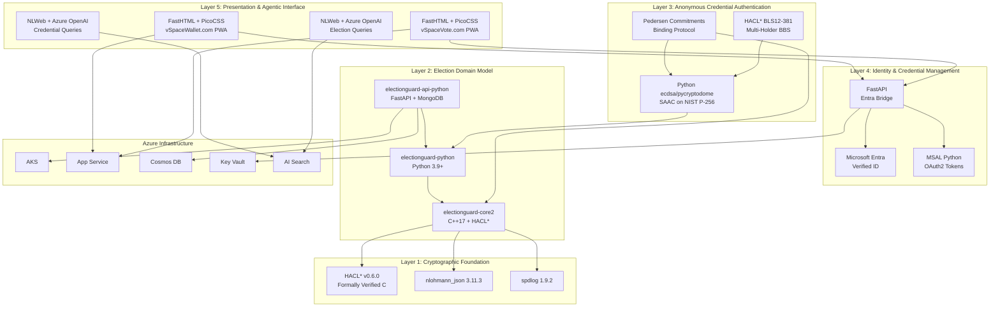

### 3.8.2 Cross-Component Compatibility Requirements

| Integration Point | Components | Protocol / API | Compatibility Requirement |
|---|---|---|---|
| C++ ↔ C | Core SDK ↔ Facades | `extern "C"` / opaque handles | C99 ABI stability across compiler versions |
| C ↔ .NET | Facades ↔ .NET Bindings | P/Invoke (netstandard2.0 / net10.0) | Symbol visibility via `EG_API` macros in `export.h` |
| C++ ↔ WASM | Core SDK ↔ Browser | Emscripten Embind 3.1.35 | WASM_BIGINT support; SharedArrayBuffer headers |
| Python ↔ C++ | vSPACE ↔ Core2 | ctypes / cffi (proposed Phase 3) | Same HACL\* v0.6.0 for cryptographic consistency |
| Rust ↔ JSON | Verifier ↔ Election Record | JSON parsing (augmented record) | `vspace_record` section backward-compatible with standard verifiers |
| Python ↔ Azure | vSPACE ↔ Entra/Cosmos/KeyVault | REST APIs + MSAL OAuth2 | Azure SDK for Python; `cryptography` ≥ 43.0 for TLS 1.3 |
| FastHTML ↔ NLWeb | PWAs ↔ Conversational AI | Shared Uvicorn ASGI process | Same middleware stack (auth, rate limiting, CORS) |
| MongoDB ↔ Cosmos DB | Dev ↔ Production | MongoDB wire protocol 6.0 | Zero code change migration via MongoDB API compatibility |

### 3.8.3 Security Integration Considerations

| Technology Pair | Security Implication | Mitigation |
|---|---|---|
| HACL\* ↔ vSPACE P-256 | HACL\* v0.6.0 may require supplementary P-256/BLS12-381 support (Assumption A-003) | Phase 3 evaluation; fallback to `ecdsa`/`pycryptodome` Python libraries |
| FastHTML ↔ Browser | No client-side JavaScript for ballot encryption | CSP headers: same-origin scripts only; HTMX partials under 2KB |
| Entra ↔ SAAC | Voter identity in VC must not leak into voting system | Oblivious credential derivation; VC consumed only during pre-election phase |
| IndexedDB ↔ Credentials | Client-side credential storage vulnerability | Encrypted with device-derived key; same-origin boundary enforcement |
| NLWeb ↔ LLM | Potential hallucination of election results | Strict RAG constraints; cryptographic provenance hashing; read-only during voting |

---

#### References

#### Repository Files Examined

- `CMakeLists.txt` — Project version (2.0.0), CMake 3.14+, CPM 0.31.0, C++17 standard enforcement
- `src/CMakeLists.txt` — nlohmann_json 3.11.3, spdlog 1.9.2, date 3.0.1 dependency declarations
- `libs/hacl/CMakeLists.txt` — HACL\* v0.6.0 pinned at commit `04883d6`
- `cmake/options.cmake` — Build configuration options, spec version 0.95.0, analysis flags
- `cmake/tools.cmake` — clang-tidy and cppcheck static analysis configuration
- `Makefile` — Emscripten 3.1.35 version, OS/platform detection, build automation targets
- `Dockerfile` — Ubuntu Jammy base image, .NET 6 installation, Make-based build
- `.env` — Database directory configuration (`EG_DB_DIR=../../database`)
- `.config/dotnet-tools.json` — Cake 3.0.0, ReSharper 2025.3.3, nvika 4.0.0
- `.devcontainer/devcontainer.json` — VS Code extensions, dev container configuration
- `bindings/typescript/package.json` — TypeScript 5.0.4, webpack 5.79.0, npm package v1.75.9
- `bindings/typescript/tsconfig.json` — ES2021 target, CommonJS module format
- `src/electionguard-db/docker-compose.db.yml` — MongoDB 6.0.3, mongo-express 1.0.0-alpha.4
- `src/electionguard-db/mongo-init.js` — Collection creation and index configuration
- `src/electionguard-ui/Directory.Packages.props` — All .NET package versions (central management)
- `apps/electionguard-cli/ElectionGuard.CLI.csproj` — .NET 10 CLI tool configuration
- `include/electionguard/status.h` — Status code definitions for C ABI
- `include/electionguard/export.h` — Symbol visibility macros (EG_API)
- `include/electionguard/constants.h` — Cryptographic constants (Q, P, precompute sizes)
- `LICENSE` — MIT License, Copyright © Microsoft Corporation

#### Repository Folders Examined

- `src/electionguard/` — 25+ C++ source files (cryptographic foundation, election domain model)
- `src/electionguard/facades/` — 19 C ABI facade files (opaque handles, extern "C")
- `src/electionguard/wasm/` — 6 Emscripten/Embind binding files
- `src/electionguard-db/` — MongoDB Docker Compose and initialisation scripts
- `src/electionguard-ui/` — .NET MAUI cross-platform UI application
- `libs/hacl/` — HACL\* cryptographic library (18 C++ wrapper files)
- `bindings/netstandard/` — .NET Standard solution (netstandard2.0, net10.0)
- `bindings/typescript/` — npm package with TypeScript facade and webpack bundling
- `apps/electionguard-cli/` — .NET 10 CLI global tool
- `apps/angular-demo/` — Angular 15.2.x demonstration application
- `test/` — doctest 2.4.12, Google Benchmark 1.5.2, C/C++ test infrastructure
- `.github/workflows/` — 6 CI/CD workflow YAML files
- `.devcontainer/` — VS Code dev container configuration
- `.config/` — .NET tool manifest

#### External Sources

- vSPACE PRD v1.1 (7 March 2026) — Primary reference for all vSPACE technology choices
- Tech Spec Sections 1.1–1.3 — System overview, architecture layers, scope
- Tech Spec Section 2.1 — Feature catalog with dependency chains
- Tech Spec Section 2.4 — Implementation considerations and technical constraints
- Tech Spec Section 2.6 — Assumptions (A-001 through A-006) and constraints (C-001 through C-006)
- FastHTML Documentation: https://fastht.ml/
- FastHTML GitHub: https://github.com/AnswerDotAI/fasthtml
- NLWeb GitHub: https://github.com/microsoft/NLWeb
- NLWeb Microsoft Announcement (Build 2025): https://news.microsoft.com/source/features/company-news/introducing-nlweb-bringing-conversational-interfaces-directly-to-the-web/
- HACL\* / Project Everest: https://hacl-star.github.io/
- HACL Packages (Cryspen): https://github.com/cryspen/hacl-packages
- ElectionGuard Core2: https://github.com/Election-Tech-Initiative/electionguard-core2

# 4. Process Flowchart

This section provides comprehensive process flowcharts documenting the end-to-end workflows of the combined ElectionGuard Core2 and vSPACE system. The diagrams span the five architectural layers defined in Section 1.2.2: Cryptographic Foundation, Election Domain Model, Anonymous Credential Authentication, Identity and Credential Management, and Presentation and Agentic Interface. Each workflow identifies start and end points, decision diamonds, system boundaries, actor touchpoints, error states, recovery paths, and timing constraints grounded in the repository source code and the vSPACE PRD v1.1.

vSPACE does not replace ElectionGuard — it wraps it. The process flows therefore distinguish between existing ElectionGuard workflows (preserved unchanged per constraint C-001) and vSPACE extension workflows that insert at two points: a pre-encryption authentication layer at step (4) of the standard data flow, and a post-verification audit layer at step (9). All workflows enforce the non-invasive extension principle (C-002) and SAFE-D compliance (C-005).

---

## 4.1 HIGH-LEVEL SYSTEM WORKFLOW

### 4.1.1 End-to-End Election Lifecycle

The following flowchart presents the complete election lifecycle from manifest definition through augmented verification, integrating both the existing ElectionGuard Core2 process (F-001 through F-012) and the vSPACE extension layer (F-100 through F-112). The nine numbered phases correspond to the standard ElectionGuard data flow defined in PRD Section 2.2, with vSPACE insertions at phases 4 and 9.

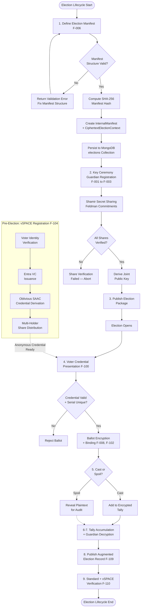

The diagram illustrates the critical temporal separation between pre-election vSPACE registration (which depends on the Microsoft Entra Verified ID cloud service) and election-day voting (which uses only the locally-held anonymous credential with no cloud dependency), as specified by requirement F-104-RQ-003. This design mitigates the risk of Entra service unavailability on election day.

### 4.1.2 Five-Layer Process Integration

Each process step maps to one of the five architectural layers. The following table establishes the layer affinity for every major workflow phase, along with the primary system components involved.

| Lifecycle Phase | Architecture Layer | Primary Components | Key Features |
|---|---|---|---|
| Manifest Definition | Layer 2 — Election Domain | `manifest.cpp`, `election.cpp` | F-006, F-004 |
| Key Ceremony | Layer 1 — Crypto Foundation | `group.cpp`, `chaum_pedersen.cpp`, `polynomial.cpp` | F-001, F-002, F-003 |
| Voter Registration | Layer 4 — Identity Management | vSPACE Entra Bridge, MSAL | F-104 |
| Credential Derivation | Layer 3 — Anonymous Auth | SAAC Issuer Service, `electionguard_vspace.saac` | F-100, F-101 |
| Credential Presentation | Layer 3 — Anonymous Auth | vSpaceWallet.com, IndexedDB | F-100, F-101, F-107 |
| Ballot Encryption + Binding | Layers 1–2 (EG) + Layer 3 (vSPACE) | `encrypt.cpp`, `electionguard_vspace.binding` | F-008, F-102, F-103 |
| Tally & Decryption | Layers 1–2 | `discrete_log.cpp`, `polynomial.cpp` | F-001, F-002 |
| Record Publication | Layer 2 + Layer 3 | `electionguard_vspace.record`, MongoDB | F-109 |
| Verification | Layer 1 + Verification Tier | `electionguard-verifier`, `vspace-verify` crate | F-110 |
| NLWeb Queries | Layer 5 — Presentation | NLWeb + Azure AI Search + Azure OpenAI | F-108 |

### 4.1.3 Actor Touchpoints and System Boundaries

Six principal actor groups interact with the system at distinct touchpoints. The following table maps actors to their primary process interactions, authorization requirements, and the system boundary at which they operate.

| Actor | Primary Touchpoints | Authorization Checkpoint | System Boundary |
|---|---|---|---|
| **Voters** | Credential presentation, ballot marking, cast/spoil decision | Anonymous credential (SAAC) + one-show serial number | vSpaceVote.com + vSpaceWallet.com PWAs |
| **Election Administrators** | Manifest definition, Entra tenant config, election open/close | Administrative API credentials, Azure AD role | ElectionGuard API + Entra Admin API |
| **Guardians** | Key ceremony, decryption share generation | Mutual TLS 1.3 certificate from election-specific CA | Guardian communication channel (F-112) |
| **Third-Party Verifiers** | Election record verification | None required (public election record) | `electionguard-verifier` + `vspace-verify` |
| **Election Observers** | NLWeb query interface, audit endpoints | Rate-limited public access | NLWeb MCP endpoints |
| **AI Agents** | MCP `ask` method on NLWeb endpoints | MCP protocol compliance | NLWeb JSON/REST interface |

---

## 4.2 CORE ELECTIONGUARD PROCESS FLOWS

### 4.2.1 Election Setup and Manifest Management

The election setup workflow establishes the cryptographic parameters and election structure that govern all subsequent operations. This process is implemented primarily in `src/electionguard/manifest.cpp`, `src/electionguard/election.cpp`, and persisted via the MongoDB `elections` collection defined in `src/electionguard-db/mongo-init.js`.

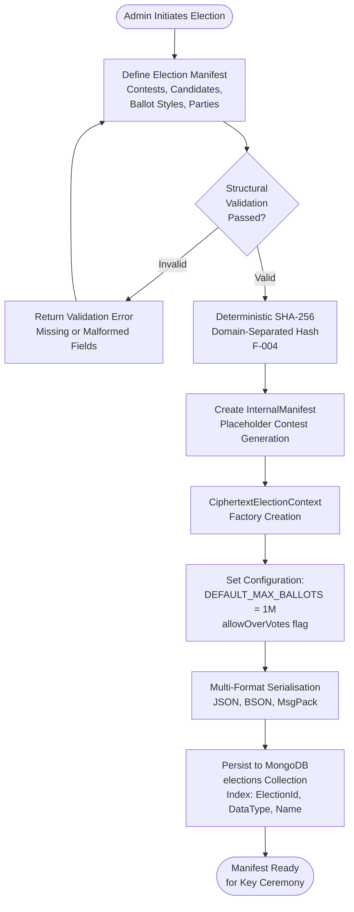

#### Validation Rules

| Checkpoint | Business Rule | Error Response |
|---|---|---|
| Structural Validation | All required contests and candidates defined; ballot styles reference valid geopolitical units | `invalid_argument` exception |
| Hash Consistency | Deterministic hash: identical manifest → identical hash | Specification compliance check |
| Context Factory | Versioned parameters, manifest hash, commitment hash, joint public key all consistent | `invalid_argument` if parameters mismatch |
| Serialisation | Round-trip serialisation preserves all fields per F-006-RQ-002 | Byte-level comparison test |

### 4.2.2 Key Ceremony Workflow

The key ceremony generates the joint election public key through a threshold secret sharing protocol. Standard ElectionGuard uses Feldman commitments; the optional vSPACE extension (F-111) can replace this with FDVSS-1 dynamic sharing when activated via the `dynamic_committee=true` parameter.

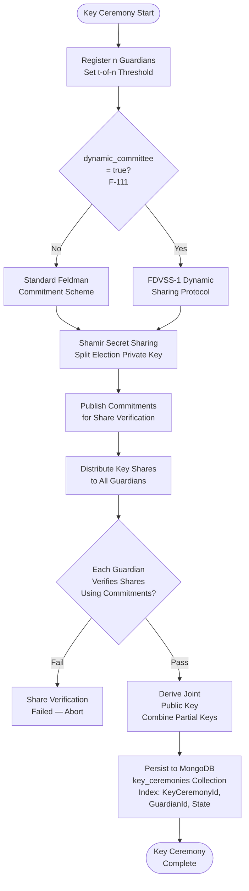

#### Key Ceremony Decision Points

| Decision | Condition | Success Path | Failure Path |
|---|---|---|---|
| Dynamic Committee? | `dynamic_committee=true` parameter | FDVSS-1 protocol (information-theoretic security) | Standard Feldman commitments |
| Share Verification | All guardians validate received shares against published commitments | Proceed to joint key derivation | Abort ceremony; re-initiate |
| Guardian Availability | All n guardians online during ceremony | Complete in single session | Retry with exponential backoff (F-112) |

#### Timing Constraints

The key ceremony is a pre-election operation with no strict real-time constraints. However, guardian communication uses mutual TLS 1.3 sessions (F-112) with O(n log n) message complexity via Bracha's reliable broadcast, tolerating t < n/3 Byzantine faults.

### 4.2.3 Ballot Encryption Pipeline

The ballot encryption pipeline is the most complex workflow in the system, implemented in `src/electionguard/encrypt.cpp` and orchestrated by the `EncryptionMediator` class. This is also the primary integration point where vSPACE inserts its credential binding layer (F-102). The following diagram traces the complete encryption flow from raw voter selections to a fully encrypted ballot with Chaum-Pedersen proofs.

```mermaid
flowchart TD
    BEStart([Plaintext Ballot Input]) --> INIT["EncryptionDevice Init<br/>deviceUuid, sessionUuid,<br/>launchCode, location"]
    INIT --> DHASH["Compute Device Hash<br/>BallotCode.getHashForDevice"]
    DHASH --> MEDINIT["EncryptionMediator Setup<br/>Cache Manifest + Context"]
    MEDINIT --> HASHCHK{"Manifest Hash<br/>== Context Hash?"}
    HASHCHK -->|No| HASHFAIL["THROW invalid_argument<br/>Manifest-Context Mismatch"]
    HASHCHK -->|Yes| STYLOOK{"Ballot Style<br/>in Manifest?"}
    STYLOOK -->|No| STYERR["THROW invalid_argument<br/>Missing Ballot Style"]
    STYLOOK -->|Yes| NORM["Normalize Ballot<br/>emplaceMissingValues"]
    NORM --> NONCE{"Explicit Nonce<br/>Provided?"}
    NONCE -->|Yes| NCECHK{"Precompute<br/>Buffer Active?"}
    NCECHK -->|Yes| NCEERR["THROW invalid_argument<br/>Nonce + Precompute Conflict"]
    NCECHK -->|No| USENCE["Use Explicit Nonce"]
    NONCE -->|No| RANDNCE["Generate rand_q<br/>from DRBG"]
    USENCE --> SEEDGEN["Derive nonceSeed<br/>hash: manifestHash +<br/>ballotId + nonce"]
    RANDNCE --> SEEDGEN
    SEEDGEN --> CONTEST["Process Next Contest"]
    CONTEST --> CVAL{"Contest<br/>Valid?"}
    CVAL -->|Overvote| OVZERO["emplaceAllZeroes<br/>All Selections = 0"]
    CVAL -->|Valid| EMPLACE["emplaceMissingValues<br/>Fill Absent Selections"]
    OVZERO --> SELENC["Encrypt Each Selection"]
    EMPLACE --> SELENC

    subgraph PerSelection["Per-Selection Encryption"]
        PRECHK{"Precomputed<br/>Buffer Available?"}
        PRECHK -->|Yes| PREENC["Pop PrecomputedSelection<br/>elgamalEncrypt with<br/>Partial Encryption"]
        PRECHK -->|No| RTENC["Derive selectionNonce<br/>elgamalEncrypt with<br/>Full Computation"]
        PREENC --> CPPROOF["Chaum-Pedersen<br/>Disjunctive Proof<br/>Selection is 0 or 1"]
        RTENC --> CPPROOF
    end

    SELENC --> PRECHK
    CPPROOF --> EXTDATA["Encode Extended Data<br/>HashedElGamalCiphertext"]
    EXTDATA --> CCONTEST["Create CiphertextBallotContest<br/>with Range Proof"]
    CCONTEST --> MORECON{"More<br/>Contests?"}
    MORECON -->|Yes| CONTEST
    MORECON -->|No| ASSEMBLY["Assemble CiphertextBallot<br/>All Contests + Timestamp"]
    ASSEMBLY --> PROOFCHK{"verifyProofs<br/>Enabled?"}
    PROOFCHK -->|No| CHAIN["Update Ballot<br/>Code Chain"]
    PROOFCHK -->|Yes| VALIDATE["isValidEncryption<br/>Full Proof Suite"]
    VALIDATE --> VALCHK{"All Proofs<br/>Valid?"}
    VALCHK -->|No| PROOFERR["THROW runtime_error<br/>Proof Verification Failed"]
    VALCHK -->|Yes| CHAIN
    CHAIN --> BEEnd([Encrypted Ballot<br/>Output])
```

#### Encryption Pipeline Step Details

| Step | Operation | Source Location | Performance Target |
|---|---|---|---|
| Device Init | Create `EncryptionDevice` with metadata hash | `encrypt.cpp` | < 1 ms |
| Mediator Setup | Validate manifest/context hash match | `encrypt.cpp` constructor | < 1 ms |
| Ballot Normalisation | `emplaceMissingValues` for absent selections | `encrypt.cpp` | < 5 ms |
| Nonce Generation | `rand_q()` from DRBG or explicit nonce | `random.cpp` | < 1 ms |
| Per-Selection Encrypt | Precomputed path or realtime ElGamal | `encrypt.cpp` / `elgamal.cpp` | < 10 ms per selection |
| Chaum-Pedersen Proof | Disjunctive proof (0 or 1) per selection | `chaum_pedersen.cpp` | < 50 ms per proof |
| Extended Data | `HashedElGamalCiphertext` for overvote/write-in | `encrypt.cpp` | < 5 ms |
| Contest Assembly | Range proof for selection limits | `encrypt.cpp` | < 20 ms per contest |
| Ballot Assembly | Combine all contests with timestamp | `encrypt.cpp` | < 5 ms |
| Proof Verification | Optional full verification suite | `encrypt.cpp` | < 200 ms total |
| Code Chaining | Update `ballotCodeSeed` to current ballot code | `ballot_code.cpp` | < 1 ms |

#### Critical Constraint: Precomputation and Nonce Exclusivity

The precomputation engine (F-005, `precompute_buffers.cpp`) maintains a thread-safe buffer of `DEFAULT_PRECOMPUTE_SIZE = 5,000` pre-generated values. When a precomputed value is available, the encryption path bypasses nonce derivation and uses the pre-generated partial encryption. However, an explicit nonce cannot be combined with precomputed values — this deterministic conflict is enforced by an `invalid_argument` exception, ensuring cryptographic correctness.

### 4.2.4 Tally Accumulation and Decryption

After the voting period closes, the encrypted ballots are homomorphically accumulated and decrypted through guardian cooperation. This workflow leverages ElGamal's additive homomorphism (F-002) and the threshold reconstruction via Lagrange interpolation.

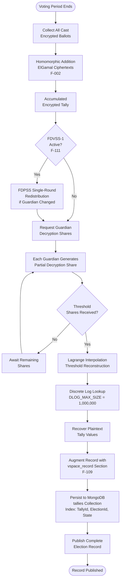

#### FDPSS Guardian Rotation (F-111, Optional)

When FDVSS-1 dynamic sharing is active, the redistribution step between voting and decryption enables guardian rotation: if a guardian's device is compromised or becomes unavailable, the remaining guardians execute a single-round FDPSS protocol to transfer the compromised share to a replacement guardian. The verifier checks that redistribution proofs are consistent with the original key ceremony parameters. This redistribution preserves information-theoretic security for the sharing phase.

---

## 4.3 vSPACE AUTHENTICATION WORKFLOWS

### 4.3.1 Voter Registration and Identity Verification

The voter registration workflow follows a three-phase model defined in PRD Section 4 and implemented through the vSPACE Entra Bridge (F-104), SAAC Protocol (F-100), and Multi-Holder BBS (F-101). Phases A and B occur pre-election day, ensuring no cloud dependency during voting. Phase C distributes credential shares across multiple holder devices for theft resistance.

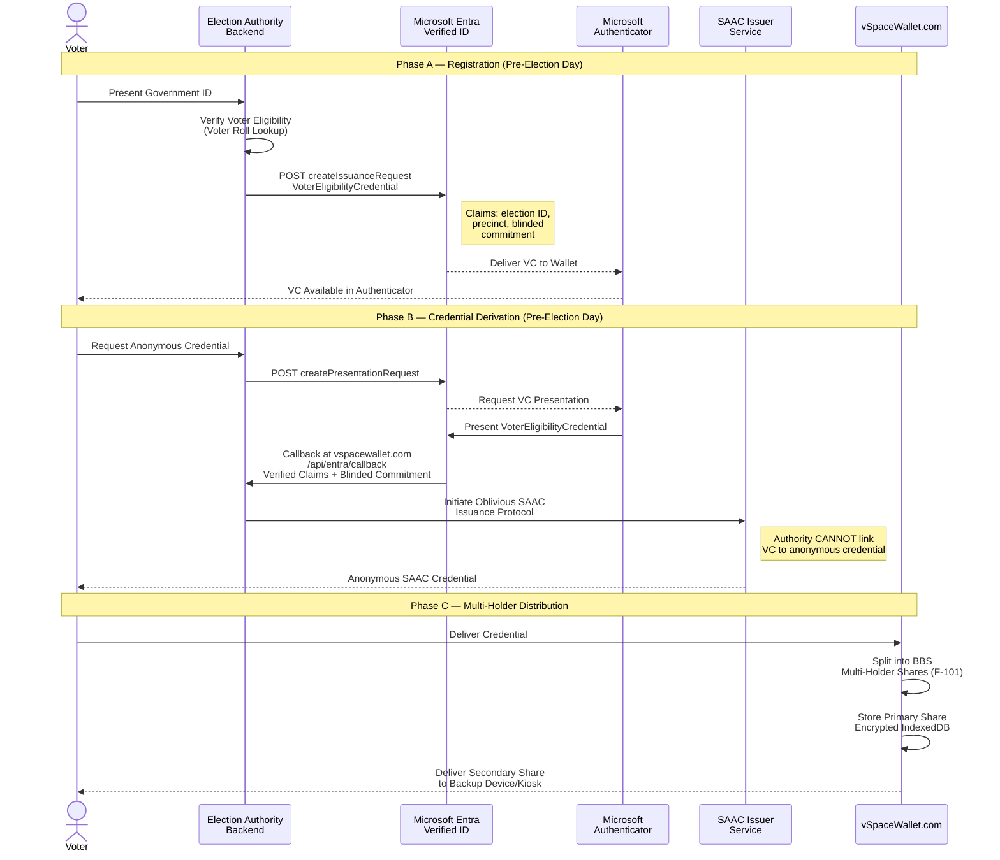

#### Registration Validation Rules

| Phase | Checkpoint | Business Rule | Security Requirement |
|---|---|---|---|
| A | Identity Verification | Government ID matches voter roll entry | Standard election authority verification |
| A | VC Issuance | Blinded commitment included in VC claims | Blinding prevents Entra from linking VC to SAAC credential |
| B | VC Presentation | Valid `VoterEligibilityCredential` presented | VC never presented to voting system (F-104-RQ-002) |
| B | Oblivious Issuance | SAAC protocol ensures issuer unlinkability | DDH assumption on NIST P-256 (F-100-RQ-001) |
| C | Share Splitting | Configurable threshold (1-of-2 to 2-of-2) | Information-theoretic share secrecy (F-101-RQ-001) |
| C | Share Storage | Primary share encrypted with device-derived key | IndexedDB same-origin boundary enforcement |

#### Performance Targets

| Operation | Target | Reference |
|---|---|---|
| Credential Issuance (SAAC) | < 500 ms | F-100-RQ-001 |
| Credential Split Operation | < 200 ms per split | F-101-RQ-001 |
| OAuth2 Token Acquisition | Automatic refresh via MSAL | F-104-RQ-005 |

### 4.3.2 Credential Presentation and Ballot Binding

This is the central vSPACE workflow that inserts before ballot encryption (step 4 of the ElectionGuard data flow). The process coordinates multi-holder threshold presentation (F-101), SAAC proof generation (F-100), one-show serial number derivation (F-103), and the credential-to-ballot binding protocol (F-102) — all without modifying the internal behaviour of `electionguard.encrypt` (F-102-RQ-003).

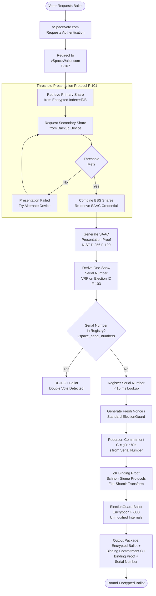

#### Binding Protocol Three-Property Guarantee

The credential-to-ballot binding protocol simultaneously satisfies three critical properties:

| Property | Mechanism | Verification |
|---|---|---|
| **Ballot Stuffing Prevention** | Each ballot requires a valid SAAC presentation + unique serial number | Serial uniqueness check in `vspace_serial_numbers` |
| **Unlinkability** | No voter-to-ballot correlation; SAAC presentation is unlinkable to VC issuance | DDH assumption on P-256; oblivious issuance |
| **Ballot Secrecy** | ElectionGuard homomorphic encryption unaffected; binding wraps but does not modify `encrypt` | F-102-RQ-003; standard proofs remain valid |

#### Credential Presentation Timing Budget

| Operation | Target | Source |
|---|---|---|
| Primary share retrieval (IndexedDB) | < 50 ms | F-106-RQ-001 |
| Secondary share cooperation | < 100 ms | F-101-RQ-002 |
| SAAC presentation proof generation | < 50 ms (C++) | F-100-RQ-002 |
| Serial number derivation | < 5 ms | F-103-RQ-001 |
| Serial number lookup | < 10 ms | F-103-RQ-002 |
| Pedersen commitment generation | < 10 ms | F-102-RQ-001 |
| ZK binding proof generation | < 50 ms | F-102-RQ-002 |
| **Total credential + binding overhead** | **< 275 ms** | **Combined budget** |

### 4.3.3 Cross-Origin Communication Protocol

The interaction between vSpaceVote.com and vSpaceWallet.com is mediated by a cross-origin protocol (F-107) operating on separate domains to enforce the same-origin security boundary. Two flows are supported: same-browser (postMessage) and cross-device (QR code fallback).

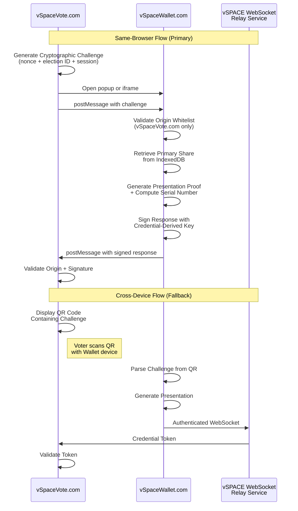

#### Cross-Origin Security Rules

| Rule | Implementation | Timing |
|---|---|---|
| Origin whitelist enforcement | Only vSpaceVote.com and vSpaceWallet.com accepted (F-107-RQ-001) | < 1 ms |
| Non-whitelisted messages | Silently dropped — no error response | Immediate |
| QR code fallback | Activated when postMessage unavailable (F-107-RQ-002) | QR scan + WebSocket latency |
| Response signing | Credential-derived key ensures only legitimate holders respond | Part of presentation proof |
| CSP headers | Same-origin scripts only on both PWAs | Enforced by Azure Front Door |

### 4.3.4 Voter Journey Through vSpaceVote.com

The voter-facing PWA (F-105) guides voters through a sequential, server-validated journey using FastHTML routes and HTMX partials. The server is the sole source of truth — no client-side state or encryption occurs, preventing tampering with ballot data.

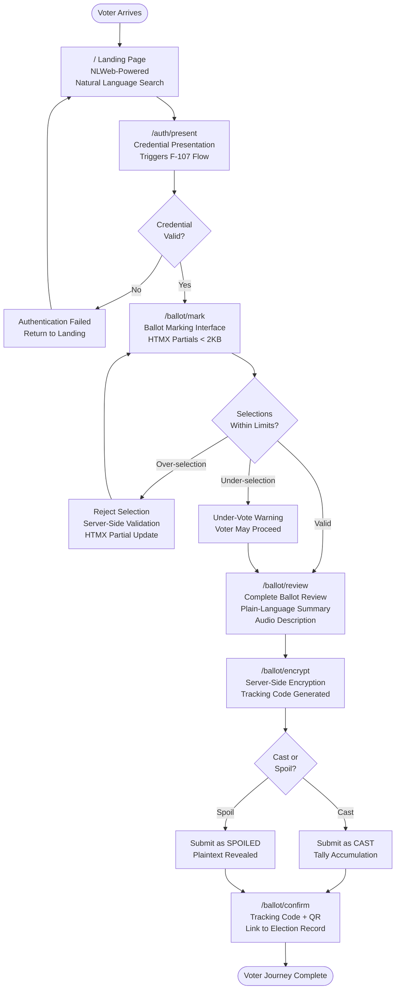

#### Route-Level Requirements

| Route | HTMX Partial | Server Response Target | Accessibility |
|---|---|---|---|
| `/` | N/A | N/A | NLWeb natural language search |
| `/auth/present` | N/A | Credential flow latency | Multi-holder threshold flow |
| `/ballot/mark` | < 2 KB per contest | < 200 ms (F-105-RQ-001) | WCAG 2.1 AA (F-105-RQ-003) |
| `/ballot/review` | Full ballot summary | < 200 ms | Audio description available |
| `/ballot/encrypt` | Tracking code display | < 200 ms + encryption time | QR code for voter records |
| `/ballot/confirm` | Final confirmation | < 200 ms | Link to public record (F-105-RQ-004) |

#### Offline Behaviour

The PWA service worker (F-105-RQ-002) implements a cache-first strategy for static assets and network-first for dynamic content. The election manifest is cached for offline review (offline load < 500 ms), but all state-changing operations — ballot encryption, credential presentation, nonce generation — require an active server connection and fail gracefully without connectivity.

---

## 4.4 VERIFICATION AND AUDIT WORKFLOWS

### 4.4.1 Augmented Verification Pipeline

The augmented verification pipeline extends the standard nine-step ElectionGuard verification with four additional vSPACE checks (F-110). The standard checks operate on the existing election record fields, while the vSPACE checks examine the `vspace_record` section. Backward compatibility (F-109-RQ-002) is preserved — standard verifiers that predate vSPACE ignore the `vspace_record` section entirely.

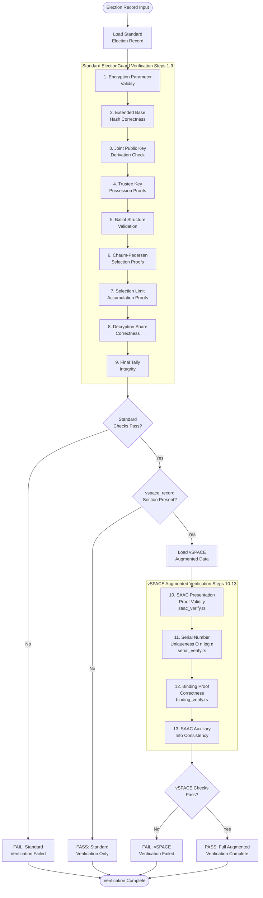

#### Verification Performance Targets

| Check | Complexity | Per-Item Target | 1M-Ballot Target |
|---|---|---|---|
| SAAC Presentation Proof | Per ballot | < 50 ms (F-110-RQ-001) | ~14 hours (parallelisable) |
| Serial Number Uniqueness | O(n log n) sort | N/A (batch operation) | < 30 seconds |
| Binding Proof Correctness | Per ballot | < 50 ms (F-110-RQ-003) | ~14 hours (parallelisable) |
| Augmented Record Serialisation | Single operation | N/A | < 5 seconds (F-109-RQ-001) |

### 4.4.2 NLWeb Conversational Query Processing

The NLWeb conversational interface (F-108) provides natural language access to published election data and credential status. Two instances run as shared Uvicorn ASGI processes alongside the FastHTML PWAs, each acting simultaneously as an MCP server for agent interoperability.

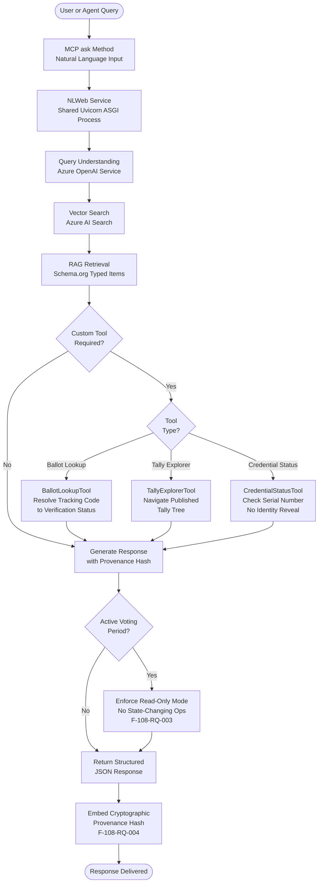

#### NLWeb Security Constraints

| Constraint | Implementation | Requirement |
|---|---|---|
| Response grounding | 100% grounded in published election record; strict RAG constraints | F-108-RQ-001 |
| Read-only enforcement | No state-changing operations during voting windows | F-108-RQ-003 |
| Rate limiting | ASGI middleware layer (shared with FastHTML) | F-108-RQ-003 |
| No voter identity in responses | `CredentialStatusTool` reveals only serial number presence | F-108-RQ-005 |
| Cryptographic provenance | Each response embeds hash of source data items | F-108-RQ-004 |

---

## 4.5 STATE TRANSITION DIAGRAMS

### 4.5.1 Ballot State Machine

The ballot lifecycle is modelled through three immutable domain types defined in `include/electionguard/ballot.hpp`: `PlaintextBallot`, `CiphertextBallot`, and `SubmittedBallot`. State transitions are enforced through explicit method calls and are irreversible once set (F-007-RQ-001).

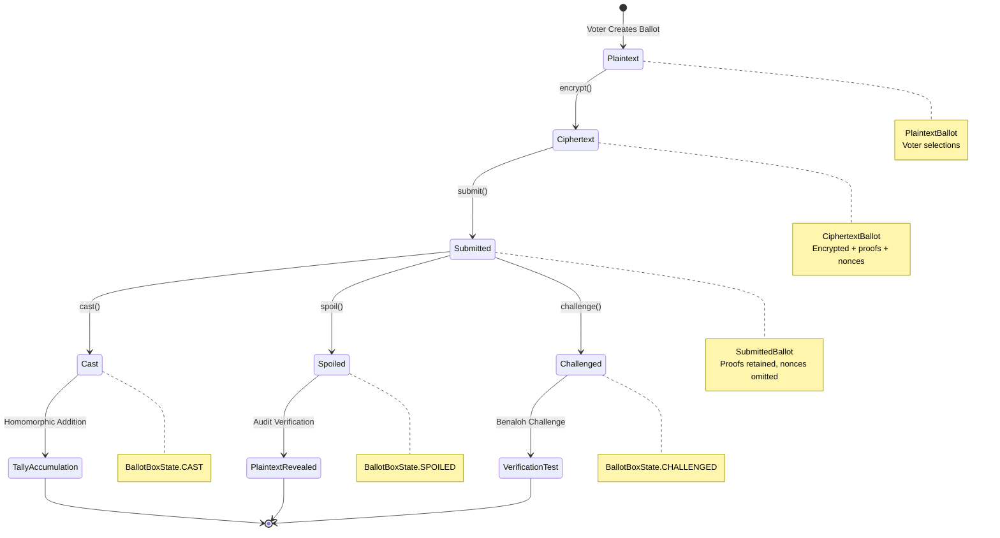

#### State Transition Rules

| Transition | Precondition | Postcondition | Reversible? |
|---|---|---|---|
| Plaintext → Ciphertext | Valid manifest, valid context, nonce generated | Encrypted selections with Chaum-Pedersen proofs | No |
| Ciphertext → Submitted | Proofs optionally verified | Nonces removed; proofs retained | No |
| Submitted → Cast | Voter confirms cast decision | Added to tally accumulation | No (immutable) |
| Submitted → Spoiled | Voter requests spoil | Plaintext revealed for verification | No (immutable) |
| Submitted → Challenged | Benaloh verification test | Encryption parameters revealed for audit | No (immutable) |

### 4.5.2 Credential Lifecycle States

The anonymous credential passes through distinct lifecycle states from initial voter registration to ballot binding. Each transition corresponds to a specific vSPACE feature and protocol interaction.

```mermaid
stateDiagram-v2
    [*] --> Unregistered
    Unregistered --> VCIssued: Identity Verification<br/>+ Entra VC Issuance (F-104)
    VCIssued --> CredentialDerived: Oblivious SAAC<br/>Derivation (F-100)
    CredentialDerived --> SharesDistributed: Multi-Holder<br/>Share Split (F-101)
    SharesDistributed --> Presented: Threshold<br/>Presentation (F-100)
    Presented --> BoundToBallot: Credential-to-Ballot<br/>Binding (F-102)
    BoundToBallot --> [*]: Ballot Cast or Spoiled

    VCIssued --> Revoked: Voter Found Ineligible<br/>Entra Admin API
    CredentialDerived --> Expired: Credential Expiration
    SharesDistributed --> ShareCompromised: Device Compromised
    ShareCompromised --> SharesDistributed: Re-issuance Flow<br/>via vSpaceWallet
    Expired --> [*]: Credential Unusable
    Revoked --> [*]: VC Revoked
```

#### Temporal Phases

| State | Temporal Phase | Cloud Dependency |
|---|---|---|
| Unregistered → VCIssued | Pre-election day | Yes (Entra Verified ID) |
| VCIssued → CredentialDerived | Pre-election day | Yes (Entra Presentation API) |
| CredentialDerived → SharesDistributed | Pre-election day | No (local operation) |
| SharesDistributed → Presented | Election day | No (local + device cooperation) |
| Presented → BoundToBallot | Election day | No (local computation) |

### 4.5.3 Election Lifecycle States

The election progresses through well-defined phases from manifest creation to final verification, with each state corresponding to completed operational milestones.

```mermaid
stateDiagram-v2
    [*] --> ManifestCreated: Define Election Manifest
    ManifestCreated --> KeyCeremonyComplete: Key Ceremony Succeeds
    KeyCeremonyComplete --> ElectionOpen: Publish Election Package
    ElectionOpen --> VotingPeriod: Voting Opens
    VotingPeriod --> TallyAccumulated: Voting Closes
    TallyAccumulated --> DecryptionComplete: Guardian Decryption
    DecryptionComplete --> RecordPublished: Publish Augmented Record
    RecordPublished --> Verified: Verification Passes
    Verified --> [*]

    KeyCeremonyComplete --> KeyCeremonyFailed: Share Verification Fails
    KeyCeremonyFailed --> [*]: Abort Election
```

### 4.5.4 Key Ceremony States

The key ceremony tracks its progress through states persisted in the MongoDB `key_ceremonies` collection, indexed by `KeyCeremonyId`, `GuardianId`, `State`, and `DataType`.

# 5. System Architecture

This section provides the authoritative architectural reference for the combined ElectionGuard Core2 and vSPACE system. The architecture is described across four principal domains: high-level structure and integration topology, detailed component specifications, technical decision rationale, and cross-cutting concerns. All architectural statements are grounded in the repository source code (files under `src/`, `include/`, `libs/`, `bindings/`, `docs/`), the vSPACE PRD v1.1 (7 March 2026), and the preceding technical specification sections.

vSPACE does not replace ElectionGuard — it wraps it. This foundational principle (constraints C-001 and C-002) governs every architectural decision: the vSPACE extension adds a pre-encryption authentication layer and a post-verification audit layer, both cryptographically decoupled from ballot contents. Standard ElectionGuard verifiers that predate vSPACE can verify core election integrity properties by ignoring the `vspace_record` section of the augmented election record.

---

## 5.1 HIGH-LEVEL ARCHITECTURE

### 5.1.1 System Overview

#### Architecture Style and Rationale

The system employs a **five-layer architecture** with a modular extension model, driven by the need to cleanly separate cryptographic primitives from election domain logic and from the vSPACE authentication extension. The layered pattern ensures that each tier operates with well-defined interfaces, enabling independent evolution of the cryptographic foundation, the election workflow, the anonymous credential subsystem, the identity management bridge, and the presentation layer. This architecture style directly supports the non-invasive extension principle (C-001): vSPACE features compose atop ElectionGuard layers without modifying any existing module, parameter, or API.

The five layers, from foundation to presentation, are:

- **Layer 1 — Cryptographic Foundation** (ElectionGuard Core2, existing): The native C++17 core library implementing the complete ElectionGuard cryptographic protocol over a 4096-bit prime modulus group, built on HACL* v0.6.0 from Project Everest for formally verified big-number arithmetic. Source files reside in `src/electionguard/` (25+ files) with public API headers in `include/electionguard/` (44 files).

- **Layer 2 — Election Domain Model** (ElectionGuard Core2, existing): Immutable domain objects representing the election lifecycle — manifests, contexts, ballots, and tallies — with encryption orchestration via `EncryptionDevice` and `EncryptionMediator`. Implemented in `manifest.cpp`, `election.cpp`, `ballot.cpp`, and `encrypt.cpp`.

- **Layer 3 — Anonymous Credential Authentication** (vSPACE, proposed): The `vspace-auth` subsystem implementing SAAC on pairing-free NIST P-256 curves for publicly verifiable credential presentation, and Multi-Holder BBS on BLS12-381 for theft-resistant credential storage and distribution. A credential re-derivation protocol bridges the two cryptographic schemes.

- **Layer 4 — Identity and Credential Management** (vSPACE, proposed): The `vspace-entra` bridge for Microsoft Entra Verified ID communication and `vspace-bind` for credential-to-ballot binding via Pedersen commitments and Schnorr-like sigma protocols.

- **Layer 5 — Presentation and Agentic Interface** (vSPACE, proposed): Two FastHTML Progressive Web Applications (vSpaceVote.com and vSpaceWallet.com) and two NLWeb instances providing conversational AI and MCP server capabilities.

A dedicated **Verification Tier** spans Layers 1–3, comprising the standard ElectionGuard Rust verifier and the vSPACE verifier extension (`vspace-verify` Rust crate).

#### Key Architectural Principles

The system's architectural principles are derived from `docs/Design_and_Architecture.md` and the vSPACE PRD v1.1:

| Principle | Implementation Evidence |
|---|---|
| Cross-Platform Portability | CI matrix spans Linux, macOS, Windows, Android, iOS, WebAssembly |
| C++17 with Stable C ABI | Modern C++ core with 19 C facade files in `src/electionguard/facades/` |
| PIMPL Pattern | Pointer-to-Implementation for API stability while evolving internals |
| Immutable Domain Objects | Thread-safe, functional-style composition throughout ballot and manifest types |
| Non-Invasive Extension (C-001) | No modification to any existing ElectionGuard module |
| Cryptographic Decoupling | Authentication layer operates outside encryption boundary |
| SAFE-D Compliance (C-005) | Safe, Accountable, Fair, Explainable, Data-governed as foundational design constraints |
| Backward Compatibility (C-002) | Standard verifiers work unmodified; `vspace_record` is additive |

#### System Boundaries and Major Interfaces

The system defines internal and external integration boundaries that govern how components communicate and what each layer exposes:

**Internal Boundaries:**
- **C++ ↔ C**: Core SDK ↔ Facades via `extern "C"` linkage and opaque handles, with symbol visibility controlled by `include/electionguard/export.h` (defining `EG_API` and `EG_INTERNAL_API` macros)
- **C ↔ .NET**: Facades ↔ .NET Standard Bindings via P/Invoke, multi-targeting `netstandard2.0` and `net10.0`
- **C++ ↔ WASM**: Core SDK ↔ Browser via Emscripten Embind 3.1.35 (6 binding files in `src/electionguard/wasm/`)
- **Python ↔ C++**: vSPACE ↔ Core2 via ctypes/cffi (proposed Phase 3 integration)

**External Boundaries:**
- **Python ↔ Azure**: vSPACE ↔ Entra/Cosmos DB/Key Vault via REST APIs with MSAL OAuth2 token acquisition
- **Rust ↔ JSON**: Verifier ↔ Augmented Election Record (JSON format with `vspace_record` section)
- **FastHTML ↔ NLWeb**: PWAs ↔ Conversational AI via shared Uvicorn ASGI process and middleware stack
- **MongoDB ↔ Cosmos DB**: Development ↔ Production via MongoDB wire protocol 6.0 (zero code change migration)

```mermaid
flowchart TB
    subgraph InternalBoundaries["Internal Integration Boundaries"]
        CPPCore["C++17 Core SDK<br/>src/electionguard/"]
        CFacades["C99 ABI Facades<br/>19 files, extern C"]
        DotNet[".NET Standard Bindings<br/>P/Invoke"]
        WASM["Emscripten/Embind<br/>6 WASM files"]
        PyCFFI["Python ctypes/cffi<br/>Phase 3"]
    end

    subgraph ExternalBoundaries["External Integration Boundaries"]
        AzureREST["Azure REST APIs<br/>MSAL OAuth2"]
        RustJSON["Rust Verifier<br/>JSON Election Record"]
        ASGIShared["Shared Uvicorn ASGI<br/>FastHTML + NLWeb"]
        MongoWire["MongoDB Wire Protocol 6.0<br/>Dev ↔ Cosmos DB"]
    end

    CPPCore --> CFacades
    CFacades --> DotNet
    CFacades --> WASM
    CPPCore --> PyCFFI

    PyCFFI --> AzureREST
    CPPCore --> RustJSON
    PyCFFI --> ASGIShared
    ASGIShared --> MongoWire
```

### 5.1.2 Core Components

The following table catalogues the principal system components, their responsibilities, key dependencies, and integration surfaces.

| Component | Primary Responsibility | Key Dependencies |
|---|---|---|
| **ElectionGuard Core2 C++ Library** (`src/electionguard/`) | Complete cryptographic protocol: modular arithmetic, ElGamal encryption, Chaum-Pedersen proofs, ballot encryption | HACL* v0.6.0, nlohmann_json 3.11.3, spdlog 1.9.2 |
| **C ABI Facades** (`src/electionguard/facades/`) | Stable cross-language interface translating C++ exceptions to status codes | ElectionGuard Core2, `export.h`, `status.h` |
| **HACL* Wrappers** (`libs/hacl/`) | Formally verified cryptographic primitives: bignum, HMAC, DRBG, SHA-2 | HACL* C library v0.6.0 (commit `04883d6`) |
| **.NET Standard Bindings** (`bindings/netstandard/`) | P/Invoke wrappers for .NET ecosystem consumers | C ABI Facades, MongoDB.Driver 2.19.1, Newtonsoft.Json |
| **TypeScript/WASM Bindings** (`bindings/typescript/`) | Browser and Node.js cryptographic API via npm package | Emscripten 3.1.35, webpack 5.79.0, TypeScript 5.0.4 |
| **MongoDB Persistence** (`src/electionguard-db/`) | Election data storage: key ceremonies, elections, ballots, tallies | MongoDB 6.0.3 (Docker), mongo-express 1.0.0-alpha.4 |
| **.NET MAUI UI** (`src/electionguard-ui/`) | Cross-platform desktop/mobile election management | Microsoft.Maui.Controls 8.0.93, CommunityToolkit.Mvvm 8.2.1 |
| **CLI Tooling** (`apps/electionguard-cli/`) | Command-line election artifact creation and test generation | .NET 10 runtime, .NET Standard Bindings |

| Component | Primary Responsibility | Key Dependencies |
|---|---|---|
| **vSPACE Auth Subsystem** (`vspace-auth`) | SAAC + Multi-Holder BBS anonymous credential protocols | ecdsa, pycryptodome (Python); HACL* (C++) |
| **vSPACE Entra Bridge** (`vspace-entra`) | Microsoft Entra Verified ID VC issuance/presentation | MSAL Python, FastAPI, Azure AD Premium P2 |
| **vSPACE Binding Layer** (`vspace-bind`) | Credential-to-ballot binding via Pedersen commitments | F-100 (SAAC), F-008 (Encryption Workflow) |
| **vSPACE Verifier Extension** (`vspace-verify`) | Augmented verification: SAAC proofs, serial uniqueness, binding correctness | Rust toolchain, `electionguard-verifier` crate |
| **vSpaceVote.com PWA** (F-105) | Voter-facing ballot marking and election participation | FastHTML, HTMX, PicoCSS, Azure App Service |
| **vSpaceWallet.com PWA** (F-106) | Credential wallet: receipt, storage, multi-holder share management | FastHTML, IndexedDB, Azure App Service |
| **NLWeb Instances** (F-108) | Conversational AI and MCP server for election/credential queries | Azure AI Search, Azure OpenAI, NLWeb reference implementation |

### 5.1.3 Data Flow Description

#### Standard ElectionGuard Data Flow (Nine-Step Pipeline)

The canonical ElectionGuard data flow progresses through nine sequential phases, as defined in PRD Section 2.2. Each phase maps to specific source components:

1. **Manifest Definition**: Election administrators define the election structure. The manifest undergoes structural validation and deterministic SHA-256 hashing in `manifest.cpp`, producing an `InternalManifest` and `CiphertextElectionContext` via `election.cpp`. Persisted to the MongoDB `elections` collection via `src/electionguard-db/mongo-init.js`.

2. **Key Ceremony**: Guardians generate the joint election public key through Shamir secret sharing with Feldman commitments. Shares are distributed and verified against published commitments. State is persisted to the `key_ceremonies` collection. The optional FDVSS-1 extension (F-111) can replace Feldman commitments with dynamic sharing when the `dynamic_committee=true` parameter is active.

3. **Election Package Publication**: The election context, manifest, and guardian public keys are published as a downloadable package.

4. **Ballot Encryption**: This is the most computationally intensive phase and the primary vSPACE insertion point. The `EncryptionMediator` in `encrypt.cpp` orchestrates selection-level ElGamal encryption with Chaum-Pedersen disjunctive proofs, contest-level range proofs, and ballot assembly with code chaining. The precomputation buffer (`DEFAULT_PRECOMPUTE_SIZE = 5,000` from `include/electionguard/constants.h`) provides pre-generated encryption triples for polling-place throughput.

5. **Cast/Spoil Decision**: An irreversible state transition from `Submitted` to `Cast`, `Spoiled`, or `Challenged` as defined in `ballot.cpp`.

6. **Tally Accumulation**: Homomorphic addition of ElGamal ciphertexts produces an encrypted aggregate tally.

7. **Guardian Decryption**: Each guardian produces a partial decryption share. Lagrange interpolation reconstructs the decryption, and discrete log lookup (`DLOG_MAX_SIZE = 1,000,000` from `discrete_log.cpp`) recovers plaintext tally values.

8. **Election Record Publication**: The complete JSON election record with all proofs is published, augmented with the `vspace_record` section when vSPACE features are active.

9. **Verification**: Any party can run the 9-step standard verification. The vSPACE extension adds 4 additional checks (steps 10–13).

#### vSPACE Extension Insertion Points

vSPACE inserts at two points in the standard flow, preserving backward compatibility:

**At Step 4 (Pre-Encryption)**: Before ballot encryption, the voter must present an anonymous credential. The sequence proceeds as: multi-holder threshold cooperation → BBS share combination → SAAC credential re-derivation → SAAC presentation proof generation → VRF-based serial number derivation → serial number uniqueness check against `vspace_serial_numbers` → Pedersen binding commitment generation (`C = g^r · h^s`) → ZK binding proof → standard ElectionGuard ballot encryption via unmodified `encrypt.cpp`.

**At Step 9 (Post-Verification)**: Four additional checks are appended: (10) SAAC presentation proof validity via `saac_verify.rs`, (11) one-show serial number uniqueness at O(n log n) via `serial_verify.rs`, (12) binding proof correctness via `binding_verify.rs`, and (13) SAAC auxiliary information consistency.

#### Serialisation Formats and Data Transformation

Data traverses multiple serialisation boundaries within the system:

| Format | Library | Usage Context |
|---|---|---|
| JSON | nlohmann_json 3.11.3 | Primary election record format, API payloads |
| BSON | nlohmann_json (via `serialize.hpp`) | Compact MongoDB storage |
| MsgPack | nlohmann_json (via `serialize.hpp`) | Compact wire format |
| Schema.org JSON | NLWeb pipeline | Conversational AI responses |

All serialisation is handled through the header-only `src/electionguard/serialize.hpp` module, which provides multi-format support via the nlohmann_json library. Round-trip serialisation consistency is a validation requirement enforced through byte-level comparison tests.

### 5.1.4 External Integration Points

| System Name | Integration Type | Data Exchange Pattern |
|---|---|---|
| Microsoft Entra Verified ID | VC issuance and presentation (Phase 2) | REST POST to `createIssuanceRequest` / `createPresentationRequest` via MSAL OAuth2 |
| Azure Cosmos DB (MongoDB API) | Document persistence (Production) | MongoDB wire protocol 6.0; zero code change from dev MongoDB 6.0.3 |
| Azure AI Search | Vector store for NLWeb (Phase 2) | Vector search API indexing Schema.org-typed election data |
| Azure OpenAI Service | LLM inference for NLWeb (Phase 2) | RAG-based query understanding; strict read-only during voting |
| Azure Key Vault | HSM-backed secret management (Production) | REST API for signing keys, CA keys, SAAC issuer parameters |
| Azure App Service (Premium v3) | PWA hosting (Production) | HTTPS with auto-scaling target of 100K concurrent voters |
| Azure Front Door | CDN, DDoS, TLS termination (Production) | HSTS preloading, managed certificates, geographic routing |
| Azure Monitor + App Insights | Observability (Production) | Custom metrics for credential latency, ballot throughput |
| HACL* v0.6.0 (Project Everest) | Formally verified crypto primitives (Existing) | Linked C library with C++ RAII wrappers in `libs/hacl/` |
| NLWeb Reference Implementation | Conversational AI protocol (Phase 2) | Python ASGI service shared with FastHTML under Uvicorn |

---

## 5.2 COMPONENT DETAILS

### 5.2.1 Cryptographic Foundation — Layer 1

#### Purpose and Responsibilities

Layer 1 provides every cryptographic primitive required by the ElectionGuard protocol and the vSPACE extension. It implements modular arithmetic over a 4096-bit prime modulus group (P) and a 256-bit subgroup (Q = 2^256 − 189), ElGamal encryption with homomorphic addition, Chaum-Pedersen zero-knowledge proofs, domain-separated SHA-256 hashing, HMAC-SHA-256, and DRBG-backed random number generation. All cryptographic operations are backed by the HACL* library from Project Everest, which provides formal verification guarantees.

#### Technologies and Frameworks

- **Language**: C++17, enforced via `target_compile_features ... cxx_std_17` with `CMAKE_CXX_EXTENSIONS OFF`
- **Crypto Backend**: HACL* v0.6.0 at commit `04883d6`, with 18 C++ RAII wrapper files in `libs/hacl/`
- **Serialisation**: nlohmann_json 3.11.3 for JSON/BSON/MsgPack
- **Logging**: spdlog 1.9.2 (singleton pattern)
- **Timestamps**: HowardHinnant/date 3.0.1

#### Key Interfaces

The Layer 1 public API is exposed through parallel C and C++ header files in `include/electionguard/`:

- **C++ Headers** (`.hpp`): Namvspace-scoped classes with `std::unique_ptr`, PIMPL, copy/move semantics, and serialisation methods
- **C Headers** (`.h`): Opaque `eg_*` handle types with `extern "C"` linkage and `eg_electionguard_status_t` return codes
- **Critical Constants** (`constants.h`): `MAX_P_LEN = 64` (4096-bit), `MAX_Q_LEN = 4` (256-bit), `DEFAULT_PRECOMPUTE_SIZE = 5000`, `DEFAULT_MAX_BALLOTS = 1,000,000`, `DLOG_MAX_SIZE = 1,000,000`

#### Source File Inventory

| Source File | Cryptographic Function |
|---|---|
| `group.cpp` | ElementModP/ElementModQ types, canonical constants (P, Q, G, R), modular arithmetic |
| `elgamal.cpp` | Key pairs, ciphertexts, homomorphic addition, full/partial decryption, hashed ElGamal |
| `chaum_pedersen.cpp` | Disjunctive proofs (0 or 1), ranged proofs, constant proofs |
| `hash.cpp` | Domain-separated SHA-256 with spec-aligned prefixes, returns ElementModQ |
| `hmac.cpp` | HMAC-SHA-256 with buffer zeroisation |
| `random.cpp` | DRBG-backed generation with OS entropy + time personalisation |
| `precompute_buffers.cpp` | Thread-safe precomputed encryption/proof buffer (singleton pattern) |
| `discrete_log.cpp` | Cache-backed discrete-log lookup for tally decryption |
| `nonces.cpp` | Deterministic hash-derived nonce sequences |

#### HACL* Wrapper Modules

| Wrapper Module | Formally Verified Function |
|---|---|
| `Bignum256.hpp/cpp` | 256-bit modular arithmetic with Montgomery context (PIMPL) |
| `Bignum4096.hpp/cpp` | 4096-bit modular arithmetic (64-bit and 32-bit limb variants) |
| `HMAC.hpp/cpp` | SHA2-256/384/512, BLAKE2s-32, BLAKE2b-32 |
| `DRBG.hpp/cpp` | HMAC-DRBG state management |
| `SHA2.hpp/cpp` | Incremental SHA-256/384/512 hashing |
| `Lib.hpp/cpp` | Secure memory zeroisation, OS randomness |

#### Scaling Considerations

The precomputation engine (F-005) amortises expensive modular exponentiation by maintaining a buffer of 5,000 pre-generated encryption triples. The buffer size is tunable per deployment. For tally decryption, the discrete log cache supports up to 1,000,000 entries (`DLOG_MAX_SIZE`), matching the `DEFAULT_MAX_BALLOTS` configuration ceiling. The `USE_32BIT_MATH` CMake option enables 32-bit-optimised arithmetic for constrained platforms (embedded devices, kiosks).

### 5.2.2 Election Domain Model — Layer 2

#### Purpose and Responsibilities

Layer 2 models the complete election lifecycle through immutable domain objects. It provides the election manifest structure, encryption context with joint public key, and the ballot state machine spanning plaintext creation through cast/spoil decisions. The `EncryptionMediator` orchestrates the entire ballot encryption pipeline, consuming manifest context and precomputed buffers to produce encrypted ballots with Chaum-Pedersen proofs.

#### Key Interfaces and Data Persistence

- **Manifest Management**: `manifest.cpp` provides the full object graph (contests, candidates, ballot styles, geopolitical units, parties), enum/string conversions, structural validation, and deterministic SHA-256 hashing
- **Election Context**: `election.cpp` factories produce `CiphertextElectionContext` objects carrying cryptographic parameters, manifest hash, commitment hash, and joint public key; configurable with `DEFAULT_MAX_BALLOTS = 1,000,000` and `allowOverVotes`
- **Ballot Lifecycle**: `ballot.cpp` implements three immutable types — `PlaintextBallot`, `CiphertextBallot`, `SubmittedBallot` — with irreversible state transitions to Cast, Spoiled, or Challenged
- **Compact Ballots**: `ballot_compact.cpp` compresses encrypted ballots and supports manifest-driven reconstruction
- **Code Chaining**: `ballot_code.cpp` generates device hashes and maintains the ballot code chain

#### Encryption Pipeline Sequence

The following diagram illustrates the detailed encryption pipeline as orchestrated by `EncryptionMediator` in `encrypt.cpp`:

```mermaid
sequenceDiagram
    participant Client as API Client
    participant Med as EncryptionMediator<br/>encrypt.cpp
    participant Dev as EncryptionDevice
    participant Pre as PrecomputeBuffers<br/>precompute_buffers.cpp
    participant EG as ElGamal<br/>elgamal.cpp
    participant CP as Chaum-Pedersen<br/>chaum_pedersen.cpp
    participant BC as BallotCode<br/>ballot_code.cpp

    Client->>Med: submit PlaintextBallot
    Med->>Med: Validate manifest hash == context hash
    Med->>Med: Validate ballot style in manifest
    Med->>Med: Normalise ballot (emplaceMissingValues)
    Med->>Med: Generate/derive nonce seed

    loop For Each Contest
        Med->>Med: Validate contest structure
        loop For Each Selection
            Med->>Pre: Request precomputed triple
            alt Precomputed Available
                Pre-->>Med: Return PrecomputedSelection
                Med->>EG: elgamalEncrypt (partial)
            else No Precomputed
                Med->>EG: elgamalEncrypt (full)
            end
            EG-->>Med: ElGamal ciphertext
            Med->>CP: Generate disjunctive proof (0 or 1)
            CP-->>Med: Chaum-Pedersen proof
        end
        Med->>CP: Generate range proof (selection limits)
    end

    Med->>BC: Update ballot code chain
    BC-->>Med: Chained ballot code
    Med-->>Client: CiphertextBallot with proofs
```

### 5.2.3 Anonymous Credential Authentication — Layer 3

#### Purpose and Responsibilities

Layer 3 implements the vSPACE anonymous credential authentication pipeline, bridging two CRYPTO 2025 constructions: SAAC (ePrint 2025/513) for pairing-free, publicly verifiable credential presentation, and Multi-Holder BBS (ePrint 2024/1874) for theft-resistant credential storage. The layered credential architecture resolves the fundamental tension between theft resistance (requiring pairing-based BBS on BLS12-381) and standards compliance (requiring pairing-free SAAC on NIST P-256). A credential re-derivation bridge converts multi-holder BBS shares to session-specific SAAC credentials at presentation time without ever materialising the full BBS credential on any single device.

#### Technologies and Dual Implementation

| Implementation | Language | Package/Library | Curve | Phase |
|---|---|---|---|---|
| Python Prototype | Python 3.9+ | `electionguard_vspace` (submodules: `saac.py`, `multiholder.py`, `binding.py`) | P-256/BLS12-381 via ecdsa, pycryptodome | Phase 1 |
| Production C++ | C++17 | `libvspace-auth` (`include/vspace/saac.hpp`, `src/vspace/saac.cpp`) | P-256/BLS12-381 via HACL* | Phase 3 |

#### Credential Presentation Flow

The credential presentation protocol coordinates four distinct operations that must complete within a combined budget of 275 milliseconds:

```mermaid
flowchart TD
    Start([Voter Requests Ballot]) --> TP1["Retrieve Primary BBS Share<br/>from Encrypted IndexedDB"]
    TP1 --> TP2["Request Secondary Share<br/>from Backup Device"]
    TP2 --> TP3{"Threshold<br/>Met?"}
    TP3 -->|No| TP3E["Alternate Device<br/>or QR Fallback"]
    TP3E --> TP2
    TP3 -->|Yes| TP4["Combine BBS Shares<br/>Re-derive SAAC Credential"]
    TP4 --> SAAC["Generate SAAC<br/>Presentation Proof<br/>NIST P-256"]
    SAAC --> VRF["Derive One-Show<br/>Serial Number<br/>VRF on Election ID"]
    VRF --> RegCheck{"Serial in<br/>Registry?"}
    RegCheck -->|Yes| Reject["REJECT: Double Vote"]
    RegCheck -->|No| Register["Register Serial Number"]
    Register --> Pedersen["Pedersen Commitment<br/>C = g^r · h^s"]
    Pedersen --> ZKProof["ZK Binding Proof<br/>Schnorr Sigma Protocols<br/>Fiat-Shamir Transform"]
    ZKProof --> Encrypt["Standard ElectionGuard<br/>Ballot Encryption<br/>Unmodified encrypt.cpp"]
    Encrypt --> Output(["Bound Encrypted Ballot"])
```

#### One-Show Enforcement Mechanism

Each voter's credential and the election identifier are combined through a verifiable random function (VRF) to produce a deterministic but unlinkable serial number. This serial number is published alongside the encrypted ballot. Anyone can verify that no serial number appears twice (preventing double-voting) without learning which voter produced which ballot. The serial number registry is persisted in the `vspace_serial_numbers` MongoDB collection with a unique index for O(1) lookup during ballot submission and O(n log n) batch verification.

### 5.2.4 Identity and Credential Management — Layer 4

#### Purpose and Responsibilities

Layer 4 manages the bridge between conventional identity verification (via Microsoft Entra Verified ID) and the anonymous credential authentication layer. It implements a three-phase model that ensures voter identity data never enters the voting system itself: Registration (VC issuance), Credential Derivation (oblivious SAAC issuance), and Voting (anonymous credential only).

#### Entra Bridge Architecture

The `vspace-entra` component is implemented as a FastAPI sub-application mounting into `electionguard-api-python` with three endpoint groups:

- `/v1/vspace/auth/` — Anonymous credential issuance and presentation
- `/v1/vspace/entra/` — Verified ID callback handlers
- `/v1/vspace/audit/` — Credential-ballot binding verification

The bridge consumes three Entra APIs:

| API | Endpoint | Phase |
|---|---|---|
| Issuance | `https://verifiedid.did.msidentity.com/v1.0/verifiableCredentials/createIssuanceRequest` | Registration |
| Presentation | `https://verifiedid.did.msidentity.com/v1.0/verifiableCredentials/createPresentationRequest` | Credential Derivation |
| Admin | `https://verifiedid.did.msidentity.com` | Setup and management |

OAuth2 tokens are acquired via MSAL Python with the `VerifiableCredential.Create.All` permission and admin consent. The election authority's DID document is registered at `https://vspacevote.com/.well-known/did.json` using the `did:web` method. A custom `VoterEligibilityCredential` contract carries election identifier, precinct, and a blinded commitment to the voter's anonymous credential seed — this blinding ensures that even the Entra service cannot later link the VC to the SAAC credential.

#### Binding Layer Protocol

The `vspace-bind` component implements the Pedersen commitment binding protocol described in PRD Section 3.3:

- **Commitment**: `C = g^r · h^s` where `r` is the ballot encryption nonce (standard ElectionGuard behaviour) and `s` is derived from the credential presentation's one-show serial number
- **Proof**: Conjunction of Schnorr-like sigma protocols, non-interactive via Fiat-Shamir transform, demonstrating that `C` commits to the same `r` used in ballot encryption and the same `s` appearing in the credential presentation
- **Non-Invasive Integration**: `vspace-bind` wraps `electionguard.encrypt` without modifying its internals (C-001 compliance)

### 5.2.5 Presentation and Agentic Interface — Layer 5

## vSpaceVote.com — Voter-Facing PWA

The voter-facing application is built as a FastHTML application deployed to Azure App Service (Premium v3, Linux). FastHTML's HTMX-based interaction model ensures the server is the sole source of truth for all voter interactions — no client-side state or encryption occurs.

**Route Architecture:**

| Route | Purpose | Response Constraint |
|---|---|---|
| `/` | Landing page with NLWeb natural language search | N/A |
| `/auth/present` | Credential presentation trigger (invokes F-107 cross-origin flow) | Credential flow latency |
| `/ballot/mark` | Ballot marking with HTMX partials per contest | < 200 ms, < 2 KB |
| `/ballot/review` | Complete ballot review with plain-language summary and audio description | < 200 ms |
| `/ballot/encrypt` | Server-side encryption, tracking code generation, cast/spoil choice | < 200 ms + encryption |
| `/ballot/confirm` | Tracking code display with QR code, link to public record | < 200 ms |

**PWA Capabilities:** Service worker implements cache-first for static assets and network-first for dynamic content. Election manifest is cached for offline review. All state-changing operations (ballot encryption, credential presentation) require active server connection. Content-Security-Policy headers enforce same-origin scripts only — no inline JavaScript.

## vSpaceWallet.com — Credential Wallet PWA

A separate FastHTML application on a distinct Azure App Service instance, enforcing the same-origin security boundary between credential management and ballot operations. The wallet manages credential receipt via Entra VC issuance callback, multi-holder share splitting (BBS), primary share storage in encrypted IndexedDB (device-derived key), and cross-origin communication with vSpaceVote.com.

#### NLWeb Conversational AI Instances

Two NLWeb instances operate as shared Uvicorn ASGI processes with the FastHTML PWAs:

| Instance | Schema.org Types | Custom Tools |
|---|---|---|
| vSpaceVote NLWeb | `Event`, `VoteAction` (custom), `Report`, `GovernmentOrganization` | `BallotLookupTool`, `TallyExplorerTool` |
| vSpaceWallet NLWeb | `DigitalDocument`, `Action`, `VerifiableCredential` (custom) | `CredentialStatusTool` |

Both instances expose an MCP `ask` method for agent interoperability, use Azure AI Search as the vector store backend, and route LLM inference to Azure OpenAI Service. Strict RAG constraints, read-only enforcement during active voting, and cryptographic provenance hashing are applied to all responses.

### 5.2.6 Verification Tier

#### Purpose and Responsibilities

The verification tier enables any third party to check the complete integrity of an election without access to any secret key. It spans the standard nine-step ElectionGuard verification (implemented in the Rust `electionguard-verifier` crate) and the four-step vSPACE augmented verification (implemented in the `vspace-verify` Rust crate).

#### Augmented 13-Step Verification Pipeline

```mermaid
flowchart TD
    RecordIn([Augmented Election Record]) --> Std1["Steps 1–9: Standard<br/>ElectionGuard Checks"]
    Std1 --> StdResult{"Standard<br/>Checks Pass?"}
    StdResult -->|No| StdFail["FAIL: Core<br/>Integrity Violated"]
    StdResult -->|Yes| vSpaceCheck{"vspace_record<br/>Present?"}
    vSpaceCheck -->|No| StdOnly["PASS: Standard<br/>Verification Only"]
    vSpaceCheck -->|Yes| ES10["Step 10: SAAC<br/>Presentation Proof<br/>saac_verify.rs"]
    ES10 --> ES11["Step 11: Serial<br/>Number Uniqueness<br/>O(n log n)<br/>serial_verify.rs"]
    ES11 --> ES12["Step 12: Binding<br/>Proof Correctness<br/>binding_verify.rs"]
    ES12 --> ES13["Step 13: SAAC<br/>Auxiliary Info<br/>Consistency"]
    ES13 --> ESResult{"vSPACE<br/>Checks Pass?"}
    ESResult -->|No| ESFail["FAIL: Authentication<br/>Integrity Violated"]
    ESResult -->|Yes| FullPass["PASS: Full Augmented<br/>Verification Complete"]
```

The backward compatibility guarantee (C-002) ensures that a standard ElectionGuard verifier that predates vSPACE can still verify core election integrity by ignoring the `vspace_record` section.

### 5.2.7 Persistence and Storage Architecture

#### Tiered Storage Strategy

The system employs a tiered storage strategy with distinct development, production, and client-side persistence layers:

**Development Environment:**
- MongoDB 6.0.3 via Docker Compose (`src/electionguard-db/docker-compose.db.yml`) on port 27017
- mongo-express 1.0.0-alpha.4 admin UI on port 8181
- Database: `ElectionGuardDb` initialised by `src/electionguard-db/mongo-init.js`

**Production Environment (Proposed):**
- Azure Cosmos DB with MongoDB API (wire-compatible, zero code change migration)
- Multi-region replication with automatic failover
- Strong consistency (configurable to bounded staleness for read-heavy verification workloads)
- Auto-scale throughput based on election-day traffic patterns

**Collection Architecture:**

| Collection | Domain | Index Strategy |
|---|---|---|
| `key_ceremonies` | Guardian key ceremony state | `DataType` polymorphic filter, `KeyCeremonyId`, `GuardianId`, `State` |
| `elections` | Election metadata and manifests | `ElectionId`, `DataType`, `Name` |
| `ballots` | Encrypted ballot storage | State field indexes |
| `tallies` | Tally accumulation and results | `TallyId`, `ElectionId`, `State` |
| `vspace_credentials` | Anonymous credential public parameters | Credential identifier, election reference |
| `vspace_serial_numbers` | One-show serial number registry | Unique index on serial number (double-vote prevention) |
| `vspace_bindings` | Credential-to-ballot binding commitments and proofs | Ballot reference, verification status |

**Client-Side Storage:**
- Browser IndexedDB in vSpaceWallet.com for primary anonymous credential share, encrypted with a device-derived key and protected by the same-origin security boundary.

---

## 5.3 TECHNICAL DECISIONS

### 5.3.1 Architecture Style Decisions

#### Decision: Layered + Modular Extension Architecture

**Context**: vSPACE must extend ElectionGuard with anonymous credential authentication without modifying any existing module. The cryptographic foundation must remain formally verifiable, while new capabilities must compose cleanly atop it.

**Decision**: A five-layer architecture where Layers 1–2 are existing ElectionGuard (unchanged), and Layers 3–5 are additive vSPACE extensions. The vSPACE binding layer wraps but does not alter the encryption pipeline.

**Rationale**: The layered pattern enforces the non-invasive extension constraint (C-001) at the architectural level. Each layer has a well-defined interface, enabling independent testing and evolution. The separation of cryptographic concerns (Layer 1) from election semantics (Layer 2) from authentication (Layer 3) ensures that a vulnerability or change in one layer does not cascade to others. Standard verifiers that predate vSPACE can verify core election properties by operating only on Layers 1–2.

**Trade-off**: Layered architectures can introduce latency through inter-layer data transformation. In this system, the credential-to-ballot binding protocol crosses Layers 2 and 3, adding approximately 275 ms of overhead to the ballot encryption pipeline. This is mitigated by the precomputation engine and the Phase 3 C++ performance hardening.

#### Decision: Layered Credential Architecture (BBS for Storage, SAAC for Presentation)

**Context**: BBS signatures (pairing-based, BLS12-381) provide multi-holder theft resistance. SAAC (pairing-free, NIST P-256) provides standards-compliant, publicly verifiable credential showing. These operate on incompatible curve families.

**Decision**: BBS-based multi-holder credentials for storage and distribution phase, SAAC for presentation phase, bridged by a credential re-derivation protocol. The full BBS credential is never materialised on any single device.

**Rationale**: This resolves the cryptographic tension between theft resistance (requiring pairing-friendly curves) and standards compliance with eIDAS 2.0 (requiring pairing-free NIST curves). The bridge protocol enables both properties simultaneously. If assumption A-001 (composability) proves invalid, the fallback is single-device SAAC with conventional device-security measures.

### 5.3.2 Communication Pattern Choices

#### Decision: Cross-Origin Protocol for PWA Communication

**Context**: vSpaceVote.com (ballot operations) and vSpaceWallet.com (credential management) must communicate for credential presentation while maintaining same-origin security boundaries.

**Decision**: Two flows — same-browser via `window.postMessage` with origin whitelist, and cross-device via QR code challenge-response through an authenticated WebSocket relay.

**Rationale**: The same-origin boundary prevents ballot operations from directly accessing credential storage. The QR code fallback eliminates browser cross-origin dependency for high-security elections. All postMessage responses are signed with credential-derived keys, ensuring only legitimate credential holders can complete the protocol.

#### Decision: Shared Uvicorn ASGI Process for FastHTML and NLWeb

**Context**: Both PWAs and both NLWeb instances require an ASGI server with common middleware (authentication, rate limiting, CORS, TLS termination).

**Decision**: FastHTML and NLWeb share a single Uvicorn process per domain, leveraging Starlette's middleware stack.

**Rationale**: Eliminates infrastructure duplication and ensures consistent security policy enforcement across the traditional web UI and the conversational AI interface. Python ecosystem cohesion (with `electionguard-python` and `electionguard-api-python`) enables same-language development across all layers.

### 5.3.3 Data Storage Strategy

#### Decision: MongoDB with Cosmos DB Migration Path

**Context**: The existing `electionguard-api-python` uses MongoDB 6.0.3 for development. Production requires global distribution and high availability.

**Decision**: MongoDB for development (via Docker Compose), Azure Cosmos DB with MongoDB API for production. Zero code change migration via wire protocol compatibility.

**Rationale**: The document model naturally represents the election domain's hierarchical data structures (manifests containing contests containing selections). The MongoDB.Driver 2.19.1 is already used in the .NET MAUI UI, ensuring ecosystem consistency. Cosmos DB provides multi-region replication and automatic failover for election-day resilience. The vSPACE extension adds three new collections (`vspace_credentials`, `vspace_serial_numbers`, `vspace_bindings`) to the existing schema without modification.

### 5.3.4 Security Mechanism Selection

The following table summarises key security decisions and their justifications:

| Decision | Selected Approach | Justification |
|---|---|---|
| Crypto Primitives | HACL* v0.6.0 (Project Everest) | Formally verified in F*; used in Firefox, Linux kernel, Wireguard |
| Guardian Communication | Mutual TLS 1.3 with election-specific CA | Certificate pinning via SHA-256 public key pins; OCSP stapling |
| Client-Side Security | CSP: same-origin scripts only; no inline JavaScript | Prevents tampering with ballot encryption via client-side code injection |
| Voter Authentication | SAAC anonymous credentials with VRF serial numbers | Unlinkable presentation; one-show enforcement without identity revelation |
| Credential Storage | Encrypted IndexedDB with device-derived key | Same-origin boundary between wallet and voting domains |
| NLWeb AI Safety | Strict RAG constraints; read-only during voting; provenance hashing | Prevents hallucination of election results; cryptographic verifiability of responses |

```mermaid
flowchart TD
    subgraph SecurityDecisionTree["Security Mechanism Decision Tree"]
        Q1{"Voter-facing<br/>operation?"}
        Q1 -->|Yes| Q2{"State-changing<br/>operation?"}
        Q1 -->|No| Q5{"Guardian<br/>communication?"}
        Q2 -->|Yes| A1["Server-side only<br/>No client-side crypto<br/>HTMX partials"]
        Q2 -->|No| A2["PWA cache allowed<br/>Network-first dynamic<br/>Cache-first static"]
        Q5 -->|Yes| A3["Mutual TLS 1.3<br/>Election-specific CA<br/>Certificate pinning"]
        Q5 -->|No| Q6{"Public data<br/>access?"}
        Q6 -->|Yes| A4["No auth required<br/>Rate limiting only<br/>Provenance hashing"]
        Q6 -->|No| A5["Azure AD role<br/>Admin API credentials"]
    end
```

---

## 5.4 CROSS-CUTTING CONCERNS

### 5.4.1 Monitoring and Observability

The observability strategy employs platform-appropriate tools across all system tiers:

| Tier | Tool | Purpose |
|---|---|---|
| C++ Core | spdlog 1.9.2 (singleton logger) | Structured logging for cryptographic workflows without performance impact |
| .NET MAUI UI | MetroLog.Maui 2.1.0 | Cross-platform structured logging for desktop/mobile |
| .NET MAUI UI | Microsoft AppCenter 5.0.2 | Analytics, crash reporting, and app distribution |
| Azure Production | Azure Monitor + Application Insights | Custom dashboards for election-specific metrics |
| vSPACE API | FastAPI exception handlers + middleware logging | HTTP request/response tracing |

Election-specific custom metrics include credential presentation latency, ballot encryption throughput, serial number lookup times, and NLWeb query response grounding rates. During active voting periods, the NLWeb service operates in read-only mode with elevated monitoring alerts for any state-changing operation attempts.

### 5.4.2 Logging and Tracing Strategy

Logging is implemented through a layered approach matching the system architecture:

- **Layer 1 (C++ Core)**: spdlog singleton (`src/electionguard/log.hpp/cpp`) provides pattern-formatted structured logging. Log levels are configurable at build time. Cryptographic operations log entry/exit timing without exposing key material.
- **Layer 2 (Election Domain)**: Domain events (ballot state transitions, manifest validation, encryption completion) are logged with election-scoped correlation identifiers.
- **Layers 3–5 (vSPACE)**: Python standard logging with FastAPI middleware captures request/response traces. Azure Application Insights provides distributed tracing across the ASGI process, NLWeb instances, and Azure service dependencies.

All logs follow a security-first principle: no secret key material, no voter identity information, and no plaintext ballot content is ever written to any log stream. The `exception_handler.cpp` module stores synchronised process-wide exception metadata for post-mortem analysis without exposing sensitive data.

### 5.4.3 Error Handling Patterns

The system employs four distinct error handling patterns aligned with each integration boundary:

```mermaid
flowchart TD
    subgraph CppErrors["C++ Core Error Handling"]
        CppInternal["Internal C++ Exceptions<br/>std::invalid_argument<br/>std::runtime_error<br/>std::bad_alloc"]
        CppInternal --> FacadeTranslation["C ABI Facade Translation<br/>AS_TYPE casting<br/>Log::error on failure"]
        FacadeTranslation --> StatusCodes["Status Code Return<br/>eg_electionguard_status_t<br/>include/electionguard/status.h"]
    end

    subgraph DotNetErrors[".NET Binding Error Handling"]
        PInvokeCall["P/Invoke Call"] --> StatusCheck{"Status Code<br/>Check"}
        StatusCheck -->|invalid_argument| ArgEx["ArgumentException"]
        StatusCheck -->|bad_allocation| MemEx["OutOfMemoryException"]
        StatusCheck -->|runtime_error| RuntimeEx["InvalidOperationException"]
    end

    subgraph PythonErrors["vSPACE API Error Handling"]
        FastAPIHandler["FastAPI Exception Handlers"] --> HTTPResponse["Structured HTTP Response<br/>Status Code + Detail"]
    end

    subgraph WasmErrors["WASM Error Handling"]
        EmbindCall["Embind Call"] --> JSException["JavaScript Exception<br/>Caught by TypeScript Facade"]
    end

    StatusCodes --> PInvokeCall
    StatusCodes --> EmbindCall
```

**Critical Error Scenarios:**

| Error Scenario | Detection Point | Recovery Path |
|---|---|---|
| Manifest-context hash mismatch | `EncryptionMediator` constructor | `invalid_argument` exception; re-validate manifest |
| Nonce + precompute conflict | `encrypt.cpp` nonce check | `invalid_argument` exception; disable one mode |
| Chaum-Pedersen proof verification failure | Optional `verifyProofs` check | `runtime_error`; ballot rejected |
| Serial number collision (double-vote) | `vspace_serial_numbers` unique index | Ballot rejected; voter alerted |
| Credential threshold not met | Multi-holder presentation protocol | Retry with alternate device |
| Entra VC presentation failure | Entra callback handler | Pre-election retry; credential re-issuance flow |
| Share verification failure (key ceremony) | Guardian commitment verification | Ceremony aborted; re-initiated |

### 5.4.4 Authentication and Authorization Framework

Six distinct actor groups interact with the system at different trust levels:

| Actor | Authentication Mechanism | Authorisation Scope |
|---|---|---|
| **Voters** | Anonymous credential (SAAC) + one-show serial number | Ballot marking, encryption, cast/spoil via vSpaceVote.com |
| **Election Administrators** | Admin API credentials + Azure AD role assignment | Manifest definition, Entra tenant configuration, election lifecycle management |
| **Guardians** | Mutual TLS 1.3 with election-specific CA, certificate pinning | Key ceremony participation, decryption share generation |
| **Third-Party Verifiers** | None required (public election record) | Full augmented record verification |
| **Election Observers** | Rate-limited public access | NLWeb query interface, audit endpoints |
| **AI Agents** | MCP protocol compliance | NLWeb `ask` method on conversational endpoints |

The credential lifecycle enforces a temporal separation: cloud-dependent operations (Entra VC issuance and credential derivation) occur pre-election day, while election-day voting uses only the locally-held anonymous credential with no cloud dependency. This architecture ensures that an Entra service outage on election day does not prevent voting.

### 5.4.5 Performance Requirements and Targets

| Operation | Target | Phase |
|---|---|---|
| Per-selection ElGamal encryption | < 10 ms | Existing |
| Chaum-Pedersen proof generation | < 50 ms per proof | Existing |
| Total ballot encryption (full pipeline) | < 200 ms | Existing |
| SAAC presentation proof verification | < 50 ms (C++, single-core Xeon E5-2680) | Phase 3 |
| Serial number derivation | < 5 ms | Phase 1 |
| Serial number lookup | < 10 ms | Phase 1 |
| Binding proof generation | < 50 ms | Phase 1 |
| Total credential + binding overhead | < 275 ms | Combined |
| API response (HTMX partial) | < 200 ms, < 2 KB | Phase 2 |
| 1M-ballot augmented record serialisation | < 5 seconds | Phase 4 |
| 1M-voter simulation (16-core, 64 GB) | < 24 hours | Phase 4 |
| NLWeb query grounding in published record | 100% | Phase 2 |
| Docker deployment health check | < 60 seconds | Phase 3 |
| Cross-platform build success rate | 100% (Linux, macOS, Windows) | Existing |

### 5.4.6 Disaster Recovery and Resilience

#### Election-Day Resilience Architecture

The system's resilience strategy is anchored by the temporal separation between cloud-dependent pre-election operations and locally-executable election-day operations:

- **Entra Service Outage**: All credential derivation occurs pre-election day. On election day, only the anonymous credential (stored locally in IndexedDB and backup devices) is used. The augmented election record contains all information needed for offline verification.
- **Cosmos DB Failure**: Multi-region replication with automatic failover ensures database availability. Serial number uniqueness is enforced at the database level (unique index) with application-level verification in the election record.
- **Guardian Unavailability**: Standard threshold scheme (t-of-n) tolerates guardian dropout. Optional FDVSS-1 (F-111) enables single-round guardian rotation via FDPSS redistribution without re-keying the election.
- **Network Degradation**: HTMX partials are designed to be under 2 KB per interaction, minimising latency sensitivity. The PWA service worker caches the election manifest and static assets for offline review, while ensuring all cryptographic operations fail gracefully without connectivity.
- **Credential Device Loss**: Multi-holder credential shares support recovery via the backup device or vSpaceWallet's re-issuance flow through the election authority. Configurable threshold (1-of-2 for accessibility, 2-of-2 for high security).

#### State Machine Integrity

All ballot state transitions (Plaintext → Ciphertext → Submitted → Cast/Spoiled/Challenged) are irreversible and enforced at the type system level in `include/electionguard/ballot.hpp`. The credential lifecycle state machine enforces corresponding irreversible transitions (Unregistered → VCIssued → CredentialDerived → SharesDistributed → Presented → BoundToBallot). Side paths for Revoked, Expired, and ShareCompromised states are handled through re-issuance flows. The election lifecycle state machine (ManifestCreated → KeyCeremonyComplete → ElectionOpen → VotingPeriod → TallyAccumulated → DecryptionComplete → RecordPublished → Verified) tracks operational milestones persisted in MongoDB.

---

## 5.5 DEPLOYMENT ARCHITECTURE

### 5.5.1 Azure Resource Topology

The production deployment leverages Microsoft Azure infrastructure (constraint C-003), driven by deep integration with Entra Verified ID and the Azure OpenAI Service:

| Azure Service | SKU / Tier | Purpose |
|---|---|---|
| Azure App Service | Premium v3, Linux | FastHTML PWA hosting (vSpaceVote.com, vSpaceWallet.com); auto-scaling for 100K concurrent voters |
| Azure Kubernetes Service (AKS) | Standard | Container orchestration for ElectionGuard API, NLWeb, credential issuer, guardian relay |
| Azure Cosmos DB | MongoDB API | Globally distributed election data with multi-region replication and automatic failover |
| Azure Front Door | Standard | CDN, DDoS protection, TLS termination with HSTS preloading and managed certificates |
| Azure Key Vault | Standard | HSM-backed storage for signing keys, CA keys, Entra SP credentials, SAAC issuer parameters |
| Azure AI Search | Standard | Vector store backend for NLWeb instances |
| Azure OpenAI Service | Standard | LLM inference for NLWeb query understanding and response generation |
| Azure Monitor + Application Insights | Standard | Custom election-specific observability dashboards |

### 5.5.2 Containerised Deployment Topology

The deployment extends the existing `electionguard-api-python` Docker Compose pattern with vSPACE-specific services:

```mermaid
flowchart TB
    subgraph AzureFrontDoor["Azure Front Door — CDN + DDoS + TLS"]
        FD_VSV["vSpaceVote.com"]
        FD_VSW["vSpaceWallet.com"]
    end

    subgraph AppService["Azure App Service (Premium v3)"]
        VSV_App["vSpaceVote.com<br/>FastHTML + NLWeb<br/>Shared Uvicorn"]
        VSW_App["vSpaceWallet.com<br/>FastHTML + NLWeb<br/>Shared Uvicorn"]
    end

    subgraph AKSCluster["Azure Kubernetes Service"]
        EGAPI_Pod["ElectionGuard API<br/>FastAPI + vSPACE<br/>Extensions"]
        CredIssuer_Pod["SAAC Credential<br/>Issuer Service"]
        GuardianRelay_Pod["Guardian Communication<br/>Relay Service"]
    end

    subgraph DataTier["Data Tier"]
        CosmosInstance["Azure Cosmos DB<br/>MongoDB API"]
        KVInstance["Azure Key Vault"]
        AISearchInstance["Azure AI Search"]
    end

    subgraph ExternalServices["External Services"]
        EntraService["Microsoft Entra<br/>Verified ID"]
        OpenAIService["Azure OpenAI<br/>Service"]
    end

    FD_VSV --> VSV_App
    FD_VSW --> VSW_App
    VSV_App --> EGAPI_Pod
    VSW_App --> CredIssuer_Pod
    EGAPI_Pod --> CosmosInstance
    CredIssuer_Pod --> KVInstance
    VSV_App --> AISearchInstance
    VSW_App --> AISearchInstance
    VSV_App --> OpenAIService
    VSW_App --> OpenAIService
    CredIssuer_Pod --> EntraService
    GuardianRelay_Pod --> KVInstance
end
```

### 5.5.3 Build System Architecture

The build system employs a layered automation strategy:

| Build Tool | Version | Purpose |
|---|---|---|
| CMake | 3.14+ | Primary C++ build system with CPM.cmake 0.31.0 package manager |
| GNU Make | System | Workflow automation: build, test, WASM, sanitise, data management |
| Emscripten | 3.1.35 | WebAssembly cross-compilation with Embind, WASM_BIGINT, SharedArrayBuffer |
| .NET SDK | 10.0 | CLI tool and MAUI UI compilation; Cake 3.0.0 for build scripting |
| Docker | System | Ubuntu Jammy base image with .NET 6, Make-based build |
| GitHub Actions | CI/CD | CodeQL security scanning, PR validation, sanitiser runs, release automation |

**Static and Dynamic Analysis:** The build system integrates clang-tidy and cppcheck for static analysis (configured in `cmake/tools.cmake`), AddressSanitizer for dynamic memory analysis (via `make sanitize-asan`), and optional Valgrind integration (`USE_DYNAMIC_ANALYSIS` CMake flag). These tools are critical for maintaining the safety-first principle documented in `docs/Design_and_Architecture.md`.

---

## 5.6 ASSUMPTIONS AND RISK ARCHITECTURE

### 5.6.1 Architectural Assumptions

| ID | Assumption | Architectural Impact If Invalid |
|---|---|---|
| A-001 | SAAC + Multi-Holder BBS composable via layered architecture | Fallback to single-device SAAC; multi-holder theft resistance lost |
| A-002 | Entra Verified ID sandbox available for Phase 2 | Phase 2 gate blocked; Entra bridge untestable |
| A-003 | HACL* v0.6.0 sufficient for P-256 and BLS12-381 | Supplementary crypto library required in Phase 3 |
| A-004 | Azure AD Premium P2 licensing available | Entra VC bridge (F-104) unusable |
| A-005 | NLWeb reference implementation maintained | Custom conversational AI implementation required |
| A-006 | FastHTML stable for production PWA | Alternative Python web framework needed |

### 5.6.2 Architectural Constraints

| ID | Constraint | Architectural Implication |
|---|---|---|
| C-001 | No modification to existing ElectionGuard modules | All vSPACE integration is via wrapping and extension |
| C-002 | All features must be additive | New endpoints, collections, and record sections only |
| C-003 | Microsoft Azure infrastructure | Architecture depends on App Service, AKS, Cosmos DB, Key Vault, AI Search, Entra |
| C-004 | Pre-release status | Not for production elections; all features TRL 4–6 |
| C-005 | SAFE-D compliance | Foundational design constraints affecting every component |
| C-006 | MIT license alignment | Consistent with ElectionGuard ecosystem licensing |

---

#### References

#### Repository Files Examined

- `src/electionguard/group.cpp` — ElementModP/ElementModQ types and modular arithmetic
- `src/electionguard/elgamal.cpp` — ElGamal encryption with homomorphic addition
- `src/electionguard/chaum_pedersen.cpp` — Zero-knowledge proof construction
- `src/electionguard/encrypt.cpp` — EncryptionDevice and EncryptionMediator orchestration
- `src/electionguard/manifest.cpp` — Election manifest object graph and validation
- `src/electionguard/election.cpp` — CiphertextElectionContext factory
- `src/electionguard/ballot.cpp` — Ballot state machine (plaintext/ciphertext/submitted)
- `src/electionguard/ballot_compact.cpp` — Compact ballot compression/expansion
- `src/electionguard/ballot_code.cpp` — Device hashes and ballot code chaining
- `src/electionguard/hash.cpp` — Domain-separated SHA-256 hashing
- `src/electionguard/hmac.cpp` — HMAC-SHA-256 with buffer zeroisation
- `src/electionguard/random.cpp` — DRBG-backed random number generation
- `src/electionguard/precompute_buffers.cpp` — Thread-safe precomputed encryption buffers
- `src/electionguard/discrete_log.cpp` — Cache-backed discrete log lookup
- `src/electionguard/nonces.cpp` — Deterministic nonce sequences
- `src/electionguard/convert.cpp` — Byte/hex/bignum/time conversions
- `src/electionguard/serialize.hpp` — Multi-format serialisation (JSON/BSON/MsgPack)
- `src/electionguard/log.hpp` — spdlog-backed singleton logger
- `src/electionguard/exception_handler.cpp` — Synchronised process-wide exception metadata
- `include/electionguard/constants.h` — Cryptographic sizing macros and defaults
- `include/electionguard/export.h` — EG_API and EG_INTERNAL_API symbol visibility macros
- `include/electionguard/status.h` — Status code definitions for C ABI
- `docs/Design_and_Architecture.md` — Architectural principles and design patterns

#### Repository Folders Examined

- `src/electionguard/` — 25+ C++ source files (core library)
- `src/electionguard/facades/` — 19 C ABI facade files
- `src/electionguard/wasm/` — 6 Emscripten/Embind binding files
- `src/electionguard-db/` — MongoDB Docker Compose and init scripts
- `src/electionguard-ui/` — .NET MAUI cross-platform UI
- `libs/hacl/` — HACL* v0.6.0 cryptographic library (18 wrapper files)
- `include/electionguard/` — 44 public API header files
- `bindings/netstandard/` — .NET Standard multi-target solution
- `bindings/typescript/` — npm package with TypeScript/WASM bindings
- `apps/electionguard-cli/` — .NET 10 CLI global tool
- `apps/angular-demo/` — Angular 15.2.x WASM demonstration

#### External References

- vSPACE PRD v1.1 (7 March 2026) — Primary system requirements and architectural decisions
- ElectionGuard Specification v0.95.0 — Cryptographic protocol specification
- R. Chairattana-Apirom et al., "Server-Aided Anonymous Credentials," CRYPTO 2025, ePrint 2025/513
- A. Flamini et al., "Multi-Holder Anonymous Credentials from BBS Signatures," CRYPTO 2025, ePrint 2024/1874
- J. Li et al., "Fully Dynamic Verifiable Secret Sharing," ePrint 2026/011 (withdrawn)
- Microsoft Entra Verified ID documentation: https://learn.microsoft.com/en-us/entra/verified-id/
- NLWeb GitHub: https://github.com/microsoft/NLWeb
- FastHTML GitHub: https://github.com/AnswerDotAI/fasthtml
- HACL* / Project Everest: https://hacl-star.github.io/
- ElectionGuard Core2: https://github.com/Election-Tech-Initiative/electionguard-core2

# 6. SYSTEM COMPONENTS DESIGN

## 6.1 Core Services Architecture

# 6. SYSTEM COMPONENTS DESIGN

## 6.1 Core Services Architecture

The vSPACE system requires a distributed, multi-tier services architecture composed of distinct service components deployed across Azure App Service and Azure Kubernetes Service (AKS). This architecture is driven by three fundamental requirements: (1) the need to cryptographically separate voter identity management from ballot operations via distinct domain boundaries (vSpaceVote.com and vSpaceWallet.com); (2) the stateful nature of the SAAC credential issuer, which must manage issuer keys and auxiliary information independently from the stateless ballot encryption API; and (3) the production scalability target of 100,000 concurrent voters per regional deployment as specified in the Azure resource topology (Tech Spec §5.5.1). All services are additive to the existing ElectionGuard Core2 ecosystem per architectural constraints C-001 and C-002 — no existing ElectionGuard module, parameter, or API endpoint is modified.

### 6.1.1 Service Components

#### 6.1.1.1 Service Inventory and Boundaries

The system is organised into four service tiers, each with well-defined responsibilities, technology stacks, and integration surfaces. The tier model enforces separation of concerns between voter-facing presentation, backend cryptographic operations, data persistence, and external identity services.

**Tier 1 — Presentation Services (Azure App Service, Premium v3, Linux)**

| Service | Domain | Responsibility |
|---|---|---|
| **vSpaceVote.com PWA** | vSpaceVote.com | Voter-facing ballot marking, credential presentation trigger, server-side encryption orchestration, cast/spoil decision, confirmation |
| **vSpaceWallet.com PWA** | vSpaceWallet.com | Credential wallet: Entra VC receipt, SAAC credential storage, multi-holder share management, cross-origin credential presentation |

Both FastHTML PWAs are deployed on separate Azure App Service instances, each running a shared Uvicorn ASGI process that co-hosts the FastHTML web UI and NLWeb conversational AI service within the same middleware stack (Tech Spec §5.3.2). The vSpaceVote.com PWA implements a sequential server-validated voter journey through six FastHTML routes: `/` (landing with NLWeb search), `/auth/present` (credential flow), `/ballot/mark` (HTMX partials per contest, each under 2 KB and 200 ms), `/ballot/review`, `/ballot/encrypt`, and `/ballot/confirm` (Tech Spec §vSpaceVote.com). The vSpaceWallet.com PWA manages credential receipt via Entra VC issuance callback, BBS multi-holder share splitting, primary share storage in encrypted IndexedDB with a device-derived key, and cross-origin credential presentation to vSpaceVote.com (Tech Spec §vSpaceWallet.com).

**Tier 2 — Backend Application Services (AKS)**

| Service | Technology | Responsibility |
|---|---|---|
| **ElectionGuard API Backend** | FastAPI + vSPACE extensions | REST API for ballot encryption, casting, spoiling, tallying; vSPACE endpoints: `/v1/vspace/auth/`, `/v1/vspace/entra/`, `/v1/vspace/audit/` |
| **SAAC Credential Issuer** | Containerised, stateful | SAAC issuer key management, auxiliary information store, oblivious issuance protocol execution |
| **Guardian Communication Relay** | Containerised | WebSocket relay for cross-device credential presentation and guardian-to-guardian message passing |

The ElectionGuard API Backend extends the existing `electionguard-api-python` FastAPI application with the vSPACE Entra Bridge mounted as a sub-application (Tech Spec §5.2.4). The three vSPACE endpoint groups are additive — they sit alongside existing endpoints without modification. The SAAC Credential Issuer is a stateful service managing issuer secret keys and the auxiliary information components required for publicly verifiable credential presentation on pairing-free NIST P-256 curves. The Guardian Communication Relay provides both the authenticated WebSocket channel for cross-device credential presentation (QR code fallback flow per Tech Spec §4.3.3) and the mutual TLS 1.3 gossip broadcast channel for guardian-to-guardian communication during key ceremonies and decryption.

**Tier 3 — Data and Infrastructure Services**

| Service | Azure SKU | Responsibility |
|---|---|---|
| **Azure Cosmos DB** (MongoDB API) | Standard | Globally distributed election data with multi-region replication and automatic failover |
| **Azure Key Vault** | Standard | HSM-backed storage for signing keys, Entra SP credentials, guardian CA keys, SAAC issuer parameters |
| **Azure AI Search** | Standard | Vector store backend for both NLWeb instances |
| **Azure OpenAI Service** | Standard | LLM inference for NLWeb RAG-based query understanding |

Cosmos DB persists seven collections: the four existing ElectionGuard collections (`key_ceremonies`, `elections`, `ballots`, `tallies`) initialised by `src/electionguard-db/mongo-init.js` and three vSPACE additions (`vspace_credentials`, `vspace_serial_numbers` with a unique index for double-vote prevention, and `vspace_bindings`) (Tech Spec §3.5.2). The MongoDB wire protocol 6.0 compatibility between the development MongoDB 6.0.3 instance and Cosmos DB production enables zero code change migration (Tech Spec §5.3.3).

**Tier 4 — External Services**

| Service | Integration Pattern |
|---|---|
| **Microsoft Entra Verified ID** | REST POST to issuance/presentation endpoints via MSAL OAuth2; `VerifiableCredential.Create.All` permission |
| **Azure Front Door** | CDN distribution, DDoS protection, TLS termination with HSTS preloading, geographic routing |
| **Azure Monitor + App Insights** | Custom election-specific observability dashboards |

#### 6.1.1.2 Inter-Service Communication Patterns

The system employs six distinct communication protocols, each selected for a specific trust boundary and latency requirement. The following table and diagram capture every inter-service communication path.

| Communication Path | Protocol | Latency Constraint |
|---|---|---|
| vSpaceVote ↔ vSpaceWallet (same browser) | `window.postMessage` with origin whitelist | Part of 275 ms credential budget |
| vSpaceVote ↔ vSpaceWallet (cross-device) | QR code → authenticated WebSocket relay | QR scan + WebSocket latency |
| PWAs ↔ ElectionGuard API | REST/HTTPS (HTMX partials) | < 200 ms per partial, < 2 KB |
| ElectionGuard API ↔ Cosmos DB | MongoDB wire protocol 6.0 | Serial lookup < 10 ms |
| vSPACE Bridge ↔ Entra Verified ID | REST POST + MSAL OAuth2 callback | Pre-election only |
| Guardian ↔ Guardian | Mutual TLS 1.3 + Bracha-inspired gossip broadcast | O(n log n) message complexity |
| FastHTML ↔ NLWeb | Shared Uvicorn ASGI in-process | Shared middleware stack |
| NLWeb ↔ Azure AI Search | Vector search API | Read-only during voting |
| NLWeb ↔ Azure OpenAI | REST API | Strict RAG constraints |

```mermaid
flowchart TB
    subgraph Tier1["Tier 1 — Presentation Services"]
        VSV["vSpaceVote.com<br/>FastHTML + NLWeb<br/>Uvicorn ASGI"]
        VSW["vSpaceWallet.com<br/>FastHTML + NLWeb<br/>Uvicorn ASGI"]
    end

    subgraph Tier2["Tier 2 — Backend Application Services (AKS)"]
        EGAPI["ElectionGuard API<br/>FastAPI + vSPACE<br/>Extensions"]
        SAACI["SAAC Credential<br/>Issuer Service"]
        GCR["Guardian Communication<br/>Relay Service"]
    end

    subgraph Tier3["Data and Infrastructure Services"]
        CDB["Azure Cosmos DB<br/>MongoDB API"]
        KV["Azure Key Vault<br/>HSM-Backed"]
        AIS["Azure AI Search<br/>Vector Store"]
    end

    subgraph Tier4["External Services"]
        ENTRA["Microsoft Entra<br/>Verified ID"]
        AOAI["Azure OpenAI<br/>Service"]
        AFD["Azure Front Door<br/>CDN + DDoS + TLS"]
    end

    AFD -->|"HTTPS + HSTS"| VSV
    AFD -->|"HTTPS + HSTS"| VSW

    VSV -->|"REST/HTMX < 200ms"| EGAPI
    VSV <-->|"postMessage /<br/>WebSocket Relay"| VSW
    VSW -->|"Credential Ops"| SAACI
    VSV -->|"Vector Search"| AIS
    VSW -->|"Vector Search"| AIS
    VSV -->|"LLM Inference"| AOAI
    VSW -->|"LLM Inference"| AOAI

    EGAPI -->|"MongoDB Wire 6.0"| CDB
    SAACI -->|"Key Retrieval"| KV
    SAACI -->|"REST + MSAL OAuth2"| ENTRA
    GCR -->|"mTLS 1.3 + Gossip"| KV

    EGAPI -->|"Ballot + Serial Data"| CDB
    GCR <-->|"WebSocket Relay"| VSV
    GCR <-->|"mTLS 1.3 Gossip"| GCR
```

The cross-origin communication between vSpaceVote.com and vSpaceWallet.com deserves special attention as a critical architectural boundary. The same-browser flow uses `window.postMessage` with a strict origin whitelist (only vSpaceVote.com and vSpaceWallet.com accepted), where all responses are signed with credential-derived keys to ensure only legitimate credential holders can complete the protocol (Tech Spec §4.3.3). The cross-device flow uses QR code challenge-response mediated through the Guardian Communication Relay's authenticated WebSocket channel — this is the recommended path for high-security elections as it eliminates browser cross-origin dependency entirely.

#### 6.1.1.3 Service Discovery Mechanisms

Service discovery operates through four distinct mechanisms aligned with each service tier:

| Mechanism | Scope | Services Discovered |
|---|---|---|
| **Azure Front Door** geographic routing | Global | vSpaceVote.com, vSpaceWallet.com App Service instances |
| **AKS internal DNS** | Cluster-local | ElectionGuard API, SAAC Credential Issuer, Guardian Relay pods |
| **DID Document resolution** | Public internet | Election authority public keys and service endpoints via `did:web` at `https://vspacevote.com/.well-known/did.json` |
| **MCP protocol** | Agentic web | NLWeb instances discoverable and queryable by external AI agents via the `ask` method |

Azure Front Door serves as the global entry point, providing geographic load distribution and DDoS protection before routing traffic to the appropriate App Service instances hosting the FastHTML PWAs. Within the AKS cluster, standard Kubernetes DNS-based service discovery enables the ElectionGuard API, SAAC Credential Issuer, and Guardian Communication Relay to locate each other by service name. For external verifiers and observers, the election authority's DID document published at the `did:web` well-known URL provides cryptographically verifiable discovery of the authority's public keys and credential issuance endpoints (PRD §4.3). The NLWeb MCP server capability enables both NLWeb instances to be discovered by external AI agents operating in the broader MCP ecosystem.

#### 6.1.1.4 Load Balancing Strategy

Load balancing is implemented at three levels reflecting the deployment topology:

| Level | Component | Strategy |
|---|---|---|
| **Global** | Azure Front Door | CDN distribution, DDoS protection, TLS termination, geographic routing to nearest regional deployment |
| **Application** | Azure App Service | Auto-scaling to support 100,000 concurrent voters per regional deployment; Premium v3 instances |
| **Container** | AKS | Standard Kubernetes load balancing across pod replicas with horizontal pod auto-scaling |

Azure Front Door (Standard tier) provides the first layer of load distribution, terminating TLS connections with managed certificates and HSTS preloading, then routing requests to the nearest regional App Service instance (Tech Spec §5.5.1). At the application level, Azure App Service Premium v3 auto-scaling dynamically adjusts instance counts based on election-day traffic patterns. Within the AKS cluster, Kubernetes service load balancing distributes requests across ElectionGuard API, credential issuer, and relay service pod replicas.

#### 6.1.1.5 Error Handling and Circuit Breaker Patterns

The system employs four distinct error handling patterns aligned with each integration boundary, as specified in Tech Spec §5.4.3:

| Integration Boundary | Pattern | Mechanism |
|---|---|---|
| **C++ Core** | Exception → Status code translation | Internal C++ exceptions translated by C ABI facade into `eg_electionguard_status_t` codes |
| **.NET Bindings** | P/Invoke → mapped exceptions | Status code check → `ArgumentException`, `OutOfMemoryException`, `InvalidOperationException` |
| **vSPACE API** | FastAPI exception handlers | Structured HTTP responses with status code and detail |
| **WASM** | Embind → JavaScript exceptions | Caught by TypeScript facade layer |

The following table details critical error scenarios, their detection points, and recovery paths:

| Error Scenario | Detection Point | Recovery Path |
|---|---|---|
| Manifest-context hash mismatch | `EncryptionMediator` constructor | `invalid_argument` exception; re-validate manifest |
| Serial number collision (double-vote) | `vspace_serial_numbers` unique index | Ballot rejected; voter alerted with clear guidance |
| Credential threshold not met | Multi-holder presentation protocol | Retry with alternate device or QR fallback |
| Entra VC presentation failure | Entra callback handler | Pre-election retry; credential re-issuance flow |
| Share verification failure | Guardian commitment verification | Ceremony aborted and re-initiated |
| Chaum-Pedersen proof failure | Optional `verifyProofs` check | `runtime_error`; ballot rejected |

For inter-service resilience, the architecture relies on the **temporal separation** design pattern as the primary circuit breaker: cloud-dependent operations (Entra VC issuance, credential derivation) are completed pre-election day, while election-day operations (credential presentation, ballot encryption, casting) execute using only locally-held anonymous credentials with no cloud dependency (Tech Spec §5.4.6). This eliminates the need for traditional circuit breaker patterns on the critical election-day voting path, as the only external dependency is the Cosmos DB persistence layer, which is protected by multi-region replication and automatic failover.

#### 6.1.1.6 Retry and Fallback Mechanisms

| Operation | Retry Strategy | Fallback |
|---|---|---|
| Entra VC issuance | Automatic retry with exponential backoff (pre-election) | Manual re-registration through election authority |
| Cross-origin credential presentation (postMessage) | Single retry with user notification | Cross-device QR code flow via WebSocket relay |
| Serial number lookup | Application-level retry (< 10 ms target) | Unique index constraint prevents false positives |
| Guardian communication | Exponential backoff with rate limiting at TLS layer | Threshold scheme (t-of-n) tolerates guardian dropout |
| NLWeb query | Vector search retry with fallback to cached results | Graceful degradation to static election information |
| HTMX partial delivery | Network-first with service worker fallback | Cache-first static assets; fail gracefully for dynamic content |

### 6.1.2 Scalability Design

#### 6.1.2.1 Horizontal and Vertical Scaling Approach

The vSPACE architecture employs both horizontal and vertical scaling strategies, with horizontal scaling as the primary mechanism for election-day traffic spikes and vertical scaling through cryptographic precomputation for throughput optimisation.

**Horizontal Scaling Architecture**

```mermaid
flowchart TB
    subgraph GlobalEntry["Global Entry Point"]
        AFD_LB["Azure Front Door<br/>Geographic Routing<br/>DDoS Protection"]
    end

    subgraph Region1["Region 1 — Primary"]
        subgraph AS1["App Service Auto-Scale Group"]
            VSV1A["vSpaceVote<br/>Instance A"]
            VSV1B["vSpaceVote<br/>Instance B"]
            VSV1N["vSpaceVote<br/>Instance N"]
            VSW1A["vSpaceWallet<br/>Instance A"]
            VSW1B["vSpaceWallet<br/>Instance B"]
        end
        subgraph AKS1["AKS Cluster — Pod Auto-Scaling"]
            EGAPI1["ElectionGuard API<br/>3–N Pods"]
            SAAC1["SAAC Issuer<br/>2–N Pods"]
            GCR1["Guardian Relay<br/>2–N Pods"]
        end
        subgraph Data1["Data Tier"]
            CDB1["Cosmos DB<br/>Auto-Scale Throughput<br/>Region 1 Primary"]
        end
    end

    subgraph Region2["Region 2 — Failover"]
        subgraph Data2["Data Tier"]
            CDB2["Cosmos DB<br/>Multi-Region Replica<br/>Automatic Failover"]
        end
    end

    AFD_LB -->|"Route to Nearest"| AS1
    AS1 --> AKS1
    AKS1 --> Data1
    CDB1 <-->|"Multi-Region<br/>Replication"| CDB2
end
```

| Scaling Dimension | Mechanism | Target |
|---|---|---|
| **App Service (PWAs)** | Azure auto-scaling with Premium v3 | 100,000 concurrent voters per regional deployment |
| **AKS (API + Services)** | Kubernetes horizontal pod auto-scaling | Dynamic pod count based on CPU/memory utilisation and request queue depth |
| **Cosmos DB** | Auto-scale throughput | Elastic RU/s allocation based on election-day traffic patterns |
| **NLWeb instances** | Co-hosted with FastHTML in shared Uvicorn process | Scale with App Service instances |

**Vertical Scaling Through Precomputation**

The C++ cryptographic core provides vertical scaling through precomputed encryption resources, avoiding the latency of on-demand modular exponentiation:

| Precomputation Resource | Configuration | Source |
|---|---|---|
| Encryption triple buffer | `DEFAULT_PRECOMPUTE_SIZE = 5,000` | `include/electionguard/constants.h` |
| Discrete log cache | `DLOG_MAX_SIZE = 1,000,000` entries | `src/electionguard/discrete_log.cpp` |
| Ballot volume ceiling | `DEFAULT_MAX_BALLOTS = 1,000,000` | `include/electionguard/constants.h` |
| 32-bit math optimisation | `USE_32BIT_MATH` CMake option | For constrained platforms (kiosks, embedded) |

The precomputation engine (`src/electionguard/precompute_buffers.cpp`) maintains a thread-safe, singleton buffer of 5,000 pre-generated ElGamal encryption triples. When available, the `EncryptionMediator` in `encrypt.cpp` consumes these triples for partial encryption, dramatically reducing per-ballot latency. The discrete log cache in `discrete_log.cpp` supports up to 1,000,000 entries, matching the `DEFAULT_MAX_BALLOTS` ceiling for tally decryption recovery.

#### 6.1.2.2 Auto-Scaling Triggers and Rules

| Service | Trigger Metric | Scale-Up Threshold | Scale-Down Threshold |
|---|---|---|---|
| App Service (PWAs) | Concurrent HTTP connections | > 80% of instance capacity | < 30% for 10 minutes |
| AKS API pods | CPU utilisation + request queue | > 70% CPU or queue > 100 | < 30% CPU and queue < 10 |
| AKS Credential Issuer | Memory utilisation (stateful) | > 75% memory | Manual scale-down only |
| Cosmos DB throughput | Request Unit consumption | > 80% provisioned RU/s | Auto-scale to minimum RU/s |

Auto-scaling is particularly critical during the election-day traffic pattern, which exhibits a predictable diurnal curve with peak voting hours. App Service auto-scaling dynamically adjusts the number of Premium v3 instances hosting the FastHTML PWAs, while AKS horizontal pod auto-scaling adjusts the replica count for the ElectionGuard API and credential issuer pods. The SAAC Credential Issuer, being stateful (managing issuer keys and auxiliary information), uses a more conservative scaling policy with manual scale-down to prevent state inconsistency during active credential operations.

#### 6.1.2.3 Resource Allocation Strategy

The system partitions resources across three temporal phases, reflecting the fundamentally different workload characteristics of each election lifecycle stage:

| Phase | Workload Profile | Resource Emphasis |
|---|---|---|
| **Pre-Election** | Entra VC issuance, SAAC credential derivation, share distribution | Credential Issuer pods, Entra Bridge bandwidth, Key Vault throughput |
| **Election Day** | Credential presentation, ballot encryption, serial number lookup, casting | App Service instances, API pods, Cosmos DB RU/s, precomputation buffers |
| **Post-Election** | Tally accumulation, guardian decryption, record publication, verification | Discrete log cache (1M entries), API pods, Cosmos DB write throughput |

During the pre-election phase, resources are concentrated on the SAAC Credential Issuer and Entra Bridge services, which handle the computationally expensive oblivious credential issuance protocol and BBS multi-holder share splitting. On election day, the allocation shifts to App Service auto-scaling for the voter-facing PWAs and API pods for ballot encryption, with Cosmos DB auto-scale throughput handling the burst of serial number registrations and ballot submissions. Post-election, resources pivot to the tally decryption pipeline, which requires the full 1,000,000-entry discrete log cache for plaintext recovery.

#### 6.1.2.4 Performance Optimisation Techniques

The following performance targets govern the system's optimisation strategy, as specified in Tech Spec §5.4.5:

| Operation | Target | Phase |
|---|---|---|
| Per-selection ElGamal encryption | < 10 ms | Existing |
| Total ballot encryption pipeline | < 200 ms | Existing |
| SAAC presentation proof verification | < 50 ms (C++, single-core) | Phase 3 |
| Serial number derivation (VRF) | < 5 ms | Phase 1 |
| Serial number lookup | < 10 ms | Phase 1 |
| Total credential + binding overhead | < 275 ms | Combined |
| API response (HTMX partial) | < 200 ms, < 2 KB | Phase 2 |
| 1M-voter simulation (16-core, 64 GB) | < 24 hours | Phase 4 |

Key optimisation techniques include:

- **Precomputed encryption triples** (5,000-entry buffer) amortise expensive modular exponentiation across the 4096-bit prime modulus group, reducing per-ballot encryption from full computation to partial computation when triples are available (Tech Spec §5.2.1).
- **HTMX partial minimisation** constrains every server-rendered HTML partial to under 2 KB, minimising latency sensitivity for voters on degraded networks (PRD §16, Risk 7).
- **Phase 3 C++ implementation** of SAAC/BBS primitives via HACL* targets sub-50 ms credential verification, replacing the Phase 1 Python prototype with production-grade performance (PRD §7.3).
- **Batch verification** techniques using randomised linear combinations can reduce amortised cost when verifying multiple credential presentations simultaneously (PRD §16, Risk 2).

#### 6.1.2.5 Capacity Planning Guidelines

| Parameter | Baseline | Maximum | Tuning Notes |
|---|---|---|---|
| Concurrent voters per region | 10,000 | 100,000 | App Service Premium v3 auto-scale instances |
| Total ballot volume | 100,000 | 1,000,000 | `DEFAULT_MAX_BALLOTS` in `constants.h` |
| Precompute buffer size | 5,000 | Tunable per deployment | Higher values improve throughput but increase memory |
| Discrete log cache entries | 1,000,000 | Matches max ballots | Required for tally decryption |
| Cosmos DB throughput | Baseline RU/s | Auto-scale elastic | Based on election-day traffic patterns |

Phase 4 validation targets simulated elections at three scale points: 10,000, 100,000, and 1,000,000 voters. The 1M-voter simulation must complete within 24 hours on a 16-core machine with 64 GB RAM (PRD §9). These benchmarks validate both the horizontal scaling of the service tier and the vertical scaling of the precomputation engine.

### 6.1.3 Resilience Patterns

#### 6.1.3.1 Temporal Separation — Primary Resilience Mechanism

The system's most critical resilience pattern is the **temporal separation** between cloud-dependent and locally-executable operations. This architectural decision, documented in Tech Spec §5.4.6 and PRD §14, ensures that no cloud service outage on election day can prevent voters from casting ballots.

```mermaid
flowchart LR
    subgraph PreElection["Pre-Election Phase<br/>(Cloud-Dependent)"]
        PE1["Entra VC<br/>Issuance"]
        PE2["SAAC Credential<br/>Derivation"]
        PE3["Multi-Holder<br/>Share Distribution"]
        PE4["NLWeb Index<br/>Population"]
    end

    subgraph ElectionDay["Election Day Phase<br/>(Local-Only Operations)"]
        ED1["Anonymous Credential<br/>Presentation<br/>(Local IndexedDB)"]
        ED2["Ballot Encryption<br/>(Server-Side)"]
        ED3["Serial Number<br/>Registration<br/>(Cosmos DB)"]
        ED4["Cast / Spoil<br/>Decision"]
    end

    subgraph PostElection["Post-Election Phase<br/>(Verification)"]
        POST1["Tally<br/>Accumulation"]
        POST2["Guardian<br/>Decryption"]
        POST3["Record<br/>Publication"]
        POST4["Public<br/>Verification"]
    end

    PE1 --> PE2
    PE2 --> PE3
    PE3 -->|"Credentials Ready<br/>Zero Cloud Dependency"| ED1
    ED1 --> ED2
    ED2 --> ED3
    ED3 --> ED4
    ED4 --> POST1
    POST1 --> POST2
    POST2 --> POST3
    POST3 --> POST4
```

The temporal separation guarantees the following: all Entra Verified ID interactions (VC issuance and credential derivation) complete during the pre-election phase. On election day, only the voter's locally-held anonymous credential is used — the SAAC presentation proof is generated from the encrypted IndexedDB share in vSpaceWallet.com with no dependency on the Entra cloud service. The augmented election record contains all information needed for fully offline, third-party verification (Tech Spec §5.4.6).

#### 6.1.3.2 Fault Tolerance Mechanisms

The following table comprehensively maps failure scenarios to their resilience mechanisms:

| Failure Scenario | Resilience Mechanism | Recovery Time |
|---|---|---|
| **Entra service outage** | Pre-election credential derivation complete; election-day uses local credentials only | Zero impact on election day |
| **Cosmos DB regional failure** | Multi-region replication with automatic failover; serial uniqueness enforced at DB + application level | Automatic failover (seconds) |
| **Guardian unavailability** | Threshold scheme (t-of-n) tolerates guardian dropout; optional FDVSS-1 enables single-round rotation | Real-time threshold tolerance |
| **Network degradation** | HTMX partials < 2 KB; PWA service worker caches manifest and static assets | Graceful degradation |
| **Credential device loss** | Multi-holder shares (1-of-2 or 2-of-2); recovery via backup device or re-issuance | Re-issuance flow (minutes) |
| **Guardian certificate revocation** | OCSP Must-Staple + CRL via gossip; FDPSS redistribution auto-triggered | Single-round redistribution |
| **NLWeb service failure** | Conversational AI non-critical; static election information remains available | Graceful degradation |

The guardian fault tolerance deserves particular attention. Standard ElectionGuard uses a static threshold scheme where t-of-n guardians must participate in decryption. The optional FDVSS-1 extension (from ePrint 2026/011) enables fully dynamic guardian committees where guardians can join or leave without re-keying the election. If a guardian's device is compromised or becomes unavailable, the remaining guardians execute a single-round FDPSS redistribution protocol to transfer shares to a replacement, with redistribution proofs verifiable in the augmented election record (PRD §12.1).

#### 6.1.3.3 State Machine Integrity

All critical lifecycle transitions are enforced as irreversible at the type system level, preventing state corruption across service boundaries:

**Ballot State Machine** (enforced in `include/electionguard/ballot.hpp`):

```mermaid
stateDiagram-v2
    [*] --> Plaintext: Voter Creates
    Plaintext --> Ciphertext: EncryptionMediator
    Ciphertext --> Submitted: Submit to Server
    Submitted --> Cast: Irreversible Decision
    Submitted --> Spoiled: Irreversible Decision
    Submitted --> Challenged: Irreversible Decision
    Cast --> [*]: Included in Tally
    Spoiled --> [*]: Plaintext Published
    Challenged --> [*]: Audit Trail
```

**Credential Lifecycle State Machine** (enforced by vSPACE auth subsystem):

```mermaid
stateDiagram-v2
    [*] --> Unregistered
    Unregistered --> VCIssued: Entra VC Issuance
    VCIssued --> CredentialDerived: Oblivious SAAC Protocol
    CredentialDerived --> SharesDistributed: BBS Multi-Holder Split
    SharesDistributed --> Presented: Threshold Presentation
    Presented --> BoundToBallot: Pedersen Commitment + ZK Proof
    BoundToBallot --> [*]: Ballot Submitted

    VCIssued --> Revoked: Authority Revocation
    CredentialDerived --> Expired: Time-Based Expiry
    SharesDistributed --> ShareCompromised: Device Compromise
    ShareCompromised --> Unregistered: Re-Issuance Flow
    Revoked --> [*]
    Expired --> [*]
```

**Election Lifecycle State Machine** (persisted in MongoDB):

The election lifecycle progresses through eight irreversible milestones: ManifestCreated → KeyCeremonyComplete → ElectionOpen → VotingPeriod → TallyAccumulated → DecryptionComplete → RecordPublished → Verified (Tech Spec §5.4.6). Each transition is persisted to the `elections` collection and cannot be reversed once committed.

#### 6.1.3.4 Data Redundancy Approach

| Data Category | Redundancy Mechanism | Verification |
|---|---|---|
| **Election records** | Cosmos DB multi-region replication + published JSON artifact | Any third party can independently verify the complete record |
| **Augmented record** | Standard record + `vspace_record` section; backward-compatible | Standard verifiers ignore `vspace_record`; vSPACE verifier checks all 13 steps |
| **Credential shares** | Primary share in encrypted IndexedDB + secondary share on backup device | Multi-holder threshold (1-of-2 or 2-of-2) |
| **Serial number registry** | Cosmos DB unique index (DB level) + application-level verification in record | Double-vote prevention at O(1) lookup, O(n log n) batch verification |
| **Guardian CA certificates** | Election-specific CA embedded in election package | Independent verification without external PKI dependency |

The election record redundancy is particularly noteworthy: the complete JSON election record with all proofs is designed as a self-contained, independently verifiable artifact. The `vspace_record` section containing SAAC issuer public parameters, one-show serial numbers, binding commitments, and binding proofs is additive — ensuring that any standard ElectionGuard verifier can verify core ballot-level integrity properties by ignoring the augmented section (constraint C-002, Tech Spec §5.6.2).

#### 6.1.3.5 Failover Configurations

| Service | Primary | Failover | Trigger |
|---|---|---|---|
| Cosmos DB | Region 1 (primary write) | Region 2 (automatic failover) | Azure-managed health monitoring |
| App Service PWAs | Regional auto-scale group | Azure Front Door routes to alternate region | Health probe failure |
| Credential presentation | Same-browser postMessage | Cross-device QR code via WebSocket relay | postMessage unavailable or user preference |
| Guardian committee | Full t-of-n quorum | Threshold tolerance for up to (n − t) dropouts; FDVSS-1 rotation | Guardian health check timeout |
| NLWeb conversational AI | Live RAG pipeline | Cached election information | OpenAI/AI Search unavailability |

Azure Front Door acts as the global failover orchestrator, continuously monitoring App Service health probes and routing traffic to healthy regional deployments. The cross-origin credential presentation protocol includes a built-in failover from the same-browser `postMessage` flow to the cross-device QR code flow, ensuring credential presentation succeeds even when browser popup blocking or cross-origin restrictions prevent the primary flow.

#### 6.1.3.6 Service Degradation Policies

The system defines a clear degradation hierarchy where non-critical services can be disabled without affecting core voting operations:

| Degradation Level | Services Affected | Voter Impact |
|---|---|---|
| **Level 0 — Full Operation** | All services operational | Complete functionality |
| **Level 1 — NLWeb Degraded** | NLWeb/OpenAI/AI Search unavailable | Natural language queries unavailable; ballot marking and credential presentation unaffected |
| **Level 2 — Entra Unavailable** | Entra Verified ID service down | No impact on election day (temporal separation); new credential issuance blocked |
| **Level 3 — Partial Guardian Loss** | Up to (n − t) guardians offline | Voting unaffected; decryption delayed until quorum restored or FDPSS rotation |
| **Level 4 — Regional Failover** | Primary region App Service/AKS down | Azure Front Door routes to failover region; brief interruption |

The degradation policies are designed around the principle that ballot marking, credential presentation, encryption, and casting must remain operational at all degradation levels except Level 4 (full regional failure). Even at Level 4, Azure Front Door geographic routing ensures rapid failover to an alternate region. NLWeb conversational AI (Level 1) and Entra VC issuance (Level 2) are explicitly non-critical during the election-day voting window due to the temporal separation architecture.

### 6.1.4 Security Architecture at the Service Level

#### 6.1.4.1 Actor-Based Authentication

Six distinct actor groups interact with the system at different trust levels, each with a dedicated authentication mechanism enforced at the service boundary (Tech Spec §5.4.4):

| Actor | Authentication | Scope |
|---|---|---|
| **Voters** | SAAC anonymous credential + one-show serial number | Ballot operations via vSpaceVote.com |
| **Administrators** | Admin API credentials + Azure AD role | Election lifecycle management |
| **Guardians** | Mutual TLS 1.3 with election-specific CA | Key ceremony, decryption |
| **Verifiers** | None required (public record) | Full augmented record verification |
| **Observers** | Rate-limited public access | NLWeb queries, audit endpoints |
| **AI Agents** | MCP protocol compliance | NLWeb `ask` method |

#### 6.1.4.2 Content Security and Network Hardening

All voter-facing services enforce strict security policies at the Azure Front Door and middleware levels:

- **Content-Security-Policy**: Same-origin scripts only on both PWAs — no inline JavaScript (Tech Spec §5.3.4). This prevents tampering with ballot encryption via client-side code injection.
- **HSTS preloading**: Managed certificates via Azure Front Door with strict transport security.
- **NLWeb AI safety**: Strict RAG constraints; all responses include cryptographic provenance hashes; read-only mode during active voting periods (Tech Spec §3.4.2).
- **Guardian TLS**: Certificate pinning via SHA-256 public key pins, OCSP Must-Staple, and CRL distribution via the authenticated broadcast gossip channel (PRD §13.1).
- **Cross-origin isolation**: Same-origin boundary between vSpaceWallet.com (credential storage) and vSpaceVote.com (ballot operations) ensures ballot operations cannot directly access credential storage.

### 6.1.5 Architectural Constraints

The core services architecture operates within six formally documented constraints (Tech Spec §5.6.2) that govern all service design decisions:

| ID | Constraint | Impact on Services Architecture |
|---|---|---|
| C-001 | No modification to existing ElectionGuard modules | All vSPACE services are additive; ElectionGuard API endpoints untouched |
| C-002 | All features must be additive | New endpoint groups, collections, and record sections only |
| C-003 | Microsoft Azure infrastructure | Architecture depends on App Service, AKS, Cosmos DB, Key Vault, AI Search, Entra |
| C-004 | Pre-release status (TRL 4–6) | Not for production elections; all services at research-grade maturity |
| C-005 | SAFE-D compliance | Safe, Accountable, Fair, Explainable, Data-governed as foundational design constraints |
| C-006 | MIT license alignment | All service components consistent with ElectionGuard ecosystem licensing |

#### References

#### Repository Files Examined

- `include/electionguard/constants.h` — Cryptographic sizing macros: `DEFAULT_PRECOMPUTE_SIZE`, `DEFAULT_MAX_BALLOTS`, `DLOG_MAX_SIZE`
- `include/electionguard/ballot.hpp` — Ballot state machine with irreversible transitions
- `include/electionguard/export.h` — `EG_API` and `EG_INTERNAL_API` symbol visibility macros
- `include/electionguard/status.h` — Status code definitions (`eg_electionguard_status_t`) for C ABI error handling
- `src/electionguard/encrypt.cpp` — `EncryptionMediator` orchestration and precompute buffer consumption
- `src/electionguard/precompute_buffers.cpp` — Thread-safe singleton buffer for encryption triples
- `src/electionguard/discrete_log.cpp` — Cache-backed discrete log lookup (1M entry capacity)
- `src/electionguard/facades/` — 19 C ABI facade files for cross-language exception translation
- `src/electionguard-db/docker-compose.db.yml` — MongoDB 6.0.3 and mongo-express service definitions
- `src/electionguard-db/mongo-init.js` — Database schema bootstrap: 4 existing + 3 vSPACE collections
- `Dockerfile` — Ubuntu Jammy base container build with Mono, .NET 6, Make
- `.env` — Database directory configuration (`EG_DB_DIR=../../database`)
- `docs/Design_and_Architecture.md` — Architectural principles and design patterns

#### Repository Folders Examined

- `src/electionguard/` — 25+ C++ source files forming the cryptographic foundation and election domain model
- `src/electionguard/facades/` — 19 C ABI facade files providing the stable cross-language interface
- `src/electionguard-db/` — MongoDB Docker Compose infrastructure and initialisation scripts
- `include/electionguard/` — 44 public API header files defining C and C++ parallel interfaces
- `libs/hacl/` — HACL* v0.6.0 cryptographic library with 18 C++ RAII wrapper files

#### Technical Specification Sections Referenced

- §5.1 HIGH-LEVEL ARCHITECTURE — Five-layer architecture, system boundaries, data flow
- §5.2 COMPONENT DETAILS — Detailed component catalog across all layers
- §5.3 TECHNICAL DECISIONS — Architecture style rationale, communication patterns, storage strategy
- §5.4 CROSS-CUTTING CONCERNS — Monitoring, error handling, authentication, performance targets, disaster recovery
- §5.5 DEPLOYMENT ARCHITECTURE — Azure resource topology, containerised deployment, build system
- §5.6 ASSUMPTIONS AND RISK ARCHITECTURE — Constraints C-001 through C-006
- §vSpaceVote.com — Route architecture, PWA capabilities, response constraints
- §vSpaceWallet.com — Credential management, NLWeb instances, verification tier
- §3.5 DATABASES & STORAGE — Tiered storage strategy, collections, index strategy
- §3.4 THIRD-PARTY SERVICES — Entra Verified ID, Azure OpenAI, NLWeb, Azure infrastructure
- §3.8 TECHNOLOGY INTEGRATION MAP — Cross-component compatibility and security considerations
- §4.1 HIGH-LEVEL SYSTEM WORKFLOW — End-to-end election lifecycle
- §4.3 vSPACE AUTHENTICATION WORKFLOWS — Registration, credential presentation, cross-origin protocol

#### External References

- vSPACE PRD v1.1 (7 March 2026) — Primary system requirements document
- ElectionGuard Core2 Repository: https://github.com/Election-Tech-Initiative/electionguard-core2
- R. Chairattana-Apirom et al., "Server-Aided Anonymous Credentials," CRYPTO 2025, ePrint 2025/513
- A. Flamini et al., "Multi-Holder Anonymous Credentials from BBS Signatures," CRYPTO 2025, ePrint 2024/1874
- J. Li et al., "Fully Dynamic Verifiable Secret Sharing," ePrint 2026/011 (withdrawn)
- Microsoft Entra Verified ID: https://learn.microsoft.com/en-us/entra/verified-id/
- NLWeb: https://github.com/microsoft/NLWeb
- FastHTML: https://github.com/AnswerDotAI/fasthtml

## 6.2 Database Design

The vSPACE-extended ElectionGuard system employs a multi-tier persistence architecture spanning development-grade MongoDB, production-grade Azure Cosmos DB, client-side encrypted storage, vector search indexing, and HSM-backed secret management. This section documents the complete database design: schema definitions, entity models, indexing strategies, data access patterns, production scaling, compliance controls, and performance optimisation — all grounded in the repository source code and the vSPACE PRD v1.1.

### 6.2.1 Storage Architecture Overview

#### 6.2.1.1 Tiered Storage Strategy

The system implements a five-tier storage architecture, each tier serving a distinct persistence requirement with technology selection driven by security classification, access pattern, and deployment context. This strategy is documented in `src/electionguard-db/docker-compose.db.yml` for the development tier and in the Azure deployment topology for production tiers.

| Tier | Technology | Purpose | Environment |
|---|---|---|---|
| Primary Document DB | MongoDB 6.0.3 (Docker) | Election data persistence | Development |
| Primary Document DB | Azure Cosmos DB (MongoDB API) | Globally distributed election data | Production |
| Vector Store | Azure AI Search | NLWeb content indexing | Production |
| Secret Management | Azure Key Vault (HSM) | Cryptographic key storage | Production |
| Client-Side Store | Browser IndexedDB | Encrypted credential share storage | Voter devices |

The architectural decision to use MongoDB with a Cosmos DB migration path is driven by three factors: the document model's natural fit for hierarchical election data structures (manifests containing contests containing selections), ecosystem consistency with the existing MongoDB.Driver 2.19.1 used in the .NET MAUI UI, and the MongoDB wire protocol 6.0 compatibility that enables zero code change migration from development to production.

#### 6.2.1.2 Development Database Configuration

The development database is configured via Docker Compose in `src/electionguard-db/docker-compose.db.yml` with the following service topology:

| Property | Value |
|---|---|
| Docker Image | `mongo:6.0.3` |
| Container Name | `electionguard2-db` |
| Port Mapping | `27017:27017` |
| Database Name | `ElectionGuardDb` |
| Admin UI | mongo-express 1.0.0-alpha.4 (port 8181) |
| Init Script | `src/electionguard-db/mongo-init.js` |
| Data Volume | `${EG_DB_DIR}:/data/db` (default: `../../database`) |
| Authentication | Root credentials via `EG_DB_PASSWORD` environment variable |

Database lifecycle management is exposed through Makefile targets (lines 526–536): `make start-db` starts the MongoDB Docker Compose stack (requiring `EG_DB_PASSWORD` to be set), and `make stop-db` gracefully shuts down all database services.

#### 6.2.1.3 Storage Architecture Diagram

```mermaid
flowchart TB
    subgraph DevEnv["Development Environment"]
        Mongo["MongoDB 6.0.3<br/>Container: electionguard2-db<br/>Port 27017"]
        MongoEx["mongo-express 1.0.0-alpha.4<br/>Admin UI<br/>Port 8181"]
    end

    subgraph ProdEnv["Production Environment — Azure"]
        Cosmos["Azure Cosmos DB<br/>MongoDB API<br/>Multi-Region Replication"]
        AISearch["Azure AI Search<br/>Vector Store<br/>NLWeb Backend"]
        KVault["Azure Key Vault<br/>HSM-Backed<br/>Secret Management"]
    end

    subgraph ClientEnv["Client-Side Storage"]
        IDB["Browser IndexedDB<br/>Encrypted Credential Shares<br/>Device-Derived Key"]
    end

    Mongo --> MongoEx
    Mongo -.->|"Wire Protocol 6.0<br/>Zero Code Change"| Cosmos
    Cosmos --- AISearch
    Cosmos --- KVault
    IDB -.->|"Same-Origin Boundary"| Cosmos
```

### 6.2.2 Schema Design

#### 6.2.2.1 Collection Architecture

The database schema is bootstrapped by `src/electionguard-db/mongo-init.js`, which defines four existing ElectionGuard collections. The vSPACE extension adds three additional collections, yielding a total of seven collections in the `ElectionGuardDb` database.

**Existing ElectionGuard Collections (4)**

| Collection | Purpose | Record Types Stored |
|---|---|---|
| `key_ceremonies` | Guardian key ceremony state management | `KeyCeremonyRecord`, `GuardianBackups`, `GuardianPublicKey`, `ElectionPartialKeyVerification` |
| `elections` | Election metadata, manifests, and contexts | `Election`, `ManifestRecord`, `ContextRecord`, `ConstantsRecord` |
| `ballots` | Encrypted ballot storage and uploads | `BallotRecord`, `BallotUpload`, `ChallengedBallotRecord` |
| `tallies` | Tally accumulation, decryption, and results | `TallyRecord`, `CiphertextTallyRecord`, `PlaintextTallyRecord`, `DecryptionShareRecord`, `TallyJoinedRecord`, `MultiTallyRecord` |

**vSPACE Additional Collections (3)**

| Collection | Purpose | Key Constraint |
|---|---|---|
| `vspace_credentials` | Anonymous credential public parameters | Indexed by credential identifier and election reference |
| `vspace_serial_numbers` | One-show serial number registry | **Unique index** on serial number for O(1) double-vote prevention |
| `vspace_bindings` | Credential-to-ballot binding commitments and proofs | Indexed by ballot reference and verification status |

#### 6.2.2.2 Polymorphic Discriminator Pattern

All collections employ a **polymorphic discriminator pattern** using a `DataType` field. Multiple record types coexist within a single collection, differentiated by the `DataType` string value. Every query executed through the data access layer is automatically augmented with `DataType = [type]` and `SoftDeleted = false` filters via the `BaseDatabaseService<T>.UpdateFilter()` method in `src/electionguard-ui/ElectionGuard.UI.Lib/Services/Database/BaseDatabaseService.cs`.

This pattern enables several critical capabilities:
- **Single-collection polymorphism**: Multiple entity types share a physical collection while maintaining logical separation
- **Automatic type filtering**: The service layer ensures that queries for `BallotRecord` documents never return `BallotUpload` documents from the same `ballots` collection
- **Soft-delete transparency**: Deleted records remain in the collection for audit but are excluded from all normal queries

#### 6.2.2.3 Entity-Relationship Diagram

All relationships are implemented through string-based reference identifiers rather than MongoDB `$ref` references, enabling portable document semantics compatible with Cosmos DB.

```mermaid
erDiagram
    KeyCeremonyRecord {
        string Id PK
        string KeyCeremonyId UK
        string Name
        int Quorum
        int NumberOfGuardians
        string State
        string DataType
        bool SoftDeleted
    }

    Election {
        string Id PK
        string ElectionId UK
        string Name
        string KeyCeremonyId FK
        datetime CreatedAt
        string DataType
        bool SoftDeleted
    }

    BallotRecord {
        string Id PK
        string ElectionId FK
        string UploadId FK
        string BallotCode UK
        string BallotState
        string DataType
        bool SoftDeleted
    }

    BallotUpload {
        string Id PK
        string ElectionId FK
        string UploadId UK
        string SerialNumber
        int BallotCount
        string DataType
        bool SoftDeleted
    }

    TallyRecord {
        string Id PK
        string TallyId UK
        string ElectionId FK
        string KeyCeremonyId FK
        string State
        int CastBallotCount
        string DataType
        bool SoftDeleted
    }

    ManifestRecord {
        string Id PK
        string ElectionId FK
        string DataType
        bool SoftDeleted
    }

    DecryptionShareRecord {
        string Id PK
        string TallyId FK
        string GuardianId
        string DataType
        bool SoftDeleted
    }

    GuardianPublicKey {
        string Id PK
        string KeyCeremonyId FK
        string GuardianId
        string DataType
        bool SoftDeleted
    }

    vSpaceSerialNumber {
        string Id PK
        string SerialNumber UK
        string ElectionId FK
        string DataType
    }

    vSpaceBinding {
        string Id PK
        string BallotRef FK
        string Commitment
        string Proof
        string DataType
    }

    KeyCeremonyRecord ||--o{ Election : "referenced via KeyCeremonyId"
    KeyCeremonyRecord ||--o{ GuardianPublicKey : "scoped by KeyCeremonyId"
    Election ||--o{ BallotRecord : "scoped by ElectionId"
    Election ||--o{ BallotUpload : "scoped by ElectionId"
    Election ||--o{ TallyRecord : "scoped by ElectionId"
    Election ||--o{ ManifestRecord : "scoped by ElectionId"
    Election ||--o{ vSpaceSerialNumber : "scoped by ElectionId"
    BallotUpload ||--o{ BallotRecord : "grouped by UploadId"
    TallyRecord ||--o{ DecryptionShareRecord : "scoped by TallyId"
    BallotRecord ||--o| vSpaceBinding : "bound via BallotRef"
    TallyRecord }o--|| KeyCeremonyRecord : "referenced via KeyCeremonyId"
```

#### 6.2.2.4 Entity Relationship Summary

The following table captures all cross-collection relationships, each implemented as a string-based foreign key:

| Source Entity | Target Entity | Join Field | Cardinality |
|---|---|---|---|
| `Election` | `KeyCeremonyRecord` | `KeyCeremonyId` | Many-to-One |
| `BallotRecord` | `Election` | `ElectionId` | Many-to-One |
| `BallotRecord` | `BallotUpload` | `UploadId` | Many-to-One |
| `TallyRecord` | `Election` | `ElectionId` | Many-to-One |
| `TallyRecord` | `KeyCeremonyRecord` | `KeyCeremonyId` | Many-to-One |
| `ManifestRecord` | `Election` | `ElectionId` | One-to-One |
| `DecryptionShareRecord` | `TallyRecord` | `TallyId` | Many-to-One |
| `GuardianPublicKey` | `KeyCeremonyRecord` | `KeyCeremonyId` | Many-to-One |
| `GuardianBackups` | `KeyCeremonyRecord` | `KeyCeremonyId` + `GuardianId` + `DesignatedId` | Many-to-One |
| `TallyJoinedRecord` | `TallyRecord` | `TallyId` + `GuardianId` | Many-to-One |

### 6.2.3 Data Models

#### 6.2.3.1 Base Entity — DatabaseRecord

All persisted entities inherit from `DatabaseRecord`, defined in `src/electionguard-ui/ElectionGuard.UI.Lib/Models/DatabaseRecord.cs`. This base class establishes the three foundational fields shared by every document in the database:

| Field | Type | Purpose | Default |
|---|---|---|---|
| `Id` | `string` (BsonType.ObjectId) | MongoDB primary key | Auto-generated `ObjectId` |
| `DataType` | `string` | Polymorphic discriminator | Set to `nameof(SubClass)` |
| `SoftDeleted` | `bool` | Soft-delete flag | `false` |

Design patterns embedded in the base entity:
- **Auto-ID generation**: Each constructor call generates a fresh `ObjectId` via `MongoDB.Bson.ObjectId.GenerateNewId().ToString()`
- **Discriminator injection**: Subclasses pass `nameof(ClassName)` to the base constructor, ensuring the `DataType` field is always set correctly
- **MVVM integration**: `DatabaseRecord` inherits `ObservableObject` from CommunityToolkit.Mvvm 8.2.1, enabling direct binding to .NET MAUI UI views
- **Source-generated properties**: Private fields annotated with `[ObservableProperty]` auto-generate public properties with change notification

#### 6.2.3.2 Core Entity Definitions

#### Election Entity

**Source**: `src/electionguard-ui/ElectionGuard.UI.Lib/Models/Election.cs`

| Field | Type | Description |
|---|---|---|
| `ElectionId` | `string` (GUID) | Unique election identifier, auto-generated |
| `Name` | `string` | Human-readable election name |
| `ElectionUrl` | `string` | URL for election resources |
| `KeyCeremonyId` | `string` | Reference to associated key ceremony |
| `ExportEncryptionDateTime` | `DateTime?` | Timestamp of encryption export |
| `CreatedBy` | `string` | Administrator identity |
| `CreatedAt` | `DateTime` | UTC creation timestamp (auto-set) |

#### KeyCeremonyRecord Entity

**Source**: `src/electionguard-ui/ElectionGuard.UI.Lib/Models/KeyCeremonyRecord.cs`

| Field | Type | Description |
|---|---|---|
| `KeyCeremonyId` | `string` (GUID) | Unique ceremony identifier |
| `Name` | `string` | Ceremony name |
| `Quorum` | `int` | Threshold (t) for decryption |
| `NumberOfGuardians` | `int` | Total guardian count (n) |
| `JointKey` | `ElectionJointKey` | Computed joint election public key |
| `State` | `KeyCeremonyState` | Current ceremony state (enum) |
| `CompletedAt` | `DateTime?` | Completion timestamp |
| `CreatedBy` | `string` | Administrator identity |
| `CreatedAt` | `DateTime` | UTC creation timestamp |

The `KeyCeremonyRecord` implements `IDisposable` for secure cleanup of the `JointKey` cryptographic object and supports implicit conversion to `CeremonyDetails` for the UI layer.

#### BallotRecord Entity

**Source**: `src/electionguard-ui/ElectionGuard.UI.Lib/Models/BallotRecord.cs`

| Field | Type | Description |
|---|---|---|
| `ElectionId` | `string` | Parent election reference |
| `UploadId` | `string` | Parent upload batch reference |
| `FileName` | `string` | Source file name |
| `BallotCode` | `string` | Unique ballot tracking code |
| `BallotState` | `BallotBoxState` | Cast, Spoiled, or Challenged |
| `TimeStamp` | `DateTime` | Ballot submission timestamp |
| `BallotData` | `string` | Serialised ballot payload |

#### BallotUpload Entity

**Source**: `src/electionguard-ui/ElectionGuard.UI.Lib/Models/BallotUpload.cs`

| Field | Type | Description |
|---|---|---|
| `ElectionId` | `string` | Parent election reference |
| `UploadId` | `string` (GUID) | Unique upload batch identifier |
| `DeviceFileName` | `string` | Source device file |
| `Location` | `string` | Upload location identifier |
| `BallotCount` | `int` | Total ballots in batch |
| `BallotImported` | `int` | Successfully imported count |
| `BallotChallenged` | `int` | Challenged ballot count |
| `BallotSpoiled` | `int` | Spoiled ballot count |
| `BallotDuplicated` | `int` | Duplicate rejection count |
| `BallotRejected` | `int` | Total rejected count |
| `SerialNumber` | `string` | Device serial number |

#### TallyRecord Entity

**Source**: `src/electionguard-ui/ElectionGuard.UI.Lib/Models/TallyRecord.cs`

| Field | Type | Description |
|---|---|---|
| `TallyId` | `string` (GUID) | Unique tally identifier |
| `Name` | `string` | Tally name |
| `ElectionId` | `string` | Parent election reference |
| `KeyCeremonyId` | `string` | Associated key ceremony |
| `Quorum` | `int` | Decryption threshold |
| `NumberOfGuardians` | `int` | Guardian count |
| `CastBallotCount` | `long` | Total cast ballots |
| `State` | `TallyState` | Current tally state (enum) |
| `IsExportable` | `bool` | Export readiness flag |
| `DeviceIds` | `List<long>` | Contributing device identifiers |
| `Dates` | `List<long>` | Contributing date range |

#### 6.2.3.3 Supplementary Artifact Entities

The system persists numerous cryptographic artifact types within the four existing collections. All inherit `DatabaseRecord` and are discriminated by `DataType`:

| Entity | Collection | Purpose |
|---|---|---|
| `ChallengeRecord` | `tallies` | Ballot challenge data linking election, tally, and guardian |
| `ChallengeResponseRecord` | `tallies` | Guardian challenge response payloads |
| `DecryptionShareRecord` | `tallies` | Guardian partial decryption shares |
| `LagrangeCoefficientsRecord` | `tallies` | Lagrange interpolation coefficients for threshold decryption |
| `CiphertextTallyRecord` | `tallies` | Encrypted aggregate tally (with `IsExportable` flag) |
| `PlaintextTallyRecord` | `tallies` | Decrypted final tally results |
| `TallyJoinedRecord` | `tallies` | Guardian join/reject status for tally ceremonies |
| `MultiTallyRecord` | `tallies` | Multi-tally grouping records |
| `ManifestRecord` | `elections` | Election manifest data |
| `ContextRecord` | `elections` | Ciphertext election context (crypto parameters) |
| `ConstantsRecord` | `elections` | Election cryptographic constants |
| `GuardianBackups` | `key_ceremonies` | Guardian partial key backups (implements `IDisposable`) |
| `GuardianPublicKey` | `key_ceremonies` | Guardian public keys (implements `IDisposable`) |
| `ElectionPartialKeyVerification` | `key_ceremonies` | Verification records for guardian key pairs |
| `User` | User collection | User records with name and admin flag |

### 6.2.4 Indexing Strategy

#### 6.2.4.1 Existing Index Definitions

All indexes are defined in `src/electionguard-db/mongo-init.js` and follow the polymorphic discriminator pattern — every index includes the `DataType` field as a filtering criterion.

**Collection: `key_ceremonies` (4 indexes)**

| Index Name | Fields | Purpose |
|---|---|---|
| KeyCeremony-DataType | `{ KeyCeremonyId: 1, DataType: 1 }` | Ceremony lookup by ID and type |
| KeyCeremony-Designated | `{ KeyCeremonyId: 1, DesignatedId: 1, DataType: 1 }` | Guardian backup retrieval by designation |
| KeyCeremony-Guardian | `{ KeyCeremonyId: 1, GuardianId: 1, DataType: 1 }` | Guardian-scoped ceremony queries |
| State-DataType | `{ State: 1, DataType: 1 }` | Ceremony state filtering (complete/incomplete) |

**Collection: `elections` (2 indexes)**

| Index Name | Fields | Purpose |
|---|---|---|
| Election-DataType | `{ ElectionId: 1, DataType: 1 }` | Election lookup by ID and type |
| Name-DataType | `{ Name: 1, DataType: 1 }` | Election search by name |

**Collection: `ballots` (4 indexes)**

| Index Name | Fields | Purpose |
|---|---|---|
| Election-DataType | `{ ElectionId: 1, DataType: 1 }` | Ballot retrieval by election |
| Upload-DataType | `{ UploadId: 1, DataType: 1 }` | Ballot retrieval by upload batch |
| BallotCode-DataType | `{ BallotCode: 1, DataType: 1 }` | Single ballot lookup by tracking code |
| Serial-Election | `{ SerialNumber: 1, ElectionId: 1, DataType: 1 }` | Serial number scoped to election |

**Collection: `tallies` (4 indexes)**

| Index Name | Fields | Purpose |
|---|---|---|
| Name-DataType | `{ Name: 1, DataType: 1 }` | Tally search by name |
| Election-Export-Tally | `{ ElectionId: 1, DataType: 1, IsExportable: 1, TallyId: 1 }` | Exportable tally queries |
| Tally-Export | `{ TallyId: 1, DataType: 1, IsExportable: 1 }` | Single tally export lookup |
| State-DataType | `{ State: 1, DataType: 1 }` | Tally state filtering |

#### 6.2.4.2 vSPACE Index Definitions

The three vSPACE collections require dedicated indexes optimised for election-day performance:

| Collection | Index Fields | Type | Purpose |
|---|---|---|---|
| `vspace_credentials` | `{ CredentialId: 1, ElectionId: 1 }` | Compound | Credential retrieval by ID and election |
| `vspace_serial_numbers` | `{ SerialNumber: 1 }` | **Unique** | O(1) double-vote prevention |
| `vspace_serial_numbers` | `{ ElectionId: 1 }` | Standard | Election-scoped serial number enumeration |
| `vspace_bindings` | `{ BallotRef: 1 }` | Standard | Binding lookup by ballot reference |
| `vspace_bindings` | `{ VerificationStatus: 1 }` | Standard | Audit-filtered binding queries |

The **unique index** on `vspace_serial_numbers.SerialNumber` is the most critical index in the vSPACE extension — it provides database-level enforcement of the one-show property at O(1) lookup time with a target of less than 10 ms. A serial number collision results in an immediate ballot rejection with voter guidance, as documented in the error handling patterns.

#### 6.2.4.3 Index Design Principles

```mermaid
flowchart TD
    QueryStart([Query Initiated]) --> AutoFilter["BaseDatabaseService<br/>UpdateFilter() Applied"]
    AutoFilter --> AddSD["Append: SoftDeleted == false"]
    AddSD --> AddDT["Append: DataType == typeof(T)"]
    AddDT --> IndexLookup["MongoDB Index Scan<br/>Polymorphic Index Match"]
    IndexLookup --> ResultSet["Filtered Result Set<br/>Correct Type Only"]
    ResultSet --> ReturnData([Return to Service Layer])
```

Key design principles observed across all indexes:
- **DataType ubiquity**: Every compound index includes `DataType` to support the polymorphic discriminator pattern
- **Soft-delete transparency**: `SoftDeleted` filtering occurs at the application level (not indexed) via `UpdateFilter()`
- **Compound ordering**: Primary lookup fields precede `DataType` in compound indexes to optimise for range scans
- **No TTL indexes**: Documents are never physically deleted; the soft-delete pattern preserves all data for audit compliance

### 6.2.5 Data Access Layer

#### 6.2.5.1 Connection Management

The `DbService` class in `src/electionguard-ui/ElectionGuard.UI.Lib/Services/Database/DbService.cs` implements a **static singleton** `MongoClient` with the following configuration:

| Parameter | Value | Source |
|---|---|---|
| Default Database | `ElectionGuardDb` | Hardcoded constant |
| Default Port | `27017` | Hardcoded constant |
| Connection Pool Size | 30 | Connection string parameter |
| Socket Timeout | 360,000 ms (6 minutes) | Connection string parameter |
| Connect Timeout | 360,000 ms (6 minutes) | Connection string parameter |
| Keep-Alive | Enabled | Connection string parameter |
| Auto-Reconnect | Enabled | Connection string parameter |
| Auth Source | `admin` | Connection string parameter |

The connection string template follows the pattern:
`mongodb://{username}:{password}@{host}:{port}/{database}?authSource=admin&keepAlive=true&poolSize=30&autoReconnect=true&socketTimeoutMS=360000&connectTimeoutMS=360000`

Two initialization modes are supported: host-plus-password for simple deployments and full connection string for production Cosmos DB connections.

#### Health Check Mechanisms

| Method | Mechanism | Timeout |
|---|---|---|
| `Verify()` | Lists all collections in the database | Default socket timeout |
| `Ping()` | Executes MongoDB `ping` command and checks server heartbeat | 1,000 ms |

Both methods trigger the `DatabaseDisconnected` event (with `DbEventArgs`) upon failure, enabling the UI layer to display connectivity warnings to administrators.

#### 6.2.5.2 Generic Repository Pattern

The `BaseDatabaseService<T>` class in `src/electionguard-ui/ElectionGuard.UI.Lib/Services/Database/BaseDatabaseService.cs` implements `IDatabaseService<T>` where `T : DatabaseRecord`, providing a complete CRUD abstraction:

```mermaid
flowchart TB
    subgraph ServiceLayer["Typed Service Layer (23 Services)"]
        BS["BallotService"]
        ES["ElectionService"]
        KCS["KeyCeremonyService"]
        TS["TallyService"]
        OtherSvc["... 19 more services"]
    end

    subgraph RepoLayer["Generic Repository"]
        BDS["BaseDatabaseService&lt;T&gt;<br/>IDatabaseService&lt;T&gt;"]
    end

    subgraph ConnLayer["Connection Management"]
        DbSvc["DbService<br/>Static Singleton MongoClient"]
    end

    subgraph Persistence["MongoDB / Cosmos DB"]
        Coll["Collections<br/>key_ceremonies | elections<br/>ballots | tallies<br/>vspace_*"]
    end

    BS --> BDS
    ES --> BDS
    KCS --> BDS
    TS --> BDS
    OtherSvc --> BDS
    BDS --> DbSvc
    DbSvc --> Coll
```

#### CRUD Operation Catalogue

| Operation | MongoDB Method | Behaviour |
|---|---|---|
| `SaveAsync` | `ReplaceOneAsync` (IsUpsert = true) | Upsert: insert if new, replace if exists |
| `SaveManyAsync` | `InsertManyAsync` | Bulk insert for batch operations |
| `UpdateAsync` | `UpdateOneAsync` | Partial field update |
| `GetAllAsync` | `Find` with UpdateFilter | All non-deleted records of type T |
| `GetAllByFieldAsync` | `Find` with field filter | Field-scoped queries |
| `GetAllByFieldInListAsync` | `Find` with `$in` operator | Multi-value field queries |
| `GetByIdAsync` | `Find` with `_id` filter | Single document by ObjectId |
| `GetByNameAsync` | `Find` with `Name` filter | Single document by name |
| `GetCursorByFilterAsync` | `FindAsync` (cursor) | Streaming cursor for large result sets |
| `CountByFilterAsync` | `CountDocumentsAsync` | Document count by filter |
| `ExistsByFilterAsync` | `CountDocumentsAsync` > 0 | Existence check |
| `MarkAsDeletedAsync` | `UpdateOneAsync` (SoftDeleted = true) | Soft delete — no physical removal |

#### Automatic Query Augmentation

Every query passes through the `UpdateFilter()` method, which appends two mandatory predicates:
1. `SoftDeleted == false` — Excludes soft-deleted records
2. `DataType == nameof(T)` — Restricts to the correct polymorphic type

This mechanism ensures that no service can accidentally retrieve deleted records or records of the wrong type from a shared collection.

#### Error Handling

All database operations are wrapped in try/catch blocks. On failure:
1. The exception is logged
2. `DbService.OnDatabaseDisconnect()` fires the `DatabaseDisconnected` event
3. The original exception is wrapped in an `ElectionGuardException` and re-thrown
4. For serial number collisions on `vspace_serial_numbers`, the ballot is rejected with voter guidance

#### 6.2.5.3 Typed Service Layer

Twenty-three specialised service classes extend `BaseDatabaseService<T>`, each encapsulating domain-specific query logic for a single entity type. The following table catalogues the principal services:

| Service Class | Collection | Key Domain Operations |
|---|---|---|
| `BallotService` | `ballots` | `GetByElectionIdAsync`, `GetByBallotCodeAsync`, `BallotExistsAsync`, `ConvertToSpoiledByBallotCodeAsync`, cursor-based retrieval |
| `BallotUploadService` | `ballots` | Election-scoped upload retrieval, serial number checks, drive reuse detection |
| `ChallengedBallotService` | `ballots` | Ballot code + tally keyed save, duplicate detection |
| `ElectionService` | `elections` | `GetByElectionIdAsync`, `ElectionNameExists`, `UpdateEncryptionExportDateAsync`, `CountByKeyCeremonyIdAsync` |
| `KeyCeremonyService` | `key_ceremonies` | `GetByKeyCeremonyIdAsync`, `GetAllCompleteAsync`, `GetAllNotCompleteAsync`, `UpdateStateAsync`, `UpdateCompleteAsync` |
| `TallyService` | `tallies` | Active tally filtering, state checks, name existence |
| `TallyJoinedService` | `tallies` | Guardian join/reject tracking |
| `CiphertextTallyService` | `tallies` | Encrypted tally record management |
| `PlaintextTallyService` | `tallies` | Decrypted tally record access |
| `DecryptionShareService` | `tallies` | Guardian decryption share storage |
| `ManifestService` | `elections` | Election-scoped manifest retrieval |
| `ConstantsService` | `elections` | Election-scoped constants retrieval |
| `GuardianBackupService` | `key_ceremonies` | Key ceremony-scoped guardian backups |
| `GuardianPublicKeyService` | `key_ceremonies` | Key ceremony-scoped public keys |
| `VerificationService` | `key_ceremonies` | Partial key verification counts and queries |
| `UserService` | User collection | User CRUD operations |

#### 6.2.5.4 Field Name Constants Registry

The `DbConstants` class in `src/electionguard-ui/ElectionGuard.UI.Lib/Services/Interfaces/IDatabaseService.cs` provides a centralised registry of all field names and collection names used across services, ensuring consistency and preventing typo-induced query failures:

| Constant Category | Values |
|---|---|
| Table Names | `TableBallots = "ballots"`, `TableElections = "elections"`, `TableKeyCeremonies = "key_ceremonies"`, `TableTallies = "tallies"` |
| Identity Fields | `Id`, `ObjectId`, `ElectionId`, `KeyCeremonyId`, `TallyId`, `UploadId`, `GuardianId`, `DesignatedId` |
| Operational Fields | `DataType`, `SoftDeleted`, `Name`, `State`, `BallotCode`, `SerialNumber`, `BallotState`, `IsExportable`, `PublicKey`, `JointKey` |
| Temporal Fields | `ExportEncryptionDateTime`, `CompletedAt`, `UpdatedAt` |

### 6.2.6 Production Database — Azure Cosmos DB

#### 6.2.6.1 Migration Path

The development-to-production migration leverages Azure Cosmos DB's MongoDB API wire protocol compatibility:

| Property | Development | Production |
|---|---|---|
| Technology | MongoDB 6.0.3 (Docker) | Azure Cosmos DB (MongoDB API) |
| Wire Protocol | MongoDB 6.0 | MongoDB 6.0 (compatible) |
| Code Changes | N/A | **Zero** — same MongoDB.Driver 2.19.1 |
| Replication | Single node | Multi-region, automatic failover |
| Consistency | N/A | Strong (configurable to bounded staleness) |
| Scaling | Fixed resources | Auto-scale throughput (RU/s) |

#### 6.2.6.2 Production Data Tier Services

| Service | Azure SKU | Purpose |
|---|---|---|
| Azure Cosmos DB | MongoDB API, Standard | Seven collections (4 existing + 3 vSPACE) with global distribution |
| Azure Key Vault | Standard | HSM-backed signing keys, CA keys, SAAC issuer parameters |
| Azure AI Search | Standard | Vector store for NLWeb election and credential queries |
| Azure OpenAI Service | Standard | NLWeb RAG-based query understanding |

#### 6.2.6.3 Cosmos DB Scaling Configuration

```mermaid
flowchart LR
    subgraph Scaling["Cosmos DB Auto-Scale Architecture"]
        Traffic["Election-Day<br/>Traffic Spike"] --> AutoScale["Auto-Scale<br/>Throughput Engine"]
        AutoScale --> RU["Request Units (RU/s)<br/>Elastic Allocation"]
        RU --> Regions["Multi-Region<br/>Replication"]
    end

    subgraph Targets["Performance Targets"]
        SerialLookup["Serial Number Lookup<br/>< 10 ms"]
        BallotWrite["Ballot Submission<br/>Burst Write"]
        MillionSim["1M-Voter Simulation<br/>< 24 hours"]
    end

    Scaling --> Targets
```

| Scaling Dimension | Mechanism | Target |
|---|---|---|
| Throughput | Auto-scale RU/s allocation | Elastic based on election-day traffic |
| Serial number lookup | Unique index on `vspace_serial_numbers` | < 10 ms per lookup |
| Replication | Multi-region with automatic failover | Seconds-level failover |
| Concurrency | App Service auto-scaling + Cosmos DB throughput | 100,000 concurrent voters per region |

#### 6.2.6.4 Replication Architecture

```mermaid
flowchart TB
    subgraph Primary["Region 1 — Primary"]
        CDB1["Cosmos DB<br/>Primary Write Region<br/>Auto-Scale RU/s"]
        Collections1["7 Collections<br/>4 ElectionGuard + 3 vSPACE"]
    end

    subgraph Secondary["Region 2 — Failover"]
        CDB2["Cosmos DB<br/>Read Replica<br/>Automatic Failover"]
        Collections2["7 Collections<br/>Replicated"]
    end

    subgraph Clients["Application Tier"]
        API["ElectionGuard API<br/>MongoDB.Driver 2.19.1"]
        MAUI[".NET MAUI UI<br/>MongoDB.Driver 2.19.1"]
    end

    API -->|"Write Path"| CDB1
    MAUI -->|"Write Path"| CDB1
    CDB1 <-->|"Multi-Region<br/>Automatic Replication"| CDB2
    CDB2 -.->|"Failover Promotion"| CDB1
    CDB1 --> Collections1
    CDB2 --> Collections2
```

### 6.2.7 Additional Storage Tiers

#### 6.2.7.1 Azure Key Vault — HSM-Backed Secret Storage

Azure Key Vault stores all sensitive cryptographic material with hardware security module protection. No secret material is persisted in MongoDB or Cosmos DB.

| Secret Category | Contents | Access Pattern |
|---|---|---|
| Election Authority Signing Keys | Keys for election record signing | SAAC Credential Issuer |
| Entra Verified ID SP Credentials | Service principal for Entra API access | vSPACE Entra Bridge |
| Guardian Certificate CA Private Key | Election-specific CA for mutual TLS 1.3 | Guardian Communication Relay |
| SAAC Issuer Parameters | Anonymous credential issuer secret keys | Credential Issuer Service |

#### 6.2.7.2 Browser IndexedDB — Client-Side Credential Storage

The vSpaceWallet.com PWA stores the voter's primary anonymous credential share in the browser's IndexedDB:

| Property | Value |
|---|---|
| Storage Location | Browser IndexedDB (vSpaceWallet.com origin) |
| Encryption | Device-derived key |
| Security Boundary | Same-origin between vSpaceWallet.com and vSpaceVote.com |
| Cloud Dependency | None on election day |
| Backup Mechanism | Secondary share on backup device (multi-holder) |

#### 6.2.7.3 Azure AI Search — Vector Store

Azure AI Search serves as the vector store backend for both NLWeb instances:

| Property | Value |
|---|---|
| Indexed Content | Election manifests, published records, tally results, verification reports |
| Schema | Schema.org-typed items (`Event`, `Report`, `GovernmentOrganization`) |
| Write Mode | Index refresh after election record publication |
| Read Mode | Read-only during active voting periods |

#### 6.2.7.4 Guardian Private Key Storage — File System

Guardian private key material is explicitly **not stored in MongoDB**. As implemented in `GuardianStorageExtensions.cs`, guardian private keys are persisted as JSON files on the local file system:

| Property | Value |
|---|---|
| Directory | `Environment.SpecialFolder.LocalApplicationData/gui_private_keys/` |
| Filename Convention | `guardian_{id}.json` |
| Serialisation | Newtonsoft.Json 13.0.3 |
| Rationale | Prevents accidental cloud synchronisation of secret key material |

### 6.2.8 Data Management

#### 6.2.8.1 Soft Delete and Data Retention

The system implements a universal **soft-delete pattern** — no document is ever physically removed from the database:

- Every `DatabaseRecord` carries a `SoftDeleted` boolean field (default: `false`)
- `MarkAsDeletedAsync()` sets `SoftDeleted = true` without modifying any other field
- `UpdateFilter()` automatically excludes soft-deleted records from all standard queries
- Soft-deleted records remain queryable through custom administrative queries for audit purposes

This design supports immutable election audit trails where no data loss is acceptable.

#### 6.2.8.2 State Machine Persistence

Three critical state machines are persisted to the database, enforcing irreversible lifecycle transitions:

**Election Lifecycle** (persisted in `elections` collection):

| State | Transition | Reversible |
|---|---|---|
| ManifestCreated | → KeyCeremonyComplete | No |
| KeyCeremonyComplete | → ElectionOpen | No |
| ElectionOpen | → VotingPeriod | No |
| VotingPeriod | → TallyAccumulated | No |
| TallyAccumulated | → DecryptionComplete | No |
| DecryptionComplete | → RecordPublished | No |
| RecordPublished | → Verified | No |

**Ballot State Machine** (persisted in `ballots` collection via `BallotBoxState` enum):

`Plaintext → Ciphertext → Submitted → Cast | Spoiled | Challenged` — all transitions are irreversible.

**Key Ceremony States** (persisted in `key_ceremonies` collection via `KeyCeremonyState` enum):

`PendingGuardiansJoin → [multi-step guardian interaction] → Complete`

**Credential Lifecycle** (vSPACE extension, persisted in `vspace_credentials`):

`Unregistered → VCIssued → CredentialDerived → SharesDistributed → Presented → BoundToBallot`

#### 6.2.8.3 Serialisation Formats

Data traverses multiple serialisation boundaries as it moves through the system:

| Format | Library | Usage Context |
|---|---|---|
| JSON | nlohmann_json 3.11.3 | Primary election record format, API payloads |
| BSON | nlohmann_json (via `serialize.hpp`) + MongoDB.Bson | Compact MongoDB/Cosmos DB storage |
| MsgPack | nlohmann_json (via `serialize.hpp`) | Compact wire format for inter-service communication |
| Schema.org JSON | NLWeb pipeline | Conversational AI structured responses |
| Newtonsoft.Json | .NET 13.0.3 | Guardian private key file serialisation |

The `DbService.cs` includes an obsolete `ComplexTypeSerializer` that bridges BSON and JSON serialisation for complex ElectionGuard ciphertext data types.

#### 6.2.8.4 Migration Procedures

| Migration Scenario | Procedure | Risk |
|---|---|---|
| Dev → Production | Change connection string to Cosmos DB endpoint | Zero code change (wire protocol compatibility) |
| Schema Evolution | Add new collections via updated `mongo-init.js` | Non-breaking — existing collections unaffected |
| vSPACE Extension | Add three new collections to existing database | Additive only (constraint C-002) |
| Index Updates | Deploy updated `mongo-init.js` to target environment | `createIndex` is idempotent |

### 6.2.9 Compliance and Security

#### 6.2.9.1 SAFE-D Data Governance

The database design enforces SAFE-D (Safe, Accountable, Fair, Explainable, Data-governed) principles as foundational constraints:

| Principle | Database Implementation |
|---|---|
| **Safe** | Soft-delete prevents data loss; multi-region Cosmos DB replication ensures availability |
| **Accountable** | Every document has `CreatedAt` timestamps; all state transitions are persisted and irreversible |
| **Fair** | Polymorphic discriminator ensures uniform data treatment; no voter-specific data differentiation |
| **Explainable** | Published election record (JSON) is self-contained and independently verifiable |
| **Data-Governed** | Voter identity data never enters MongoDB/Cosmos DB — consumed only during credential derivation |

#### 6.2.9.2 Privacy Controls

| Control | Implementation |
|---|---|
| Voter Identity Isolation | Voter PII never enters ElectionGuard database; consumed only during anonymous credential derivation phase |
| Credential Unlinkability | SAAC issuer stores only public parameters and auxiliary info; one-show serial numbers are deterministic but irreversible |
| Guardian Key Isolation | Private keys stored on local file system, not in database |
| Same-Origin Boundary | IndexedDB credential shares accessible only from vSpaceWallet.com origin |
| No Ballot-Voter Linkage | Anonymous credential binding prevents correlation between voter identity and ballot content |

#### 6.2.9.3 Access Control Model

| Actor | Database Access | Scope |
|---|---|---|
| Election Administrators | Full CRUD via UI services | All collections |
| Guardians | Read/write via ceremony services | `key_ceremonies` collection only |
| ElectionGuard API | Read/write via typed services | All collections (server-side) |
| Voters | No direct database access | All operations mediated through API |
| Third-Party Verifiers | Read-only via published JSON record | No database access — published artifact only |
| AI Agents (NLWeb) | Read-only via Azure AI Search | Vector store only — no direct DB access |

#### 6.2.9.4 Fault Tolerance and Backup

| Failure Scenario | Resilience Mechanism | Recovery Time |
|---|---|---|
| Cosmos DB regional failure | Multi-region replication with automatic failover | Seconds (Azure-managed) |
| Serial number collision | Unique index at DB level + application-level verification | Immediate rejection |
| Entra service outage | Temporal separation: credentials pre-derived before election day | Zero impact on election day |
| Credential device loss | Multi-holder shares (1-of-2 or 2-of-2); recovery via backup device | Re-issuance flow (minutes) |
| Database connection failure | `DatabaseDisconnected` event triggers UI notification; retry with exponential backoff | Connection pool auto-recovery |

#### 6.2.9.5 Data Redundancy

| Data Category | Redundancy Mechanism |
|---|---|
| Election records | Cosmos DB multi-region replication + published JSON artifact |
| Augmented record | Standard record + `vspace_record` section (backward compatible) |
| Credential shares | Primary in IndexedDB + secondary on backup device |
| Serial number registry | Cosmos DB unique index + application-level verification in election record |
| Guardian CA certificates | Embedded in election package for independent verification |

### 6.2.10 Performance Optimisation

#### 6.2.10.1 Query Optimisation Patterns

| Pattern | Implementation | Performance Impact |
|---|---|---|
| Polymorphic Index Filtering | All queries include `DataType` predicate | Prevents full collection scans across mixed document types |
| Soft-Delete Pre-filtering | `SoftDeleted == false` on every query | Reduces result sets without requiring physical deletion |
| Cursor-Based Streaming | `GetCursorByFilterAsync` for large result sets | Avoids memory pressure from loading all ballots into memory |
| Compound Index Ordering | Primary lookup field precedes `DataType` in index | Optimises for range scan then type filter |
| Existence Checks | `ExistsByFilterAsync` using `CountDocumentsAsync` | Short-circuits without materialising documents |

#### 6.2.10.2 Connection Pooling Configuration

| Parameter | Value | Rationale |
|---|---|---|
| Pool Size | 30 connections | Balanced for .NET MAUI UI with multiple concurrent views |
| Socket Timeout | 360,000 ms | Accommodates long-running tally operations |
| Connect Timeout | 360,000 ms | Handles initial connection under load |
| Keep-Alive | Enabled | Reduces connection establishment overhead |
| Auto-Reconnect | Enabled | Handles transient network failures transparently |

#### 6.2.10.3 Performance Targets

| Operation | Target | Mechanism |
|---|---|---|
| Serial number lookup | < 10 ms | Unique index on `vspace_serial_numbers` |
| Serial number derivation (VRF) | < 5 ms | Client-side computation |
| 1M-ballot record serialisation | < 5 seconds | nlohmann_json streaming serialisation |
| Docker deployment health check | < 60 seconds | `Ping()` with 1,000 ms timeout |
| Cosmos DB auto-scale throughput | Elastic RU/s | Azure-managed based on traffic patterns |
| Batch verification of serial uniqueness | O(n log n) | Application-level sort + scan |

#### 6.2.10.4 Data Flow Through Storage Tiers

```mermaid
flowchart TD
    subgraph VoterDevice["Voter Device"]
        IDB_Read["Read Primary<br/>Credential Share<br/>from IndexedDB"]
    end

    subgraph AppTier["Application Tier"]
        CredPresent["Credential<br/>Presentation"]
        SerialCheck["Serial Number<br/>Uniqueness Check"]
        BallotEnc["Ballot<br/>Encryption"]
        BindCommit["Binding<br/>Commitment"]
    end

    subgraph DataTier["Data Tier — Cosmos DB"]
        ESN["vspace_serial_numbers<br/>Unique Index Lookup"]
        EB["vspace_bindings<br/>Commitment Storage"]
        Ballots["ballots<br/>Encrypted Ballot Storage"]
    end

    subgraph SecretTier["Secret Tier — Key Vault"]
        SAAC_Keys["SAAC Issuer<br/>Parameters"]
    end

    subgraph PublishTier["Publication Tier"]
        Record["Augmented<br/>Election Record<br/>JSON Artifact"]
    end

    IDB_Read --> CredPresent
    CredPresent --> SerialCheck
    SerialCheck -->|"< 10 ms"| ESN
    ESN -->|"Unique: Register"| SerialCheck
    SerialCheck --> BallotEnc
    BallotEnc --> BindCommit
    BindCommit --> EB
    BallotEnc --> Ballots
    SAAC_Keys -.->|"Key Retrieval"| CredPresent
    Ballots --> Record
    EB --> Record
    ESN --> Record
```

### 6.2.11 Dependency Versions

| Component | Version | Source |
|---|---|---|
| MongoDB Server (Docker) | 6.0.3 | `src/electionguard-db/docker-compose.db.yml` |
| mongo-express Admin UI | 1.0.0-alpha.4 | `src/electionguard-db/docker-compose.db.yml` |
| MongoDB.Driver (.NET) | 2.19.1 | `src/electionguard-ui/Directory.Packages.props` |
| Newtonsoft.Json (.NET) | 13.0.3 | `src/electionguard-ui/Directory.Packages.props` |
| nlohmann_json (C++) | 3.11.3 | `src/CMakeLists.txt` |
| Azure Cosmos DB API | MongoDB API (wire-compatible) | Azure deployment configuration |

#### References

#### Repository Files Examined

- `src/electionguard-db/docker-compose.db.yml` — Complete MongoDB Docker Compose configuration with service definitions, port mappings, and volume mounts
- `src/electionguard-db/mongo-init.js` — Database schema bootstrap script defining all 4 existing collections and 14 compound indexes
- `.env` — Environment variable configuration including `EG_DB_DIR=../../database` for data volume mapping
- `Makefile` (lines 526–536) — Database lifecycle targets (`make start-db`, `make stop-db`)
- `src/electionguard-ui/ElectionGuard.UI.Lib/Models/DatabaseRecord.cs` — Base entity with BSON ObjectId, polymorphic discriminator, and soft-delete pattern
- `src/electionguard-ui/ElectionGuard.UI.Lib/Models/Election.cs` — Election entity with GUID identifier and key ceremony reference
- `src/electionguard-ui/ElectionGuard.UI.Lib/Models/BallotRecord.cs` — Ballot entity with state machine and tracking code
- `src/electionguard-ui/ElectionGuard.UI.Lib/Models/BallotUpload.cs` — Upload batch entity with ballot count tracking
- `src/electionguard-ui/ElectionGuard.UI.Lib/Models/KeyCeremonyRecord.cs` — Key ceremony entity with guardian threshold and state management
- `src/electionguard-ui/ElectionGuard.UI.Lib/Models/TallyRecord.cs` — Tally entity with export flag and device tracking
- `src/electionguard-ui/ElectionGuard.UI.Lib/Services/Database/DbService.cs` — Singleton MongoClient connection management, health checks, and connection string configuration
- `src/electionguard-ui/ElectionGuard.UI.Lib/Services/Database/BaseDatabaseService.cs` — Generic repository with CRUD operations, automatic query augmentation, and error handling
- `src/electionguard-ui/ElectionGuard.UI.Lib/Services/Database/BallotService.cs` — Ballot-specific query operations and cursor-based retrieval
- `src/electionguard-ui/ElectionGuard.UI.Lib/Services/Database/ElectionService.cs` — Election lookup and name existence checking
- `src/electionguard-ui/ElectionGuard.UI.Lib/Services/Database/KeyCeremonyService.cs` — Key ceremony state management and completion queries
- `src/electionguard-ui/ElectionGuard.UI.Lib/Services/Interfaces/IDatabaseService.cs` — DbConstants field name registry and generic service interface
- `src/electionguard-ui/Directory.Packages.props` — Central NuGet package version management (MongoDB.Driver 2.19.1, Newtonsoft.Json 13.0.3)

#### Repository Folders Examined

- `src/electionguard-db/` — MongoDB Docker Compose infrastructure and database initialisation scripts
- `src/electionguard-ui/ElectionGuard.UI.Lib/Models/` — 30 model files defining all persisted entity types
- `src/electionguard-ui/ElectionGuard.UI.Lib/Services/Database/` — 23 typed database service files implementing the data access layer
- `src/electionguard-ui/ElectionGuard.UI.Lib/Services/Interfaces/` — 6 interface files including IDatabaseService and DbConstants
- `src/electionguard-ui/ElectionGuard.UI.Lib/Services/FileSystem/` — File storage backends for guardian private key persistence

#### Technical Specification Sections Referenced

- §3.5 DATABASES & STORAGE — Tiered storage strategy, collection definitions, and index design
- §3.8 TECHNOLOGY INTEGRATION MAP — MongoDB ↔ Cosmos DB wire protocol compatibility
- §5.1 HIGH-LEVEL ARCHITECTURE — Five-layer architecture, data flow, and serialisation formats
- §5.2 COMPONENT DETAILS — Layer 3–4 credential flow, binding protocol, and serial number enforcement
- §5.3 TECHNICAL DECISIONS — MongoDB/Cosmos DB migration rationale and storage strategy decisions
- §5.4 CROSS-CUTTING CONCERNS — Performance targets, disaster recovery, and state machine integrity
- §5.5 DEPLOYMENT ARCHITECTURE — Azure resource topology and Cosmos DB production configuration
- §6.1 Core Services Architecture — Service tier details, scaling mechanisms, and resilience patterns

#### External References

- vSPACE PRD v1.1 (7 March 2026) — Primary system requirements including SAFE-D compliance and deployment domains
- ElectionGuard Core2 Repository: https://github.com/Election-Tech-Initiative/electionguard-core2

## 6.3 Integration Architecture

The vSPACE-extended ElectionGuard system operates across ten distinct integration boundaries spanning six communication protocols, four service tiers, three external cloud services, and eight cross-language binding interfaces. This section provides the definitive reference for all API contracts, message processing patterns, and external system integrations that govern data exchange across the system. The integration architecture is driven by two fundamental design principles: temporal separation (cloud-dependent operations complete before election day, ensuring local-only execution during voting) and non-invasive extension (all vSPACE integration surfaces are additive per constraints C-001 and C-002, preserving existing ElectionGuard interfaces unchanged).

### 6.3.1 API Design

#### 6.3.1.1 Protocol Specifications

The system employs nine distinct communication protocols across its integration boundaries, each selected for a specific trust boundary, latency requirement, and security classification. These protocols span internal cross-language interfaces, inter-service REST/HTTPS channels, cross-origin browser communication, and external cloud API integrations.

```mermaid
flowchart TB
    subgraph BrowserLayer["Browser-Layer Protocols"]
        PM["window.postMessage<br/>Origin Whitelist"]
        QR["QR Code → WebSocket<br/>Relay Channel"]
        HTMX["REST/HTTPS<br/>HTMX Partials < 2 KB"]
    end

    subgraph ServiceLayer["Service-Layer Protocols"]
        MONGO["MongoDB Wire<br/>Protocol 6.0"]
        MTLS["Mutual TLS 1.3<br/>Gossip Broadcast"]
        ASGI["Shared Uvicorn<br/>ASGI In-Process"]
    end

    subgraph ExternalLayer["External-Layer Protocols"]
        ENTRA_REST["REST POST +<br/>MSAL OAuth2"]
        VECTOR["Azure AI Search<br/>Vector Search API"]
        LLM_API["Azure OpenAI<br/>REST API"]
    end

    PM --> HTMX
    QR --> HTMX
    HTMX --> MONGO
    HTMX --> ASGI
    ASGI --> VECTOR
    ASGI --> LLM_API
    MTLS --> MONGO
    ENTRA_REST --> MONGO
```

The following table documents every inter-component communication path, its protocol, and its latency constraint as specified across the deployment topology:

| Communication Path | Protocol | Latency Constraint |
|---|---|---|
| vSpaceVote ↔ vSpaceWallet (same browser) | `window.postMessage` with origin whitelist | Part of 275 ms credential budget |
| vSpaceVote ↔ vSpaceWallet (cross-device) | QR code → authenticated WebSocket relay | QR scan + WebSocket latency |
| PWAs ↔ ElectionGuard API | REST/HTTPS (HTMX partials) | < 200 ms per partial, < 2 KB |
| ElectionGuard API ↔ Cosmos DB | MongoDB wire protocol 6.0 | Serial lookup < 10 ms |

| Communication Path | Protocol | Latency Constraint |
|---|---|---|
| vSPACE Bridge ↔ Entra Verified ID | REST POST + MSAL OAuth2 callback | Pre-election only |
| Guardian ↔ Guardian | Mutual TLS 1.3 + Bracha-inspired gossip | O(n log n) message complexity |
| FastHTML ↔ NLWeb | Shared Uvicorn ASGI in-process | Shared middleware stack |
| NLWeb ↔ Azure AI Search | Vector search API | Read-only during voting |
| NLWeb ↔ Azure OpenAI | REST API | Strict RAG constraints |

#### Internal Cross-Language Binding Protocols

In addition to the nine network-level protocols, the system defines four internal integration boundaries that govern how the C++ cryptographic core communicates with higher-level language bindings. These are not network protocols but binary-level interoperation contracts that shape the overall integration architecture.

| Binding Interface | Protocol | Compatibility Requirement |
|---|---|---|
| C++ ↔ C (Core ↔ Facades) | `extern "C"` linkage, opaque handles | C99 ABI stability via `EG_API` macros in `include/electionguard/export.h` |
| C ↔ .NET (Facades ↔ Bindings) | P/Invoke, multi-targeting `netstandard2.0` / `net10.0` | Symbol visibility controlled by `export.h` |
| C++ ↔ WASM (Core ↔ Browser) | Emscripten Embind 3.1.35 | WASM_BIGINT support; SharedArrayBuffer headers |
| Python ↔ C++ (vSPACE ↔ Core2) | ctypes / cffi (Phase 3) | Same HACL* v0.6.0 for cryptographic consistency |

The C ABI facade layer in `src/electionguard/facades/` (19 files) translates internal C++ exceptions into `eg_electionguard_status_t` status codes defined in `include/electionguard/status.h`, providing a stable binary interface that all higher-level bindings consume. The WASM binding layer in `src/electionguard/wasm/` (6 files) uses Emscripten Embind to expose `EncryptionDevice` and `EncryptionMediator` operations to browser environments.

#### 6.3.1.2 Authentication Methods

Six distinct actor groups interact with the system at different trust levels, each requiring a dedicated authentication mechanism enforced at the appropriate service boundary. The authentication framework implements the temporal separation principle: cloud-dependent authentication (Entra VC) completes pre-election, while election-day authentication uses only locally-held anonymous credentials.

| Actor Group | Authentication Mechanism | Scope |
|---|---|---|
| Voters | SAAC anonymous credential + one-show serial number | Ballot operations via vSpaceVote.com |
| Administrators | Admin API credentials + Azure AD role assignment | Election lifecycle management |
| Guardians | Mutual TLS 1.3 with election-specific CA | Key ceremony, decryption |
| Third-Party Verifiers | None required (public record) | Full augmented record verification |

| Actor Group | Authentication Mechanism | Scope |
|---|---|---|
| Election Observers | Rate-limited public access | NLWeb queries, audit endpoints |
| AI Agents | MCP protocol compliance | NLWeb `ask` method |

#### Voter Authentication Pipeline

The voter authentication pipeline orchestrates a multi-step process spanning two PWA domains and three cryptographic protocols:

```mermaid
sequenceDiagram
    actor Voter
    participant VSV as vSpaceVote.com
    participant VSW as vSpaceWallet.com
    participant IDB as IndexedDB<br/>(Encrypted)
    participant API as ElectionGuard API
    participant CDB as Cosmos DB

    Voter->>VSV: Request Ballot (/auth/present)
    VSV->>VSW: Cryptographic Challenge<br/>(nonce + election ID + session)
    VSW->>IDB: Retrieve Primary BBS Share<br/>(< 50 ms)
    VSW->>VSW: Obtain Secondary Share<br/>(< 100 ms)
    VSW->>VSW: Combine BBS Shares<br/>Re-derive SAAC Credential
    VSW->>VSW: Generate SAAC Presentation Proof<br/>(< 50 ms, NIST P-256)
    VSW->>VSW: Derive VRF Serial Number<br/>(< 5 ms)
    VSW->>VSV: Signed Credential Token<br/>(postMessage or WebSocket)
    VSV->>API: Submit Credential + Ballot
    API->>CDB: Serial Number Lookup<br/>(< 10 ms, unique index)
    CDB-->>API: Uniqueness Confirmed
    API->>API: Pedersen Commitment<br/>C = g^r · h^s (< 10 ms)
    API->>API: ZK Binding Proof<br/>(< 50 ms)
    API->>API: ElectionGuard Encryption<br/>(unmodified encrypt.cpp)
    API-->>VSV: Bound Encrypted Ballot
```

The total credential presentation and binding budget is constrained to 275 ms, composed of seven discrete operations with individual timing targets documented in the credential presentation pipeline.

#### Guardian Mutual TLS Authentication

Guardian-to-guardian communication implements mutual TLS 1.3 with hardened certificate management:

| TLS Feature | Implementation |
|---|---|
| Certificate Authority | Election-specific CA operated by election authority |
| Certificate Pinning | SHA-256 public key pins in `AuthenticatedChannel` interface |
| Revocation | OCSP Must-Staple extension + CRL via gossip broadcast |
| Broadcast Protocol | Bracha-inspired reliable broadcast, O(n log n) messages |

The Python `cryptography` library (version ≥ 43.0) provides TLS 1.3 support, with the `AuthenticatedChannel` abstract interface offering two implementations: `SimulatedChannel` for testing and `ProductionTLSChannel` for the full mutual TLS + gossip stack. If a guardian's certificate is revoked, the FDPSS redistribution protocol is automatically triggered.

#### 6.3.1.3 Authorization Framework

Authorization is enforced through a layered model where each service tier applies access controls appropriate to its trust boundary:

```mermaid
flowchart TD
    Request([Incoming Request]) --> AFD{"Azure Front Door<br/>TLS Termination<br/>DDoS Protection"}
    AFD --> ActorType{"Actor<br/>Type?"}

    ActorType -->|Voter| VoterAuth["SAAC Credential<br/>Presentation + Serial<br/>Number Verification"]
    ActorType -->|Admin| AdminAuth["Azure AD Role<br/>+ Admin API Credentials"]
    ActorType -->|Guardian| GuardianAuth["Mutual TLS 1.3<br/>Certificate Pinning"]
    ActorType -->|Verifier| PublicAuth["No Auth Required<br/>Public Record Access"]
    ActorType -->|Observer/Agent| RateLimited["Rate-Limited<br/>Public Access"]

    VoterAuth --> BallotScope["Ballot Marking<br/>Encryption, Cast/Spoil"]
    AdminAuth --> AdminScope["Election Lifecycle<br/>Entra Configuration"]
    GuardianAuth --> GuardianScope["Key Ceremony<br/>Decryption Shares"]
    PublicAuth --> VerifyScope["Full Augmented<br/>Record Verification"]
    RateLimited --> ObserverScope["NLWeb Queries<br/>Audit Endpoints"]
```

#### OAuth2 Integration for Entra Verified ID

The vSPACE Entra Bridge authenticates to the Microsoft Entra Verified ID service using MSAL Python with the following OAuth2 configuration:

| OAuth2 Parameter | Value |
|---|---|
| Permission Scope | `VerifiableCredential.Create.All` |
| Consent Type | Admin consent required |
| Token Acquisition | MSAL Python confidential client |
| DID Method | `did:web` at `https://vspacevote.com/.well-known/did.json` |

The election authority's Azure AD application registration carries the `VerifiableCredential.Create.All` API permission, enabling both issuance and presentation request operations against the Entra Verified ID service endpoints. The `did:web` DID document at the well-known URL contains the authority's public keys for VC signing and service endpoints for issuance and verification, resolvable by any third-party verifier without a centralised certificate authority.

#### 6.3.1.4 Rate Limiting Strategy

Rate limiting is enforced at the ASGI layer through Starlette's middleware stack, shared between FastHTML and NLWeb within each domain's Uvicorn process. The strategy addresses three distinct threat categories:

| Threat Category | Rate Limit Enforcement | Target |
|---|---|---|
| DDoS on voter-facing PWAs | Azure Front Door Standard tier | Global CDN + DDoS protection |
| NLWeb query abuse | ASGI middleware layer | Per-IP throttling during voting periods |
| Guardian amplification attacks | TLS-layer exponential backoff | O(n log n) bound on gossip messages |

Content-Security-Policy headers enforce same-origin scripts only on both vSpaceVote.com and vSpaceWallet.com, preventing cross-site scripting attacks that could circumvent rate limiting or tamper with ballot operations. HSTS preloading via Azure Front Door with managed certificates ensures all connections are TLS-encrypted.

During active voting periods, NLWeb instances operate in read-only mode — no state-changing operations can be triggered through the conversational AI interface. All NLWeb responses include cryptographic provenance hashes linking to source data items in the vector store, preventing fabrication of election results.

#### 6.3.1.5 Versioning Approach

The integration architecture employs versioning at four distinct levels:

| Versioning Level | Scheme | Current Version |
|---|---|---|
| REST API Endpoints | URI path prefix `/v1/` | v1 (all vSPACE endpoints) |
| ElectionGuard Specification | Semantic (spec version) | 0.95.0 (from `cmake/options.cmake`) |
| TypeScript npm Package | npm semver | `@infernored/electionguard-experimental` v1.75.9 |
| Election Record Augmentation | Additive section (`vspace_record`) | Backward-compatible with standard verifiers |

The vSPACE extension adds three REST endpoint groups under the `/v1/` prefix, consistent with the existing `electionguard-api-python` versioning convention. The augmented election record appends the `vspace_record` section to the standard JSON artifact — standard ElectionGuard verifiers that predate vSPACE ignore this section entirely, ensuring backward compatibility per constraint C-002. The Rust verifier extension (`vspace-verify`) checks for the presence of the `vspace_record` section and performs the additional four verification steps (steps 10–13) only when it exists.

#### 6.3.1.6 API Endpoint Specifications

The vSPACE extension adds three additive REST endpoint groups to the existing `electionguard-api-python` FastAPI application, mounted as a sub-application:

| Endpoint Group | Purpose | Phase |
|---|---|---|
| `/v1/vspace/auth/` | Anonymous credential issuance and presentation | Phase 1–2 |
| `/v1/vspace/entra/` | Verified ID callback handlers (issuance + presentation) | Phase 2 |
| `/v1/vspace/audit/` | Credential-ballot binding verification | Phase 2 |

```mermaid
flowchart LR
    subgraph ExistingAPI["Existing ElectionGuard API (Unmodified)"]
        EG_Encrypt["/v1/encrypt"]
        EG_Cast["/v1/cast"]
        EG_Spoil["/v1/spoil"]
        EG_Tally["/v1/tally"]
    end

    subgraph vSpaceExtension["vSPACE Additive Endpoints"]
        ES_Auth["/v1/vspace/auth/<br/>Credential Issuance<br/>& Presentation"]
        ES_Entra["/v1/vspace/entra/<br/>Entra VC Callbacks"]
        ES_Audit["/v1/vspace/audit/<br/>Binding Verification"]
    end

    subgraph FastAPIApp["FastAPI Application (Shared Process)"]
        Router["FastAPI Router"]
    end

    Router --> ExistingAPI
    Router --> vSpaceExtension
```

The vSPACE endpoints are strictly additive — they do not modify, replace, or intercept any existing ElectionGuard API endpoint. The Entra Bridge is implemented as a FastAPI sub-application that mounts into the existing application structure, consuming three Entra APIs for issuance, presentation, and administration.

### 6.3.2 Message Processing

#### 6.3.2.1 Event Processing Patterns

The vSPACE system does not employ traditional message queues or event streaming infrastructure. Instead, it implements **temporal separation** as its primary event orchestration pattern, partitioning the election lifecycle into three temporally distinct phases with fundamentally different infrastructure dependencies:

```mermaid
flowchart LR
    subgraph Phase1["Pre-Election Phase<br/>(Cloud-Dependent)"]
        P1A["Entra VC<br/>Issuance"]
        P1B["SAAC Credential<br/>Derivation"]
        P1C["Multi-Holder<br/>Share Distribution"]
        P1D["NLWeb Index<br/>Population"]
    end

    subgraph Phase2["Election Day Phase<br/>(Local-Only Operations)"]
        P2A["Anonymous Credential<br/>Presentation<br/>(Local IndexedDB)"]
        P2B["Ballot Encryption<br/>(Server-Side)"]
        P2C["Serial Number<br/>Registration<br/>(Cosmos DB)"]
        P2D["Cast / Spoil<br/>Decision"]
    end

    subgraph Phase3["Post-Election Phase<br/>(Verification)"]
        P3A["Tally<br/>Accumulation"]
        P3B["Guardian<br/>Decryption"]
        P3C["Record<br/>Publication"]
        P3D["Public<br/>Verification"]
    end

    P1A --> P1B
    P1B --> P1C
    P1C -->|"Credentials Ready<br/>Zero Cloud Dependency"| P2A
    P2A --> P2B
    P2B --> P2C
    P2C --> P2D
    P2D --> P3A
    P3A --> P3B
    P3B --> P3C
    P3C --> P3D
```

This temporal separation guarantees that no cloud service outage on election day prevents voters from casting ballots. All Entra Verified ID interactions complete during the pre-election phase. On election day, the voter's locally-held anonymous credential (stored in encrypted IndexedDB on the vSpaceWallet.com origin) is the sole authentication mechanism, with no dependency on the Entra cloud service.

#### 6.3.2.2 Credential Presentation Timing Pipeline

The credential presentation flow constitutes the most timing-sensitive message processing pipeline in the system, with a strict 275 ms combined budget across seven sequential operations:

| Operation | Target Latency | Source |
|---|---|---|
| Primary share retrieval (IndexedDB) | < 50 ms | vSpaceWallet.com client |
| Secondary share cooperation | < 100 ms | Backup device or kiosk |
| SAAC presentation proof generation | < 50 ms (C++) | Credential re-derivation |
| Serial number derivation (VRF) | < 5 ms | VRF on election identifier |

| Operation | Target Latency | Source |
|---|---|---|
| Serial number lookup | < 10 ms | `vspace_serial_numbers` unique index |
| Pedersen commitment generation | < 10 ms | Binding layer |
| ZK binding proof generation | < 50 ms | Schnorr sigma protocols |
| **Total credential + binding overhead** | **< 275 ms** | **Combined budget** |

The Phase 3 C++ implementation of SAAC/BBS primitives via HACL* targets sub-50 ms credential verification on commodity hardware (Intel Xeon E5-2680 or equivalent), replacing the Phase 1 Python prototype. Batch verification using randomised linear combinations further reduces amortised cost when processing multiple credential presentations simultaneously.

#### 6.3.2.3 Cross-Origin Message Flow

The interaction between vSpaceVote.com and vSpaceWallet.com is mediated by a carefully designed cross-origin protocol that preserves the same-origin security boundary between ballot operations and credential storage. Two message flows are supported:

```mermaid
sequenceDiagram
    participant VSV as vSpaceVote.com
    participant VSW as vSpaceWallet.com
    participant Relay as vSPACE WebSocket<br/>Relay Service

    Note over VSV,Relay: Same-Browser Flow (Primary)
    VSV->>VSV: Generate Cryptographic Challenge<br/>(nonce + election ID + session)
    VSV->>VSW: Open popup or iframe
    VSV->>VSW: postMessage with challenge
    VSW->>VSW: Validate Origin Whitelist<br/>(vSpaceVote.com only)
    VSW->>VSW: Retrieve Primary Share + Generate Proof
    VSW->>VSW: Sign Response with<br/>Credential-Derived Key
    VSW->>VSV: postMessage with signed response
    VSV->>VSV: Validate Origin + Signature

    Note over VSV,Relay: Cross-Device Flow (Fallback)
    VSV->>VSV: Display QR Code<br/>Containing Challenge
    Note right of VSV: Voter scans QR<br/>with Wallet device
    VSW->>VSW: Parse Challenge from QR
    VSW->>VSW: Generate Presentation
    VSW->>Relay: Authenticated WebSocket
    Relay->>VSV: Credential Token
    VSV->>VSV: Validate Token
```

#### Cross-Origin Security Enforcement

| Rule | Implementation |
|---|---|
| Origin whitelist | Only vSpaceVote.com and vSpaceWallet.com accepted |
| Non-whitelisted messages | Silently dropped — no error response |
| Response signing | Credential-derived key ensures only legitimate holders respond |
| CSP headers | Same-origin scripts only on both PWAs; no inline JavaScript |

The QR code flow is the recommended path for high-security elections as it eliminates browser cross-origin dependency entirely. The fallback from postMessage to QR code is automatic when popup blocking or cross-origin restrictions prevent the primary flow.

#### 6.3.2.4 Ballot State Machine Message Processing

All ballot lifecycle transitions are enforced as irreversible at the type system level in `include/electionguard/ballot.hpp`, preventing state corruption across service boundaries:

```mermaid
stateDiagram-v2
    [*] --> Plaintext: Voter Creates
    Plaintext --> Ciphertext: EncryptionMediator
    Ciphertext --> Submitted: Submit to Server
    Submitted --> Cast: Irreversible Decision
    Submitted --> Spoiled: Irreversible Decision
    Submitted --> Challenged: Irreversible Decision
    Cast --> [*]: Included in Tally
    Spoiled --> [*]: Plaintext Published
    Challenged --> [*]: Audit Trail
```

The credential lifecycle operates as a parallel state machine enforced by the vSPACE auth subsystem:

```mermaid
stateDiagram-v2
    [*] --> Unregistered
    Unregistered --> VCIssued: Entra VC Issuance
    VCIssued --> CredentialDerived: Oblivious SAAC Protocol
    CredentialDerived --> SharesDistributed: BBS Multi-Holder Split
    SharesDistributed --> Presented: Threshold Presentation
    Presented --> BoundToBallot: Pedersen Commitment + ZK Proof
    BoundToBallot --> [*]: Ballot Submitted
    VCIssued --> Revoked: Authority Revocation
    SharesDistributed --> ShareCompromised: Device Compromise
    ShareCompromised --> Unregistered: Re-Issuance Flow
```

#### 6.3.2.5 Batch Processing Flows

Batch processing occurs in two critical phases of the election lifecycle:

**Tally Accumulation (Post-Election):** Encrypted ballots are homomorphically accumulated using ElGamal's additive property. The `EncryptionMediator` processes ballots sequentially, consuming precomputed encryption triples from a thread-safe singleton buffer of `DEFAULT_PRECOMPUTE_SIZE = 5,000` entries. The discrete log cache (`DLOG_MAX_SIZE = 1,000,000` entries in `src/electionguard/discrete_log.cpp`) supports plaintext tally recovery for up to one million ballots.

**Augmented Verification (Post-Election):** The 13-step verification pipeline processes the entire election record as a batch operation:

| Verification Batch | Complexity | 1M-Ballot Target |
|---|---|---|
| Steps 1–9 (Standard ElectionGuard) | Per ballot | Standard verification time |
| Step 10: SAAC presentation proof | Per ballot, < 50 ms each | ~14 hours (parallelisable) |
| Step 11: Serial number uniqueness | O(n log n) sort + scan | < 30 seconds |
| Step 12: Binding proof correctness | Per ballot, < 50 ms each | ~14 hours (parallelisable) |

The Phase 4 validation target requires a 1,000,000-voter simulation to complete within 24 hours on a 16-core machine with 64 GB RAM, confirming that batch verification parallelises effectively across available cores.

#### 6.3.2.6 Error Handling Strategy

The system employs four distinct error handling patterns aligned with each integration boundary, ensuring errors are translated appropriately as they cross layer boundaries:

```mermaid
flowchart TD
    subgraph CppCore["C++ Core Error Handling"]
        CppEx["Internal C++ Exceptions<br/>std::invalid_argument<br/>std::runtime_error"]
        CppEx --> Facade["C ABI Facade Translation<br/>19 facade files"]
        Facade --> StatusCode["eg_electionguard_status_t<br/>Status Code Return"]
    end

    subgraph DotNetBinding[".NET Binding Error Handling"]
        PInvoke["P/Invoke Call"] --> Check{"Status Code<br/>Check"}
        Check -->|invalid_argument| ArgEx["ArgumentException"]
        Check -->|bad_alloc| MemEx["OutOfMemoryException"]
        Check -->|runtime_error| OpEx["InvalidOperationException"]
    end

    subgraph PythonAPI["vSPACE API Error Handling"]
        FastAPI["FastAPI Exception<br/>Handlers"] --> HTTP["Structured HTTP<br/>Response"]
    end

    subgraph WasmLayer["WASM Error Handling"]
        Embind["Embind Call"] --> JSEx["JavaScript Exception<br/>TypeScript Facade"]
    end

    StatusCode --> PInvoke
    StatusCode --> Embind
```

The C++ status code enum in `include/electionguard/status.h` defines nine error categories:

| Status Code | Value | Mapped Exception |
|---|---|---|
| `ELECTIONGUARD_STATUS_SUCCESS` | 0 | None |
| `ELECTIONGUARD_STATUS_ERROR_INVALID_ARGUMENT` | 1 | `ArgumentException` |
| `ELECTIONGUARD_STATUS_ERROR_OUT_OF_RANGE` | 2 | `ArgumentOutOfRangeException` |
| `ELECTIONGUARD_STATUS_ERROR_IO_ERROR` | 3 | `IOException` |

| Status Code | Value | Mapped Exception |
|---|---|---|
| `ELECTIONGUARD_STATUS_ERROR_BAD_ACCESS` | 4 | `AccessViolationException` |
| `ELECTIONGUARD_STATUS_ERROR_BAD_ALLOC` | 5 | `OutOfMemoryException` |
| `ELECTIONGUARD_STATUS_ERROR_ALREADY_EXISTS` | 6 | `InvalidOperationException` |
| `ELECTIONGUARD_STATUS_ERROR_RUNTIME_ERROR` | 7 | `InvalidOperationException` |
| `ELECTIONGUARD_STATUS_UNKNOWN` | 8 | `Exception` |

#### Critical Integration Error Scenarios

The following table documents critical error scenarios specific to integration boundaries, their detection points, and recovery paths:

| Error Scenario | Detection Point | Recovery Path |
|---|---|---|
| Serial number collision (double-vote) | `vspace_serial_numbers` unique index | Ballot rejected; voter alerted with guidance |
| Credential threshold not met | Multi-holder presentation protocol | Retry with alternate device or QR fallback |
| Entra VC presentation failure | Entra callback handler | Pre-election retry; credential re-issuance |

| Error Scenario | Detection Point | Recovery Path |
|---|---|---|
| Manifest-context hash mismatch | `EncryptionMediator` constructor | `invalid_argument` exception; re-validate manifest |
| Share verification failure | Guardian commitment verification | Ceremony aborted; re-initiated |
| Chaum-Pedersen proof failure | `verifyProofs` check in `encrypt.cpp` | `runtime_error`; ballot rejected |

For inter-service resilience, the temporal separation architecture eliminates the need for traditional circuit breaker patterns on the critical election-day voting path. Cloud-dependent operations (Entra VC issuance, credential derivation) complete pre-election, while election-day operations execute using only locally-held credentials. The sole external dependency during voting is Cosmos DB, protected by multi-region replication and automatic failover.

### 6.3.3 External Systems

#### 6.3.3.1 Third-Party Integration Patterns

The vSPACE system integrates with three categories of external services: Microsoft identity infrastructure (Entra Verified ID), Azure cloud services (Cosmos DB, Key Vault, AI Search, OpenAI), and open protocol services (NLWeb). All external integrations follow the temporal separation principle, with cloud-dependent operations isolated to the pre-election and post-election phases.

```mermaid
flowchart TB
    subgraph vSpaceSystem["vSPACE System Boundary"]
        subgraph Tier1["Tier 1 — Presentation"]
            VSV["vSpaceVote.com<br/>FastHTML + NLWeb"]
            VSW["vSpaceWallet.com<br/>FastHTML + NLWeb"]
        end

        subgraph Tier2["Tier 2 — Backend (AKS)"]
            EGAPI["ElectionGuard API<br/>+ vSPACE Extensions"]
            SAACI["SAAC Credential<br/>Issuer"]
            GCR["Guardian<br/>Relay"]
        end
    end

    subgraph AzureIdentity["Microsoft Identity Services"]
        Entra["Entra Verified ID<br/>VC Issuance + Presentation"]
        AAD["Azure AD<br/>MSAL OAuth2"]
    end

    subgraph AzureData["Azure Data Services"]
        Cosmos["Cosmos DB<br/>MongoDB API"]
        KV["Key Vault<br/>HSM-Backed"]
        AIS["AI Search<br/>Vector Store"]
    end

    subgraph AzureAI["Azure AI Services"]
        AOAI["Azure OpenAI<br/>LLM Inference"]
    end

    subgraph AzureNetwork["Azure Network Services"]
        AFD["Azure Front Door<br/>CDN + DDoS + TLS"]
        Monitor["Azure Monitor<br/>+ App Insights"]
    end

    AFD --> VSV
    AFD --> VSW
    VSV --> EGAPI
    VSW --> SAACI
    SAACI --> Entra
    SAACI --> AAD
    EGAPI --> Cosmos
    SAACI --> KV
    GCR --> KV
    VSV --> AIS
    VSW --> AIS
    VSV --> AOAI
    VSW --> AOAI
    EGAPI --> Monitor
```

#### 6.3.3.2 Microsoft Entra Verified ID Integration

The Entra Verified ID integration implements a three-phase credential lifecycle that bridges conventional identity verification with anonymous credential authentication. The vSPACE Entra Bridge (`vspace-entra`), implemented as a FastAPI sub-application, consumes three Entra REST APIs:

| Entra API | Endpoint URL | Purpose |
|---|---|---|
| Issuance | `verifiedid.did.msidentity.com/.../createIssuanceRequest` | VC issuance during voter registration |
| Presentation | `verifiedid.did.msidentity.com/.../createPresentationRequest` | VC presentation during credential derivation |
| Admin | `verifiedid.did.msidentity.com` | Service provisioning, DID registration, contract management |

#### Entra Integration Requirements

| Requirement | Specification |
|---|---|
| Azure Licensing | Azure AD Premium P2 or Microsoft Entra Suite |
| API Permission | `VerifiableCredential.Create.All` with admin consent |
| DID Method | `did:web` at `https://vspacevote.com/.well-known/did.json` |
| Custom Credential | `VoterEligibilityCredential` (election ID, precinct, blinded commitment) |

#### Voter Registration Sequence

The Entra integration operates across three phases, with Phases A and B completing before election day:

```mermaid
sequenceDiagram
    actor Voter
    participant EA as Election Authority
    participant Entra as Entra Verified ID
    participant Auth as Microsoft Authenticator
    participant SAAC as SAAC Issuer Service
    participant Wallet as vSpaceWallet.com

    Note over Voter,Wallet: Phase A — Registration (Pre-Election)
    Voter->>EA: Present Government ID
    EA->>EA: Verify Voter Eligibility
    EA->>Entra: POST createIssuanceRequest<br/>VoterEligibilityCredential
    Entra-->>Auth: Deliver VC to Wallet
    Auth-->>Voter: VC Available

    Note over Voter,Wallet: Phase B — Credential Derivation
    Voter->>EA: Request Anonymous Credential
    EA->>Entra: POST createPresentationRequest
    Auth->>Entra: Present VoterEligibilityCredential
    Entra->>EA: Callback with Verified Claims
    EA->>SAAC: Oblivious SAAC Issuance
    Note right of SAAC: Authority CANNOT link<br/>VC to anonymous credential
    SAAC-->>Wallet: Anonymous SAAC Credential

    Note over Voter,Wallet: Phase C — Share Distribution
    Wallet->>Wallet: BBS Multi-Holder Split
    Wallet->>Wallet: Store Primary Share<br/>Encrypted IndexedDB
    Wallet-->>Voter: Secondary Share<br/>to Backup Device
```

The blinded commitment included in the `VoterEligibilityCredential` ensures that even the Entra service cannot later link the VC to the anonymous credential. During the oblivious issuance protocol, the SAAC issuer learns the voter's eligibility attributes but cannot correlate the issuance event to a future credential presentation — ensuring unlinkability under the DDH assumption on NIST P-256.

#### 6.3.3.3 Azure Infrastructure Service Contracts

The production deployment leverages eight Azure services, each with specific SKU requirements and integration contracts:

| Azure Service | SKU | Integration Purpose |
|---|---|---|
| App Service | Premium v3, Linux | FastHTML PWA hosting; auto-scale for 100K concurrent voters |
| AKS | Standard | Container orchestration for API, credential issuer, relay |
| Cosmos DB | MongoDB API | Globally distributed election data; 7 collections |
| Front Door | Standard | CDN, DDoS, TLS termination, HSTS preloading |

| Azure Service | SKU | Integration Purpose |
|---|---|---|
| Key Vault | Standard | HSM-backed signing keys, CA keys, SAAC parameters |
| AI Search | Standard | Vector store for NLWeb instances |
| OpenAI Service | Standard | LLM inference for NLWeb RAG queries |
| Monitor + App Insights | Standard | Custom election-specific dashboards |

#### Cosmos DB Integration Contract

The MongoDB-to-Cosmos DB migration path provides zero code change deployment:

| Property | Development | Production |
|---|---|---|
| Technology | MongoDB 6.0.3 (Docker) | Azure Cosmos DB (MongoDB API) |
| Wire Protocol | MongoDB 6.0 | MongoDB 6.0 (compatible) |
| Driver | MongoDB.Driver 2.19.1 | MongoDB.Driver 2.19.1 (same) |
| Code Changes | N/A | Zero |

Seven collections are persisted across the data tier: four existing ElectionGuard collections (`key_ceremonies`, `elections`, `ballots`, `tallies`) initialised by `src/electionguard-db/mongo-init.js`, and three vSPACE additions (`vspace_credentials`, `vspace_serial_numbers` with a unique index for double-vote prevention, `vspace_bindings`). Connection pooling is configured at 30 connections with 360-second socket and connect timeouts via the `DbService` singleton in `src/electionguard-ui/ElectionGuard.UI.Lib/Services/Database/DbService.cs`.

#### 6.3.3.4 NLWeb Protocol Service Integration

Two NLWeb instances are deployed as MCP servers for agentic web interoperability, each co-hosted with its corresponding FastHTML PWA in a shared Uvicorn ASGI process:

| NLWeb Instance | Domain | Schema.org Types | Custom Tools |
|---|---|---|---|
| vSpaceVote | vSpaceVote.com | `Event`, `VoteAction`, `Report` | `BallotLookupTool`, `TallyExplorerTool` |
| vSpaceWallet | vSpaceWallet.com | `DigitalDocument`, `Action`, `VerifiableCredential` | `CredentialStatusTool` |

```mermaid
flowchart TD
    Query([User or Agent Query]) --> MCP["MCP ask Method<br/>Natural Language Input"]
    MCP --> NLWeb["NLWeb Service<br/>Shared Uvicorn ASGI"]
    NLWeb --> OpenAI["Azure OpenAI<br/>Query Understanding"]
    OpenAI --> Vector["Azure AI Search<br/>Vector Retrieval"]
    Vector --> RAG["RAG Pipeline<br/>Schema.org Typed Items"]
    RAG --> ToolCheck{"Custom Tool<br/>Required?"}
    ToolCheck -->|No| Response["Generate Response<br/>+ Provenance Hash"]
    ToolCheck -->|Yes| ToolExec["Execute Domain Tool<br/>(BallotLookup / TallyExplorer<br/>/ CredentialStatus)"]
    ToolExec --> Response
    Response --> ReadOnly{"Active Voting<br/>Period?"}
    ReadOnly -->|Yes| Enforce["Enforce Read-Only<br/>No State Changes"]
    ReadOnly -->|No| Output["Return Structured JSON"]
    Enforce --> Output
```

#### NLWeb Security Constraints

| Constraint | Enforcement |
|---|---|
| Response grounding | 100% grounded in published election record; strict RAG |
| Read-only during voting | No state-changing operations during active voting windows |
| No voter identity exposure | `CredentialStatusTool` reveals only serial number presence |
| Cryptographic provenance | Each response embeds hash of source data items |

#### 6.3.3.5 External Service Discovery

Service discovery operates through four mechanisms aligned with the service tier architecture:

| Mechanism | Scope | Services Discovered |
|---|---|---|
| Azure Front Door routing | Global | vSpaceVote.com, vSpaceWallet.com App Service instances |
| AKS internal DNS | Cluster-local | ElectionGuard API, SAAC Issuer, Guardian Relay pods |
| DID Document resolution | Public internet | Election authority public keys via `did:web` |
| MCP protocol | Agentic web | NLWeb instances discoverable by external AI agents |

#### 6.3.3.6 Serialisation and Data Exchange Formats

Data traverses five serialisation formats as it moves across integration boundaries, all managed through the header-only `src/electionguard/serialize.hpp` module:

| Format | Library | Usage Context |
|---|---|---|
| JSON | nlohmann_json 3.11.3 | Election records, API payloads |
| BSON | nlohmann_json + MongoDB.Bson | MongoDB/Cosmos DB storage |
| MsgPack | nlohmann_json | Compact inter-service wire format |
| Schema.org JSON | NLWeb pipeline | Conversational AI responses |
| Newtonsoft.Json | .NET 13.0.3 | Guardian private key file serialisation |

Round-trip serialisation consistency is enforced through byte-level comparison tests, ensuring that data traversing multiple serialisation boundaries maintains integrity.

### 6.3.4 Integration Resilience and Failover

#### 6.3.4.1 Retry and Fallback Mechanisms

Each integration point has a defined retry strategy and fallback path:

| Operation | Retry Strategy | Fallback |
|---|---|---|
| Entra VC issuance | Exponential backoff (pre-election) | Manual re-registration |
| Cross-origin credential (postMessage) | Single retry with notification | QR code flow via WebSocket relay |
| Serial number lookup | Application-level retry (< 10 ms) | Unique index prevents false positives |
| Guardian communication | Exponential backoff at TLS layer | Threshold tolerance for guardian dropout |

| Operation | Retry Strategy | Fallback |
|---|---|---|
| NLWeb query | Vector search retry + cache | Static election information |
| HTMX partial delivery | Network-first + service worker | Cache-first for static assets |

#### 6.3.4.2 Service Degradation Hierarchy

The system defines a five-level degradation hierarchy where non-critical services can be disabled without affecting core voting:

| Level | Services Affected | Voter Impact |
|---|---|---|
| Level 0 | All operational | Full functionality |
| Level 1 | NLWeb/OpenAI/AI Search down | Conversational queries unavailable |
| Level 2 | Entra Verified ID down | No election-day impact (temporal separation) |
| Level 3 | Up to (n−t) guardians offline | Voting unaffected; decryption delayed |
| Level 4 | Regional App Service/AKS down | Azure Front Door routes to failover region |

The degradation policies are designed around the principle that ballot marking, credential presentation, encryption, and casting must remain operational at degradation levels 0 through 3. Even at Level 4, Azure Front Door geographic routing ensures rapid failover to an alternate regional deployment.

### 6.3.5 Cross-Component Compatibility Matrix

#### 6.3.5.1 Full Integration Compatibility Map

The following comprehensive compatibility matrix documents every integration point, its protocol, and the specific compatibility requirement that must be maintained:

| Integration Point | Protocol/API | Compatibility Requirement |
|---|---|---|
| C++ ↔ C (Core ↔ Facades) | `extern "C"` / opaque handles | C99 ABI stability across compiler versions |
| C ↔ .NET (Facades ↔ Bindings) | P/Invoke | Symbol visibility via `EG_API` macros |
| C++ ↔ WASM (Core ↔ Browser) | Emscripten Embind 3.1.35 | WASM_BIGINT; SharedArrayBuffer |
| Python ↔ C++ (vSPACE ↔ Core2) | ctypes/cffi (Phase 3) | Same HACL* v0.6.0 |

| Integration Point | Protocol/API | Compatibility Requirement |
|---|---|---|
| Rust ↔ JSON (Verifier ↔ Record) | JSON parsing | `vspace_record` backward-compatible |
| Python ↔ Azure (vSPACE ↔ Cloud) | REST + MSAL OAuth2 | `cryptography` ≥ 43.0 for TLS 1.3 |
| FastHTML ↔ NLWeb | Shared Uvicorn ASGI | Same middleware stack |
| MongoDB ↔ Cosmos DB | Wire protocol 6.0 | Zero code change migration |

#### 6.3.5.2 Security Integration Considerations

Each technology pairing introduces specific security implications that are mitigated through architectural controls:

| Technology Pair | Security Implication | Mitigation |
|---|---|---|
| HACL* ↔ vSPACE P-256 | May require supplementary curve support | Phase 3 evaluation; fallback to `ecdsa`/`pycryptodome` |
| FastHTML ↔ Browser | No client-side JavaScript for encryption | CSP: same-origin scripts only; HTMX < 2 KB |
| Entra ↔ SAAC | Voter identity must not leak into voting system | Oblivious derivation; VC consumed pre-election only |
| IndexedDB ↔ Credentials | Client-side storage vulnerability | Encrypted with device-derived key; same-origin boundary |

### 6.3.6 Augmented Election Record Integration

#### 6.3.6.1 Record Structure

The standard ElectionGuard election record is augmented with an `vspace_record` section that contains all cryptographic artifacts produced by the vSPACE integration layer:

| Record Component | Content | Purpose |
|---|---|---|
| Issuer public parameters | SAAC issuer public key material | Enables third-party verification of credential presentations |
| One-show serial numbers | One entry per cast ballot | Double-vote detection without identity revelation |
| Binding commitments | `C = g^r · h^s` per cast ballot | Links credential presentation to ballot encryption nonce |
| Binding proofs | ZK proofs per cast ballot | Proves commitment correctness without revealing secrets |

#### 6.3.6.2 Augmented Verification Pipeline

The vSPACE verifier extension (`vspace-verify` Rust crate) appends four additional checks to the standard nine-step ElectionGuard verification:

```mermaid
flowchart TD
    Input([Election Record]) --> Standard["Steps 1-9:<br/>Standard ElectionGuard<br/>Verification"]
    Standard --> StdResult{"Standard<br/>Checks Pass?"}
    StdResult -->|No| Fail1["FAIL: Standard<br/>Verification"]
    StdResult -->|Yes| vSpaceCheck{"vspace_record<br/>Present?"}
    vSpaceCheck -->|No| StdPass["PASS: Standard<br/>Only"]
    vSpaceCheck -->|Yes| Step10["Step 10: SAAC<br/>Presentation Proofs<br/>saac_verify.rs"]
    Step10 --> Step11["Step 11: Serial Number<br/>Uniqueness O(n log n)<br/>serial_verify.rs"]
    Step11 --> Step12["Step 12: Binding Proof<br/>Correctness<br/>binding_verify.rs"]
    Step12 --> Step13["Step 13: SAAC Auxiliary<br/>Info Consistency"]
    Step13 --> vSpaceResult{"vSPACE<br/>Checks Pass?"}
    vSpaceResult -->|No| Fail2["FAIL: vSPACE<br/>Verification"]
    vSpaceResult -->|Yes| FullPass["PASS: Full<br/>Augmented Verification"]
```

This two-tier verification architecture ensures backward compatibility: any standard ElectionGuard verifier that predates vSPACE can verify core election integrity by ignoring the `vspace_record` section (constraint C-002). The augmented verifier performs all 13 steps for complete authentication-level and ballot-level integrity verification.

#### References

#### Repository Files Examined

- `include/electionguard/export.h` — ABI symbol visibility macros (`EG_API`, `EG_INTERNAL_API`) controlling cross-language boundary contracts
- `include/electionguard/status.h` — Status code enum (`eg_electionguard_status_t`) defining the nine error categories for C ABI error translation
- `include/electionguard/constants.h` — Cryptographic sizing constants: `DEFAULT_PRECOMPUTE_SIZE = 5,000`, `DEFAULT_MAX_BALLOTS = 1,000,000`, `DLOG_MAX_SIZE = 1,000,000`
- `include/electionguard/ballot.hpp` — Ballot state machine with irreversible transitions (Plaintext → Ciphertext → Submitted → Cast/Spoiled/Challenged)
- `src/electionguard/encrypt.cpp` — `EncryptionMediator` orchestration, precompute buffer consumption, and ballot encryption pipeline
- `src/electionguard/serialize.hpp` — Multi-format serialisation (JSON, BSON, MsgPack) via nlohmann_json 3.11.3
- `src/electionguard/facades/encrypt.cpp` — C ABI facade pattern demonstrating `extern "C"` linkage, opaque handles, and status code translation
- `src/electionguard/wasm/encrypt.cpp` — Emscripten Embind WASM binding for `EncryptionDevice` and `EncryptionMediator`
- `src/electionguard/discrete_log.cpp` — Cache-backed discrete log lookup with 1M entry capacity for tally decryption
- `src/electionguard-db/mongo-init.js` — Database schema bootstrap: 4 existing collections with 14 compound indexes, plus 3 vSPACE collections
- `src/electionguard-db/docker-compose.db.yml` — MongoDB 6.0.3 Docker Compose with mongo-express 1.0.0-alpha.4 admin UI
- `src/electionguard-ui/ElectionGuard.UI.Lib/Services/Database/DbService.cs` — Singleton `MongoClient` with connection pooling (30 connections, 360s timeout)
- `bindings/netstandard/ElectionGuard/ElectionGuard.Encryption/NativeInterface.cs` — .NET P/Invoke integration with SafeHandle pattern
- `bindings/typescript/package.json` — TypeScript npm package `@infernored/electionguard-experimental` v1.75.9
- `docs/Design_and_Architecture.md` — Architectural principles: PIMPL pattern, immutability, cross-platform portability, C ABI stability

#### Repository Folders Examined

- `src/electionguard/` — 25+ C++ source files forming the cryptographic foundation and election domain model
- `src/electionguard/facades/` — 19 C ABI facade files providing the stable cross-language integration interface
- `src/electionguard/wasm/` — 6 Emscripten Embind binding files for browser/WASM integration
- `src/electionguard-db/` — MongoDB Docker Compose infrastructure and database initialisation scripts
- `bindings/netstandard/` — .NET Standard P/Invoke bindings multi-targeting `netstandard2.0` and `net10.0`
- `bindings/typescript/` — TypeScript/npm package with webpack bundling for browser distribution
- `include/electionguard/` — 44 public API header files defining parallel C and C++ interfaces
- `libs/hacl/` — HACL* v0.6.0 cryptographic library with 18 C++ RAII wrapper files

#### Technical Specification Sections Referenced

- §5.1 HIGH-LEVEL ARCHITECTURE — Five-layer architecture, system boundaries, internal/external integration points
- §5.2 COMPONENT DETAILS — Layer-by-layer component catalog, encryption pipeline, credential presentation flow
- §5.3 TECHNICAL DECISIONS — Architecture style rationale, communication pattern choices, security mechanism selection
- §5.4 CROSS-CUTTING CONCERNS — Authentication framework, error handling patterns, performance targets, disaster recovery
- §5.5 DEPLOYMENT ARCHITECTURE — Azure resource topology, containerised deployment, build system architecture
- §6.1 Core Services Architecture — Service tiers, inter-service communication, scalability, resilience patterns, security architecture
- §6.2 Database Design — Schema, entity models, indexing strategy, data access layer, production scaling
- §3.4 THIRD-PARTY SERVICES — Entra Verified ID, Azure OpenAI, NLWeb, Azure infrastructure services
- §3.8 TECHNOLOGY INTEGRATION MAP — Cross-component compatibility, security integration considerations
- §4.2 CORE ELECTIONGUARD PROCESS FLOWS — Setup, key ceremony, encryption pipeline, tally/decryption
- §4.3 vSPACE AUTHENTICATION WORKFLOWS — Registration, credential presentation, cross-origin protocol
- §4.4 VERIFICATION AND AUDIT WORKFLOWS — Augmented verification pipeline, NLWeb query processing
- §3.2 FRAMEWORKS & LIBRARIES — Complete technology stack with versions across C++, .NET, TypeScript, Python

#### External References

- vSPACE PRD v1.1 (7 March 2026) — Primary system requirements document
- ElectionGuard Core2 Repository: https://github.com/Election-Tech-Initiative/electionguard-core2
- R. Chairattana-Apirom et al., "Server-Aided Anonymous Credentials," CRYPTO 2025, ePrint 2025/513
- A. Flamini et al., "Multi-Holder Anonymous Credentials from BBS Signatures," CRYPTO 2025, ePrint 2024/1874
- Microsoft Entra Verified ID Documentation: https://learn.microsoft.com/en-us/entra/verified-id/
- NLWeb Reference Implementation: https://github.com/microsoft/NLWeb
- FastHTML Framework: https://github.com/AnswerDotAI/fasthtml

## 6.4 Security Architecture

The vSPACE-extended ElectionGuard system implements a defence-in-depth security architecture spanning six actor groups, four service tiers, three cryptographic protocol families, and eight Azure infrastructure services. Security is not an afterthought — it is the foundational design constraint governing every component, from formally verified cryptographic primitives at the C++ core to anonymous credential presentation at the voter-facing PWA layer. The architecture is anchored by three overarching security principles: **temporal separation** (cloud-dependent identity operations complete before election day, ensuring local-only execution during voting), **cryptographic decoupling** (voter authentication is unlinkable to ballot content), and **non-invasive extension** (all vSPACE security surfaces are additive per constraints C-001 and C-002, preserving the existing ElectionGuard security boundary unchanged).

This section provides the definitive reference for the authentication framework, authorization system, data protection mechanisms, security infrastructure, and compliance controls that collectively guarantee ballot secrecy, voter anonymity, election integrity, and credential-theft resistance across the entire election lifecycle.

### 6.4.1 Authentication Framework

#### 6.4.1.1 Identity Management Model

The system defines six distinct actor groups, each with a dedicated authentication mechanism calibrated to its trust level and operational scope. This actor-based identity model is enforced at the service boundary where each actor type enters the system, as documented in the cross-cutting concerns (§5.4.4) and the integration architecture (§6.3.1.2).

| Actor Group | Authentication Mechanism | Authorization Scope |
|---|---|---|
| **Voters** | SAAC anonymous credential + VRF one-show serial number | Ballot marking, encryption, cast/spoil via vSpaceVote.com |
| **Election Administrators** | Admin API credentials + Azure AD role assignment | Manifest definition, Entra tenant configuration, election lifecycle |
| **Guardians** | Mutual TLS 1.3 with election-specific CA, SHA-256 certificate pinning | Key ceremony participation, decryption share generation |
| **Third-Party Verifiers** | None required (public election record) | Full augmented record verification (13-step pipeline) |

| Actor Group | Authentication Mechanism | Authorization Scope |
|---|---|---|
| **Election Observers** | Rate-limited public access | NLWeb query interface, audit endpoints |
| **AI Agents** | MCP protocol compliance | NLWeb `ask` method on conversational endpoints |

The identity model enforces a strict separation between the identity layer and the ballot layer. Voter identity data (from Entra Verified Credentials) is consumed only during the anonymous credential derivation phase and is never persisted by vSPACE services. The SAAC oblivious issuance protocol guarantees that the election authority cannot link a voter's Verifiable Credential to their subsequent anonymous credential presentation, under the DDH assumption on NIST P-256.

#### 6.4.1.2 Voter Authentication Pipeline

The voter authentication pipeline orchestrates a multi-step process spanning two PWA domains (vSpaceVote.com and vSpaceWallet.com) and three cryptographic protocols (Multi-Holder BBS, SAAC, and VRF). The pipeline operates across three temporally separated phases, with Phases A and B completing before election day to ensure zero cloud dependency during voting.

```mermaid
sequenceDiagram
    actor Voter
    participant EA as Election Authority
    participant Entra as Entra Verified ID
    participant Auth as Microsoft Authenticator
    participant SAAC as SAAC Issuer Service
    participant Wallet as vSpaceWallet.com

    Note over Voter,Wallet: Phase A — Registration (Pre-Election Day)
    Voter->>EA: Present Government ID
    EA->>EA: Verify Voter Eligibility
    EA->>Entra: POST createIssuanceRequest<br/>VoterEligibilityCredential
    Entra-->>Auth: Deliver VC to Wallet
    Auth-->>Voter: VC Available

    Note over Voter,Wallet: Phase B — Credential Derivation (Pre-Election Day)
    Voter->>EA: Request Anonymous Credential
    EA->>Entra: POST createPresentationRequest
    Auth->>Entra: Present VoterEligibilityCredential
    Entra->>EA: Callback with Verified Claims
    EA->>SAAC: Oblivious SAAC Issuance
    Note right of SAAC: Authority CANNOT link<br/>VC to anonymous credential
    SAAC-->>Wallet: Anonymous SAAC Credential

    Note over Voter,Wallet: Phase C — Multi-Holder Share Distribution
    Wallet->>Wallet: BBS Multi-Holder Split
    Wallet->>Wallet: Store Primary Share<br/>Encrypted IndexedDB
    Wallet-->>Voter: Secondary Share<br/>to Backup Device
```

**Phase A — Registration**: The voter presents government identification. The election authority verifies eligibility against the voter roll and issues a `VoterEligibilityCredential` Verifiable Credential via the Entra Verified ID REST API at `verifiedid.did.msidentity.com/.../createIssuanceRequest`. The VC includes a blinded commitment to the voter's anonymous credential seed, which prevents even the Entra service from later linking the VC to the anonymous credential.

**Phase B — Credential Derivation**: The voter's VC is presented to the election authority's SAAC issuance service via Entra's presentation verification callback. The oblivious SAAC issuance protocol then produces an anonymous credential on NIST P-256 curves. The authority learns eligibility attributes but cannot correlate the issuance event to any future credential presentation — ensuring unlinkability under the DDH assumption.

**Phase C — Multi-Holder Distribution**: The anonymous credential is split into BBS multi-holder shares using pairing-based BLS12-381 signatures (ePrint 2024/1874). The primary share is stored in encrypted IndexedDB on vSpaceWallet.com with a device-derived encryption key, and the secondary share is delivered to the voter's designated backup device or polling-place kiosk.

#### 6.4.1.3 Multi-Factor and Multi-Holder Credential Architecture

The multi-holder credential system provides cryptographic theft resistance by ensuring that the full BBS credential is never materialised on any single device. This addresses a critical risk: if a voter's device is compromised, the attacker cannot present the credential without cooperation from the second holder device.

| Security Property | Mechanism | Cryptographic Basis |
|---|---|---|
| Theft resistance | BBS multi-holder shares across devices | Pairing-based, BLS12-381 (ePrint 2024/1874) |
| Configurable threshold | 1-of-2 (accessibility) to 2-of-2 (high security) | Information-theoretic share secrecy |
| Standards-compliant presentation | SAAC on pairing-free NIST P-256 curves | ePrint 2025/513, aligned with eIDAS 2.0 BBS# |
| Credential re-derivation bridge | BBS shares → session-specific SAAC credential | Layered architecture resolving curve incompatibility |

The layered credential architecture resolves the tension between two cryptographic requirements: BBS signatures (pairing-based) provide multi-holder theft resistance during storage, while SAAC (pairing-free) provides standards-compliant presentation on NIST curves. At voting time, the multi-holder BBS shares are combined and re-derived into a session-specific SAAC credential without ever reconstructing the full BBS credential on any single device. If the composability assumption (A-001) proves invalid, the documented fallback is single-device SAAC with conventional device-security measures such as TEE and biometric unlock (§5.6.1).

#### 6.4.1.4 Session Management and Token Handling

Session management in the vSPACE system is governed by the temporal separation principle, which partitions the election lifecycle into phases with fundamentally different trust models and infrastructure dependencies.

**Temporal Separation Principle**: Cloud-dependent operations — Entra VC issuance, anonymous credential derivation, and share distribution — complete before election day. Election-day voting uses only locally-held anonymous credentials stored in encrypted IndexedDB, with no dependency on the Entra cloud service. This architectural decision ensures that an Entra service outage on election day does not prevent voting.

**OAuth2 Token Management for Entra**: The vSPACE Entra Bridge authenticates to the Entra Verified ID service using MSAL Python confidential client with the `VerifiableCredential.Create.All` API permission and admin consent. Token acquisition targets the Azure AD authority for the election authority's tenant, with the DID document published at `https://vspacevote.com/.well-known/did.json` using the `did:web` method.

**Cross-Origin Session Protocol**: Communication between vSpaceVote.com and vSpaceWallet.com uses cryptographic challenge tokens (nonce + election ID + session identifier) passed via `window.postMessage` (same-browser) or QR code + authenticated WebSocket relay (cross-device). All responses are signed with credential-derived keys, ensuring only legitimate credential holders can complete the protocol.

**One-Show Serial Numbers**: The VRF-derived serial number is deterministic (derived from the voter's credential and the election identifier) but cannot be reversed to recover voter identity. The serial number is stored in the `vspace_serial_numbers` collection with a unique index, providing O(1) double-vote prevention at the database level and O(n log n) batch verification in the augmented election record.

#### 6.4.1.5 Credential Lifecycle Management

The credential lifecycle is enforced as an irreversible state machine by the vSPACE auth subsystem, with each transition producing a verifiable proof included in the augmented election record.

```mermaid
stateDiagram-v2
    [*] --> Unregistered
    Unregistered --> VCIssued: Entra VC Issuance
    VCIssued --> CredentialDerived: Oblivious SAAC Protocol
    CredentialDerived --> SharesDistributed: BBS Multi-Holder Split
    SharesDistributed --> Presented: Threshold Presentation
    Presented --> BoundToBallot: Pedersen Commitment + ZK Proof
    BoundToBallot --> [*]: Ballot Submitted

    VCIssued --> Revoked: Authority Revocation
    CredentialDerived --> Expired: Time-Based Expiry
    SharesDistributed --> ShareCompromised: Device Compromise
    ShareCompromised --> Unregistered: Re-Issuance Flow
    Revoked --> [*]
    Expired --> [*]
```

The credential presentation timing budget is constrained to a total of 275 ms across seven discrete operations, ensuring responsive voter interactions even with the full cryptographic pipeline:

| Operation | Target Latency | Source Component |
|---|---|---|
| Primary share retrieval (IndexedDB) | < 50 ms | vSpaceWallet.com client |
| Secondary share cooperation | < 100 ms | Backup device or kiosk |
| SAAC presentation proof generation | < 50 ms (C++) | Credential re-derivation |
| Serial number derivation (VRF) | < 5 ms | VRF on election identifier |

| Operation | Target Latency | Source Component |
|---|---|---|
| Serial number lookup | < 10 ms | `vspace_serial_numbers` unique index |
| Pedersen commitment generation | < 10 ms | Binding layer |
| ZK binding proof generation | < 50 ms | Schnorr sigma protocols |
| **Total credential + binding overhead** | **< 275 ms** | **Combined budget** |

The Phase 3 C++ implementation of SAAC and BBS primitives via HACL* targets sub-50 ms credential verification on commodity hardware (Intel Xeon E5-2680 or equivalent), replacing the Phase 1 Python prototype. Batch verification using randomised linear combinations further reduces amortised cost when processing multiple presentations simultaneously.

### 6.4.2 Authorization System

#### 6.4.2.1 Layered Authorization Model

Authorization is enforced through a layered model where each service tier applies access controls appropriate to its trust boundary. The system implements defence-in-depth, with authorization checks at the network edge (Azure Front Door), the middleware layer (ASGI/Starlette), the application layer (FastAPI), and the data layer (MongoDB unique indexes).

```mermaid
flowchart TD
    Request([Incoming Request]) --> AFD{"Azure Front Door<br/>TLS Termination<br/>DDoS Protection<br/>HSTS Preloading"}
    AFD --> ActorDetect{"Actor Type<br/>Detection"}

    ActorDetect -->|Voter| VoterAuth["SAAC Credential<br/>+ Serial Number<br/>Verification"]
    ActorDetect -->|Admin| AdminAuth["Azure AD Role<br/>+ Admin API<br/>Credentials"]
    ActorDetect -->|Guardian| GuardianAuth["Mutual TLS 1.3<br/>Certificate Pinning<br/>OCSP Must-Staple"]
    ActorDetect -->|Verifier| PublicAuth["No Auth Required<br/>Public Record"]
    ActorDetect -->|Observer/Agent| RateLimited["Rate-Limited<br/>Public Access"]

    VoterAuth --> BallotOps["Ballot Marking<br/>Encryption<br/>Cast / Spoil"]
    AdminAuth --> AdminOps["Election Lifecycle<br/>Entra Configuration<br/>Manifest Management"]
    GuardianAuth --> GuardianOps["Key Ceremony<br/>Decryption Shares<br/>FDPSS Redistribution"]
    PublicAuth --> VerifyOps["Full 13-Step<br/>Augmented Record<br/>Verification"]
    RateLimited --> ObserverOps["NLWeb Queries<br/>Audit Endpoints"]
```

#### 6.4.2.2 Role-Based Access Control

The system implements role-based access control through a combination of Azure AD role assignments for administrators, cryptographic identity for voters and guardians, and public access for verifiers and observers. The access control model is further documented in the database design (§6.2.9.3).

| Actor | Database Access | Scope | Enforcement Mechanism |
|---|---|---|---|
| Election Administrators | Full CRUD via UI services | All collections | Azure AD role + Admin API credentials |
| Guardians | Read/write via ceremony services | `key_ceremonies` only | Mutual TLS 1.3 certificate |
| ElectionGuard API | Read/write via typed services | All collections | Server-side API authentication |
| Voters | No direct database access | Operations mediated via API | Anonymous SAAC credential |

| Actor | Database Access | Scope | Enforcement Mechanism |
|---|---|---|---|
| Third-Party Verifiers | Read-only published JSON record | No database access | Public artifact only |
| AI Agents (NLWeb) | Read-only via Azure AI Search | Vector store only | MCP protocol + rate limiting |

#### 6.4.2.3 Policy Enforcement Points

Security policies are enforced at seven distinct points across the system architecture, forming a layered defence perimeter:

| Enforcement Point | Policy | Implementation |
|---|---|---|
| **Azure Front Door** | TLS termination, DDoS protection, HSTS preloading | Standard tier, managed certificates, geographic routing |
| **ASGI Middleware** | Rate limiting, authentication, CORS | Starlette middleware shared by FastHTML + NLWeb |
| **Content Security Policy** | Same-origin scripts only, no inline JavaScript | Enforced on both vSpaceVote.com and vSpaceWallet.com |

| Enforcement Point | Policy | Implementation |
|---|---|---|
| **NLWeb Layer** | Read-only during voting, strict RAG, provenance hashing | No state-changing operations during active voting windows |
| **Guardian TLS Layer** | Certificate pinning, exponential backoff, rate limiting | O(n log n) gossip broadcast bound, OCSP Must-Staple |
| **Database Layer** | Unique indexes for serial numbers, soft-delete audit trail | `vspace_serial_numbers` unique index for O(1) double-vote prevention |
| **Type System** | Irreversible state transitions | Ballot and credential state machines enforced in `ballot.hpp` |

The Content-Security-Policy enforcement is particularly critical for the e-voting context: by allowing only same-origin scripts and prohibiting inline JavaScript on both PWAs, the system prevents client-side code injection attacks that could tamper with ballot encryption behaviour. This policy is consistent with FastHTML's HTMX architecture where all interactivity is driven by HTML attributes and server-rendered partials rather than client-side JavaScript.

#### 6.4.2.4 Audit Logging and Accountability

Logging follows a security-first principle across all system layers, with a critical invariant: no secret key material, no voter identity information, and no plaintext ballot content is ever written to any log stream.

| Layer | Tool | Logging Scope |
|---|---|---|
| Layer 1 (C++ Core) | spdlog 1.9.2 singleton | Cryptographic operation entry/exit timing without key material exposure |
| Layer 2 (Election Domain) | Domain event logging | Ballot state transitions, manifest validation with election-scoped correlation IDs |
| Layers 3–5 (vSPACE) | Python standard logging + FastAPI middleware | HTTP request/response traces, distributed tracing via Azure Application Insights |
| Exception Handling | `exception_handler.cpp` | Synchronised process-wide exception metadata for post-mortem analysis |

The augmented election record serves as the primary public audit trail, providing cryptographic accountability through 13 verification steps:

| Step | Verification | Rust Module |
|---|---|---|
| Steps 1–9 | Standard ElectionGuard (encryption parameters, base hash, joint key, trustee proofs, ballot structure, Chaum-Pedersen proofs, selection limits, decryption shares, tally integrity) | Standard `electionguard-verifier` |
| Step 10 | SAAC presentation proof validity | `saac_verify.rs` |
| Step 11 | Serial number uniqueness O(n log n) | `serial_verify.rs` |
| Step 12 | Binding proof correctness | `binding_verify.rs` |
| Step 13 | SAAC auxiliary information consistency | `vspace-verify` crate |

This two-tier verification architecture ensures backward compatibility: standard ElectionGuard verifiers that predate vSPACE verify core ballot-level integrity by ignoring the `vspace_record` section, while the augmented verifier performs all 13 steps for complete authentication-level and ballot-level integrity verification.

### 6.4.3 Data Protection

#### 6.4.3.1 Cryptographic Primitives and Encryption Standards

The system employs a comprehensive suite of formally verified and standards-compliant cryptographic primitives, anchored by the HACL* v0.6.0 library from Project Everest. HACL* is formally verified in F* and is deployed in production systems including Firefox, the Linux kernel, and WireGuard, providing the highest available assurance for the cryptographic foundation.

| Primitive | Library/Version | Application |
|---|---|---|
| ElGamal Encryption | HACL*/Core2 (4096-bit prime modulus) | Ballot secrecy, homomorphic tallying |
| Chaum-Pedersen ZK Proofs | Core2 | Ballot well-formedness verification |
| SHA-256 (Domain-Separated) | HACL* v0.6.0 (`SHA2.hpp/cpp`) | Hashing with spec-aligned prefixes |
| HMAC-SHA-256 | HACL* v0.6.0 (`HMAC.hpp/cpp`) | Ballot code generation, proof construction |

| Primitive | Library/Version | Application |
|---|---|---|
| HMAC-DRBG | HACL* v0.6.0 (`DRBG.hpp/cpp`) | Cryptographic nonce generation with OS entropy seeding |
| Bignum256 (Montgomery) | HACL* v0.6.0 (`Bignum256.hpp/cpp`) | ElementModQ (Q = 2^256 − 189) |
| Bignum4096 | HACL* v0.6.0 (`Bignum4096.hpp/cpp`) | ElementModP (4096-bit prime P) |
| Memory Zeroisation | HACL* `Lib_Memzero0_memzero` (`Lib.hpp/cpp`) | Secure cleanup of key material |
| System Randomness | HACL* `Lib_RandomBuffer_System` (`Lib.hpp/cpp`) | OS entropy seeding |

| Primitive | Library/Version | Application |
|---|---|---|
| SAAC Protocol | ecdsa/pycryptodome (Python), HACL* (C++ Phase 3) | NIST P-256 anonymous credential presentation |
| BBS Signatures | HACL* (Phase 3, BLS12-381) | Multi-holder credential shares, theft resistance |
| TLS 1.3 | Python `cryptography` ≥ 43.0 | Guardian mutual authentication |
| Pedersen Commitments | Schnorr-like sigma protocols | Credential-to-ballot binding (C = g^r · h^s) |

The HACL* wrapper architecture in `libs/hacl/` provides 18 C++ RAII wrapper files around the HACL C APIs. The `Lib.hpp` module exposes two critical security functions: `memZero()` for secure memory zeroisation of key material, and `readRandomBytes()` for OS-entropy-backed random byte generation with an `awaitEntropy` parameter that blocks until sufficient entropy is available.

Symbol visibility is controlled at the shared library boundary by `include/electionguard/export.h`, which defines the `EG_API` macro for public symbols and `EG_INTERNAL_API` with `visibility("hidden")` on GCC, ensuring that internal implementation details are not leaked through shared library exports. The C ABI in `include/electionguard/status.h` defines nine status codes for exception translation across language boundaries, preventing exception propagation that could leak internal state.

#### 6.4.3.2 Key Management Architecture

All sensitive cryptographic material is managed through a tiered storage model that separates key categories by protection level and access pattern. No secret key material is persisted in MongoDB or Cosmos DB.

| Key Category | Storage Location | Protection Level | Access Pattern |
|---|---|---|---|
| Election Authority Signing Keys | Azure Key Vault (HSM-backed) | Hardware security module | SAAC Credential Issuer |
| Entra Verified ID SP Credentials | Azure Key Vault (HSM-backed) | Hardware security module | vSPACE Entra Bridge |
| Guardian Certificate CA Private Key | Azure Key Vault (HSM-backed) | Hardware security module | Guardian Communication Relay |
| SAAC Issuer Parameters | Azure Key Vault (HSM-backed) | Hardware security module | Credential Issuer Service |

| Key Category | Storage Location | Protection Level | Access Pattern |
|---|---|---|---|
| Voter Primary Credential Share | Browser IndexedDB (encrypted) | Device-derived encryption key | vSpaceWallet.com same-origin |
| Voter Secondary Credential Share | Backup device or kiosk | Physical separation | Multi-holder threshold |
| Guardian TLS Certificates | Election-specific CA | Certificate pinning + OCSP Must-Staple | Mutual TLS 1.3 |
| Guardian Private Keys | Local file system (`gui_private_keys/`) | Filesystem isolation | Never in cloud database |

Guardian private keys are explicitly stored on the local file system as JSON files in `Environment.SpecialFolder.LocalApplicationData/gui_private_keys/` using Newtonsoft.Json serialisation, as implemented in `GuardianStorageExtensions.cs`. This design prevents accidental cloud synchronisation of secret key material. The `KeyCeremonyRecord` entity implements `IDisposable` for secure cleanup of the `JointKey` cryptographic object.

#### 6.4.3.3 Data Masking and Privacy Controls

The vSPACE architecture implements privacy as a structural property, not a policy overlay. Voter identity data is architecturally prevented from entering the ballot-handling system through multiple independent mechanisms:

| Privacy Control | Implementation | Guarantee |
|---|---|---|
| Oblivious issuance protocol | SAAC issuer learns eligibility but cannot link issuance to presentation | DDH assumption on NIST P-256 |
| Blinded commitment in VC | Entra service cannot link VC to anonymous credential | Blinding in `VoterEligibilityCredential` claims |
| No voter identity persistence | PII consumed only during credential derivation, not persisted by vSPACE services | SAFE-D Data-Governed principle |
| One-show serial numbers | VRF-derived, deterministic but irreversible | Cannot recover voter identity from serial number |

| Privacy Control | Implementation | Guarantee |
|---|---|---|
| NLWeb identity isolation | `CredentialStatusTool` reveals only serial number presence | No voter identity in AI responses |
| Logging prohibition | No secret key material, voter identity, or plaintext ballot content in any log stream | Security-first logging principle |
| Same-origin credential boundary | IndexedDB accessible only from vSpaceWallet.com origin | Browser same-origin policy enforcement |
| NLWeb data isolation | No access to decryption keys, guardian shares, or voter identity data | Read-only access to published election record only |

The three-property guarantee of the credential-to-ballot binding protocol simultaneously ensures: (1) ballot stuffing prevention via valid SAAC presentation + unique serial number per ballot, (2) unlinkability via SAAC's DDH-based anonymity guarantee, and (3) ballot secrecy via unmodified ElectionGuard homomorphic encryption. The binding protocol wraps but does not modify the internal behaviour of `encrypt.cpp`.

#### 6.4.3.4 Secure Communication Channels

Every communication path in the system employs protocol-appropriate security controls:

| Communication Path | Protocol | Security Features |
|---|---|---|
| All client traffic | HTTPS via Azure Front Door | TLS termination, HSTS preloading, managed certificates, DDoS protection |
| vSpaceVote ↔ vSpaceWallet (browser) | `window.postMessage` | Origin whitelist (2 domains only), credential-derived signing key |
| vSpaceVote ↔ vSpaceWallet (cross-device) | QR code + authenticated WebSocket | Challenge-response, server-mediated relay |

| Communication Path | Protocol | Security Features |
|---|---|---|
| Guardian ↔ Guardian | Mutual TLS 1.3 | SHA-256 certificate pinning, OCSP Must-Staple, Bracha gossip broadcast |
| vSPACE ↔ Entra | REST + MSAL OAuth2 | `VerifiableCredential.Create.All` admin consent, pre-election only |
| API ↔ Cosmos DB | MongoDB wire protocol 6.0 | Azure-managed encryption at rest and in transit |
| FastHTML ↔ NLWeb | Shared Uvicorn ASGI in-process | Shared middleware stack (authentication, rate limiting, CORS) |

The Guardian mutual TLS infrastructure deserves particular attention. Each guardian's certificate is issued by a dedicated election-specific Certificate Authority (CA) operated by the election authority, with the CA's root certificate embedded in the election package for independent verification. The `AuthenticatedChannel` abstract interface in the Python `cryptography` library provides two implementations: `SimulatedChannel` for testing (ideal functionality semantics) and `ProductionTLSChannel` for the full mutual TLS 1.3 + gossip stack. Certificate revocation combines OCSP stapling (with Must-Staple extension) with CRL distribution via the authenticated Bracha broadcast gossip primitive. If a guardian's certificate is revoked, the FDPSS redistribution protocol is automatically triggered to rotate the compromised guardian's shares.

### 6.4.4 Security Infrastructure

#### 6.4.4.1 Security Zones and Trust Boundaries

The system is organised into four distinct security zones, each with defined trust boundaries, permitted data flows, and enforcement mechanisms.

```mermaid
flowchart TB
    subgraph Zone1["Zone 1 — Public Internet"]
        Voters["Voters<br/>(Browser / PWA)"]
        Verifiers["Third-Party<br/>Verifiers"]
        Observers["Election<br/>Observers"]
        Agents["AI Agents<br/>(MCP)"]
    end

    subgraph Zone2["Zone 2 — Azure Edge (DDoS + TLS)"]
        AFD["Azure Front Door<br/>Standard Tier<br/>TLS Termination<br/>HSTS + CSP + DDoS"]
    end

    subgraph Zone3["Zone 3 — Application Tier (Authenticated)"]
        subgraph AppService["App Service Premium v3"]
            VSV["vSpaceVote.com<br/>FastHTML + NLWeb"]
            VSW["vSpaceWallet.com<br/>FastHTML + NLWeb"]
        end
        subgraph AKS["AKS Cluster"]
            EGAPI["ElectionGuard API<br/>+ vSPACE Extensions"]
            SaacSvc["SAAC Credential<br/>Issuer (Stateful)"]
            GRelay["Guardian<br/>Relay"]
        end
    end

    subgraph Zone4["Zone 4 — Data and Secrets (HSM Protected)"]
        Cosmos["Cosmos DB<br/>Multi-Region<br/>Encryption at Rest"]
        KV["Azure Key Vault<br/>HSM-Backed"]
        AIS["Azure AI Search<br/>Read-Only During Voting"]
    end

    subgraph Zone5["Zone 5 — External Identity (Pre-Election Only)"]
        Entra["Entra Verified ID<br/>VC Issuance +<br/>Presentation"]
    end

    Voters -->|"HTTPS"| AFD
    Verifiers -->|"HTTPS"| AFD
    Observers -->|"HTTPS + Rate Limit"| AFD
    Agents -->|"MCP JSON/REST"| AFD

    AFD -->|"HTTPS + HSTS"| VSV
    AFD -->|"HTTPS + HSTS"| VSW

    VSV -->|"REST/HTMX < 200ms"| EGAPI
    VSW -->|"Credential Ops"| SaacSvc
    GRelay <-->|"mTLS 1.3 Gossip"| GRelay

    EGAPI -->|"MongoDB Wire 6.0"| Cosmos
    SaacSvc -->|"Key Retrieval"| KV
    GRelay -->|"CA Key Access"| KV
    VSV -->|"Vector Search"| AIS

    SaacSvc -->|"REST + MSAL<br/>(Pre-Election Only)"| Entra
```

**Zone 1 (Public Internet)**: All external actors interact through HTTPS. No direct access to any internal service is permitted. Verifiers access only the published JSON election record artifact — no database access.

**Zone 2 (Azure Edge)**: Azure Front Door Standard tier provides the first security perimeter with global CDN distribution, DDoS protection, TLS termination with managed certificates, HSTS preloading, and geographic routing for failover.

**Zone 3 (Application Tier)**: Authenticated access only. The App Service instances host the FastHTML PWAs with CSP headers enforcing same-origin scripts. The AKS cluster runs the backend services with Kubernetes internal DNS for service discovery. The same-origin boundary between vSpaceWallet.com and vSpaceVote.com prevents ballot operations from directly accessing credential storage.

**Zone 4 (Data and Secrets)**: All sensitive cryptographic material resides in Azure Key Vault with HSM-backed protection. Cosmos DB provides encrypted-at-rest storage with multi-region replication. Azure AI Search operates in read-only mode during active voting periods.

**Zone 5 (External Identity)**: Entra Verified ID interactions are temporally isolated to the pre-election phase. No data flows between this zone and the voting system on election day.

#### 6.4.4.2 Security CI/CD Pipeline

The build system integrates multiple security analysis tools to maintain the safety-first principle documented in `docs/Design_and_Architecture.md`:

| Tool | Trigger | Scope | Configuration |
|---|---|---|---|
| **CodeQL** | Pull requests to `main` | C++ code (apps, bindings, cmake, include, libs, src, test) | `.github/workflows/codeql-analysis.yml` |
| **AddressSanitizer** | Push to `main` | Clang-14 ASAN builds on Linux | `.github/workflows/sanitizer.yml` |
| **clang-tidy** | Build pipeline | Static analysis | `cmake/tools.cmake` |

| Tool | Trigger | Scope | Configuration |
|---|---|---|---|
| **cppcheck** | Build pipeline | Additional static analysis | `cmake/tools.cmake` |
| **Valgrind** (optional) | `USE_DYNAMIC_ANALYSIS` CMake flag | Dynamic memory analysis | CMake build option |
| **Dependabot** | Automated | Dependency vulnerability scanning | `.github/` configuration |

The security analysis pipeline ensures that memory safety violations (buffer overflows, use-after-free, uninitialised memory reads) are detected before they reach the cryptographic core. AddressSanitizer integration via `make sanitize-asan` provides runtime memory error detection, while CodeQL performs semantic code analysis for vulnerability patterns including SQL injection, cross-site scripting, and buffer overflow classes.

#### 6.4.4.3 NLWeb AI Safety Controls

The NLWeb conversational AI layer operates under significantly stricter security constraints than typical web content applications, reflecting the critical nature of election data integrity:

| Constraint | Enforcement | Requirement |
|---|---|---|
| Response grounding | 100% grounded in published election record; strict RAG constraints | F-108-RQ-001 |
| Read-only during voting | No state-changing operations during active voting windows | F-108-RQ-003 |
| No voter identity exposure | `CredentialStatusTool` reveals only serial number presence, never voter identity | F-108-RQ-005 |
| Cryptographic provenance | Each response embeds hash of source data items from vector store | F-108-RQ-004 |
| Data isolation | No access to decryption keys, guardian shares, or voter identity data | Architectural isolation |
| Rate limiting | Per-IP throttling during voting periods via ASGI middleware | Shared with FastHTML |

The NLWeb query layer operates exclusively on the published election record and public metadata. The LLM pipeline is configured with strict retrieval-augmented generation (RAG) constraints that prevent hallucination of election results or fabrication of verification statuses. All NLWeb responses include cryptographic provenance hashes linking to source data items in the Azure AI Search vector store, allowing any recipient to verify that the response is grounded in authentic election record content.

#### 6.4.4.4 Cross-Origin Security Enforcement

The cross-origin protocol between vSpaceVote.com and vSpaceWallet.com is a critical security boundary that preserves the separation between ballot operations and credential storage:

| Security Rule | Implementation |
|---|---|
| Origin whitelist | Only vSpaceVote.com and vSpaceWallet.com accepted |
| Non-whitelisted messages | Silently dropped — no error response (prevents information leakage) |
| Response signing | Credential-derived key ensures only legitimate holders respond |
| CSP headers | Same-origin scripts only on both PWAs; no inline JavaScript |
| QR fallback | Recommended for high-security elections — eliminates browser cross-origin dependency |
| Automatic fallback | postMessage to QR code flow when popup blocking prevents primary flow |

The QR code flow is the recommended path for high-security elections as it eliminates the browser cross-origin dependency entirely. The flow uses challenge-response mediated through the Guardian Communication Relay's authenticated WebSocket channel, analogous to the Entra Verified ID presentation flow where the Authenticator app scans a QR code to present a VC.

#### 6.4.4.5 Vulnerability Management

The vSPACE system follows Microsoft's Coordinated Vulnerability Disclosure principle, as documented in `SECURITY.md`:

| Property | Value |
|---|---|
| Reporting Channel | Microsoft Security Response Center (MSRC) |
| Reporting URL | `https://msrc.microsoft.com/create-report` |
| Email Contact | `secure@microsoft.com` (PGP encryption available) |
| Response Target | 24 hours |
| Disclosure Principle | Coordinated Vulnerability Disclosure |
| Coverage | Buffer overflow, SQL injection, cross-site scripting, and related vulnerability classes |

### 6.4.5 Compliance Framework

#### 6.4.5.1 SAFE-D Compliance

The SAFE-D (Safe, Accountable, Fair, Explainable, Data-governed) framework is applied as a foundational design constraint, not a post-hoc addition. Every security decision in the vSPACE architecture is traceable to at least one SAFE-D principle (constraint C-005 in §5.6.2).

| Principle | Security Implementation |
|---|---|
| **Safe** | ElectionGuard ballot secrecy via homomorphic encryption; SAAC credential-theft resistance via multi-holder threshold; HACL* formally verified primitives |
| **Accountable** | Every credential lifecycle step produces a verifiable proof in the augmented record; DID document anchors authority identity at `did:web` URL; 13-step verification pipeline |
| **Fair** | Uniform anonymous credentials for all voters; one-show enforcement identical across all voters; configurable but uniform multi-holder threshold per election |
| **Explainable** | Plain-language documentation; human-readable metadata in augmented record; NLWeb conversational interface for election data |
| **Data-Governed** | Voter identity data NEVER enters ElectionGuard system; anonymous credential issuer stores only public parameters; deterministic serial numbers cannot be reversed |

#### 6.4.5.2 Standards Alignment

| Standard | System Alignment | Component |
|---|---|---|
| ElectionGuard Specification v0.95.0 | Cryptographic protocol compliance; no modification | Core2 C++ Library |
| W3C Verifiable Credentials Data Model v2.0 | Entra Verified ID VC issuance | vSPACE Entra Bridge |
| W3C Decentralized Identifiers (DIDs) v1.0 | `did:web` method for election authority | DID document at well-known URL |
| eIDAS 2.0 / BBS# Protocol | SAAC construction alignment | Anonymous credential presentation |

| Standard | System Alignment | Component |
|---|---|---|
| NIST P-256 / P-384 Curves | Standards-compliant pairing-free credential presentation | SAAC issuer and voter device |
| WCAG 2.1 AA | PicoCSS semantic HTML for accessibility | Both FastHTML PWAs |
| MIT License | Consistent with ElectionGuard ecosystem | All components (C-006) |

#### 6.4.5.3 Architectural Security Constraints

Six formally documented constraints govern all security design decisions and establish immutable boundaries for the security architecture:

| ID | Constraint | Security Impact |
|---|---|---|
| C-001 | No modification to existing ElectionGuard modules | All vSPACE security is additive; no existing attack surface expanded |
| C-002 | All features must be additive | New endpoints, collections, and record sections only; standard verifiers unaffected |
| C-003 | Microsoft Azure infrastructure | Leverages Azure-native security services (Key Vault, Front Door, Entra) |
| C-004 | Pre-release status (TRL 4–6) | NOT for production elections; all features at research-grade maturity |
| C-005 | SAFE-D compliance | Security as foundational design constraint across all components |
| C-006 | MIT license alignment | Open-source transparency enabling independent security audit |

#### 6.4.5.4 Security Decision Matrix

The following matrix summarises the key security mechanism decisions and their justifications, as documented in the technical decisions (§5.3.4):

| Decision | Selected Approach | Justification |
|---|---|---|
| Cryptographic Primitives | HACL* v0.6.0 (Project Everest) | Formally verified in F*; deployed in Firefox, Linux kernel, WireGuard |
| Guardian Communication | Mutual TLS 1.3 + election-specific CA | Certificate pinning via SHA-256; OCSP Must-Staple; Bracha gossip |
| Client-Side Security | CSP: same-origin only; no inline JavaScript | Prevents ballot encryption tampering via code injection |
| Voter Authentication | SAAC anonymous credentials + VRF serial numbers | Unlinkable presentation; one-show enforcement without identity revelation |

| Decision | Selected Approach | Justification |
|---|---|---|
| Credential Storage | Encrypted IndexedDB + multi-holder shares | Same-origin boundary; device-derived key; theft resistance |
| NLWeb AI Safety | Strict RAG; read-only during voting; provenance hashing | Prevents hallucination; cryptographic verifiability of all responses |
| Key Material Protection | Azure Key Vault HSM + local filesystem for guardian keys | HSM hardware protection; no cloud sync of guardian private keys |
| Error Translation | C ABI status codes (`status.h`) | Prevents exception propagation leaking internal state across boundaries |

### 6.4.6 Service Degradation Security Impact

The system defines a five-level degradation hierarchy designed to preserve the core voting security posture even under partial service failure. The hierarchy ensures that ballot marking, credential presentation, encryption, and casting remain operational through Level 3 degradation.

| Level | Services Affected | Security Posture |
|---|---|---|
| Level 0 | All operational | Full security posture; all six actor authentication paths active |
| Level 1 | NLWeb/OpenAI/AI Search down | Conversational queries unavailable; core voting security unaffected |
| Level 2 | Entra Verified ID down | No election-day impact (temporal separation); new credential issuance blocked |
| Level 3 | Up to (n−t) guardians offline | Voting unaffected; decryption delayed until quorum restored or FDPSS rotation |
| Level 4 | Regional App Service/AKS down | Azure Front Door routes to failover region; brief interruption |

The temporal separation architecture ensures that the most critical security dependency — the Entra Verified ID cloud service — is not required on election day. All credential derivation completes during the pre-election phase, and election-day credential presentation uses only locally-held anonymous credentials stored in encrypted IndexedDB. This design decision was made explicitly to prevent a cloud service outage from compromising election-day voting operations.

#### References

#### Repository Files Examined

- `include/electionguard/export.h` — ABI symbol visibility macros (`EG_API`, `EG_INTERNAL_API`) controlling cross-language boundary security
- `include/electionguard/status.h` — Status code enum (`eg_electionguard_status_t`) with nine error categories for C ABI error translation
- `include/electionguard/hmac.hpp` — HMAC-SHA-256 compute interface for ballot code generation and proof construction
- `libs/hacl/Lib.hpp` — Secure memory zeroisation (`memZero`) and OS random byte generation (`readRandomBytes`)
- `libs/hacl/HMAC.hpp`, `libs/hacl/DRBG.hpp`, `libs/hacl/SHA2.hpp`, `libs/hacl/Bignum256.hpp`, `libs/hacl/Bignum4096.hpp` — HACL* v0.6.0 RAII wrappers for formally verified cryptographic primitives
- `src/electionguard-db/mongo-init.js` — Database schema bootstrap with 4 collections and 14 compound indexes, plus 3 vSPACE collections
- `src/electionguard/log.hpp` — spdlog-backed singleton logger implementing security-first logging
- `src/electionguard/exception_handler.cpp` — Synchronised process-wide exception metadata for secure post-mortem analysis
- `SECURITY.md` — Microsoft vulnerability reporting policy (MSRC, Coordinated Vulnerability Disclosure)
- `docs/Design_and_Architecture.md` — Safety-first design principles, PIMPL pattern, immutability, smart pointers
- `.github/workflows/codeql-analysis.yml` — CodeQL C++ security scanning configuration
- `.github/workflows/sanitizer.yml` — AddressSanitizer (ASAN) build configuration

#### Repository Folders Examined

- `include/electionguard/` — 44 public API header files defining the C/C++ security boundary
- `libs/hacl/` — 18 C++ RAII wrappers for HACL* v0.6.0 formally verified cryptographic primitives
- `src/electionguard/facades/` — 19 C ABI facade files preventing exception propagation across language boundaries
- `src/electionguard-db/` — MongoDB Docker Compose infrastructure and database initialisation scripts
- `.github/workflows/` — 6 workflow files including CodeQL, sanitizer, PR validation, and release automation

#### Technical Specification Sections Referenced

- §5.1 HIGH-LEVEL ARCHITECTURE — Five-layer architecture, system boundaries, cryptographic decoupling
- §5.3 TECHNICAL DECISIONS — Security mechanism selection decision tree (§5.3.4)
- §5.4 CROSS-CUTTING CONCERNS — Authentication framework (§5.4.4), logging strategy (§5.4.2), error handling (§5.4.3), disaster recovery (§5.4.6)
- §5.5 DEPLOYMENT ARCHITECTURE — Azure resource topology, containerised security (§5.5.1)
- §5.6 ASSUMPTIONS AND RISK ARCHITECTURE — Constraints C-001 through C-006 (§5.6.2)
- §6.1 Core Services Architecture — Service tiers, inter-service security, service-level authentication (§6.1.4)
- §6.2 Database Design — Privacy controls (§6.2.9.2), access control model (§6.2.9.3), SAFE-D compliance (§6.2.9.1)
- §6.3 Integration Architecture — Authentication methods (§6.3.1.2), authorization framework (§6.3.1.3), rate limiting (§6.3.1.4), NLWeb security (§6.3.3.4), cross-origin security (§6.3.2.3)
- §4.3 vSPACE AUTHENTICATION WORKFLOWS — Registration, credential presentation, cross-origin protocol
- §4.4 VERIFICATION AND AUDIT WORKFLOWS — 13-step verification pipeline, NLWeb security constraints
- §3.2 FRAMEWORKS & LIBRARIES — HACL* wrapper architecture (§3.2.1), vSPACE Python dependencies (§3.2.5)
- §3.5 DATABASES & STORAGE — Key Vault secret management (§3.5.5), IndexedDB client-side storage (§3.5.6)

#### External References

- vSPACE PRD v1.1 (7 March 2026) — Primary system requirements, SAFE-D framework (§6), TLS infrastructure (§13), risk mitigations (§16)
- R. Chairattana-Apirom, F. Harding, A. Lysyanskaya, and S. Tessaro, "Server-Aided Anonymous Credentials," CRYPTO 2025, ePrint 2025/513
- A. Flamini, E. Lee, and A. Lysyanskaya, "Multi-Holder Anonymous Credentials from BBS Signatures," CRYPTO 2025, ePrint 2024/1874
- Microsoft Entra Verified ID Documentation: https://learn.microsoft.com/en-us/entra/verified-id/
- HACL* / Project Everest: https://hacl-star.github.io/
- ElectionGuard Core2 Repository: https://github.com/Election-Tech-Initiative/electionguard-core2
- NLWeb Reference Implementation: https://github.com/microsoft/NLWeb
- FastHTML Framework: https://github.com/AnswerDotAI/fasthtml

## 6.5 Monitoring and Observability

The vSPACE-extended ElectionGuard system implements a multi-tier observability architecture spanning five distinct monitoring layers — from build-time-configurable C++ structured logging at the cryptographic core to Azure-native production observability with election-specific custom dashboards. The monitoring strategy is governed by two overarching principles: **security-first logging** (no secret key material, voter identity data, or plaintext ballot content is ever written to any log stream) and **election-awareness** (all dashboards, alerts, and metrics are structured around the three temporal phases of the election lifecycle — pre-election, election day, and post-election). This section provides the definitive reference for the monitoring infrastructure, observability patterns, alert management, and incident response framework that collectively ensure operational visibility across all system tiers while maintaining the privacy guarantees that are foundational to the vSPACE design.

### 6.5.1 Monitoring Infrastructure

#### 6.5.1.1 Multi-Tier Observability Architecture

The vSPACE system employs a four-tier observability architecture, with each tier employing platform-appropriate tooling matched to its execution context and security classification. Monitoring tools are selected to align with the Azure-native infrastructure requirement (constraint C-003) and the existing ElectionGuard ecosystem dependencies.

```mermaid
flowchart TB
    subgraph Tier1["Tier 1 — C++ Cryptographic Core"]
        Spdlog["spdlog 1.9.2<br/>Structured Console Logger<br/>Compile-Time Level Control"]
        ExHandler["ExceptionHandler Singleton<br/>Process-Wide Crash Metadata<br/>AsyncSemaphore Protection"]
        Stopwatch["Stopwatch Utility<br/>chrono::high_resolution_clock<br/>Millisecond Precision"]
    end

    subgraph Tier2["Tier 2 — .NET MAUI UI"]
        MetroLog["MetroLog.Maui 2.1.0<br/>Streaming File Logger<br/>Device Disk"]
        AppCenter["AppCenter 5.0.2<br/>Analytics + Crashes<br/>Cloud Telemetry"]
        DebugLog["Extensions.Logging.Debug 7.0.0<br/>Debug-Mode Console"]
        CrashSentinel["ErrorLog Crash Sentinel<br/>crashed.txt File<br/>Recovery Detection"]
    end

    subgraph Tier3["Tier 3 — vSPACE Python API"]
        FastAPILog["FastAPI Middleware<br/>Request/Response Tracing<br/>Exception Handlers"]
        PythonLog["Python stdlib logging<br/>Structured Log Output"]
    end

    subgraph Tier4["Tier 4 — Azure Production"]
        AppInsights["Azure Application Insights<br/>Distributed Tracing<br/>Custom Metrics"]
        AzureMonitor["Azure Monitor<br/>Election-Specific Dashboards<br/>Alert Rules"]
    end

    Spdlog -->|"Log::error() mirrors"| ExHandler
    Stopwatch -->|"Timing data"| Spdlog
    MetroLog -->|"File logs"| AppCenter
    CrashSentinel -->|"Crash state"| MetroLog
    FastAPILog -->|"Traces"| AppInsights
    PythonLog -->|"Structured logs"| AppInsights
    AppInsights -->|"Metrics + Traces"| AzureMonitor
```

The following table captures the complete monitoring tool inventory across all system tiers, with version pins and source evidence:

| Tier | Technology | Version | Purpose |
|---|---|---|---|
| C++ Core (Layer 1) | spdlog | 1.9.2 | Structured console logging with compile-time level control |
| C++ Core (Layer 1) | ExceptionHandler | N/A | Process-wide crash metadata singleton |
| C++ Core (Layer 1) | Stopwatch utility | N/A | Cryptographic operation timing |
| .NET MAUI UI | MetroLog.Maui | 2.1.0 | Streaming file logging to disk |

| Tier | Technology | Version | Purpose |
|---|---|---|---|
| .NET MAUI UI | AppCenter (Analytics/Crashes) | 5.0.2 | Cloud crash analytics and telemetry |
| .NET MAUI UI | Extensions.Logging.Debug | 7.0.0 | Debug-mode console logging |
| vSPACE API (Python) | FastAPI middleware | stdlib | Request/exception logging |
| Azure Production | Azure Monitor + App Insights | Standard | Distributed tracing, dashboards, alerts |

#### 6.5.1.2 Metrics Collection

Metrics are collected at four granularity levels, each serving a distinct operational purpose:

**Level 1 — Cryptographic Operation Metrics (C++ Core)**

The `Stopwatch` class in `src/electionguard/utils.hpp` provides millisecond-precision performance instrumentation for all cryptographic operations via `chrono::high_resolution_clock`. The spdlog logger captures entry/exit timing for key operations without exposing key material. Performance constants defined in `include/electionguard/constants.h` establish capacity baselines that drive capacity monitoring:

| Constant | Value | Monitoring Relevance |
|---|---|---|
| `DEFAULT_PRECOMPUTE_SIZE` | 5,000 | Precompute buffer utilisation tracking |
| `DEFAULT_MAX_BALLOTS` | 1,000,000 | Maximum ballot volume ceiling |
| `DLOG_MAX_SIZE` | 1,000,000 | Discrete log cache capacity |

**Level 2 — Application-Level Metrics (.NET MAUI / Python)**

MetroLog.Maui 2.1.0 captures structured application events to the device file system at the path returned by `ErrorLog.CreateLogPath()` (resolving to `electionguard/logs/` under the MAUI app data directory). The FastAPI middleware layer captures request/response traces including HTTP status codes, response latencies, and exception details for all vSPACE API endpoints.

**Level 3 — Election-Specific Custom Metrics (Application Insights)**

Azure Application Insights (Standard tier) collects custom metrics tailored to election operations, as specified in §5.4.1 and §3.4.4:

| Metric | Target | Description |
|---|---|---|
| Credential presentation latency | 275 ms total budget | 7-operation pipeline end-to-end |
| Ballot encryption throughput | Benchmarked per deployment | Ballots encrypted per second |
| Serial number lookup time | < 10 ms | One-show serial number uniqueness check |
| NLWeb grounding rate | 100% | All responses grounded in published record |

**Level 4 — Infrastructure Metrics (Azure Monitor)**

Azure Monitor collects platform-level metrics from all Azure infrastructure services:

| Azure Service | Key Metrics |
|---|---|
| Azure Front Door | Edge request count, DDoS mitigation events, TLS handshake latency |
| App Service (Premium v3) | Concurrent connections, CPU/memory utilisation, auto-scale instance count |
| AKS Cluster | Pod health, container CPU/memory, replica counts, restart frequency |
| Cosmos DB (MongoDB API) | RU/s consumption, operation latency, replication lag |

#### 6.5.1.3 Log Aggregation

Logging is implemented through a layered approach that matches the five-layer system architecture defined in §5.1.1. Each layer employs a logging strategy appropriate to its execution context:

- **Layer 1 (C++ Core):** The spdlog singleton logger (`src/electionguard/log.hpp` and `src/electionguard/log.cpp`) provides pattern-formatted structured logging via `spdlog::stdout_logger_mt("console")`. The log pattern `[%H:%M:%S:%e %z] [p: %P] [t: %t] [%l] :: %v` encodes timestamps with millisecond precision, timezone offset, process ID, thread ID, log level, and message — enabling multi-process and multi-thread correlation. Log levels (trace, debug, info, warn, error) are configurable at build time via `#ifdef LOG_DEBUG` and `#ifdef LOG_TRACE` compile flags, defaulting to info level. The logger supports domain-aware serialisation through a `DomainLoggableType` variant type that safely hex-encodes `ElementModP` and `ElementModQ` cryptographic objects via `.toHex()`. All `Log::error()` invocations automatically mirror to `ExceptionHandler::setData()`, populating the process-wide exception metadata repository. Automatic caller identification uses `__builtin_FUNCTION()`.

- **Layer 2 (Election Domain):** Domain events — ballot state transitions, manifest validation, encryption completion — are logged with election-scoped correlation identifiers. These events flow through the same spdlog infrastructure, enriched with election context.

- **Layers 3–5 (vSPACE):** Python standard logging combined with FastAPI middleware captures request/response traces. Azure Application Insights provides distributed tracing across the ASGI process, NLWeb instances, and Azure service dependencies. Correlation IDs are propagated across all service boundaries to enable end-to-end trace assembly.

#### 6.5.1.4 Distributed Tracing

The distributed tracing architecture spans four layers, with Azure Application Insights serving as the central trace aggregator for production deployments:

```mermaid
flowchart LR
    subgraph Layer1["Layer 1 — C++ Core"]
        SpdTrace["spdlog Trace Output<br/>Process ID + Thread ID<br/>Function Name"]
    end

    subgraph Layer2["Layer 2 — Election Domain"]
        DomainTrace["Domain Event Logs<br/>Election-Scoped<br/>Correlation IDs"]
    end

    subgraph Layer3["Layer 3 — vSPACE API"]
        APITrace["FastAPI Middleware<br/>HTTP Request/Response<br/>Traces"]
    end

    subgraph Layer4["Layer 4 — Application Insights"]
        DistTrace["Distributed Tracing<br/>ASGI + NLWeb +<br/>Azure Dependencies"]
    end

    SpdTrace --> DomainTrace
    DomainTrace --> APITrace
    APITrace --> DistTrace
```

The tracing strategy enforces the security-first logging principle throughout all layers: no secret key material, no voter identity information, and no plaintext ballot content is ever written to any trace span. Cryptographic objects appearing in trace logs are hex-encoded representations of public mathematical elements (`ElementModP`, `ElementModQ`), never private keys or cleartext voter data.

#### 6.5.1.5 Alert Management

Alert rules are configured in Azure Monitor with thresholds calibrated to the election lifecycle's three temporal phases. The alert management system integrates auto-scaling triggers (§6.1.2.2), service degradation policies (§6.1.3.6), and NLWeb safety constraints (§6.4.4.3).

| Alert Category | Metric | Threshold | Severity |
|---|---|---|---|
| Infrastructure — App Service | Concurrent connections | > 80% capacity | Warning |
| Infrastructure — AKS | CPU utilisation | > 70% | Warning |
| Infrastructure — Cosmos DB | RU/s consumption | > 80% provisioned | Warning |
| Security — NLWeb | State-change attempt during voting | Any occurrence | Critical |

| Alert Category | Metric | Threshold | Severity |
|---|---|---|---|
| Security — Serial collision | Duplicate serial number | Any occurrence | Critical |
| Performance — Credential | Presentation latency | > 275 ms | Warning |
| Performance — Serial lookup | Lookup latency | > 10 ms | Warning |
| Availability — Guardian | Guardian health check | Timeout | High |

#### 6.5.1.6 Dashboard Design

Azure Monitor dashboards are organised into five functional groups aligned with the election operations model. Each dashboard group aggregates metrics from the appropriate tier sources.

```mermaid
flowchart TB
    subgraph DashboardSuite["Azure Monitor Dashboard Suite"]
        subgraph ElectionOps["Election Operations Dashboard"]
            EO1["Ballot Throughput<br/>Encryptions/sec"]
            EO2["Cast/Spoil Ratio<br/>Real-Time"]
            EO3["Ballot State<br/>Distribution"]
        end

        subgraph CredentialMgmt["Credential Management Dashboard"]
            CM1["Presentation Latency<br/>P50 / P95 / P99"]
            CM2["Serial Number<br/>Lookups/sec"]
            CM3["Issuance Rate<br/>(Pre-Election)"]
        end

        subgraph InfraHealth["Infrastructure Health Dashboard"]
            IH1["AKS Pod Count<br/>+ CPU/Memory"]
            IH2["Cosmos DB RU/s<br/>Consumption"]
            IH3["App Service<br/>Connection Count"]
        end

        subgraph SecurityDash["Security Dashboard"]
            SD1["Guardian Status<br/>Online/Offline"]
            SD2["NLWeb Grounding<br/>Rate %"]
            SD3["Read-Only Mode<br/>Enforcement"]
        end

        subgraph CICDDash["CI/CD Dashboard"]
            CI1["ASAN Results<br/>Pass/Fail"]
            CI2["CodeQL Findings<br/>Count by Severity"]
            CI3["Benchmark<br/>Regressions"]
        end
    end
```

#### Dashboard Layout Specifications

| Dashboard | Key Widgets | Refresh Interval |
|---|---|---|
| Election Operations | Ballot throughput gauge, cast/spoil pie chart, encryption pipeline latency histogram | 10 seconds |
| Credential Management | Presentation latency P50/P95/P99, serial lookup latency, issuance progress bar | 10 seconds |
| Infrastructure Health | AKS pod status grid, Cosmos DB RU/s time series, App Service auto-scale chart | 30 seconds |

| Dashboard | Key Widgets | Refresh Interval |
|---|---|---|
| Security | Guardian heartbeat matrix, NLWeb grounding rate, read-only mode indicator | 15 seconds |
| CI/CD | ASAN pass/fail badge, CodeQL finding trend, benchmark regression chart | On push |

### 6.5.2 Observability Patterns

#### 6.5.2.1 Health Checks

The system implements health checks at three distinct levels, each designed to detect failures within its scope of responsibility.

**Database Health Checks**

The `DbService` class in `src/electionguard-ui/ElectionGuard.UI.Lib/Services/Database/DbService.cs` implements two health check mechanisms:

| Check Method | Mechanism | Timeout | Failure Action |
|---|---|---|---|
| `Verify()` | Lists all collections in the database | 360,000 ms (socket timeout) | Triggers `DatabaseDisconnected` event |
| `Ping()` | Executes MongoDB `ping` command + server heartbeat | 1,000 ms | Triggers `DatabaseDisconnected` event |

Connection pooling is configured for resilience: 30 connections, 360-second socket timeout, 360-second connect timeout, keep-alive enabled, and auto-reconnect enabled. Both health check methods fire the `DatabaseDisconnected` event (with `DbEventArgs`) upon failure, enabling the UI layer to display the `NetworkPopup` connectivity warning to administrators (as implemented in `src/electionguard-ui/ElectionGuard.UI/App.xaml.cs`).

**Docker Deployment Health**

The Phase 3 acceptance criterion requires Docker deployment health checks to complete within 60 seconds. The current `Dockerfile` (Ubuntu Jammy base) does not include a `HEALTHCHECK` instruction — this is an area identified for the vSPACE containerised deployment extension to add, leveraging the `DbService.Ping()` mechanism with a 1,000 ms timeout as the health probe backend.

**Azure Infrastructure Health**

Azure Front Door continuously monitors App Service health probes and routes traffic to healthy regional deployments. Within the AKS cluster, Kubernetes liveness and readiness probes monitor pod health for the ElectionGuard API, SAAC Credential Issuer, and Guardian Communication Relay services (§6.1.3.5).

#### 6.5.2.2 Performance Metrics

Performance metrics are tracked against explicit targets defined across the vSPACE implementation phases. The following matrix consolidates all performance targets with their measurement mechanisms:

| Operation | Target | Phase | Measurement Method |
|---|---|---|---|
| Per-selection ElGamal encryption | < 10 ms | Existing | `Stopwatch` in `src/electionguard/utils.hpp` |
| Total ballot encryption pipeline | < 200 ms | Existing | `Stopwatch` end-to-end |
| SAAC presentation proof verification | < 50 ms (C++, single-core) | Phase 3 | Google Benchmark 1.5.2 |
| Serial number derivation (VRF) | < 5 ms | Phase 1 | Application Insights custom metric |

| Operation | Target | Phase | Measurement Method |
|---|---|---|---|
| Serial number lookup | < 10 ms | Phase 1 | Cosmos DB query latency metric |
| Total credential + binding overhead | < 275 ms | Combined | Application Insights end-to-end trace |
| API response (HTMX partial) | < 200 ms, < 2 KB | Phase 2 | FastAPI middleware timing |
| Docker health check | < 60 seconds | Phase 3 | Container orchestrator probe |

**Benchmarking Infrastructure**

Google Benchmark 1.5.2, integrated via CPM.cmake in `test/CMakeLists.txt`, provides micro-benchmarking for cryptographic operations. Benchmarks execute as part of the CI sanitiser workflow (`.github/workflows/sanitizer.yml`), producing build-time performance baselines. The CI pipeline sequence follows: `environment → build → test → .NET tests → benchmarks → sanitize-asan`, ensuring that performance regression is detected before code merges. The doctest 2.4.12 framework provides the C++ unit test infrastructure that complements benchmarking.

#### 6.5.2.3 Business Metrics

Election-specific business metrics are tracked through Azure Application Insights custom events, providing operational intelligence aligned with the election lifecycle:

**Pre-Election Phase Metrics**

| Metric | Description | Source |
|---|---|---|
| Voter registration rate | VC issuance completions per hour | Entra Bridge callbacks |
| Credential derivation rate | SAAC credentials issued per hour | SAAC Issuer Service |
| Share distribution completions | Multi-holder split success rate | vSpaceWallet.com |

**Election Day Phase Metrics**

| Metric | Description | Source |
|---|---|---|
| Ballot cast rate | Cast ballots per minute | ElectionGuard API |
| Ballot spoil rate | Spoiled ballots per minute | ElectionGuard API |
| Credential presentation success rate | Successful authentications / total attempts | vSPACE auth endpoints |
| Serial number registration rate | New serial numbers per minute | `vspace_serial_numbers` collection |

**Post-Election Phase Metrics**

| Metric | Description | Source |
|---|---|---|
| Tally accumulation progress | Percentage of ballots accumulated | ElectionGuard API |
| Guardian participation | Active guardians / total guardians | Guardian Relay Service |
| Verification pipeline progress | Steps completed in 13-step pipeline | vSPACE Verifier |

#### 6.5.2.4 SLA Monitoring

SLA monitoring is structured around the system's production scalability target of 100,000 concurrent voters per regional deployment and the five-level service degradation hierarchy defined in §6.1.3.6.

| SLA Dimension | Target | Monitoring Method |
|---|---|---|
| Voter capacity | 100,000 concurrent per region | App Service connection count + AKS pod scaling |
| Credential presentation latency | < 275 ms (7 operations) | Application Insights trace duration |
| Serial number lookup | < 10 ms | Cosmos DB operation latency |
| Regional failover time | Seconds (Azure-managed) | Azure Front Door health probe |

| SLA Dimension | Target | Monitoring Method |
|---|---|---|
| Ballot volume capacity | 1,000,000 per election | `DEFAULT_MAX_BALLOTS` constant monitoring |
| NLWeb response grounding | 100% grounded in record | Provenance hash validation rate |
| Election record serialisation | < 5 seconds for 1M ballots | Application Insights custom metric |
| 1M-voter simulation | < 24 hours (16-core, 64 GB) | Phase 4 benchmark suite |

#### 6.5.2.5 Capacity Tracking

Capacity tracking monitors resource utilisation against the auto-scaling thresholds defined in §6.1.2.2, with alerts triggering before capacity limits are reached:

| Resource | Metric | Scale-Up Threshold | Scale-Down Threshold |
|---|---|---|---|
| App Service (PWAs) | Concurrent HTTP connections | > 80% of instance capacity | < 30% for 10 minutes |
| AKS API Pods | CPU utilisation + request queue | > 70% CPU or queue > 100 | < 30% CPU and queue < 10 |
| AKS Credential Issuer | Memory utilisation (stateful) | > 75% memory | Manual scale-down only |
| Cosmos DB Throughput | Request Unit consumption | > 80% provisioned RU/s | Auto-scale to minimum RU/s |

The SAAC Credential Issuer employs a conservative scaling policy with manual scale-down to prevent state inconsistency during active credential operations. Resources are partitioned across three temporal phases reflecting distinct workload profiles (§6.1.2.3):

- **Pre-Election:** Credential Issuer pods, Entra Bridge bandwidth, Key Vault throughput
- **Election Day:** App Service instances, API pods, Cosmos DB RU/s, precomputation buffers
- **Post-Election:** Discrete log cache (1M entries), API pods, Cosmos DB write throughput

### 6.5.3 Service Degradation Monitoring

#### 6.5.3.1 Five-Level Degradation Hierarchy

The system defines a five-level service degradation hierarchy that governs monitoring priorities and alert severity. The hierarchy ensures that ballot marking, credential presentation, encryption, and casting remain operational through Level 3 degradation, with Azure Front Door providing geographic failover at Level 4.

| Level | Condition | Voting Impact | Dashboard Indicator |
|---|---|---|---|
| Level 0 | All services operational | None — full security posture | All green |
| Level 1 | NLWeb/OpenAI/AI Search down | None — conversational queries unavailable | NLWeb panel red |
| Level 2 | Entra Verified ID down | None — temporal separation ensures independence | Credential issuance halted |
| Level 3 | Up to (n−t) guardians offline | Voting OK; decryption delayed until quorum | Guardian health panel amber |
| Level 4 | Regional App Service/AKS down | Front Door routes to failover region | Regional failover active |

#### 6.5.3.2 Degradation Detection and Alerting

```mermaid
flowchart TD
    HealthProbes([Azure Health Probes]) --> Detect{Service<br/>Status?}
    Detect -->|All Healthy| L0["Level 0<br/>Full Operation<br/>Normal Dashboards"]
    Detect -->|NLWeb Unavailable| L1["Level 1<br/>NLWeb Degraded"]
    Detect -->|Entra Down| L2["Level 2<br/>Entra Unavailable"]
    Detect -->|Guardian Dropout| L3["Level 3<br/>Partial Guardian Loss"]
    Detect -->|Regional Failure| L4["Level 4<br/>Regional Failover"]

    L1 --> Alert1["Alert: Informational<br/>Conversational AI disabled<br/>Core voting unaffected"]
    L2 --> Alert2["Alert: Warning<br/>New credential issuance blocked<br/>Election-day voting unaffected"]
    L3 --> Alert3["Alert: High<br/>Monitor guardian quorum<br/>Prepare FDPSS redistribution"]
    L4 --> Alert4["Alert: Critical<br/>Front Door failover active<br/>Monitor recovery"]
```

#### 6.5.3.3 Failover Monitoring

Each failover configuration has dedicated monitoring to ensure rapid detection and recovery:

| Service | Primary | Failover | Monitor |
|---|---|---|---|
| Cosmos DB | Region 1 (primary write) | Region 2 (automatic failover) | Replication lag metric |
| App Service PWAs | Regional auto-scale group | Front Door routes to alternate region | Health probe failure count |
| Credential presentation | Same-browser postMessage | Cross-device QR code via WebSocket relay | Protocol fallback event count |
| Guardian committee | Full t-of-n quorum | Threshold tolerance + FDVSS-1 rotation | Guardian heartbeat interval |

### 6.5.4 Security-First Logging Controls

#### 6.5.4.1 Absolute Logging Prohibitions

The security-first logging principle, documented across §5.4.2 and §6.4.2.4, establishes absolute prohibitions on what data may appear in any log stream, trace span, or monitoring metric:

| Category | Prohibited Data | Rationale |
|---|---|---|
| Cryptographic secrets | Guardian private keys, SAAC issuer parameters, signing keys, CA private key | Key material exposure enables election compromise |
| Voter identity | Name, government ID, Entra VC claims, voter-to-credential mapping | Voter privacy and unlinkability guarantee |
| Ballot content | Plaintext selections, decrypted ballot data | Ballot secrecy (ElectionGuard's core guarantee) |

#### 6.5.4.2 Permitted Logging Data

| Category | Permitted Data | Example |
|---|---|---|
| Ballot transitions | State changes without content | "Ballot B-1234 transitioned to Cast" |
| Credential events | Success/failure without identity | "Credential presentation verified in 48 ms" |
| Serial numbers | VRF-derived, deterministic, irreversible | "Serial S-abcdef registered for election E-001" |
| Correlation IDs | Election-scoped identifiers | "Election E-001 correlation trace T-789" |
| Timing metrics | Cryptographic operation durations | "ElGamal encryption completed in 8 ms" |
| Status codes | `eg_electionguard_status_t` enum values | "Operation returned ELECTIONGUARD_STATUS_SUCCESS (0)" |

#### 6.5.4.3 Exception Metadata Management

The `ExceptionHandler` singleton in `src/electionguard/exception_handler.cpp` provides a process-wide crash metadata repository for post-mortem analysis:

| Property | Implementation |
|---|---|
| Pattern | Singleton with `EG_API` (public) visibility |
| Thread safety | `AsyncSemaphore task_lock` for synchronised access |
| State fields | `function` (string), `message` (string), `code` (uint64_t) |
| Copy/move | Deleted constructors (enforce singleton) |
| Capture methods | `setData(func, exception)` and `setData(func, message)` |
| Public getters | `getFunction()`, `getMessage()`, `getCode()` |

All `Log::error()` calls automatically mirror to `ExceptionHandler::setData()`, ensuring that the last fatal error context is always available for post-mortem analysis without requiring manual annotation. The exception handler stores only the most recent error — it is designed for crash analysis, not log aggregation. Production log aggregation is handled by Application Insights at the Azure tier.

### 6.5.5 Error Propagation and Status Code Monitoring

#### 6.5.5.1 Cross-Boundary Error Translation

Errors are translated across four integration boundaries, with each boundary producing monitorable events. The nine-value `eg_electionguard_status_t` enum defined in `include/electionguard/status.h` provides the foundational error taxonomy:

| Status Code | Value | Monitoring Action |
|---|---|---|
| `ELECTIONGUARD_STATUS_SUCCESS` | 0 | Count: successful operations |
| `ELECTIONGUARD_STATUS_ERROR_INVALID_ARGUMENT` | 1 | Alert on sustained elevation |
| `ELECTIONGUARD_STATUS_ERROR_OUT_OF_RANGE` | 2 | Alert on sustained elevation |
| `ELECTIONGUARD_STATUS_ERROR_IO_ERROR` | 3 | Alert: infrastructure issue |

| Status Code | Value | Monitoring Action |
|---|---|---|
| `ELECTIONGUARD_STATUS_ERROR_BAD_ACCESS` | 4 | Alert: memory safety concern |
| `ELECTIONGUARD_STATUS_ERROR_BAD_ALLOC` | 5 | Alert: resource exhaustion |
| `ELECTIONGUARD_STATUS_ERROR_ALREADY_EXISTS` | 6 | Count: duplicate operations |
| `ELECTIONGUARD_STATUS_ERROR_RUNTIME_ERROR` | 7 | Alert on any occurrence |
| `ELECTIONGUARD_STATUS_UNKNOWN` | 99 | Critical alert: unexpected failure |

#### 6.5.5.2 Integration Boundary Error Flow

```mermaid
flowchart LR
    subgraph CppBoundary["C++ → C ABI"]
        CppEx["C++ Exception"] --> TryCatch["try/catch in<br/>Facade Layer<br/>19 facade files"]
        TryCatch --> StatusCode["eg_electionguard<br/>_status_t<br/>Return Code"]
    end

    subgraph DotNetBoundary["C ABI → .NET"]
        StatusCode --> PInvoke["P/Invoke<br/>Marshalling"]
        PInvoke --> DotNetEx["Mapped .NET<br/>Exceptions"]
    end

    subgraph WasmBoundary["C ABI → JS/WASM"]
        StatusCode --> Embind["Embind<br/>Layer"]
        Embind --> JSEx["JavaScript<br/>Exceptions"]
    end

    subgraph PythonBoundary["C ABI → Python/FastAPI"]
        StatusCode --> CTypes["ctypes/cffi<br/>Bridge"]
        CTypes --> HTTPResp["FastAPI HTTP<br/>Response 4xx/5xx"]
    end

    DotNetEx --> AppCenterCrash["AppCenter<br/>Crash Reports"]
    HTTPResp --> AppInsightsErr["Application Insights<br/>Exception Telemetry"]
```

#### 6.5.5.3 Critical Error Scenario Monitoring

The following critical error scenarios are monitored with dedicated alert rules:

| Error Scenario | Detection Point | Alert Severity | Recovery Path |
|---|---|---|---|
| Serial number collision | `vspace_serial_numbers` unique index | Critical | Ballot rejected; voter alerted |
| Manifest-context hash mismatch | `EncryptionMediator` constructor | High | Re-validate manifest |
| Chaum-Pedersen proof failure | `verifyProofs` check | High | Ballot rejected |
| Credential threshold not met | Multi-holder presentation | Warning | Retry with alternate device |

| Error Scenario | Detection Point | Alert Severity | Recovery Path |
|---|---|---|---|
| Entra VC presentation failure | Entra callback handler | Warning | Pre-election retry; re-issuance |
| Share verification failure | Guardian commitment verification | High | Ceremony aborted; re-initiated |
| NLWeb grounding failure | Provenance hash validation | High | Response blocked; alert raised |
| Database disconnection | `DbService.Ping()` / `Verify()` | Critical | `DatabaseDisconnected` event; `NetworkPopup` |

### 6.5.6 MAUI UI Client-Side Observability

#### 6.5.6.1 Application Lifecycle Monitoring

The .NET MAUI UI application implements client-side observability through the logging configuration established in `MauiProgram.cs` via the `SetupLogging()` method:

- **Debug logging:** `builder.Logging.AddDebug()` (Microsoft.Extensions.Logging.Debug 7.0.0) for development-time console output
- **File logging:** `builder.Logging.AddStreamingFileLogger()` (MetroLog.Maui 2.1.0) writing structured logs to the path returned by `ErrorLog.CreateLogPath()`
- **AppCenter integration:** Microsoft.AppCenter packages (Analytics 5.0.2, Crashes 5.0.2, Distribute 5.0.2) are imported in `MauiProgram.cs` for cloud-based crash analytics

#### 6.5.6.2 Crash Detection and Recovery

The `App.xaml.cs` constructor implements a crash detection pipeline:

1. Injects `ILogger<App>` and logs "Application Started" at Info level
2. Calls `AddUnhandledExceptionHandler()` which subscribes to the platform-specific `UnhandledException` event (Windows)
3. On unhandled exception: logs at **Critical level** and calls `ErrorLog.CreateCrashedFile()`
4. Subscribes to `DbService.DatabaseDisconnected` event to display `NetworkPopup`

The `ErrorLog` helper class in `src/electionguard-ui/ElectionGuard.UI/Helpers/ErrorLog.cs` implements a crash sentinel pattern:

| Method | Function |
|---|---|
| `CreateLogPath()` | Returns path to `electionguard/logs/` directory |
| `CreateCrashedFile()` | Writes `crashed.txt` sentinel to log directory |
| `DeleteCrashedFile()` | Removes the sentinel file |
| `AppPreviousCrashed()` | Returns `true` if previous session wrote sentinel |

This sentinel pattern enables crash recovery detection on subsequent application launches, providing operational continuity for election administrators using the MAUI management interface.

### 6.5.7 NLWeb AI Safety Monitoring

#### 6.5.7.1 NLWeb-Specific Monitoring Controls

The NLWeb conversational AI layer operates under election-specific safety constraints that require dedicated monitoring, as documented in §6.4.4.3 and the PRD §10.3:

| Control | Monitoring Metric | Alert Condition |
|---|---|---|
| Response grounding | Grounding rate (target: 100%) | Any ungrounded response |
| Read-only mode | State-change attempt count | Any attempt during active voting |
| Rate limiting | Per-IP rate limit triggers | Sustained high trigger rate |
| Provenance hashing | Hash validation failure count | Any validation failure |
| `CredentialStatusTool` | Information leakage audit | Any voter identity in response |

#### 6.5.7.2 NLWeb Data Isolation Verification

The NLWeb query layer operates exclusively on the published election record and public election metadata. Monitoring verifies this isolation boundary continuously:

- **No access verification:** NLWeb instances never access decryption keys, guardian shares, voter identity data, or unpublished election data
- **Vector store scope:** Azure AI Search indexes only published election records, manifests, tally results, and verification reports — using Schema.org-typed items (`Event`, `Report`, `GovernmentOrganization` for vSpaceVote.com; `DigitalDocument`, `Action`, `VerifiableCredential` for vSpaceWallet.com)
- **Read-only enforcement:** During active voting periods, all state-changing operations through the NLWeb interface are blocked at the ASGI middleware layer

### 6.5.8 CI/CD Observability Pipeline

#### 6.5.8.1 Security Analysis Workflows

The CI/CD pipeline integrates security analysis tools that produce monitoring artifacts, configured in `.github/workflows/`:

| Workflow File | Trigger | Tool | Monitoring Output |
|---|---|---|---|
| `codeql-analysis.yml` | PRs to `main` (C++ paths) | CodeQL | Security vulnerability findings |
| `sanitizer.yml` | Push to `main` | clang-14 AddressSanitizer | Memory safety violations |
| `pull-request.yml` | PRs to `main` | Multi-platform build matrix | Cross-platform build status |
| `pull-request-ui.yml` | PRs (UI paths) | macOS/Windows build | UI validation status |

#### 6.5.8.2 Static and Dynamic Analysis Tools

The build system integrates comprehensive analysis tooling as documented in §5.5.3 and §6.4.4.2:

| Tool | Analysis Type | Purpose |
|---|---|---|
| CodeQL | Semantic code analysis | Vulnerability pattern detection (buffer overflow, XSS, injection) |
| AddressSanitizer (ASAN) | Runtime memory analysis | Buffer overflows, use-after-free, uninitialised reads |
| clang-tidy | Static analysis | Code quality and correctness |
| cppcheck | Static analysis | Additional defect detection |
| Valgrind | Dynamic analysis (optional) | Memory leak detection via `USE_DYNAMIC_ANALYSIS` CMake flag |
| Dependabot | Dependency scanning | Automated vulnerability alerts |

#### 6.5.8.3 Performance Benchmarking in CI

Google Benchmark 1.5.2 executes as part of the sanitiser workflow (`sanitizer.yml`), producing performance baselines for cryptographic operations. The CI pipeline follows the sequence: `environment → build → test → .NET tests → benchmarks → sanitize-asan`. Benchmark results are compared against the performance targets documented in §5.4.5 to detect regressions before code merges. The critical benchmark target is SAAC presentation proof verification completing under 50 ms on commodity hardware (Intel Xeon E5-2680 or equivalent).

### 6.5.9 Incident Response Framework

#### 6.5.9.1 Alert Routing

Alert routing follows a severity-based escalation model aligned with the five-level service degradation hierarchy:

```mermaid
flowchart TD
    AlertTrigger([Alert Triggered<br/>Azure Monitor]) --> Classify{Severity<br/>Classification}
    
    Classify -->|Critical| CriticalPath["Critical Path<br/>Serial collision<br/>DB disconnection<br/>NLWeb safety violation<br/>Regional failure"]
    Classify -->|High| HighPath["High Path<br/>Guardian dropout<br/>Proof failure<br/>Manifest mismatch"]
    Classify -->|Warning| WarningPath["Warning Path<br/>Scaling threshold<br/>Performance degradation<br/>Credential retry"]
    Classify -->|Informational| InfoPath["Informational Path<br/>NLWeb degraded<br/>Entra unavailable<br/>pre-election"]

    CriticalPath --> ImmediatePage["Immediate Page<br/>Election Operations<br/>Team"]
    HighPath --> EscalateTeam["Escalate to<br/>Technical Lead<br/>Within 15 min"]
    WarningPath --> TeamNotify["Team Notification<br/>Monitor for<br/>Escalation"]
    InfoPath --> LogOnly["Log + Dashboard<br/>Update Only"]

    ImmediatePage --> RunbookExec["Execute<br/>Runbook"]
    EscalateTeam --> RunbookExec
```

#### 6.5.9.2 Escalation Procedures

| Severity | Response Time | Escalation Path | Action |
|---|---|---|---|
| Critical | Immediate | Election Operations → System Architect → Management | Execute runbook; consider election pause |
| High | < 15 minutes | Technical Lead → Election Operations | Execute runbook; monitor for resolution |
| Warning | < 30 minutes | On-call team | Investigate; prepare mitigation |
| Informational | Next business cycle | Dashboard review | Log for trend analysis |

#### 6.5.9.3 Runbook Index

The following runbooks address the most critical incident scenarios identified across the system architecture:

| Runbook ID | Scenario | Key Steps |
|---|---|---|
| RB-001 | Serial number collision detected | 1. Verify collision in Cosmos DB 2. Reject duplicate ballot 3. Alert voter with guidance 4. Audit credential presentation log |
| RB-002 | Regional App Service/AKS failure | 1. Verify Front Door failover activation 2. Monitor failover region health 3. Assess regional recovery timeline |
| RB-003 | Guardian quorum loss | 1. Count active guardians vs. threshold 2. If below threshold: initiate FDPSS redistribution 3. Monitor redistribution proof generation |

| Runbook ID | Scenario | Key Steps |
|---|---|---|
| RB-004 | NLWeb safety violation | 1. Verify read-only mode enforcement 2. Block offending query pattern 3. Audit provenance hash chain 4. Review RAG constraint configuration |
| RB-005 | Database disconnection | 1. Check Cosmos DB multi-region status 2. Verify automatic failover activation 3. Monitor `DatabaseDisconnected` event propagation 4. Confirm UI `NetworkPopup` displayed |
| RB-006 | MAUI application crash | 1. Check `crashed.txt` sentinel via `ErrorLog.AppPreviousCrashed()` 2. Review MetroLog file output 3. Check AppCenter crash report 4. Assess ExceptionHandler metadata |

#### 6.5.9.4 Post-Mortem Process

Post-mortem analysis leverages the multi-tier observability data:

1. **Immediate data collection:** Application Insights distributed traces, Azure Monitor metrics, spdlog output, ExceptionHandler metadata (`getFunction()`, `getMessage()`, `getCode()`)
2. **Root cause analysis:** Correlate election-scoped identifiers across all logging tiers; reconstruct the sequence of state transitions using ballot and credential lifecycle state machines
3. **Impact assessment:** Determine the number of affected voters, ballots, or credential presentations using the ballot state distribution and serial number registry
4. **Remediation:** Document corrective actions; update runbooks; adjust alert thresholds if false positives or missed detections occurred
5. **Verification:** Confirm that the 13-step augmented verification pipeline produces a PASS result for the complete election record after remediation

#### 6.5.9.5 Improvement Tracking

Improvement actions identified during post-mortem analysis are tracked against the following categories:

| Category | Tracking Mechanism | Review Cycle |
|---|---|---|
| Alert threshold adjustments | Azure Monitor configuration versioning | Per election |
| Runbook updates | Version-controlled documentation | Per incident |
| Dashboard enhancements | Azure Monitor template updates | Per election phase |
| Security tool findings | CodeQL/ASAN result trend analysis | Per CI run |
| Performance baseline updates | Google Benchmark regression tracking | Per release |

### 6.5.10 Monitoring Architecture Summary

#### 6.5.10.1 Applicability Statement

The vSPACE-extended ElectionGuard system requires a purpose-built monitoring architecture due to the election-critical nature of the workload, the multi-tier deployment topology spanning C++ native code through Azure-managed services, and the strict security-first logging requirements. The monitoring infrastructure described in this section is Azure-native — no Prometheus, Grafana, or OpenTelemetry components are used. All production observability flows through Azure Monitor and Application Insights (Standard tier), consistent with the Azure infrastructure constraint (C-003).

#### 6.5.10.2 Pre-Release Status Acknowledgement

Per constraint C-004, the vSPACE system operates at TRL 4–6 (Research Pre-Release). The monitoring architecture described herein represents the target production observability design. In the current codebase, the C++ logging infrastructure (spdlog, ExceptionHandler, Stopwatch) and the .NET MAUI UI observability stack (MetroLog, AppCenter, ErrorLog crash sentinel) are fully implemented. Azure Monitor integration, custom dashboards, and the alert management framework will be configured during Azure deployment as part of Phase 2–3 implementation. No dedicated monitoring configuration files exist in the current repository — this is expected because the Azure-native monitoring infrastructure is provisioned through Azure deployment automation (Terraform/Bicep templates), not embedded in the application source.

#### References

#### Repository Files Examined

- `src/electionguard/log.hpp` — spdlog Log class interface with `DomainLoggableType` variant, `EG_INTERNAL_API` visibility
- `src/electionguard/log.cpp` — spdlog singleton implementation, log pattern `[%H:%M:%S:%e %z] [p: %P] [t: %t] [%l] :: %v`, error-to-exception bridge
- `src/electionguard/exception_handler.cpp` — Process-wide exception metadata singleton with `AsyncSemaphore` protection
- `include/electionguard/exception_handler.hpp` — ExceptionHandler public API, deleted copy/move constructors
- `src/electionguard/utils.hpp` — `Stopwatch` class with `chrono::high_resolution_clock`, `getSystemTimestamp()`
- `include/electionguard/status.h` — Nine status codes in `eg_electionguard_status_t` enum and `eg_electionguard_status_names[]` array
- `include/electionguard/constants.h` — `DEFAULT_PRECOMPUTE_SIZE` (5,000), `DEFAULT_MAX_BALLOTS` (1,000,000), `DLOG_MAX_SIZE` (1,000,000)
- `src/electionguard-ui/ElectionGuard.UI/MauiProgram.cs` — MetroLog + AppCenter setup via `SetupLogging()`
- `src/electionguard-ui/ElectionGuard.UI/App.xaml.cs` — Crash handler, `DatabaseDisconnected` subscription, `NetworkPopup`
- `src/electionguard-ui/ElectionGuard.UI/Helpers/ErrorLog.cs` — Crash sentinel utility (`crashed.txt` pattern)
- `src/electionguard-ui/Directory.Packages.props` — Pinned package versions (MetroLog 2.1.0, AppCenter 5.0.2, Logging.Debug 7.0.0)
- `src/electionguard-ui/ElectionGuard.UI.Lib/Services/Database/DbService.cs` — `Verify()` and `Ping()` health checks, connection pooling
- `Dockerfile` — Ubuntu Jammy base; no `HEALTHCHECK` instruction
- `.github/workflows/sanitizer.yml` — ASAN workflow with benchmark execution
- `.github/workflows/codeql-analysis.yml` — CodeQL C++ security scanning

#### Repository Folders Examined

- `src/electionguard/` — 25+ C++ source files including logging, exception handling, and timing utilities
- `src/electionguard-ui/ElectionGuard.UI/` — MAUI application with crash handling and logging configuration
- `src/electionguard-ui/ElectionGuard.UI.Lib/Services/Database/` — Database service layer with health check mechanisms
- `.github/workflows/` — 6 CI/CD workflow files (CodeQL, sanitizer, PR validation, UI validation, release)
- `include/electionguard/` — Public C/C++ headers including status codes and constants
- `test/` — Test infrastructure with doctest 2.4.12 and Google Benchmark 1.5.2

#### Technical Specification Sections Referenced

- §5.4 CROSS-CUTTING CONCERNS — Primary monitoring/observability strategy, logging layers, custom metrics, performance targets
- §6.1 Core Services Architecture — Service degradation hierarchy, auto-scaling triggers, health checks, resilience patterns
- §6.2 Database Design — `DbService` health checks (`Verify`/`Ping`), connection pooling, performance targets
- §6.3 Integration Architecture — External service monitoring, error handling patterns, NLWeb security constraints
- §6.4 Security Architecture — Audit logging layers, NLWeb AI safety controls, security CI/CD pipeline, verification pipeline
- §5.5 DEPLOYMENT ARCHITECTURE — Azure resource topology, build system analysis tools
- §5.1 HIGH-LEVEL ARCHITECTURE — Five-layer architecture, external integration points including Azure Monitor
- §3.4 THIRD-PARTY SERVICES — Azure Monitor + Application Insights as observability service
- §3.2 FRAMEWORKS & LIBRARIES — spdlog 1.9.2, Google Benchmark 1.5.2, AppCenter 5.0.2, MetroLog 2.1.0

#### External References

- vSPACE PRD v1.1 (7 March 2026) — System requirements, SAFE-D framework, acceptance criteria, NLWeb security (§10.3)
- ElectionGuard Core2 Repository: https://github.com/Election-Tech-Initiative/electionguard-core2

## 6.6 Testing Strategy

The vSPACE-extended ElectionGuard system implements a multi-layered testing architecture spanning six distinct language/platform ecosystems — from formally verified C++ cryptographic primitives to Azure-native integration tests and vSPACE anonymous credential protocol validation. The testing strategy is governed by three overarching principles: **cryptographic correctness first** (every mathematical operation must produce bit-identical results across Python, C++, and Rust implementations), **cross-platform parity** (tests execute across Linux, macOS, and Windows on x64, x86, and ARM64 architectures with multiple compilers), and **non-invasive extension validation** (all vSPACE test suites verify that existing ElectionGuard behaviour remains unmodified per constraints C-001 and C-002).

This section provides the definitive reference for the testing frameworks, test organisation, automation pipelines, quality gates, and verification strategies that collectively ensure correctness, performance, and security across the entire election lifecycle — from guardian key ceremony through ballot encryption, anonymous credential presentation, tally decryption, and augmented election record verification.

### 6.6.1 Testing Approach

#### 6.6.1.1 Unit Testing

#### Testing Frameworks and Tools

The system employs six distinct testing framework stacks, one per language/platform ecosystem, each selected for alignment with its layer's execution context and dependency chain. All framework versions are pinned for reproducibility.

| Layer | Framework | Version | Manager | Entry Point |
|---|---|---|---|---|
| C++ Core | doctest | 2.4.12 | CPM.cmake | `test/main.cpp` |
| C ABI | Manual bool harness | N/A | CMake | `test/main.c` |
| .NET Bindings | NUnit + Shouldly | NUnit 3 / Shouldly 4.1.0 | NuGet | 3 test projects |
| TypeScript/WASM | Mocha + Chai | 10.2.0 / 4.3.7 | npm | `test/**/*.test.ts` |
| Angular Demo | Karma + Jasmine | Angular 15 | npm | `apps/angular-demo/` |
| Benchmarks | Google Benchmark | 1.5.2 | CPM.cmake | `test/electionguard/benchmark/main.cpp` |

**C++ Unit Testing (doctest 2.4.12):** The primary C++ testing framework is fetched via CPM from `doctest/doctest` on GitHub and configured in `test/CMakeLists.txt` (lines 16–20). The `DOCTEST_CONFIG_IMPLEMENT_WITH_MAIN` macro is defined in `test/main.cpp` to provide the test runner entry point. Test discovery is platform-specific: Windows uses `doctest_add_test`, while other platforms use `doctest_discover_tests` (lines 162–168 of `test/CMakeLists.txt`). CTest integration is activated via `ENABLE_TESTING()` at line 160, and the compiled test executable is named `ElectionGuardTests`.

**C ABI Testing (Manual Harness):** The C test harness in `test/main.c` implements a manual bool-returning test pattern with 11 discrete test functions: `test_ballot_code`, `test_ballot`, `test_chaum_pedersen_proof`, `test_collections`, `test_election`, `test_elgamal`, `test_encrypt_compact`, `test_encrypt`, `test_group`, `test_hash`, and `test_manifest`. All tests run sequentially — even when earlier tests fail — and results are aggregated via logical AND for the overall pass/fail determination. The compiled executable is named `ElectionGuardCTests`.

**.NET Unit Testing (NUnit):** Three distinct NUnit test projects cover the .NET binding layer, each referencing `Microsoft.NET.Test.Sdk`, `NUnit`, `NUnit3TestAdapter`, `NUnit.Analyzers`, and `coverlet.collector` for coverage. The target framework is `net10.0` (with some targets also supporting `netstandard2.0`), and platform support spans `arm64`, `x64`, and `x86` in both `Debug` and `Release` configurations. Shouldly 4.1.0 (from `Directory.Packages.props`) provides fluent assertion syntax across all three projects.

**TypeScript/WASM Testing (Mocha + Chai):** The TypeScript bindings test suite uses Mocha 10.2.0 with Chai 4.3.7 for assertions. The test command (`mocha -r ts-node/register test/**/*.test.ts`) executes 7 test modules. A global async `before` hook in `bindings/typescript/test/setup.ts` initialises the WASM module with a 10-second timeout before any tests run.

#### Test Organisation Structure

The test infrastructure follows a well-defined directory hierarchy with clear separation between C++ tests, C ABI tests, benchmarks, test fixtures, and utility code:

```
test/
├── CMakeLists.txt                    # Build orchestration for all targets
├── main.cpp                          # doctest entry point (C++)
├── main.c                            # Manual C test harness
└── electionguard/
    ├── sources.cmake                  # Source file groupings
    ├── benchmark/                     # 10 Google Benchmark files
    │   ├── main.cpp                   # BENCHMARK_MAIN() bootstrap
    │   ├── bench_group.cpp
    │   ├── bench_hacl.cpp
    │   ├── bench_hash.cpp
    │   ├── bench_nonces.cpp
    │   ├── bench_elgamal.cpp
    │   ├── bench_hashed_elgamal.cpp
    │   ├── bench_chaum_pedersen.cpp
    │   ├── bench_encrypt.cpp
    │   └── bench_precompute.cpp       # Currently disabled (TODO)
    ├── generators/                    # Test fixture factories (C/C++ bridge)
    │   ├── ballot.{h,hpp,cpp}
    │   ├── election.{h,hpp,cpp}
    │   └── manifest.{h,hpp,cpp}
    ├── utils/                         # Test support utilities
    │   ├── byte_logger.hpp            # Hex dump diagnostic utility
    │   ├── constants.hpp              # Deterministic boundary values
    │   └── utils.h                    # C-string comparison helper
    ├── test_ballot.{c,cpp}
    ├── test_chaum_pedersen.{c,cpp}
    ├── test_elgamal.{c,cpp}
    ├── test_encrypt.{c,cpp}
    ├── test_group.{c,cpp}
    ├── test_hash.{c,cpp}
    ├── test_manifest.{c,cpp}
    └── ... (16 C++ test files, 12 C test files total)
```

Four distinct source file groupings are defined in `test/electionguard/sources.cmake`:

| Source Group | File Count | Purpose |
|---|---|---|
| `SOURCES_electionguard_test_utils` | 12 | Generators and utility files |
| `SOURCES_electionguard_test_benchmark` | 9 | Benchmark files (precompute disabled) |
| `SOURCES_electionguard_test_cpp_tests` | 16 | `main.cpp` + C++ test files |
| `SOURCES_electionguard_test_c_tests` | 12 | `main.c` + C test files |

The .NET test projects are structured as three independent assemblies mirroring the library architecture:

| Project | Scope | Key Subdirectories |
|---|---|---|
| `ElectionGuard.Encryption.Tests` | Crypto, ballots, manifests, serialisation | 13 NUnit test files |
| `ElectionGuard.ElectionSetup.Tests` | Key ceremony, guardian coordination | `Generators/`, `Integration/`, `Mocks/` |
| `ElectionGuard.Decryption.Tests` | Decryption shares, tally, election record | `Challenge/`, `Decryption/`, `Tally/` |

#### Mocking Strategy

The mocking approach varies by layer, with each ecosystem using patterns appropriate to its language and domain model:

**C++ Layer — Deterministic Fixture Factories:** The C++ test infrastructure does not use a traditional mocking framework. Instead, the `test/electionguard/generators/` directory contains static factory classes that provide deterministic test fixtures:

- `BallotGenerator::getSimpleBallotFromFile()` loads a minimal ballot from `data/ballot_in_simple.json`
- `ManifestGenerator::getJeffersonCountryManifest_multipleBallotStyle_fromFile()` loads the full election manifest from the `data/` directory
- `ElectionGenerator::getFakeContext()` synthesises a minimal cryptographic context (guardian=1, quorum=1) for unit tests
- `ElectionGenerator::getJsonContext()` embeds a full JSON literal for deterministic regression testing

Configurable macros (`TEST_SPEC_VERSION`, `TEST_USE_SAMPLE`, `TEST_USE_FULL_SAMPLE`) control which fixture sets are activated, allowing tests to run with either reduced-size or full-scale data.

**.NET Layer — In-Memory Service Mocks:** The `ElectionGuard.ElectionSetup.Tests/Mocks/` directory provides `ConcurrentDictionary`-based in-memory service implementations that replace database dependencies during testing. This enables full key ceremony workflow validation without requiring MongoDB or any external service, ensuring database-free execution of all election setup tests.

**.NET Layer — Deterministic Generators:** The `ElectionGuard.ElectionSetup.Tests/Generators/` directory contains deterministic key ceremony builders that produce reproducible guardian configurations for test repeatability.

**vSPACE Python Layer (Proposed):** The vSPACE networking layer exposes an abstract `AuthenticatedChannel` interface with two implementations: `SimulatedChannel` (providing ideal functionality semantics without TLS overhead for testing and Google Colab execution) and `ProductionTLSChannel` (implementing the full mutual TLS 1.3 + gossip broadcast stack). Dependency injection enables swapping between implementations across all integration tests.

#### Test Naming Conventions

Consistent naming conventions are enforced across all ecosystems to enable rapid identification of test purpose and scope:

| Ecosystem | File Pattern | Test Pattern | Example |
|---|---|---|---|
| C++ (doctest) | `test_{module}.cpp` | `TEST_CASE("descriptive name")` | `test_elgamal.cpp` |
| C (harness) | `test_{module}.c` | `bool test_{module}()` | `test_hash.c` |
| .NET (NUnit) | `Test{Module}.cs` | `[Test]` / `[TestCase]` attributes | `TestEncryption.cs` |
| TypeScript (Mocha) | `{module}.test.ts` | `describe`/`it` blocks | `encryption.test.ts` |
| Benchmarks | `bench_{module}.cpp` | `BENCHMARK()` macro | `bench_elgamal.cpp` |

#### Test Data Management

Test data is managed through a combination of static fixture files, in-code factories, and generated datasets:

**Static Fixture Directory (`data/`):**

| Fixture | Path | Purpose |
|---|---|---|
| Simple ballot | `data/ballot_in_simple.json` | Minimal ballot (1 contest, 2 selections including write-in) |
| Jefferson County manifest | `data/election_manifest_jefferson_county.json` | Full election manifest (spec v0.95) |
| Hamilton County manifest | `data/test/manifest.json` | Complete general election manifest |
| Cryptographic context | `data/test/context.json` | 5 guardians, 3-of-5 quorum, 1M max votes |
| Encrypted ballots | `data/test/output/` | 34 encrypted ballot files (`fake-ballot-0.json` to `fake-ballot-33.json`) |
| Plaintext ballots | `data/test/plaintext/` | 34 corresponding raw plaintext ballot fixtures |
| Test result | `data/test/test-result.json` | Full tally/decryption result fixture |

**Test Data Regeneration:** The `make generate-sample-data` target executes the .NET Decryption test suite with the filter `--filter TestCategory=OutputTestData`, producing fresh encrypted ballot and election record fixtures from the test infrastructure. The `make generate-sample-election-record` target generates a complete election record via the same mechanism.

**CMake Test Configuration Options:** Build-time options in `cmake/options.cmake` control test data behaviour:

| Option | Default | Effect |
|---|---|---|
| `USE_TEST_PRIMES` | OFF | Substitutes smaller primes for accelerated test execution |
| `EXPORT_INTERNALS` | OFF | Exports internal headers for white-box testing |
| `LOG_LEVEL` | (default) | Set to `debug` during test builds for diagnostic output |

#### 6.6.1.2 Integration Testing

#### Service Integration Test Approach

Integration testing validates the correct interaction between system layers, from C++ cryptographic core through managed bindings to the vSPACE authentication subsystem. The integration test architecture follows the five-layer system model defined in §5.1.

```mermaid
flowchart TD
    subgraph UnitTests["Unit Test Layer"]
        CppUnit["C++ doctest<br/>16 test files<br/>Cryptographic primitives"]
        CUnit["C Harness<br/>11 test functions<br/>ABI boundary"]
        DotNetUnit[".NET NUnit<br/>3 test projects<br/>Binding correctness"]
        TSUnit["TypeScript Mocha<br/>7 test modules<br/>WASM interop"]
    end

    subgraph IntegrationTests["Integration Test Layer"]
        EncryptInt["Encryption Pipeline<br/>Manifest → Context →<br/>Ballot → Encrypt → Verify"]
        CeremonyInt["Key Ceremony<br/>Guardian coordination<br/>Polynomial verification"]
        DecryptInt["Decryption Pipeline<br/>Shares → Tally →<br/>Challenge → Record"]
        SerialInt["Serialisation Round-Trip<br/>JSON / BSON / MsgPack<br/>Cross-format validation"]
    end

    subgraph E2ETests["End-to-End Test Layer"]
        ElectionSim["Full Election Simulation<br/>10–1M voters<br/>Phase-gated acceptance"]
        vSpaceFlow["vSPACE Credential Flow<br/>Registration → Derivation →<br/>Presentation → Binding"]
        EntraInt["Entra Sandbox Tests<br/>VC Issuance +<br/>Presentation flows"]
        VerifierInt["Augmented Verification<br/>13-step pipeline<br/>Rust + Python"]
    end

    CppUnit --> EncryptInt
    CUnit --> EncryptInt
    DotNetUnit --> CeremonyInt
    DotNetUnit --> DecryptInt
    TSUnit --> SerialInt
    EncryptInt --> ElectionSim
    CeremonyInt --> ElectionSim
    DecryptInt --> ElectionSim
    SerialInt --> VerifierInt
    ElectionSim --> vSpaceFlow
    vSpaceFlow --> EntraInt
    vSpaceFlow --> VerifierInt
```

**Encryption Pipeline Integration:** The .NET `ElectionGuard.Encryption.Tests` project validates the complete encryption workflow: manifest loading, cryptographic context construction, ballot creation, ElGamal encryption, Chaum-Pedersen proof generation, and precompute buffer lifecycle management. These tests exercise the full C++ → C ABI → .NET P/Invoke → NUnit assertion chain.

**Key Ceremony Integration:** The `ElectionGuard.ElectionSetup.Tests` project contains a dedicated `Integration/` subdirectory that tests multi-guardian key ceremony workflows, including guardian coordination, polynomial verification, and Feldman commitment validation. The in-memory mocks in `Mocks/` replace database dependencies while preserving the full ceremony protocol semantics.

**Decryption Pipeline Integration:** The `ElectionGuard.Decryption.Tests` project validates share-based decryption, tally accumulation, challenge proof generation, and complete election record round-trip. The `Benchmark.cs` timing utility within this project provides performance measurement for decryption operations.

**Serialisation Round-Trip Testing:** The Encryption test project includes serialisation validation across three formats — JSON, BSON, and MsgPack — ensuring that election records survive round-trip serialisation without data loss or corruption. This is critical for the vSPACE augmented election record, which adds the `vspace_record` section alongside standard ElectionGuard fields.

#### API Testing Strategy (vSPACE Proposed)

The vSPACE extension adds three new FastAPI router modules under `app/api/v1/vspace/` in the `electionguard-api-python` repository:

| Router | Endpoints | Test Strategy |
|---|---|---|
| `auth.py` | Credential issuance and presentation | pytest with `SimulatedChannel` mock |
| `entra.py` | Verified ID callback handlers | pytest against Entra sandbox environment |
| `audit.py` | Credential-ballot binding verification | pytest with pre-generated augmented records |

API tests validate that new vSPACE endpoints are purely additive — they sit alongside existing ElectionGuard endpoints without modifying them, consistent with constraint C-002.

#### Database Integration Testing

Database integration testing is structured around the MongoDB persistence layer:

- **Existing ElectionGuard collections:** Tests validate ballot storage, manifest persistence, and tally accumulation against MongoDB (currently Docker-Compose-deployed via `docker-compose.yml`)
- **vSPACE collections (proposed):** Three new MongoDB collections (`vspace_credentials`, `vspace_serial_numbers`, `vspace_bindings`) are tested for schema compliance, unique index enforcement on serial numbers (critical for double-vote prevention), and cross-collection referential integrity
- **In-memory substitution:** The .NET test infrastructure uses `ConcurrentDictionary`-based mocks to eliminate database dependencies for unit-level tests, with full MongoDB integration tests reserved for CI pipeline execution

#### External Service Mocking

| External Service | Mock Strategy | Production Interface |
|---|---|---|
| MongoDB | `ConcurrentDictionary` in-memory (.NET) | `DbService` with connection pooling |
| Microsoft Entra Verified ID | Entra sandbox environment (Phase 2) | REST API at `verifiedid.did.msidentity.com` |
| Guardian TLS Network | `SimulatedChannel` (ideal functionality) | `ProductionTLSChannel` (mutual TLS 1.3) |
| Azure AI Search | Local vector store mock | Azure AI Search index |
| Azure Key Vault | Local filesystem key store | HSM-backed Key Vault |

#### 6.6.1.3 End-to-End Testing

#### E2E Test Scenarios

End-to-end testing is structured around the four-phase vSPACE implementation roadmap, with each phase defining progressively more comprehensive election simulations:

| Phase | TRL | Scenario | Scale | Key Validations |
|---|---|---|---|---|
| Phase 1 | 3 | Simulated election | 10 voters, 3 guardians, 2-of-3 | SAAC issuance/presentation, binding, augmented record |
| Phase 2 | 4 | Entra-integrated election | 100 voters, real Entra VCs | Oblivious credential derivation, VC presentation |
| Phase 3 | 5 | Cross-language validation | All test vectors | C++ bit-identical to Python; sub-50ms verification |
| Phase 4 | 6 | Large-scale simulation | 1,000,000 voters | 24-hour completion on 16-core, 64 GB |

**Phase 1 Acceptance Test:** A complete simulated election with 10 voters, 3 guardians, and a 2-of-3 threshold runs end-to-end with vSPACE authentication, producing a verifiable augmented election record. All unit tests must pass for SAAC issuance, SAAC presentation, Multi-Holder split/reconstruct, and credential-to-ballot binding. The Google Colab notebook (`vSPACE_PoC_Colab.ipynb`) must execute without error on a T4 GPU instance.

**Phase 3 Cross-Language Validation:** C++ implementations in `src/vspace/` must produce bit-identical outputs to the Python reference implementations in `electionguard_vspace` for all test vectors. The Rust verifier extension (`vspace-verify` crate) must correctly validate all test election records. Docker deployment must start and pass health checks within 60 seconds.

**Phase 4 Scale Validation:** A 1,000,000-voter simulation must complete within 24 hours on a 16-core machine with 64 GB RAM. The augmented election record for 1M ballots must serialise in under 5 seconds.

#### Test Data Setup and Teardown

E2E test data follows a layered preparation model:

1. **Election manifest provisioning:** Test manifests are loaded from `data/test/manifest.json` (Hamilton County) or `data/election_manifest_jefferson_county.json` (Jefferson County multi-style)
2. **Key ceremony execution:** Guardian keys are generated via deterministic generators in `ElectionGuard.ElectionSetup.Tests/Generators/` or through the full ceremony integration flow
3. **Ballot generation:** Plaintext ballots are loaded from `data/test/plaintext/` (34 fixtures) or generated programmatically via `BallotGenerator`
4. **Encryption and casting:** The full ElectionGuard encryption pipeline produces encrypted ballots stored in `data/test/output/`
5. **Teardown:** Test data regeneration via `make generate-sample-data` ensures fixtures remain synchronised with the current codebase

#### Performance Testing Requirements

Performance testing is implemented through two complementary mechanisms: Google Benchmark 1.5.2 for micro-level cryptographic operation timing and Application Insights custom metrics for end-to-end latency measurement.

| Operation | Target Latency | Phase | Measurement Tool |
|---|---|---|---|
| Per-selection ElGamal encryption | < 10 ms | Existing | `Stopwatch` in `utils.hpp` |
| Chaum-Pedersen proof generation | < 50 ms per proof | Existing | Google Benchmark |
| Total ballot encryption pipeline | < 200 ms | Existing | Google Benchmark |
| SAAC presentation verification | < 50 ms (C++, single-core Xeon) | Phase 3 | Google Benchmark |
| Serial number derivation (VRF) | < 5 ms | Phase 1 | Application Insights |
| Serial number lookup | < 10 ms | Phase 1 | Cosmos DB metrics |
| Binding proof generation | < 50 ms | Phase 1 | Benchmarked with encryption |
| Total credential + binding | < 275 ms | Combined | Application Insights |
| HTMX partial response | < 200 ms, < 2 KB | Phase 2 | FastAPI middleware timing |
| Docker health check | < 60 seconds | Phase 3 | Container probe |
| 1M-voter simulation | < 24 hours (16-core, 64 GB) | Phase 4 | Benchmark suite |
| 1M-ballot record serialisation | < 5 seconds | Phase 4 | Custom metric |

The benchmark infrastructure covers the full spectrum of cryptographic operations through 10 dedicated benchmark files in `test/electionguard/benchmark/`:

| Benchmark File | Operations Measured |
|---|---|
| `bench_group.cpp` | Group arithmetic (modular exponentiation, multiplication) |
| `bench_hacl.cpp` | HACL* bignum operations |
| `bench_hash.cpp` | SHA-256 hashing throughput |
| `bench_nonces.cpp` | Cryptographic nonce generation via HMAC-DRBG |
| `bench_elgamal.cpp` | ElGamal encryption and partial decryption |
| `bench_hashed_elgamal.cpp` | Hashed ElGamal operations |
| `bench_chaum_pedersen.cpp` | ZK proof generation and verification |
| `bench_encrypt.cpp` | End-to-end ballot encryption pipeline |
| `bench_precompute.cpp` | Precompute buffer lifecycle (currently disabled) |

All benchmarks use `benchmark::kMillisecond` as the timing unit, and the benchmark executable is named `ElectionGuardBenchmark`.

#### Cross-Platform Test Coverage

The project maintains test coverage across a comprehensive matrix of operating systems, compilers, and architectures:

| Dimension | Coverage |
|---|---|
| Operating Systems | Linux (Ubuntu 24.04), macOS 15 (Intel + ARM), Windows 2025 |
| Compilers | Clang 14, GCC 12, MSVC (latest), Xcode 16.4, Emscripten 3.1.35 |
| Architectures | x64, x86, arm64 |
| Build Systems | MSYS2, Visual Studio, Ninja, GNU Make |
| Binding Layers | C, C++, .NET (NUnit), TypeScript/WASM (Mocha), Angular (Karma/Jasmine) |

### 6.6.2 Test Automation

#### 6.6.2.1 CI/CD Integration

The test automation infrastructure is built on GitHub Actions with six workflow files orchestrating builds, tests, analysis, and release across the entire repository.

```mermaid
flowchart TD
    subgraph Triggers["CI Trigger Sources"]
        PR["Pull Request<br/>to main"]
        Push["Push to main"]
        Tag["Tag v*.*.*"]
        Manual["Manual<br/>workflow_dispatch"]
    end

    subgraph PathFilter["Path-Based Filtering<br/>dorny/paths-filter@v3"]
        PF1["github"]
        PF2["apps"]
        PF3["bindings"]
        PF4["cmake / include"]
        PF5["libs / source"]
        PF6["typescript"]
        PF7["scripts / root"]
    end

    subgraph Workflows["GitHub Actions Workflows"]
        PRWorkflow["pull-request.yml<br/>9-config build matrix<br/>Multi-platform tests"]
        PRUIWorkflow["pull-request-ui.yml<br/>macOS/Windows UI<br/>build + test"]
        SanitiserWorkflow["sanitizer.yml<br/>ASAN + Benchmarks<br/>Clang 14 Release"]
        CodeQLWorkflow["codeql-analysis.yml<br/>C++ semantic<br/>vulnerability scan"]
        ReleaseWorkflow["release.yml<br/>Multi-platform<br/>artifact builds"]
        LintWorkflow["Linting<br/>dotnet jb inspectcode<br/>+ nvika"]
    end

    PR --> PathFilter
    PathFilter --> PRWorkflow
    PathFilter --> PRUIWorkflow
    Push --> SanitiserWorkflow
    PR --> CodeQLWorkflow
    Tag --> ReleaseWorkflow
    Manual --> PRWorkflow

    PRWorkflow --> TestExec["Test Execution<br/>C++ + C + .NET + TS"]
    SanitiserWorkflow --> SanitiserExec["environment → build →<br/>test → .NET tests →<br/>benchmarks → ASAN"]
    CodeQLWorkflow --> SecurityScan["Semantic Vulnerability<br/>Analysis"]
```

#### Workflow Inventory

| Workflow | File | Trigger | Test Activities |
|---|---|---|---|
| Pull Request | `pull-request.yml` | PRs to `main`, manual | 9-configuration multi-platform build + test matrix |
| Pull Request UI | `pull-request-ui.yml` | PRs affecting UI paths | macOS/Windows UI build + test |
| Sanitiser | `sanitizer.yml` | Push to `main` | Build → Test → .NET Tests → Benchmarks → ASAN |
| CodeQL | `codeql-analysis.yml` | PRs to `main` (C++ paths) | C++ semantic vulnerability scanning |
| Release | `release.yml` | Tag `v*.*.*` | Multi-platform artifact builds |

#### 6.6.2.2 Pull Request Build Matrix

The pull request workflow executes a 9-configuration build matrix providing comprehensive cross-platform coverage:

| Configuration | OS | Compiler | .NET Tests | TS Tests |
|---|---|---|---|---|
| ubuntu-24.04-clang-14.0.0 | Ubuntu 24.04 | Clang 14 | No | No |
| ubuntu-24.04-emscripten-3.1 | Ubuntu 24.04 | Emscripten 3.1.35 | No | Yes |
| ubuntu-24.04-gcc-12.1.0 | Ubuntu 24.04 | GCC 12 | No | No |
| macos-15-intel-xcode-16.4 | macOS 15 Intel | Xcode 16.4 | Yes | No |
| macos-15-xcode-16.4-arm64 | macOS 15 ARM | Xcode 16.4 | No | No |
| windows-2025-msys2-clang-14 | Windows 2025 | MSYS2 Clang 14 | No | No |
| windows-2025-msvc-latest-x86 | Windows 2025 | MSVC latest | No | No |
| windows-2025-msvc-latest-x64 | Windows 2025 | MSVC latest | Yes | No |
| ubuntu-24.04-linter | Ubuntu 24.04 | Clang 14 | Yes | No |

Path-based filtering via `dorny/paths-filter@v3` classifies file changes into groups (`github`, `apps`, `bindings`, `cmake`, `include`, `libs`, `root`, `scripts`, `source`, `typescript`), ensuring that tests execute only when relevant source paths have changed. This optimises CI resource usage while maintaining correctness guarantees.

#### 6.6.2.3 Automated Test Triggers

The Makefile provides a comprehensive set of test targets that serve as both local development commands and CI pipeline steps:

| Target | Description | CI Usage |
|---|---|---|
| `make test` | Build with tests enabled + run C++ and C executables | PR workflow |
| `make test-arm64/x64/x86` | Architecture-specific test variants | Platform-specific CI |
| `make test-msys2` | MSYS2-specific Windows test builds | Windows CI |
| `make test-netstandard` | Build .NET bindings + run all 3 NUnit projects | PR/sanitiser workflows |
| `make test-wasm` | Build WASM + run TypeScript/Mocha tests | Emscripten CI config |
| `make test-cli` | Build CLI + run command-line verifier tests | Verification pipeline |
| `make bench` | Configure benchmark toolchain + run Google Benchmark | Sanitiser workflow |
| `make bench-netstandard` | Build .NET bindings + run .NET benchmarks | Performance regression |
| `make coverage` | Build with `CODE_COVERAGE=ON` + run tests | Coverage reporting |
| `make sanitize-asan` | Build with AddressSanitizer + run both test suites | Sanitiser workflow |
| `make sanitize-tsan` | Build with ThreadSanitizer + run both test suites | Manual/scheduled |
| `make sanitize` | Run both ASAN and TSAN | Comprehensive analysis |
| `make memcheck` | Run static analysis (Linux only) | Manual analysis |
| `make verify` | Build CLI + execute election record verifier | Verification CI |

#### 6.6.2.4 Sanitiser Pipeline Sequence

The sanitiser workflow (`sanitizer.yml`) executes a strict sequential pipeline on Clang 14 under Ubuntu 24.04 in Release mode:

```mermaid
flowchart LR
    ENV["make<br/>environment"] --> BUILD["make<br/>build"]
    BUILD --> TEST["make<br/>test"]
    TEST --> NETTEST["make<br/>test-netstandard"]
    NETTEST --> BENCH["make<br/>bench"]
    BENCH --> ASAN["make<br/>sanitize-asan"]
```

This sequence ensures that functional correctness is validated before performance benchmarks execute, and memory safety analysis runs last against a known-good build. The ASAN toolchain configuration (`cmake/toolchains/sanitize.asan.cmake`) activates Debug mode, shared libraries, test and coverage instrumentation, static analysis (clang-tidy, cppcheck, IWYU), and sets `USE_SANITIZER=address`.

#### 6.6.2.5 Failed Test and Flaky Test Handling

The testing infrastructure implements several mechanisms for managing test failures:

- **Contributor guidelines** (`CONTRIBUTING.md`) establish clear expectations: "DO make sure tests pass" and "AVOID breaking the continuous integration build"
- **PR template** (`.github/pull_request_template.md`) includes an explicit "Testing" section requiring contributors to describe their test/validation approach
- **Path-filtered execution** reduces false negatives from unrelated changes by only running tests when relevant source files have been modified
- **Sequential C test execution** ensures all 11 C test functions run regardless of individual failures, providing complete diagnostic information even when earlier tests fail
- **Benchmark isolation** (`bench_precompute.cpp` is currently disabled with a TODO marker) demonstrates the pattern for quarantining unreliable performance tests while maintaining the rest of the benchmark suite

### 6.6.3 Security Testing

#### 6.6.3.1 Static Security Analysis

Static analysis tools are integrated into the build pipeline via `cmake/tools.cmake` and activated through the `USE_STATIC_ANALYSIS` CMake option:

| Tool | Configuration | Activation | Purpose |
|---|---|---|---|
| clang-tidy | Extensive check list with ~15 exclusions | `USE_STATIC_ANALYSIS=ON` | Code quality, correctness, and potential security issues |
| cppcheck | Enabled alongside clang-tidy | `USE_STATIC_ANALYSIS=ON` | Additional defect detection patterns |
| include-what-you-use (IWYU) | Optional via `find_program` | `USE_STATIC_ANALYSIS=ON` | Header dependency hygiene |
| CodeQL | GitHub Actions workflow | PR workflow (C++ paths) | Semantic vulnerability scanning: buffer overflow, XSS, injection |
| .NET ReSharper/Rider | Per-solution `DotSettings` file | IDE integration | .NET code inspections |
| `dotnet jb inspectcode` + nvika | `make lint` target | CI linting config | Treats warnings as errors |

#### 6.6.3.2 Dynamic Security Analysis

Dynamic analysis tools provide runtime detection of memory safety violations, thread safety issues, and resource leaks:

| Tool | Toolchain File | Trigger | Detection Scope |
|---|---|---|---|
| AddressSanitizer (ASAN) | `cmake/toolchains/sanitize.asan.cmake` | `make sanitize-asan`, `sanitizer.yml` | Buffer overflow, use-after-free, uninitialised reads |
| ThreadSanitizer (TSAN) | `cmake/toolchains/sanitize.tsan.cmake` | `make sanitize-tsan` | Data races, thread safety violations |
| Valgrind | `cmake/FindValgrind.cmake` | `make memcheck`, `USE_DYNAMIC_ANALYSIS` | Memory leaks, invalid memory access |

The ASAN toolchain activates the full analysis suite in a single build configuration: Debug mode, shared libraries, coverage instrumentation, static analysis (clang-tidy, cppcheck, IWYU), and `USE_SANITIZER=address`. This comprehensive configuration ensures that memory safety violations in the cryptographic core are detected before they can propagate to the binding layers.

#### 6.6.3.3 Security Testing Requirements Matrix

| Security Domain | Test Type | Tools | Frequency |
|---|---|---|---|
| Memory safety (C++ core) | Dynamic analysis | ASAN, TSAN, Valgrind | Every push to `main`; manual |
| Code vulnerability patterns | Semantic analysis | CodeQL | Every PR to `main` |
| Dependency vulnerabilities | Automated scanning | Dependabot | Weekly |
| Static code quality | Build-time analysis | clang-tidy, cppcheck | Opt-in (`USE_STATIC_ANALYSIS`) |
| Cryptographic correctness | Cross-language validation | bit-identical output comparison | Phase 3 test suite |
| Credential theft resistance | Multi-holder threshold tests | pytest, NUnit | Phase 1–2 acceptance |
| Ballot secrecy | Binding proof verification | Rust verifier (`vspace-verify`) | Phase 3 acceptance |

#### 6.6.3.4 Vulnerability Management Integration

Security testing integrates with the vulnerability management process documented in `SECURITY.md`:

| Aspect | Implementation |
|---|---|
| Reporting channel | Microsoft Security Response Center (MSRC) |
| Reporting URL | `https://msrc.microsoft.com/create-report` |
| Response target | 24 hours |
| Disclosure principle | Coordinated Vulnerability Disclosure |
| Coverage scope | Buffer overflow, SQL injection, XSS, and related classes |

### 6.6.4 vSPACE-Specific Testing Requirements

#### 6.6.4.1 Phase Gate Acceptance Test Criteria

Each implementation phase defines verifiable acceptance criteria that must be met before proceeding to the next phase:

| Phase | TRL | Acceptance Criteria |
|---|---|---|
| Phase 1 (Foundation) | 3 | All unit tests pass for SAAC issuance/presentation, Multi-Holder split/reconstruct, credential-to-ballot binding; 10-voter simulated election; Google Colab notebook executes on T4 GPU |
| Phase 2 (Entra Integration) | 4 | Entra Verified ID issuance/presentation against sandbox; oblivious credential derivation correctness; 100-voter simulation with real Entra VCs |
| Phase 3 (Production Hardening) | 5 | C++ bit-identical to Python for all test vectors; sub-50ms credential verification; Rust verifier validates all test records; Docker health check < 60s |
| Phase 4 (Validation) | 6 | 1M-voter simulation < 24 hours; formal security analysis; third-party security audit; non-Microsoft wallet interoperability |

#### 6.6.4.2 vSPACE Test Infrastructure

The vSPACE extension introduces five additional test infrastructure components that complement the existing ElectionGuard test suite:

**Python Test Suite (pytest):** A new `tests/test_vspace/` directory under `electionguard-python` covers the `electionguard_vspace` module, including SAAC protocol primitives (`saac.py`), Multi-Holder BBS operations (`multiholder.py`), credential-to-ballot binding (`binding.py`), Entra bridge client (`entra_bridge.py`), election record augmentation (`record.py`), and Python-level verification (`verify.py`).

**Entra Integration Tests:** Automated pytest tests exercise the Entra Verified ID sandbox environment through three scenarios:

| Scenario | Flow | Validation |
|---|---|---|
| Credential Issuance | vSpaceWallet issues VoterEligibilityCredential via SAAC | VC claims include blinded commitment |
| Presentation | Multi-holder threshold presentation to Entra verification | Verified claims callback received |
| Complete Voting Flow | Issuance → Presentation → Ballot lifecycle | FDVSS-1 sharing phase unlocked; failure triggers abort |

**Rust Verifier Extension Tests:** The `vspace-verify` crate includes tests for three verification modules:

| Module | Test Scope |
|---|---|
| `saac_verify.rs` | SAAC presentation proof validity for all test ballots |
| `binding_verify.rs` | Binding proof correctness between credential and ballot |
| `serial_verify.rs` | One-show serial number uniqueness (O(n log n) check) |

**Google Colab Notebook:** The reproducible `vSPACE_PoC_Colab.ipynb` demonstrates the end-to-end flow with 32 simulated voters, including FDVSS-1 guardian key ceremony, credential-authenticated ballot encryption, pipelined FDPSS redistribution, and augmented election record verification. This notebook serves as both a demonstration and an executable integration test.

**Cross-Language Validation Tests:** Phase 3 requires bit-identical output verification between Python (`electionguard_vspace`) and C++ (`libvspace-auth`) implementations for all test vectors, ensuring no implementation divergence between prototyping and production paths.

#### 6.6.4.3 Networking Layer Test Strategy

The `AuthenticatedChannel` abstraction enables comprehensive testing of the guardian communication layer without TLS overhead:

```mermaid
flowchart LR
    subgraph TestEnv["Test Environment"]
        SimChannel["SimulatedChannel<br/>Ideal Functionality<br/>No TLS Overhead"]
        TestSuite["pytest / NUnit<br/>Guardian Protocol Tests"]
    end

    subgraph ProdEnv["Production Environment"]
        TLSChannel["ProductionTLSChannel<br/>Mutual TLS 1.3<br/>Gossip Broadcast"]
        Production["Election Deployment"]
    end

    subgraph SharedInterface["AuthenticatedChannel Interface"]
        IF["Abstract Channel<br/>send() / receive()<br/>broadcast()"]
    end

    TestSuite --> IF
    IF --> SimChannel
    IF --> TLSChannel
    SimChannel --> TestSuite
    TLSChannel --> Production
```

Dependency injection enables seamless swapping between `SimulatedChannel` (for unit tests, integration tests, and Google Colab execution) and `ProductionTLSChannel` (for production deployment), ensuring that protocol-level correctness is validated independently from transport-layer security.

### 6.6.5 Quality Metrics

#### 6.6.5.1 Code Coverage

Code coverage is instrumented at both the C++ and .NET layers:

**C++ Coverage:**

| Property | Configuration |
|---|---|
| CMake option | `CODE_COVERAGE=OFF` (default), enabled via `CODE_COVERAGE=ON` |
| Tooling | `StableCoder-cmake-scripts` v23.06, `code-coverage.cmake` module |
| Instrumentation | `target_code_coverage(${CPPTEST_PROJECT_TARGET} AUTO)` in `test/CMakeLists.txt` (lines 175–177) |
| Report tool | `lcov` (installed in Linux environments) |
| Makefile target | `make coverage` (builds with `CODE_COVERAGE=ON` + `USE_STATIC_ANALYSIS=ON`) |

**.NET Coverage:**

| Property | Configuration |
|---|---|
| Collector | `coverlet.collector` referenced in all 3 test projects |
| Integration | Automatic with `dotnet test` via NUnit3TestAdapter |
| Scope | All .NET binding assemblies |

#### 6.6.5.2 Quality Gates

Quality gates are enforced at multiple points in the development workflow:

| Gate | Enforcement Point | Criteria |
|---|---|---|
| PR Build | `pull-request.yml` | All 9 matrix configurations pass |
| Security Scan | `codeql-analysis.yml` | No new critical/high findings |
| Memory Safety | `sanitizer.yml` | Zero ASAN violations |
| Performance | `sanitizer.yml` (bench step) | No regression beyond tolerance |
| .NET Lint | `make lint` | Zero warnings (treated as errors) |
| Contributor Testing | PR template | Testing section completed |
| Cross-Platform | CI matrix | 100% build success (Linux, macOS, Windows) |

#### 6.6.5.3 Performance Test Thresholds

Performance thresholds are formally defined across the vSPACE implementation phases and monitored through benchmarks and Application Insights custom metrics:

| Threshold Category | Metric | Target | Enforcement |
|---|---|---|---|
| Cryptographic operations | ElGamal encryption per selection | < 10 ms | Google Benchmark regression |
| Cryptographic operations | Chaum-Pedersen proof generation | < 50 ms | Google Benchmark regression |
| Ballot pipeline | Total encryption pipeline | < 200 ms | Google Benchmark end-to-end |
| vSPACE credential | SAAC presentation verification | < 50 ms (C++) | Phase 3 benchmark gate |
| vSPACE credential | Total credential + binding overhead | < 275 ms | Application Insights |
| API performance | HTMX partial response | < 200 ms, < 2 KB | FastAPI middleware |
| Scale validation | 1M-voter simulation | < 24 hours | Phase 4 benchmark suite |
| Scale validation | 1M-ballot serialisation | < 5 seconds | Phase 4 custom metric |
| Infrastructure | Docker health check | < 60 seconds | Container orchestrator |

#### 6.6.5.4 Verification Pipeline Quality Targets

The augmented 13-step verification pipeline defines specific quality targets for each verification phase:

| Verification Step | Complexity | Per-Item Target | 1M-Ballot Target |
|---|---|---|---|
| Steps 1–9 (Standard ElectionGuard) | Per ballot/global | Varies by step | Existing validation |
| Step 10: SAAC Presentation Proof | Per ballot | < 50 ms | ~14 hours (parallelisable) |
| Step 11: Serial Number Uniqueness | O(n log n) sort | Batch operation | < 30 seconds |
| Step 12: Binding Proof Correctness | Per ballot | < 50 ms | ~14 hours (parallelisable) |
| Step 13: SAAC Auxiliary Consistency | Global | Single pass | < 5 seconds |

### 6.6.6 Test Environment Architecture

#### 6.6.6.1 Development Environment

The development environment provides three execution contexts for local test execution:

**Dev Container (`.devcontainer/`):**

| Property | Configuration |
|---|---|
| Base image | Ubuntu 22.04 C++ base |
| Tooling | CMake, .NET SDK 10.0, preloaded CPM cache |
| Post-create | `make fetch-sample-data environment-ui` |
| Purpose | Consistent cross-developer test environment |

**Docker (`Dockerfile`):**

| Property | Configuration |
|---|---|
| Base image | Ubuntu Jammy with Mono, .NET 6, Unix tooling |
| Bootstrap | `make clean environment` |
| Health check | Not implemented (identified for Phase 3 improvement) |
| Purpose | CI-reproducible build and test container |

**VS Code Integration (`.vscode/`):**

| Property | Configuration |
|---|---|
| IntelliSense | C/C++ profiles for test navigation |
| Debugging | Launch configurations for test executables |
| Tasks | Make-based build and test shortcuts |
| Extensions | Recommended extensions for test authoring |

#### 6.6.6.2 Test Environment Topology

```mermaid
flowchart TB
    subgraph DevLocal["Developer Local Environment"]
        DevContainer["Dev Container<br/>Ubuntu 22.04 + CMake<br/>.NET SDK 10.0"]
        Docker["Docker Image<br/>Ubuntu Jammy<br/>make clean environment"]
        VSCode["VS Code<br/>IntelliSense + Debug<br/>Launch Configs"]
    end

    subgraph CIEnvironment["GitHub Actions CI"]
        subgraph LinuxCI["Linux Runners"]
            UbuntuClang["Ubuntu 24.04<br/>Clang 14"]
            UbuntuGCC["Ubuntu 24.04<br/>GCC 12"]
            UbuntuEmcc["Ubuntu 24.04<br/>Emscripten 3.1.35"]
        end
        subgraph MacCI["macOS Runners"]
            MacIntel["macOS 15<br/>Intel Xcode 16.4"]
            MacARM["macOS 15<br/>ARM64 Xcode 16.4"]
        end
        subgraph WinCI["Windows Runners"]
            WinMSVC64["Windows 2025<br/>MSVC x64"]
            WinMSVC86["Windows 2025<br/>MSVC x86"]
            WinMSYS2["Windows 2025<br/>MSYS2 Clang 14"]
        end
    end

    subgraph StagingEnv["vSPACE Staging Environment (Proposed)"]
        EntraSandbox["Entra Verified ID<br/>Sandbox Tenant"]
        AzureStaging["Azure App Service<br/>+ AKS Staging"]
        CosmosStaging["Cosmos DB<br/>Staging Instance"]
    end

    DevLocal -->|"make test"| CIEnvironment
    CIEnvironment -->|"Phase 2+"| StagingEnv
```

#### 6.6.6.3 Test Data Flow

```mermaid
flowchart LR
    subgraph StaticFixtures["Static Test Data"]
        Manifests["Election Manifests<br/>data/*.json"]
        Contexts["Crypto Contexts<br/>data/test/context.json"]
        Ballots["Plaintext Ballots<br/>data/test/plaintext/<br/>34 fixtures"]
    end

    subgraph Generators["Dynamic Generators"]
        CppGen["C++ Generators<br/>test/generators/<br/>ballot, election, manifest"]
        DotNetGen[".NET Generators<br/>ElectionSetup.Tests/<br/>Generators/"]
        DataGen["make generate-<br/>sample-data<br/>Regeneration pipeline"]
    end

    subgraph TestExecution["Test Execution"]
        UnitTests["Unit Tests<br/>doctest + NUnit +<br/>Mocha"]
        IntTests["Integration Tests<br/>Key Ceremony +<br/>Encryption Pipeline"]
        BenchTests["Benchmarks<br/>Google Benchmark<br/>10 bench files"]
    end

    subgraph Outputs["Test Outputs"]
        EncBallots["Encrypted Ballots<br/>data/test/output/<br/>34 files"]
        Results["Test Results<br/>data/test/<br/>test-result.json"]
        CoverageReport["Coverage Reports<br/>lcov + coverlet"]
    end

    StaticFixtures --> TestExecution
    Generators --> TestExecution
    TestExecution --> Outputs
    Outputs --> DataGen
    DataGen --> StaticFixtures
```

### 6.6.7 Testing Strategy Summary

#### 6.6.7.1 Test Framework Matrix

| Layer | Framework | Version | Test Files | Scope |
|---|---|---|---|---|
| C++ Core | doctest | 2.4.12 | 16 | Cryptographic primitives, domain model |
| C ABI | Manual harness | N/A | 11 functions | Cross-language boundary |
| .NET Bindings | NUnit + Shouldly | 3 / 4.1.0 | 3 projects | Encryption, setup, decryption |
| TypeScript/WASM | Mocha + Chai | 10.2.0 / 4.3.7 | 7 modules | WASM interop, group operations |
| Angular Demo | Karma + Jasmine | Angular 15 | N/A | WASM integration demo |
| Benchmarks | Google Benchmark | 1.5.2 | 10 files | Performance regression |
| vSPACE (Python) | pytest (proposed) | Latest | `tests/test_vspace/` | SAAC, Multi-Holder, binding |
| vSPACE (Rust) | Cargo test (proposed) | Latest | `vspace-verify` crate | Augmented verification |

#### 6.6.7.2 Analysis Tool Matrix

| Tool | Type | Integration | Activation |
|---|---|---|---|
| clang-tidy | Static analysis | Build pipeline | `USE_STATIC_ANALYSIS=ON` |
| cppcheck | Static analysis | Build pipeline | `USE_STATIC_ANALYSIS=ON` |
| IWYU | Static analysis | Build pipeline | `USE_STATIC_ANALYSIS=ON` |
| CodeQL | Semantic analysis | PR workflow | Automatic on C++ path changes |
| AddressSanitizer | Dynamic analysis | Sanitiser workflow | `make sanitize-asan` |
| ThreadSanitizer | Dynamic analysis | Manual | `make sanitize-tsan` |
| Valgrind | Dynamic analysis | Optional CMake flag | `USE_DYNAMIC_ANALYSIS=ON` |
| Dependabot | Dependency scanning | Automated | Weekly |
| lcov | Coverage reporting | Coverage build | `CODE_COVERAGE=ON` |
| coverlet | .NET coverage | NUnit integration | Automatic with `dotnet test` |

#### 6.6.7.3 Applicability Statement

The vSPACE-extended ElectionGuard system requires a comprehensive, multi-layered testing strategy due to the cryptographic criticality of the workload, the cross-platform deployment requirements spanning five language ecosystems, and the election-integrity guarantees that must be formally verifiable. The testing infrastructure described in this section addresses both the existing ElectionGuard-core2 codebase (fully implemented with doctest, Google Benchmark, NUnit, Mocha, and comprehensive CI/CD pipelines) and the proposed vSPACE extension (Phase 1–4 progressive implementation with pytest, Rust cargo test, Entra sandbox integration, and cross-language validation).

Per constraint C-004, the vSPACE system operates at TRL 4–6 (Research Pre-Release). The existing ElectionGuard testing infrastructure is production-grade and fully operational. The vSPACE-specific testing components — Python test suites, Entra integration tests, Rust verifier tests, and large-scale simulation benchmarks — will be implemented progressively across Phases 1–4 as defined in the implementation roadmap (PRD §7).

#### References

#### Repository Files Examined

- `test/CMakeLists.txt` — Complete test build configuration (doctest 2.4.12 via CPM, Google Benchmark 1.5.2 via CPM, CTest integration, coverage instrumentation, Valgrind support)
- `test/main.cpp` — doctest `DOCTEST_CONFIG_IMPLEMENT_WITH_MAIN` entry point for C++ test executable
- `test/main.c` — Manual C test harness with 11 bool-returning test functions
- `test/electionguard/sources.cmake` — Four source file groupings for all test and benchmark targets
- `Makefile` (lines 1–778) — All test, benchmark, sanitiser, coverage, verification, and data generation targets
- `.github/workflows/pull-request.yml` — 9-configuration multi-platform CI build matrix with `dorny/paths-filter@v3`
- `.github/workflows/sanitizer.yml` — Post-merge ASAN + benchmark pipeline (Clang 14, Ubuntu 24.04, Release)
- `.github/workflows/codeql-analysis.yml` — CodeQL C++ semantic vulnerability scanning configuration
- `.github/workflows/pull-request-ui.yml` — macOS/Windows UI build and test workflow
- `.github/workflows/release.yml` — Multi-platform release artifact builds
- `.github/pull_request_template.md` — PR template with mandatory "Testing" section
- `CONTRIBUTING.md` — Contribution guidelines with testing expectations
- `SECURITY.md` — Microsoft vulnerability reporting policy (MSRC)
- `cmake/tools.cmake` — Static/dynamic analysis tool configuration (clang-tidy, cppcheck, IWYU, Valgrind, sanitisers, coverage)
- `cmake/options.cmake` — Build options including `USE_TEST_PRIMES`, `CODE_COVERAGE`, `USE_DYNAMIC_ANALYSIS`, `USE_STATIC_ANALYSIS`, `USE_SANITIZER`, `EXPORT_INTERNALS`, `OPTION_ENABLE_TESTS`
- `cmake/toolchains/sanitize.asan.cmake` — AddressSanitizer toolchain configuration
- `cmake/toolchains/sanitize.tsan.cmake` — ThreadSanitizer toolchain configuration
- `cmake/FindValgrind.cmake` — Valgrind discovery and integration

#### Repository Folders Examined

- `test/` — Top-level test infrastructure with CMake build, C and C++ entry points
- `test/electionguard/` — 27 test files, benchmarks, generators, and utilities
- `test/electionguard/benchmark/` — 10 Google Benchmark files covering all cryptographic operations
- `test/electionguard/generators/` — 9 test fixture factory files providing C/C++ bridge test data
- `test/electionguard/utils/` — 3 utility files (byte logger, deterministic constants, string comparison)
- `data/` — Static test fixture directory with election manifests, contexts, and ballot data
- `data/test/` — Complete test data package (manifests, contexts, 34 encrypted + 34 plaintext ballots, results)
- `.github/workflows/` — 6 CI/CD workflow YAML files
- `cmake/` — Build configuration including toolchains for 19 platform/profile combinations
- `cmake/toolchains/` — ASAN, TSAN, benchmark, and cross-compilation toolchain files
- `bindings/netstandard/ElectionGuard/ElectionGuard.Encryption.Tests/` — 13 NUnit test files for encryption layer
- `bindings/netstandard/ElectionGuard/ElectionGuard.ElectionSetup.Tests/` — Key ceremony tests with Generators/, Integration/, and Mocks/ subdirectories
- `bindings/netstandard/ElectionGuard/ElectionGuard.Decryption.Tests/` — Decryption tests with Challenge/, Decryption/, Tally/, and ElectionRecord/ subdirectories
- `bindings/typescript/test/` — 8 Mocha test files for WASM binding validation
- `.devcontainer/` — Dev container configuration for consistent test environments
- `.vscode/` — VS Code integration (IntelliSense, launch configs, tasks)

#### Technical Specification Sections Referenced

- §1.2 System Overview — Seven-repository ecosystem architecture, five-layer system model, success criteria
- §2.4 IMPLEMENTATION CONSIDERATIONS — Performance requirements with measurement methods, security implications
- §3.2 FRAMEWORKS & LIBRARIES — All testing framework versions (doctest 2.4.12, Google Benchmark 1.5.2, NUnit, Mocha 10.2.0, Chai 4.3.7, Shouldly 4.1.0)
- §3.6 DEVELOPMENT & DEPLOYMENT — Build system (CMake, Make, Emscripten), build configuration options
- §4.4 VERIFICATION AND AUDIT WORKFLOWS — 13-step verification pipeline, verification performance targets
- §5.4 CROSS-CUTTING CONCERNS — Performance targets, error handling patterns, monitoring/observability, authentication framework
- §6.4 Security Architecture — Security CI/CD pipeline, analysis tools, vulnerability management, NLWeb AI safety
- §6.5 Monitoring and Observability — Benchmark CI integration, performance metrics, CI/CD observability pipeline

#### External References

- vSPACE PRD v1.1 (7 March 2026) — Phase gate acceptance criteria (§9), implementation roadmap (§7), PoC plan (§15), risk analysis (§16)
- ElectionGuard Core2 Repository: https://github.com/Election-Tech-Initiative/electionguard-core2
- R. Chairattana-Apirom et al., "Server-Aided Anonymous Credentials," CRYPTO 2025, ePrint 2025/513
- A. Flamini et al., "Multi-Holder Anonymous Credentials from BBS Signatures," CRYPTO 2025, ePrint 2024/1874

# 7. User Interface Design

## 7.1 UI SURFACE OVERVIEW

The vSPACE / ElectionGuard Core2 system encompasses five distinct user interface surfaces spanning two implementation categories: existing implementations present in the repository, and proposed vSPACE interfaces defined by the PRD v1.1. Each surface serves a specific actor group and operates within well-defined security and interaction boundaries.

### 7.1.1 UI Surface Classification

The following table catalogues all UI surfaces, their implementation status, target audiences, and technology foundations.

| UI Surface | Category | Status | Technology | Target Users | Deployment |
|---|---|---|---|---|---|
| **.NET MAUI Application** | Desktop/Mobile | Existing (in repository) | .NET MAUI 8.0.93 / 9.0.21, MVVM | Election Administrators, Guardians | Windows, macOS Catalyst |
| **Angular Browser Demo** | Web (WASM) | Existing (in repository) | Angular 15.2.x, WASM | Developers (PoC) | Browser |
| **CLI Tool** | Command-Line | Existing (in repository) | .NET 10 | Administrators, Developers | Terminal |
| **vSpaceVote.com** | Progressive Web Application | Proposed (Phase 2) | FastHTML, HTMX, PicoCSS | Voters | Azure App Service |
| **vSpaceWallet.com** | Progressive Web Application | Proposed (Phase 2) | FastHTML, HTMX, PicoCSS | Voters | Azure App Service |

### 7.1.2 UI Surface Relationship Map

The following diagram illustrates the relationships between all UI surfaces and their backend dependencies across the five-layer architecture defined in Section 5.1.

```mermaid
flowchart TB
    subgraph ExistingUI["Existing UI Surfaces (Layer 5 — In Repository)"]
        MAUI["**.NET MAUI App**<br/>Admin & Guardian<br/>Desktop/Mobile"]
        AngDemo["**Angular Demo**<br/>WASM PoC<br/>Browser"]
        CLI["**CLI Tool**<br/>electionguard-cli<br/>.NET 10"]
    end

    subgraph ProposedUI["Proposed vSPACE UI Surfaces (Layer 5 — Phase 2)"]
        VSV["**vSpaceVote.com**<br/>Voter-Facing PWA<br/>FastHTML + HTMX"]
        VSW["**vSpaceWallet.com**<br/>Credential Wallet PWA<br/>FastHTML + HTMX"]
        NLW_V["NLWeb Instance<br/>Election Queries"]
        NLW_W["NLWeb Instance<br/>Credential Queries"]
    end

    subgraph BackendServices["Backend Services"]
        MongoDB["MongoDB / Cosmos DB<br/>Election Data"]
        EGAPI["ElectionGuard API<br/>FastAPI + vSPACE"]
        CredIssuer["SAAC Credential<br/>Issuer Service"]
        EntraID["Microsoft Entra<br/>Verified ID"]
    end

    MAUI -->|"MongoDB.Driver 2.19.1<br/>Direct DB Access"| MongoDB
    CLI -->|".NET Bindings<br/>P/Invoke"| EGAPI
    AngDemo -->|"In-Browser WASM<br/>No Backend"| AngDemo
    VSV -->|"HTMX Partials<br/>< 2KB, < 200ms"| EGAPI
    VSW -->|"IndexedDB + Entra<br/>Credential Lifecycle"| CredIssuer
    VSW -.->|"Entra VC Callback"| EntraID
    VSV <-->|"F-107 Cross-Origin<br/>postMessage / QR"| VSW
    VSV --- NLW_V
    VSW --- NLW_W
```

---

## 7.2 CORE UI TECHNOLOGIES

### 7.2.1 .NET MAUI Application Framework (Existing)

The existing admin and guardian UI is built on .NET MAUI with a Model-View-ViewModel (MVVM) architecture. The technology stack is managed through central package management via `src/electionguard-ui/Directory.Packages.props`, ensuring version consistency across all .NET projects.

| Component | Package | Version | Purpose |
|---|---|---|---|
| **UI Framework** | Microsoft.Maui.Controls | 8.0.93 | Cross-platform MAUI control library |
| **Core Runtime** | Microsoft.Maui.Core | 9.0.21 | MAUI runtime engine |
| **Windows Layer** | Microsoft.UI.Xaml | 2.8.6 | Windows-specific UI primitives |
| **UI Toolkit** | CommunityToolkit.Maui | 5.3.0 | Popups, converters, extensions |
| **MVVM Framework** | CommunityToolkit.Mvvm | 8.2.1 | Observable objects, relay commands |
| **Data Serialization** | Newtonsoft.Json | 13.0.3 | JSON serialization for domain objects |
| **Database Access** | MongoDB.Driver | 2.19.1 | Direct MongoDB persistence layer |
| **Analytics** | Microsoft.AppCenter (Analytics, Crashes, Distribute) | 5.0.2 | Telemetry, crash reporting, distribution |
| **Logging** | MetroLog.Maui | 2.1.0 | Cross-platform structured logging |

**Platform Targets:** The application targets `net10.0-windows10.0.19041.0` (Windows) and `net10.0-maccatalyst` (macOS Catalyst), as configured in `src/electionguard-ui/ElectionGuard.UI/ElectionGuard.UI.csproj`.

### 7.2.2 Angular Browser Demo Framework (Existing)

The Angular demonstration application in `apps/angular-demo/` provides a browser-based proof-of-concept for WebAssembly integration with the ElectionGuard SDK.

| Component | Package | Version | Purpose |
|---|---|---|---|
| **Framework** | @angular/* | 15.2.x | Angular application framework |
| **Webpack Builder** | @angular-builders/custom-webpack | (dev dep) | Custom webpack configuration |
| **ElectionGuard WASM** | @infernored/electionguard-experimental | 1.75.9 | WASM-based ElectionGuard bindings |
| **Reactive** | rxjs | (runtime) | Reactive programming primitives |
| **TypeScript Target** | ES2022 | — | Strict Angular compiler settings |

The custom webpack configuration in `apps/angular-demo/custom-webpack-config.js` disables Node core module fallbacks (`crypto`, `fs`, `os`, `path`, `perf_hooks`, `worker_threads`) and enables `Cross-Origin-Opener-Policy` and `Cross-Origin-Embedder-Policy` headers required for SharedArrayBuffer and pthread support in the compiled WASM module.

### 7.2.3 FastHTML Progressive Web Application Framework (Proposed)

Both vSpaceVote.com and vSpaceWallet.com are built on FastHTML, a pure-Python web framework selected for its alignment with the ElectionGuard Python ecosystem and its server-as-source-of-truth architecture. The framework selection rationale is documented in Section 5.3 of the Technical Specification.

| Property | Value | Justification |
|---|---|---|
| **PyPI Package** | `python-fasthtml` 0.12.x | Apache 2.0 license |
| **Runtime** | ASGI (Uvicorn + Starlette) | Shared with NLWeb; single process per domain |
| **Interactivity** | HTMX (server-rendered HTML partials) | Server is sole source of truth; no client-side state |
| **CSS** | PicoCSS (built-in) | WCAG 2.1 AA accessible semantic HTML styling |
| **PWA Support** | Service worker + web manifest | Installability; offline manifest caching |
| **Security** | Content-Security-Policy: same-origin only | No inline JavaScript; all interactivity via HTML attributes |

#### Justification for FastHTML over JavaScript-based Frameworks

Five reinforcing factors drive the FastHTML selection (as documented in Section 3.2.5):

1. **Language Unification** — The entire ElectionGuard ecosystem is Python-centric (`electionguard-python`, `electionguard-api-python`, NLWeb reference implementation). FastHTML eliminates the impedance mismatch between backend cryptographic operations and frontend rendering.
2. **ASGI Infrastructure Sharing** — FastHTML's Starlette foundation enables vSpaceVote.com and vSpaceWallet.com to share the same Uvicorn process with their respective NLWeb conversational AI instances, eliminating infrastructure duplication.
3. **Server-as-Source-of-Truth** — HTMX's approach of swapping server-rendered partials ensures every voter action is validated server-side against election rules and cryptographic constraints. There is no client-side state that could become desynchronised, and no client-side JavaScript that could alter ballot encryption behaviour.
4. **Accessibility** — PicoCSS provides semantic HTML styling meeting WCAG 2.1 AA standards, critical for election applications.
5. **Security Surface Reduction** — CSP headers allow only same-origin scripts, consistent with FastHTML's architecture where all interactivity is driven by HTML attributes.

---

## 7.3 .NET MAUI ADMIN/GUARDIAN APPLICATION

The .NET MAUI application (`src/electionguard-ui/`) provides the primary administrative and guardian interface for managing election workflows including key ceremonies, election creation, ballot upload, tally operations, and multi-tally coordination. The application implements the MVVM pattern using CommunityToolkit.Mvvm 8.2.1, with 32 XAML/code-behind view files and 17 ViewModel files.

### 7.3.1 Shell Navigation Architecture

The application's navigation is structured through a MAUI Shell with flyout navigation disabled and the navigation bar hidden, as defined in `src/electionguard-ui/ElectionGuard.UI/AppShell.xaml`. The Shell registers three root routes with additional dynamic routes registered at runtime via `NavigationService.cs`.

```mermaid
flowchart TD
    Shell["AppShell<br/>FlyoutBehavior=Disabled<br/>NavBarIsVisible=False"]

    Shell --> Login["LoginPage<br/>Route: LoginPage"]
    Shell --> Admin["AdminHomePage<br/>Route: AdminHomePage"]
    Shell --> Guardian["GuardianHomePage<br/>Route: GuardianHomePage"]

    Admin --> CKC["CreateKeyCeremonyAdminPage"]
    Admin --> VKC["ViewKeyCeremonyPage"]
    Admin --> CE["CreateElectionAdminPage"]
    Admin --> EP["ElectionPage"]
    Admin --> CMT["CreateMultiTallyPage"]

    Guardian --> GVKC["ViewKeyCeremonyPage"]
    Guardian --> GMT["CreateMultiTallyPage"]
    Guardian --> GTP["TallyProcessPage"]

    EP --> BU["BallotUploadPage"]
    EP --> CT["CreateTallyPage"]
    EP --> TP["TallyProcessPage"]
    EP --> VT["ViewTallyPage"]

    subgraph Popups["Modal Popups"]
        SP["SettingsPage"]
        MP["ManifestPopup"]
        CP["ChallengedPopup"]
        NP["NetworkPopup"]
    end
```

The `NavigationService` in `src/electionguard-ui/ElectionGuard.UI/Services/NavigationService.cs` maintains a ViewModel-to-Page mapping registry, manages popup lifecycle through CommunityToolkit.Maui, and provides back/home navigation orchestration with Shell route integration.

### 7.3.2 Complete Screen Inventory

The MAUI application provides 16 distinct screens organized by role (Admin vs. Guardian) and workflow phase. All views reside in `src/electionguard-ui/ElectionGuard.UI/Views/` (32 files including XAML and code-behind), with corresponding ViewModels in `src/electionguard-ui/ElectionGuard.UI/ViewModels/` (17 files).

#### Authentication Screens

| Screen | File | Purpose | Bound ViewModel |
|---|---|---|---|
| **LoginPage** | `LoginPage.xaml` | Localized login form with name entry and login command; role-based routing to Admin or Guardian home | `LoginViewModel` |

#### Administrator Screens

| Screen | File | Purpose | Bound ViewModel |
|---|---|---|---|
| **AdminHomePage** | `AdminHomePage.xaml` | Admin dashboard: key ceremony creation, election creation, multi-tally management; CollectionViews with `NoContentView` empty states | `AdminHomeViewModel` |
| **CreateKeyCeremonyAdminPage** | `CreateKeyCeremonyAdminPage.xaml` | Form for ceremony name, number of guardians, quorum threshold, error message display, and create command | `CreateKeyCeremonyAdminViewModel` |
| **ViewKeyCeremonyPage** | `ViewKeyCeremonyPage.xaml` | Ceremony metadata display, state tracking, join action, guardian status with backup and verification imagery | `ViewKeyCeremonyViewModel` |
| **CreateElectionAdminPage** | `CreateElectionAdminPage.xaml` | Key ceremony selection, manifest file picking, election name/URL entry, validation, and create command | `CreateElectionViewModel` |
| **ElectionPage** | `ElectionPage.xaml` | Multi-region election workspace: metadata display, manifest summary, ballot actions, upload management, tally list, and 5-step operational checklist | `ElectionViewModel` |
| **BallotUploadPage** | `BallotUploadPage.xaml` | Three-panel upload interface: AutoUpload, ManualUpload, Results; includes file/folder pickers, validation, and upload commands | `BallotUploadViewModel` |
| **CreateTallyPage** | `CreateTallyPage.xaml` | Tally naming, use-all-ballots versus custom date range, multi-select ballot uploads and date ranges | `CreateTallyViewModel` |
| **CreateMultiTallyPage** | `CreateMultiTallyPage.xaml` | Admin vs. non-admin conditional rendering, key ceremony selection, election record folder picking, join/create commands | `CreateMultiTallyViewModel` |

#### Tally Process and Results Screens

| Screen | File | Purpose | Bound ViewModel |
|---|---|---|---|
| **TallyProcessPage** | `TallyProcessPage.xaml` | Most stateful screen: role-gated actions (Abandon, View, Join, Reject, Start), guardian collections, ballot upload panels, checklist progression, and multi-tally progress tracking | `TallyProcessViewModel` |
| **ViewTallyPage** | `ViewTallyPage.xaml` | Tally metadata, election name, export command, guardian status icons, and contest results rendered via `ContestControl` | `ViewTallyViewModel` |

#### Guardian Screens

| Screen | File | Purpose | Bound ViewModel |
|---|---|---|---|
| **GuardianHomePage** | `GuardianHomePage.xaml` | Guardian dashboard: active key ceremonies, multi-tally operations, and tally assignments | `GuardianHomeViewModel` |

#### Modal Popups

| Popup | File | Purpose | Bound ViewModel |
|---|---|---|---|
| **SettingsPage** | `SettingsPage.xaml` | CommunityToolkit modal popup: database address/password/connection string entry, save action, language toggle, and log viewer | `SettingsViewModel` |
| **ManifestPopup** | `ManifestPopup.xaml` | Election manifest content viewer | `ManifestViewModel` |
| **ChallengedPopup** | `ChallengedPopup.xaml` | Challenged ballot details display | `ChallengedPopupViewModel` |
| **NetworkPopup** | `NetworkPopup.xaml` | Database disconnection notification overlay | — |

### 7.3.3 Reusable Controls

Five reusable controls in `src/electionguard-ui/ElectionGuard.UI/Controls/` (10 files including XAML and code-behind) standardize common UI patterns across the application.

| Control | File | Purpose | Bindable Properties |
|---|---|---|---|
| **NoContentView** | `NoContentView.xaml` | Standardized empty-state placeholder with consistent visual treatment | `Text` |
| **ContestControl** | `ContestControl.xaml` | Contest results display: contest name header, columns for candidate Name, Party, and Votes, with alternating row colors | Contest data binding |
| **ExpanderControl** | `ExpanderControl.xaml` | Collapsible section wrapper around CommunityToolkit Expander with title label and expand/collapse icon transitions | `Title`, content template |
| **LabelValueControl** | `LabelValueControl.xaml` | Compact two-line field: label above value with shared form styling | `Label`, `Value` |
| **UploadsControl** | `UploadsControl.xaml` | Tabular ballot upload summary: per-upload statistics and aggregate totals | Upload collection |

### 7.3.4 Presentation Logic — Value Converters

The application employs 17 value converter files in `src/electionguard-ui/ElectionGuard.UI/Converters/` to translate domain state into visual representations. These converters implement `IValueConverter` and handle the translation between election domain models and XAML visual bindings.

| Converter | Transformation |
|---|---|
| **AlternatingRowColorConverter** | Even/odd row index → alternating background colors (`#FFE1E1E1` / `#FFC8C8C8`) |
| **BackupConverter** | Boolean backup status → `backup.png` / `notbackup.png` icon |
| **BadVerifyConverter** | Boolean verification status → `badverify.png` / `verify.png` icon with tooltip |
| **BallotUploadPanelConverter** | Enum comparison → panel visibility state for the three-panel upload interface |
| **GuardianBackgroundConverter** | Boolean active state → LightGrey / Transparent background |
| **MultiBackgroundColorConverter** | Boolean multi-tally state → `#FF70cab8` / `#FF409388` accent |
| **StateConverter** | `KeyCeremonyState` enum → localized display string |
| **TallyStateConverter family** (9 converters) | `TallyState` enum → threshold/equality comparisons for role-gated UI state management |

### 7.3.5 Styling Architecture

The visual design system is defined across three resource dictionaries in `src/electionguard-ui/ElectionGuard.UI/Resources/Styles/`, merged through the application's `App.xaml` in a specific cascade order: `Validations.xaml → Colors.xaml → Styles.xaml → EgStyles.xaml`.

#### Color System (Colors.xaml)

The foundational color palette defines the application's visual identity:

| Category | Colors | Purpose |
|---|---|---|
| **Brand** | Primary, Secondary, Tertiary | Core brand identity |
| **Neutrals** | White, Black, Gray100 – Gray950 | Text, backgrounds, borders |
| **Accents** | Yellow, Cyan, Blue (100/200/300Accent) | Interactive elements, highlights |
| **Semantic** | HeaderColor, MultiPartColor, MultiColor, FooterColor, FooterTextColor | Domain-specific meaning |

Each `Color` resource has a corresponding `SolidColorBrush` resource for XAML binding.

#### Application Styles (EgStyles.xaml)

The application-specific style layer provides:

- **Typography Scale:** Named styles H1, H2, H3, H2W with corresponding `MainFontSize`, `NarrowSize`, `MediumSize`, `LargeSize` sizing tokens
- **Page Layout Templates:** `NarrowCenteredPage`, `MediumCenteredPage`, `LargeCenteredPage`, `FullCenteredPage` — responsive width containers for different screen densities
- **PageTemplate ControlTemplate:** The master page template defines a three-row structure: header row (logo image, navigation commands), scrollable content area, and footer row (version display, user info, language toggle). Header commands include `HomeCommand`, `LogoutCommand`, `SettingsCommand`, and `ChangeLanguageCommand`
- **Form Components:** Standardized label styles, error text display, popup layouts, and button sizing

#### Implicit Control Styles (Styles.xaml)

The implicit style layer targets all standard MAUI controls (ActivityIndicator, Button, CheckBox, DatePicker, Editor, Entry, Label, Page, NavigationPage, Picker, RadioButton, SearchBar, Shell, Slider, Switch, TabbedPage, TimePicker) with:

- `AppThemeBinding` for light/dark mode support (though the application forces `AppTheme.Light` at startup)
- `VisualStateManager` groups for Normal and Disabled states
- Minimum hit sizes of 44 pixels (accessibility requirement)
- Windows-specific `VisualElement.AccessKeyPlacement="Left"` for keyboard navigation

### 7.3.6 UI Services Layer

Eight service files in `src/electionguard-ui/ElectionGuard.UI/Services/` provide the mediating layer between ViewModels and backend operations.

| Service | Responsibility | Backend Dependency |
|---|---|---|
| **AuthenticationService** | Lightweight session setup: username tracking, admin role check against `UISettings.AdminUser`; not credential-based | None (local) |
| **NavigationService** | Shell route registration, ViewModel-to-Page mapping, popup management via CommunityToolkit, back/home navigation | MAUI Shell |
| **ConfigurationService** | Application version string display | Assembly metadata |
| **LocalizationService** | Culture toggle between English (`en`) and Spanish (`es`), persistence via MAUI Preferences API | MAUI Preferences |
| **TallyStateMachine** | Role-aware state router for tally progression; determines available actions based on current tally state and user role | Domain model |
| **TallyManager** | Heavy orchestration layer: tally accumulation, guardian decryption coordination, challenge/response flows | ElectionGuard .NET bindings, MongoDB |
| **DbService** | MongoDB connection management with initialization from saved connection or host/password configuration | MongoDB.Driver 2.19.1 |
| **ErrorLog** | Windows unhandled exception logging for crash diagnostics | File system |

### 7.3.7 Localization

The application supports two locales through the .NET RESX resource pipeline defined in `src/electionguard-ui/ElectionGuard.UI/Resx/`:

| Resource File | Language | Coverage |
|---|---|---|
| `AppResources.resx` | English (neutral/default) | Complete — all UI text |
| `AppResources.es.resx` | Spanish | Partial coverage |
| `AppResources.Designer.cs` | — | Auto-generated strongly-typed accessors |

XAML views reference translations via the `helper:Translate` markup extension, and the `LocalizationResourceManager` provides runtime culture switching. The selected language is persisted across sessions through the MAUI Preferences API.

### 7.3.8 Application Bootstrap

The application initialization sequence, defined across `App.xaml.cs` and `MauiProgram.cs` in `src/electionguard-ui/ElectionGuard.UI/`, performs:

1. **Theme Forcing** — Sets `AppTheme.Light` regardless of system preference
2. **JSON Configuration** — Configures global Newtonsoft.Json serialization settings
3. **Localization Initialization** — Restores language preference from MAUI Preferences via `LocalizationResourceManager` and `AppResources`
4. **Database Connection** — `DbService` initialization from saved connection string or host/password combination
5. **CommunityToolkit Registration** — MAUI toolkit configuration including popup infrastructure
6. **Font Registration** — Custom font loading and version tracking
7. **Logging Setup** — Debug and file logging via MetroLog.Maui 2.1.0
8. **DI Container** — Registration of all services, ViewModels, pages, and popups
9. **User Tracking** — Static `CurrentUser` tracking for session management
10. **Error Monitoring** — Database disconnect detection triggers `NetworkPopup`; Windows unhandled exception logging via `ErrorLog`

---

## 7.4 ANGULAR BROWSER DEMO

### 7.4.1 Purpose and Scope

The Angular demo application in `apps/angular-demo/` is a **proof-of-concept demonstration**, not a production voter-facing UI. Its primary purpose is to validate that the ElectionGuard SDK's WebAssembly bindings function correctly in a browser environment, confirming that WASM-based ballot encryption can execute client-side.

### 7.4.2 Application Architecture

The demo's source resides in `apps/angular-demo/src/` with a minimal component structure:

| File | Role | Behavior |
|---|---|---|
| `index.html` | Static HTML shell | Contains `<app-root></app-root>` mount point |
| `main.ts` | Bootstrap | `platformBrowserDynamic().bootstrapModule(AppModule)` |
| `app.component.html` | Template | Retains the **default Angular CLI starter template** (not customized for election use) |
| `app.component.ts` | Orchestrator | Initializes ElectionGuard WASM module, loads fixture ballot data, triggers ballot encryption |
| `electionguard.service.ts` | WASM Integration | ElectionGuard initialization, mediator setup, fixture loading, ballot encryption orchestration |
| `logger.service.ts` | Logging | Minimal `console.log` wrapper |

### 7.4.3 Key Technical Constraints

The Angular demo requires specialized browser configuration to support the ElectionGuard WASM module:

- **SharedArrayBuffer Headers:** `Cross-Origin-Opener-Policy: same-origin` and `Cross-Origin-Embedder-Policy: require-corp` are configured in `apps/angular-demo/angular.json` to enable pthread support for multi-threaded WASM operations
- **Node Module Fallbacks Disabled:** The custom webpack configuration (`apps/angular-demo/custom-webpack-config.js`) explicitly disables `crypto`, `fs`, `os`, `path`, `perf_hooks`, and `worker_threads` polyfills, as the WASM module provides its own cryptographic implementations via HACL*
- **In-Browser Execution:** All ElectionGuard operations execute client-side via compiled WASM — there is no backend server dependency; fixture and sample data are bundled within the browser application

---

## 7.5 vSpaceVote.com — VOTER-FACING PROGRESSIVE WEB APPLICATION

vSpaceVote.com (Feature F-105) is the voter-facing PWA for ballot marking, credential presentation, and election participation. Built as a FastHTML application deployed to Azure App Service (Premium v3, Linux), it implements the server-as-source-of-truth architecture where no client-side state or encryption occurs — the server validates every voter action against election rules and cryptographic constraints.

### 7.5.1 Route Architecture

The voter journey proceeds through six sequential FastHTML routes, each with defined response constraints enforcing the performance targets specified in Section 5.4.5.

| Route | Purpose | Response Constraint | HTMX Partial Size |
|---|---|---|---|
| `/` | Landing page with NLWeb natural language search for contests and candidates | N/A | N/A |
| `/auth/present` | Credential presentation trigger — invokes F-107 cross-origin flow with vSpaceWallet.com | Credential flow latency (< 275 ms total) | N/A |
| `/ballot/mark` | Ballot marking interface with HTMX partials per contest section | < 200 ms (F-105-RQ-001) | < 2 KB per contest |
| `/ballot/review` | Complete ballot review with plain-language summary and audio description | < 200 ms | Full ballot summary |
| `/ballot/encrypt` | Server-side ElectionGuard encryption, tracking code generation, cast/spoil choice | < 200 ms + encryption time | Tracking code display |
| `/ballot/confirm` | Tracking code display with QR code and link to public election record | < 200 ms | Final confirmation |

### 7.5.2 Voter Journey Flow

The voter journey implements a sequential, server-validated workflow where each step requires successful completion of the preceding step. Server-side validation enforces election rules at every transition, with HTMX partial updates providing responsive feedback without client-side state.

```mermaid
flowchart TD
    ARRIVE([Voter Arrives at vSpaceVote.com]) --> HOME["/ Landing Page<br/>NLWeb-Powered<br/>Natural Language Search<br/>Contest & Candidate Discovery"]
    HOME --> AUTHP["/auth/present<br/>Credential Presentation<br/>Triggers F-107 Cross-Origin Flow"]
    AUTHP --> CREDCHK{"Credential<br/>Valid?"}
    CREDCHK -->|No| AUTHFAIL["Authentication Failed<br/>Return to Landing Page"]
    AUTHFAIL --> HOME
    CREDCHK -->|Yes| MARK["/ballot/mark<br/>Ballot Marking Interface<br/>HTMX Partials per Contest<br/>< 2KB per Interaction"]
    MARK --> SELCHK{"Selections<br/>Within Limits?"}
    SELCHK -->|Over-selection| SELERR["Server-Side Rejection<br/>HTMX Partial Update<br/>Selection Limit Error"]
    SELERR --> MARK
    SELCHK -->|Under-selection| SELWARN["Under-Vote Warning<br/>Voter May Proceed"]
    SELCHK -->|Valid| REVIEW["/ballot/review<br/>Complete Ballot Review<br/>Plain-Language Summary<br/>Audio Description Available"]
    SELWARN --> REVIEW
    REVIEW --> ENCPAGE["/ballot/encrypt<br/>Server-Side ElectionGuard<br/>Encryption + Tracking Code"]
    ENCPAGE --> CASTCHK{"Cast or<br/>Spoil?"}
    CASTCHK -->|Cast| CAST["Submit as CAST<br/>Added to Tally<br/>Accumulation"]
    CASTCHK -->|Spoil| SPOIL["Submit as SPOILED<br/>Plaintext Revealed<br/>for Verification"]
    CAST --> CONFIRM["/ballot/confirm<br/>Tracking Code + QR Code<br/>Link to Public Record"]
    SPOIL --> CONFIRM
    CONFIRM --> DONE([Voter Journey Complete])
```

#### Selection Validation Rules

The server-side validation at `/ballot/mark` enforces three categories of selection validity:

| Validation | Server Response | User Experience |
|---|---|---|
| **Over-selection** (exceeds contest limit) | HTTP response with error HTMX partial | Selection rejected; voter must deselect before proceeding |
| **Under-selection** (fewer than required) | HTTP response with warning HTMX partial | Warning displayed; voter may proceed or add selections |
| **Valid selection** | HTTP redirect to `/ballot/review` | Proceed to ballot review |

### 7.5.3 PWA Capabilities

The vSpaceVote.com service worker (generated by a FastHTML middleware component) provides tiered caching with strict security boundaries:

| Content Type | Caching Strategy | Offline Availability |
|---|---|---|
| Static assets (CSS, images, fonts) | Cache-first | Available offline |
| Election manifest and contest descriptions | Cache-first | Available for offline review (< 500 ms load) |
| Dynamic content (ballot state, results) | Network-first | Requires active connection |
| State-changing operations (encryption, credential presentation, nonce generation) | No caching | **Requires active server connection** — fails gracefully without connectivity |

The web app manifest (`manifest.json`) is generated per-election with appropriate election branding, enabling voters to install vSpaceVote.com as a home-screen application. HTTPS is enforced via Azure Front Door with HSTS preloading.

### 7.5.4 NLWeb Conversational Interface (F-108)

The vSpaceVote.com NLWeb instance runs as a shared Uvicorn ASGI process alongside the FastHTML PWA, providing natural language search and query capabilities over public election data.

| Property | Configuration |
|---|---|
| **Schema.org Types** | `Event` (elections), custom `VoteAction`, `Report` (election records), `GovernmentOrganization` |
| **Custom Tools** | `BallotLookupTool` (tracking code → verification status), `TallyExplorerTool` (navigate tally tree) |
| **Vector Store** | Azure AI Search |
| **LLM Inference** | Azure OpenAI Service |
| **MCP Server** | Exposes `ask` method for agent interoperability |
| **Security** | Strict RAG constraints; read-only during active voting; all responses include cryptographic provenance hashes |

---

## 7.6 vSpaceWallet.com — CREDENTIAL WALLET PROGRESSIVE WEB APPLICATION

vSpaceWallet.com (Feature F-106) is the credential management PWA operating on a separate domain from vSpaceVote.com to enforce the same-origin security boundary between credential management and ballot operations. It is a separate FastHTML application deployed to its own Azure App Service instance.

### 7.6.1 Core Wallet Functions

The wallet serves three primary functions, each corresponding to a distinct phase of the credential lifecycle:

```mermaid
flowchart LR
    subgraph CredReceipt["Function 1: Credential Receipt & Storage"]
        R1["Entra VC Issuance<br/>Callback Handling"]
        R2["SAAC Oblivious<br/>Credential Derivation"]
        R3["BBS Multi-Holder<br/>Share Splitting (F-101)"]
        R4["Primary Share →<br/>Encrypted IndexedDB"]
        R5["Secondary Share →<br/>Backup Device / Kiosk"]
        R1 --> R2 --> R3
        R3 --> R4
        R3 --> R5
    end

    subgraph CredPresentation["Function 2: Credential Presentation"]
        P1["Cross-Origin Challenge<br/>from vSpaceVote.com"]
        P2["Multi-Holder Threshold<br/>Protocol Coordination"]
        P3["SAAC Presentation<br/>Proof Generation"]
        P4["One-Show Serial<br/>Number Computation"]
        P5["Return Credential<br/>Token to vSpaceVote"]
        P1 --> P2 --> P3 --> P4 --> P5
    end

    subgraph CredLifecycle["Function 3: Credential Lifecycle Management"]
        L1["View Credential Status"]
        L2["Check Expiration"]
        L3["Initiate Re-issuance"]
        L4["Revoke Compromised<br/>Credentials"]
        L5["Manage Multi-Holder<br/>Device Configuration"]
    end
```

### 7.6.2 Storage Architecture

The wallet employs client-side encrypted storage for credential shares, enforced by the browser's same-origin security boundary:

| Storage Layer | Technology | Contents | Security |
|---|---|---|---|
| **Primary Share** | Browser IndexedDB | Encrypted anonymous credential primary share | Device-derived encryption key; same-origin policy enforcement |
| **Secondary Share** | Backup device or polling-place kiosk | Complementary credential share for multi-holder threshold | Separate physical device; independent recovery path |
| **Credential Metadata** | Server-side (Cosmos DB) | Public parameters, issuance status, anonymized presentation history | `vspace_credentials` collection |

### 7.6.3 NLWeb Conversational Interface

The vSpaceWallet.com NLWeb instance enables natural language interactions for credential management. Voters can ask questions such as "Is my voting credential still valid for the November election?" or "How do I add my tablet as a backup device?" and receive contextualised, Schema.org-typed responses derived from their credential state.

| Property | Configuration |
|---|---|
| **Schema.org Types** | `DigitalDocument` (credentials), `Action` (issuance/presentation events), custom `VerifiableCredential` |
| **Custom Tools** | `CredentialStatusTool` (check one-show serial number presence without revealing voter identity) |
| **Vector Store** | Azure AI Search |
| **LLM Inference** | Azure OpenAI Service |
| **MCP Server** | Exposes `ask` method for agent interoperability |

---

## 7.7 CROSS-ORIGIN COMMUNICATION PROTOCOL (F-107)

The interaction between vSpaceVote.com and vSpaceWallet.com is mediated by a carefully designed cross-origin protocol that preserves the same-origin security boundary between ballot operations and credential management. Two communication flows are supported, depending on whether both applications operate in the same browser or on separate physical devices.

### 7.7.1 Same-Browser Flow (Primary)

The primary flow uses `window.postMessage` for secure cross-origin communication within the same browser:

```mermaid
sequenceDiagram
    participant Vote as vSpaceVote.com
    participant Wallet as vSpaceWallet.com

    Vote->>Vote: Generate Cryptographic Challenge<br/>(nonce + election ID + session)
    Vote->>Wallet: Open in popup or iframe
    Vote->>Wallet: postMessage with challenge
    Wallet->>Wallet: Validate Origin Whitelist<br/>(vSpaceVote.com only)
    Wallet->>Wallet: Retrieve Primary Share<br/>from Encrypted IndexedDB
    Wallet->>Wallet: Generate SAAC Presentation Proof<br/>+ Compute One-Show Serial Number
    Wallet->>Wallet: Sign Response with<br/>Credential-Derived Key
    Wallet->>Vote: postMessage with signed response
    Vote->>Vote: Validate Origin + Verify Signature
    Vote->>Vote: Proceed to Ballot Marking
```

### 7.7.2 Cross-Device Flow (QR Fallback)

The fallback flow supports scenarios where the wallet resides on a separate physical device, using a server-mediated challenge-response pattern:

```mermaid
sequenceDiagram
    participant Vote as vSpaceVote.com<br/>(Voter's Screen)
    participant Relay as vSPACE WebSocket<br/>Relay Service
    participant Wallet as vSpaceWallet.com<br/>(Voter's Mobile Device)

    Vote->>Vote: Display QR Code<br/>Containing Cryptographic Challenge
    Note right of Vote: Voter scans QR<br/>with Wallet device
    Wallet->>Wallet: Parse Challenge from QR
    Wallet->>Wallet: Generate SAAC Presentation<br/>+ Serial Number
    Wallet->>Relay: Authenticated WebSocket<br/>with Credential Token
    Relay->>Vote: Forward Credential Token
    Vote->>Vote: Validate Token
    Vote->>Vote: Proceed to Ballot Marking
```

The QR code flow is analogous to the Entra Verified ID presentation flow (where Microsoft Authenticator scans a QR code to present a VC) and is the **recommended primary path for high-security elections** as noted in the PRD's risk analysis.

### 7.7.3 Cross-Origin Security Rules

| Rule | Implementation | Timing |
|---|---|---|
| **Origin whitelist enforcement** | Only vSpaceVote.com and vSpaceWallet.com accepted (F-107-RQ-001) | < 1 ms |
| **Non-whitelisted messages** | Silently dropped — no error response to prevent information leakage | Immediate |
| **QR code fallback activation** | Triggered when postMessage is unavailable (F-107-RQ-002) | QR scan + WebSocket latency |
| **Response signing** | Credential-derived key ensures only legitimate credential holders can respond | Integrated into presentation proof |
| **CSP headers** | Same-origin scripts only enforced on both PWAs | Enforced by Azure Front Door |

---

## 7.8 UI / BACKEND INTERACTION BOUNDARIES

Each UI surface operates within strictly defined backend interaction boundaries that determine data access patterns, security enforcement points, and failure modes.

### 7.8.1 MAUI Application ↔ Backend

The MAUI application communicates directly with MongoDB via MongoDB.Driver 2.19.1 — there is no REST API intermediary for the admin/guardian workflow. This direct database access pattern reflects the desktop application's trusted-environment deployment model.

```mermaid
flowchart LR
    subgraph MAUIApp["MAUI Application"]
        VM["ViewModels<br/>(17 files)"]
        SVC["Services Layer<br/>(TallyManager,<br/>AuthenticationService,<br/>DbService)"]
        EGBind["ElectionGuard<br/>.NET Bindings<br/>P/Invoke"]
    end

    subgraph BackendMAUI["Backend"]
        MDB["MongoDB<br/>6.0.3 (Docker)"]
        EGNative["ElectionGuard<br/>Native DLLs/dylibs"]
    end

    VM --> SVC
    SVC --> MDB
    SVC --> EGBind
    EGBind --> EGNative
```

| Boundary | Pattern | Security Model |
|---|---|---|
| VM → Services | In-process method calls | MVVM binding, role-based UI state |
| Services → MongoDB | MongoDB.Driver direct access | Connection string credentials |
| Services → ElectionGuard | .NET P/Invoke to native C++ | In-process, trusted execution |

### 7.8.2 vSpaceVote.com ↔ Backend

vSpaceVote.com employs server-rendered HTMX partials with the server as the sole source of truth. All ballot operations — encryption, nonce generation, serial number validation — execute server-side only. No client-side encryption or state management occurs.

| Interaction | Direction | Protocol | Constraint |
|---|---|---|---|
| Ballot marking selections | Client → Server | HTMX `hx-post` / `hx-get` | < 2 KB partial, < 200 ms response |
| Selection validation | Server → Client | HTMX partial swap | Server-side rule enforcement |
| Ballot encryption | Server-side only | FastHTML → ElectionGuard API (FastAPI in AKS) | No client-side crypto |
| Credential presentation | Client ↔ vSpaceWallet | F-107 cross-origin protocol | < 275 ms total budget |
| NLWeb queries | Client → Server | Same Uvicorn ASGI process | RAG-grounded, read-only during voting |

### 7.8.3 vSpaceWallet.com ↔ Backend

vSpaceWallet.com manages credential lifecycle operations with a split between client-side encrypted storage and server-side credential issuance services.

| Interaction | Direction | Protocol | Storage |
|---|---|---|---|
| Credential receipt | Entra → Server → Client | Entra VC callback at `/api/entra/callback` | Primary share → encrypted IndexedDB |
| Credential presentation | vSpaceVote → Client → Server | F-107 cross-origin protocol | Share retrieval from IndexedDB |
| Multi-holder coordination | Client ↔ Backup Device | Threshold protocol | Secondary share from backup device |
| Lifecycle management | Client → Server | FastHTML/HTMX | Server-side metadata in Cosmos DB |
| NLWeb queries | Client → Server | Same Uvicorn ASGI process | Schema.org-typed credential state |

### 7.8.4 Angular Demo ↔ Backend

The Angular demo operates entirely within the browser with no backend server dependency. All ElectionGuard cryptographic operations execute client-side through the compiled WASM module. Fixture and sample election data are bundled directly within the application.

| Aspect | Implementation |
|---|---|
| **Execution model** | In-browser WASM; zero network calls |
| **Data source** | Bundled fixture data |
| **ElectionGuard operations** | Client-side via `@infernored/electionguard-experimental` WASM package |
| **Backend dependency** | None |

---

## 7.9 VISUAL DESIGN AND ACCESSIBILITY

### 7.9.1 MAUI Application Visual Design

The MAUI application's visual design is governed by the three-layer style system defined in `src/electionguard-ui/ElectionGuard.UI/Resources/Styles/`.

#### Theme and Color System

- **Forced Theme:** `AppTheme.Light` is set at application startup in `App.xaml.cs`, overriding system preference
- **Brand Colors:** Primary, Secondary, and Tertiary brand colors provide the core identity
- **Grayscale Ramp:** Gray100 through Gray950 provides the full spectrum for text, backgrounds, and borders
- **Accent Colors:** Yellow, Cyan, and Blue in 100/200/300Accent variants for interactive elements
- **Semantic Colors:** HeaderColor, FooterColor, FooterTextColor, MultiPartColor, and MultiColor encode domain-specific visual meaning

#### Page Layout System

All pages share the `PageTemplate` ControlTemplate, which provides a consistent three-row structure:

| Row | Content | Components |
|---|---|---|
| **Header** | Application branding and navigation | Logo image (`logo.png`), localized title text, HomeCommand, LogoutCommand, SettingsCommand, ChangeLanguageCommand |
| **Content** | Scrollable main content area | Page-specific content presenter |
| **Footer** | Application metadata | Version string, current user, language toggle |

Four responsive width containers (`NarrowCenteredPage`, `MediumCenteredPage`, `LargeCenteredPage`, `FullCenteredPage`) adapt content layout to available screen width.

### 7.9.2 FastHTML PWA Visual Design (Proposed)

Both vSpaceVote.com and vSpaceWallet.com employ PicoCSS for their visual foundation, providing accessible, semantic HTML styling with minimal configuration.

| Design Aspect | Implementation |
|---|---|
| **CSS Framework** | PicoCSS (bundled with FastHTML) — provides classless, semantic styling |
| **Rendering Model** | Pure server-rendered HTML; no client-side framework or JavaScript templates |
| **Interactivity** | All dynamic behavior via HTMX HTML attributes (`hx-get`, `hx-post`, `hx-swap`, `hx-target`) |
| **Branding** | Web app manifest generated per-election with election-specific branding |
| **PWA Install** | Service worker + manifest enable home-screen installation |
| **CSP Enforcement** | `Content-Security-Policy` allows only same-origin scripts; no inline JavaScript permitted |

### 7.9.3 Accessibility Standards

Both the existing MAUI application and the proposed FastHTML PWAs implement accessibility features, though with different approaches appropriate to their platforms.

#### MAUI Accessibility Features

| Feature | Implementation | Evidence |
|---|---|---|
| **Minimum hit sizes** | 44 pixels on all interactive elements | `Styles.xaml` implicit control styles |
| **VisualStateManager** | Normal and Disabled visual states for all controls | `Styles.xaml` |
| **Keyboard navigation** | Windows `AccessKeyPlacement="Left"` for access keys | `Styles.xaml` Windows-specific refinements |
| **Localization** | Full English + partial Spanish via RESX resources | `src/electionguard-ui/ElectionGuard.UI/Resx/` |

#### FastHTML PWA Accessibility Features (F-105-RQ-003: WCAG 2.1 AA)

| Feature | Implementation | Standard |
|---|---|---|
| **Semantic HTML** | PicoCSS enforces proper heading hierarchy, form labels, and element semantics | WCAG 2.1 AA |
| **ARIA attributes** | Server-rendered partials include appropriate ARIA roles and labels | WCAG 2.1 AA |
| **Audio description** | Available on the `/ballot/review` page for ballot content accessibility | WCAG 2.1 AA |
| **NLWeb natural language** | Voters can discover contests and candidates via conversational queries | Enhanced accessibility |
| **No JavaScript dependency** | All interactions work via HTML form submissions and HTMX attributes | Progressive enhancement |

---

## 7.10 PERFORMANCE REQUIREMENTS

### 7.10.1 UI Response Targets

Performance targets for UI interactions are defined across Section 5.4.5 and the route-level requirements for vSpaceVote.com.

| Operation | Target | UI Surface | Measurement Method |
|---|---|---|---|
| HTMX partial response | < 200 ms, < 2 KB | vSpaceVote.com | Server-side response timing |
| Offline manifest load | < 500 ms | vSpaceVote.com (PWA cache) | Service worker cache retrieval |
| Docker deployment health check | < 60 seconds | All containerized services | Health endpoint polling |
| API response (ballot encryption) | < 200 ms per ballot | ElectionGuard API | Load testing |

### 7.10.2 Credential Flow Timing Budget

The credential presentation flow spanning vSpaceVote.com and vSpaceWallet.com must complete within a combined budget of 275 milliseconds, as specified in Section 4.3.2.

| Operation | Target | Source Feature |
|---|---|---|
| Primary share retrieval (IndexedDB) | < 50 ms | F-106-RQ-001 |
| Secondary share cooperation | < 100 ms | F-101-RQ-002 |
| SAAC presentation proof generation | < 50 ms (C++ target) | F-100-RQ-002 |
| Serial number derivation (VRF) | < 5 ms | F-103-RQ-001 |
| Serial number registry lookup | < 10 ms | F-103-RQ-002 |
| Pedersen commitment generation | < 10 ms | F-102-RQ-001 |
| ZK binding proof generation | < 50 ms | F-102-RQ-002 |
| **Total credential + binding overhead** | **< 275 ms** | **Combined budget** |

---

## 7.11 UI SECURITY CONSTRAINTS

### 7.11.1 Content Security Policy

Both FastHTML PWAs enforce strict Content-Security-Policy headers through Azure Front Door, aligned with the security mechanism decisions documented in Section 5.3.4.

| Directive | Value | Rationale |
|---|---|---|
| `script-src` | `'self'` (same-origin only) | Prevents injection of client-side code that could alter ballot encryption behavior |
| `style-src` | `'self'` | PicoCSS bundled with FastHTML |
| Inline JavaScript | **Prohibited** | All interactivity driven by HTMX HTML attributes |
| Inline styles | **Prohibited** | Server-rendered semantic HTML with PicoCSS |

### 7.11.2 Data Boundary Enforcement

The UI architecture enforces strict data separation between credential management and ballot operations through domain-level isolation.

| Constraint | Implementation | Affected UI Surfaces |
|---|---|---|
| **No client-side encryption** | All ballot encryption operations server-side only | vSpaceVote.com |
| **Cross-origin boundary** | Separate domains enforce same-origin policy between wallet and voting | vSpaceVote.com ↔ vSpaceWallet.com |
| **Origin whitelist** | postMessage accepted only from whitelisted origins (F-107-RQ-001) | Both PWAs |
| **NLWeb read-only during voting** | No state-changing NLWeb operations during active voting periods | Both PWAs |
| **No credential exposure** | Anonymous credential presentation never reveals voter identity | Both PWAs |

### 7.11.3 Client-Side Credential Protection

vSpaceWallet.com's credential storage employs layered protection:

| Layer | Mechanism | Threat Mitigated |
|---|---|---|
| **Same-origin policy** | Browser-enforced IndexedDB access restriction | Cross-origin credential theft |
| **Encryption at rest** | Device-derived encryption key for IndexedDB contents | Physical device compromise |
| **Multi-holder threshold** | Credential shares split across multiple devices (configurable 1-of-2 to 2-of-2) | Single-device compromise |
| **Signed responses** | postMessage responses signed with credential-derived key | Man-in-the-middle on cross-origin channel |

---

## 7.12 UI USE CASE SUMMARY

The following table maps all primary use cases to their respective UI surfaces and supporting features.

| Use Case | UI Surface | Actor | Feature Dependencies |
|---|---|---|---|
| Log in and select role | MAUI Application (LoginPage) | Admin / Guardian | AuthenticationService |
| Create key ceremony | MAUI Application (CreateKeyCeremonyAdminPage) | Admin | F-007, F-010 |
| Participate in key ceremony | MAUI Application (ViewKeyCeremonyPage) | Guardian | F-007, F-010 |
| Create election with manifest | MAUI Application (CreateElectionAdminPage, ElectionPage) | Admin | F-006, F-010 |
| Upload encrypted ballots | MAUI Application (BallotUploadPage) | Admin | F-008, F-010 |
| Create and process tally | MAUI Application (TallyProcessPage, ViewTallyPage) | Admin / Guardian | F-008, F-010 |
| Validate WASM ballot encryption | Angular Demo (AppComponent) | Developer | F-009 (WASM bindings) |
| Discover contests via natural language | vSpaceVote.com (Landing Page + NLWeb) | Voter | F-105, F-108 |
| Present anonymous credential | vSpaceVote.com + vSpaceWallet.com | Voter | F-100, F-101, F-107 |
| Mark ballot selections | vSpaceVote.com (`/ballot/mark`) | Voter | F-105, F-008 |
| Review and encrypt ballot | vSpaceVote.com (`/ballot/review`, `/ballot/encrypt`) | Voter | F-105, F-102, F-008 |
| Cast or spoil ballot | vSpaceVote.com (`/ballot/encrypt`, `/ballot/confirm`) | Voter | F-105, F-007 |
| Receive and store credential | vSpaceWallet.com | Voter | F-106, F-100, F-101, F-104 |
| Manage credential lifecycle | vSpaceWallet.com (Dashboard) | Voter | F-106 |
| Query credential status via NLWeb | vSpaceWallet.com (NLWeb) | Voter / Agent | F-108 |

---

#### References

- `src/electionguard-ui/ElectionGuard.UI/AppShell.xaml` — Shell navigation structure defining root routes (LoginPage, AdminHomePage, GuardianHomePage)
- `src/electionguard-ui/ElectionGuard.UI/App.xaml` — Resource dictionary merge chain (Validations → Colors → Styles → EgStyles)
- `src/electionguard-ui/ElectionGuard.UI/App.xaml.cs` — Application bootstrap: theme forcing, localization, database monitoring, error handling
- `src/electionguard-ui/ElectionGuard.UI/MauiProgram.cs` — DI registration, service initialization, font and logging configuration
- `src/electionguard-ui/ElectionGuard.UI/ElectionGuard.UI.csproj` — Build targets, platform configuration, package dependencies
- `src/electionguard-ui/Directory.Packages.props` — Central package version management for all .NET projects
- `src/electionguard-ui/ElectionGuard.UI/Views/` — Complete page and popup inventory (32 XAML/code-behind files)
- `src/electionguard-ui/ElectionGuard.UI/ViewModels/` — MVVM ViewModel implementations (17 files)
- `src/electionguard-ui/ElectionGuard.UI/Controls/` — Reusable UI controls (10 files: NoContentView, ContestControl, ExpanderControl, LabelValueControl, UploadsControl)
- `src/electionguard-ui/ElectionGuard.UI/Converters/` — Value converters for presentation logic (17 files)
- `src/electionguard-ui/ElectionGuard.UI/Resources/Styles/` — Visual design system (Colors.xaml, EgStyles.xaml, Styles.xaml)
- `src/electionguard-ui/ElectionGuard.UI/Services/` — UI service layer (8 files: NavigationService, AuthenticationService, TallyManager, etc.)
- `src/electionguard-ui/ElectionGuard.UI/Resx/` — Localization resources (AppResources.resx for English, AppResources.es.resx for Spanish)
- `apps/angular-demo/angular.json` — Angular build configuration with custom webpack and COOP/COEP headers
- `apps/angular-demo/package.json` — Angular demo package dependencies
- `apps/angular-demo/custom-webpack-config.js` — Node module fallback disabling for WASM compatibility
- `apps/angular-demo/src/app/app.component.ts` — Demo orchestrator for ElectionGuard WASM encryption
- `apps/angular-demo/src/app/electionguard.service.ts` — WASM integration service for mediator setup and fixture loading
- `src/electionguard-ui/ElectionGuard.UI.Lib/` — Shared models, services, and exception types for the MAUI application
- `src/electionguard-ui/ElectionGuard.UI.Test/` — NUnit test project for the MAUI UI
- Tech Spec Section 3.2 (Frameworks & Libraries) — Technology stack versions for MAUI, Angular, and FastHTML
- Tech Spec Section 4.3 (vSPACE Authentication Workflows) — Voter journey flow, credential presentation timing, cross-origin protocol
- Tech Spec Section 5.1 (High-Level Architecture) — Five-layer architecture with Layer 5 presentation tier
- Tech Spec Section 5.2 (Component Details) — vSpaceVote.com and vSpaceWallet.com component specifications
- Tech Spec Section 5.3 (Technical Decisions) — FastHTML justification, cross-origin protocol rationale, shared Uvicorn decision
- Tech Spec Section 5.4 (Cross-Cutting Concerns) — Performance targets, accessibility requirements, error handling patterns
- Tech Spec Section 5.5 (Deployment Architecture) — Azure resource topology, PWA deployment configuration
- vSPACE PRD v1.1 (7 March 2026) — Sections 11 (FastHTML PWA Architecture), 10 (NLWeb Integration), and 16 (Risk Analysis)

# 8. Infrastructure

The vSPACE-extended ElectionGuard system is deployed on a Microsoft Azure cloud-native infrastructure, driven by deep integration with Microsoft Entra Verified ID, Azure OpenAI Service, and the existing Microsoft-aligned ElectionGuard ecosystem (architectural constraint C-003). The infrastructure spans a multi-region Azure deployment with globally distributed data replication, container orchestration via Azure Kubernetes Service, automated CI/CD pipelines via GitHub Actions, and a purpose-built monitoring architecture centred on Azure Monitor and Application Insights. This section provides the definitive reference for all infrastructure components — from local development containers through the production Azure topology — including build system architecture, CI/CD pipelines, resource sizing, disaster recovery, and operational monitoring.

Per constraint C-004, the vSPACE system operates at TRL 4–6 (Research Pre-Release). The existing ElectionGuard Core2 infrastructure — Dockerfiles, CI/CD workflows, build system, and database services — is fully implemented and operational. The Azure production deployment infrastructure (App Service, AKS, Cosmos DB, Front Door, Key Vault) represents the target production architecture and will be provisioned via Terraform/Bicep templates during Week 7 of the PoC roadmap.

---

## 8.1 DEPLOYMENT ENVIRONMENT

### 8.1.1 Target Environment Assessment

The vSPACE system targets **Microsoft Azure as the sole production cloud provider**, a selection governed by constraint C-003 and three non-negotiable integration requirements: Microsoft Entra Verified ID (requires an Azure AD tenant), Azure OpenAI Service for NLWeb LLM inference, and the existing Microsoft-aligned ElectionGuard ecosystem. No hybrid or multi-cloud deployment is supported.

#### Environment Type and Justification

| Property | Specification |
|---|---|
| Environment Type | Cloud-native (Microsoft Azure) |
| Deployment Model | Multi-region with automatic failover |
| Primary Constraint | C-003: Microsoft Azure infrastructure |
| Justification over AWS | Entra Verified ID requires Azure AD tenant; Azure OpenAI Service for NLWeb; Azure Cosmos DB MongoDB API for zero-code-change migration from development MongoDB 6.0.3 |

#### Compute Resource Requirements

The production deployment must support the following capacity targets as specified in the scalability design:

| Resource | Target | Source |
|---|---|---|
| Concurrent Voters (per region) | 100,000 | App Service Premium v3 auto-scaling |
| Maximum Ballot Volume | 1,000,000 | `DEFAULT_MAX_BALLOTS` in `include/electionguard/constants.h` |
| Encryption Triple Buffer | 5,000 entries | `DEFAULT_PRECOMPUTE_SIZE` in `constants.h` |
| Discrete Log Cache | 1,000,000 entries | `DLOG_MAX_SIZE` in `constants.h` |
| 1M-Voter Simulation | < 24 hours on 16-core / 64 GB RAM | Phase 4 validation target |

#### Compliance and Regulatory Considerations

| Framework | Alignment |
|---|---|
| SAFE-D (C-005) | Safe, Accountable, Fair, Explainable, Data-governed as foundational design constraints |
| eIDAS 2.0 / BBS# | SAAC construction alignment for EU credential interoperability |
| W3C Verifiable Credentials v2.0 | Entra Verified ID VC issuance and presentation |
| W3C Decentralized Identifiers v1.0 | `did:web` method for election authority at `https://vspacevote.com/.well-known/did.json` |
| MIT License (C-006) | All components consistent with ElectionGuard ecosystem licensing |

### 8.1.2 Azure Resource Topology

The production deployment leverages a constellation of eight Azure services, each selected for a specific architectural role within the four-tier service model.

```mermaid
flowchart TB
    subgraph InternetZone["Zone 1 — Public Internet"]
        Voters["Voters / Verifiers<br/>Observers / AI Agents"]
    end

    subgraph EdgeZone["Zone 2 — Azure Edge"]
        AFD["Azure Front Door<br/>Standard Tier<br/>CDN + DDoS + TLS + HSTS"]
    end

    subgraph AppZone["Zone 3 — Application Tier"]
        subgraph AppSvc["App Service (Premium v3, Linux)"]
            VSV["vSpaceVote.com<br/>FastHTML + NLWeb<br/>Shared Uvicorn"]
            VSW["vSpaceWallet.com<br/>FastHTML + NLWeb<br/>Shared Uvicorn"]
        end
        subgraph AKSCluster["AKS Cluster (Standard)"]
            EGAPI["ElectionGuard API<br/>FastAPI + vSPACE<br/>3–N Pods"]
            SAAC["SAAC Credential<br/>Issuer (Stateful)<br/>2–N Pods"]
            GRelay["Guardian Comm.<br/>Relay Service<br/>2–N Pods"]
        end
    end

    subgraph DataZone["Zone 4 — Data & Secrets (HSM-Protected)"]
        CosmosDB["Azure Cosmos DB<br/>MongoDB API<br/>Multi-Region"]
        KeyVault["Azure Key Vault<br/>HSM-Backed"]
        AISearch["Azure AI Search<br/>Vector Store"]
    end

    subgraph ExtZone["Zone 5 — External Identity (Pre-Election Only)"]
        Entra["Entra Verified ID<br/>VC Issuance +<br/>Presentation"]
        OpenAI["Azure OpenAI<br/>LLM Inference"]
    end

    Voters -->|"HTTPS"| AFD
    AFD -->|"HTTPS + HSTS"| VSV
    AFD -->|"HTTPS + HSTS"| VSW
    VSV -->|"REST/HTMX < 200ms"| EGAPI
    VSW -->|"Credential Ops"| SAAC
    EGAPI -->|"MongoDB Wire 6.0"| CosmosDB
    SAAC -->|"Key Retrieval"| KeyVault
    GRelay -->|"CA Key Access"| KeyVault
    VSV -->|"Vector Search"| AISearch
    VSW -->|"Vector Search"| AISearch
    VSV -->|"LLM Inference"| OpenAI
    VSW -->|"LLM Inference"| OpenAI
    SAAC -->|"REST + MSAL<br/>(Pre-Election Only)"| Entra
```

| Azure Service | SKU / Tier | Purpose |
|---|---|---|
| Azure App Service | Premium v3, Linux | FastHTML PWA hosting (vSpaceVote.com, vSpaceWallet.com); auto-scaling for 100K concurrent voters per region |
| Azure Kubernetes Service (AKS) | Standard | Container orchestration: ElectionGuard API, SAAC Credential Issuer, Guardian Relay |
| Azure Cosmos DB | MongoDB API | Globally distributed election data with multi-region replication and automatic failover |
| Azure Front Door | Standard | CDN, DDoS protection, TLS termination with HSTS preloading, geographic routing |

| Azure Service | SKU / Tier | Purpose |
|---|---|---|
| Azure Key Vault | Standard | HSM-backed storage: signing keys, CA keys, Entra SP credentials, SAAC issuer parameters |
| Azure AI Search | Standard | Vector store backend for both NLWeb instances |
| Azure OpenAI Service | Standard | LLM inference for NLWeb RAG-based query processing |
| Azure Monitor + App Insights | Standard | Custom election-specific observability dashboards |

### 8.1.3 Environment Management

#### Infrastructure as Code Strategy

Infrastructure provisioning is planned via Terraform/Bicep templates, targeting Week 7 of the PoC roadmap. No dedicated IaC configuration files exist in the current repository — this is expected because the Azure-native monitoring and provisioning infrastructure is external to the application source at TRL 4–6.

| IaC Tool | Purpose | Deliverable Timeline |
|---|---|---|
| Terraform | Azure infrastructure provisioning | Week 7 (PoC Roadmap) |
| Bicep | Azure-native ARM template generation | Week 7 (PoC Roadmap) |

#### Environment Promotion Strategy

The system follows a three-stage environment promotion model that leverages MongoDB wire protocol 6.0 compatibility for zero-code-change migration between development and production data tiers.

| Environment | Data Tier | Application Hosting | Status |
|---|---|---|---|
| **Development** | MongoDB 6.0.3 via Docker Compose (`docker-compose.db.yml`) | Local / Dev Container | Implemented |
| **Staging (Proposed)** | Cosmos DB (MongoDB API) — Staging Instance | Azure App Service + AKS Staging | Phase 2+ |
| **Production (Proposed)** | Cosmos DB (MongoDB API) — Multi-Region | Azure App Service + AKS Production | Phase 3+ |

```mermaid
flowchart LR
    subgraph Dev["Development"]
        DevMongo["MongoDB 6.0.3<br/>Docker Compose<br/>Port 27017"]
        DevExpress["mongo-express<br/>Admin UI<br/>Port 8181"]
    end

    subgraph Staging["Staging (Proposed)"]
        StageCosmos["Cosmos DB<br/>MongoDB API<br/>Single-Region"]
        StageEntra["Entra Verified ID<br/>Sandbox Tenant"]
    end

    subgraph Production["Production (Proposed)"]
        ProdCosmos["Cosmos DB<br/>MongoDB API<br/>Multi-Region"]
        ProdFrontDoor["Azure Front Door<br/>Global CDN"]
    end

    Dev -->|"Wire Protocol 6.0<br/>Zero Code Change"| Staging
    Staging -->|"Multi-Region<br/>Enablement"| Production
```

The MongoDB-to-Cosmos DB migration path is seamless: the MongoDB wire protocol 6.0 compatibility between the development MongoDB 6.0.3 Docker instance and Cosmos DB production ensures that existing MongoDB client code (both Python and .NET via MongoDB.Driver 2.19.1) requires zero modification for production deployment.

#### Configuration Management

The current repository externalises environment configuration through a minimal set of files:

| Configuration File | Contents | Purpose |
|---|---|---|
| `.env` | `EG_DB_DIR=../../database` | Database directory path externalisation |
| `docker-compose.db.yml` | `EG_DB_PASSWORD`, `EG_DB_DIR` env vars | Database service credentials |
| `cmake/options.cmake` | Build configuration options | Build-time feature flags |

### 8.1.4 Geographic Distribution and Failover

The production deployment implements multi-region distribution with Azure Front Door as the global entry point, providing geographic routing to the nearest regional deployment and automatic failover on health probe failure.

| Component | Region 1 (Primary) | Region 2 (Failover) |
|---|---|---|
| App Service PWAs | Auto-scale group (active) | Standby auto-scale group |
| AKS Cluster | Active pods (API, SAAC, Relay) | Standby pod replicas |
| Cosmos DB | Primary write region | Automatic failover read replica |

Azure Front Door continuously monitors App Service health probes and routes traffic to healthy regional deployments. Cosmos DB multi-region replication with automatic failover is managed by Azure health monitoring, providing seconds-level failover for the data tier.

---

## 8.2 CLOUD SERVICES

### 8.2.1 Cloud Provider Selection and Justification

Microsoft Azure was selected as the sole cloud provider (constraint C-003) based on three non-negotiable integration requirements:

1. **Microsoft Entra Verified ID** requires an Azure AD tenant for DID document hosting, VC issuance, and presentation verification — capabilities not available from AWS or GCP.
2. **Azure OpenAI Service** provides the LLM inference backend for NLWeb's RAG-based query processing, natively integrated with the NLWeb reference implementation.
3. **Azure Cosmos DB MongoDB API** provides a wire-compatible migration path from the existing MongoDB 6.0.3 development database used in `docker-compose.db.yml`, enabling zero-code-change production deployment.

### 8.2.2 Core Service Inventory

#### Tier 1 — Presentation Services

| Service | Technology | Domain | Scaling Target |
|---|---|---|---|
| vSpaceVote.com PWA | FastHTML + NLWeb (Shared Uvicorn ASGI) | vSpaceVote.com | 100K concurrent voters per region |
| vSpaceWallet.com PWA | FastHTML + NLWeb (Shared Uvicorn ASGI) | vSpaceWallet.com | Scales with voter demand |

Both FastHTML PWAs are deployed on separate Azure App Service Premium v3 Linux instances. Each instance runs a shared Uvicorn ASGI process co-hosting the FastHTML web UI and NLWeb conversational AI service within the same middleware stack (authentication, rate limiting, CORS, TLS termination).

#### Tier 2 — Backend Application Services (AKS)

| Service | Pod Range | State Model | Responsibility |
|---|---|---|---|
| ElectionGuard API | 3–N | Stateless | REST API for ballot encryption, casting, spoiling, tallying; vSPACE endpoints |
| SAAC Credential Issuer | 2–N | Stateful | SAAC issuer key management, auxiliary information store, oblivious issuance |
| Guardian Communication Relay | 2–N | Stateless | WebSocket relay for cross-device credential presentation + guardian gossip |

#### Tier 3 — Data and Infrastructure Services

| Service | Integration Pattern |
|---|---|
| Azure Cosmos DB (MongoDB API) | MongoDB wire protocol 6.0; 7 collections (4 existing + 3 vSPACE) |
| Azure Key Vault (HSM-backed) | Signing keys, Entra SP credentials, guardian CA keys, SAAC issuer parameters |
| Azure AI Search | Vector store indexing published election records and credential state |
| Azure OpenAI Service | Strict RAG mode; read-only during active voting; cryptographic provenance hashing |

#### Tier 4 — External Services

| Service | Integration |
|---|---|
| Microsoft Entra Verified ID | REST POST to issuance/presentation endpoints via MSAL OAuth2; pre-election only |
| Azure Front Door | CDN, DDoS protection, TLS termination with HSTS preloading, geographic routing |
| Azure Monitor + Application Insights | Custom election-specific dashboards with four-tier observability |

### 8.2.3 High Availability Design

The high availability architecture is founded on **temporal separation** — the system's primary resilience mechanism. Cloud-dependent operations (Entra VC issuance, credential derivation, share distribution) complete before election day. Election-day operations use only locally-held anonymous credentials stored in encrypted IndexedDB, eliminating cloud dependency for the critical voting path.

```mermaid
flowchart LR
    subgraph PreElection["Pre-Election Phase<br/>(Cloud-Dependent)"]
        PE1["Entra VC<br/>Issuance"]
        PE2["SAAC Credential<br/>Derivation"]
        PE3["Multi-Holder<br/>Share Distribution"]
        PE4["NLWeb Index<br/>Population"]
    end

    subgraph ElectionDay["Election Day Phase<br/>(Local-Only Operations)"]
        ED1["Anonymous Credential<br/>Presentation<br/>(Local IndexedDB)"]
        ED2["Ballot Encryption<br/>(Server-Side)"]
        ED3["Serial Number<br/>Registration<br/>(Cosmos DB)"]
        ED4["Cast / Spoil<br/>Decision"]
    end

    subgraph PostElection["Post-Election Phase<br/>(Verification)"]
        POST1["Tally<br/>Accumulation"]
        POST2["Guardian<br/>Decryption"]
        POST3["Record<br/>Publication"]
        POST4["Public<br/>Verification"]
    end

    PE1 --> PE2
    PE2 --> PE3
    PE3 -->|"Credentials Ready<br/>Zero Cloud Dependency"| ED1
    ED1 --> ED2
    ED2 --> ED3
    ED3 --> ED4
    ED4 --> POST1
    POST1 --> POST2
    POST2 --> POST3
    POST3 --> POST4
```

#### Service Degradation Hierarchy

The system defines five levels of service degradation where core voting operations remain operational through Level 3:

| Level | Condition | Voting Impact |
|---|---|---|
| Level 0 — Full Operation | All services operational | None |
| Level 1 — NLWeb Degraded | NLWeb/OpenAI/AI Search unavailable | None — conversational queries unavailable |
| Level 2 — Entra Unavailable | Entra Verified ID service down | None — temporal separation ensures independence |
| Level 3 — Partial Guardian Loss | Up to (n−t) guardians offline | Voting unaffected; decryption delayed |
| Level 4 — Regional Failover | Primary region App Service/AKS down | Front Door routes to failover region |

#### Failover Configurations

| Service | Primary | Failover | Trigger |
|---|---|---|---|
| Cosmos DB | Region 1 (primary write) | Region 2 (automatic failover) | Azure-managed health monitoring |
| App Service PWAs | Regional auto-scale group | Azure Front Door routes to alternate region | Health probe failure |
| Credential Presentation | Same-browser `postMessage` | QR code via WebSocket relay | `postMessage` unavailable |
| Guardian Committee | Full t-of-n quorum | Threshold tolerance + FDVSS-1 rotation | Guardian health check timeout |

### 8.2.4 Cost Optimisation Strategy

Resource allocation is partitioned across three temporal phases, reflecting the fundamentally different workload characteristics of each election lifecycle stage:

| Phase | Workload Profile | Cost-Dominant Resources |
|---|---|---|
| **Pre-Election** | Entra VC issuance, SAAC credential derivation, share distribution | Credential Issuer pods, Entra Bridge bandwidth, Key Vault throughput |
| **Election Day** | Credential presentation, ballot encryption, serial number lookup, casting | App Service instances, API pods, Cosmos DB RU/s |
| **Post-Election** | Tally accumulation, guardian decryption, record publication, verification | Discrete log cache (1M entries), API pods, Cosmos DB write throughput |

Cost optimisation techniques include:
- **Auto-scaling down** App Service instances to minimum capacity during pre- and post-election phases when voter-facing traffic is minimal
- **Cosmos DB auto-scale throughput** that elastically adjusts RU/s to the actual election-day traffic pattern, reducing provisioned capacity during idle periods
- **Stateful SAAC Credential Issuer** uses manual-only scale-down to prevent state inconsistency, but can be deprovisiond entirely post-election
- **NLWeb instances** co-hosted with FastHTML in shared Uvicorn processes, eliminating the need for separate compute resources

### 8.2.5 Security and Compliance Considerations

Security is enforced at four infrastructure zones, as detailed in the Security Architecture (§6.4):

| Zone | Security Controls |
|---|---|
| Zone 1 (Public Internet) | HTTPS only; no direct access to internal services |
| Zone 2 (Azure Edge) | Azure Front Door DDoS protection, TLS termination, HSTS preloading, managed certificates |
| Zone 3 (Application Tier) | CSP headers (same-origin scripts only), AKS internal DNS isolation, rate limiting via ASGI middleware |
| Zone 4 (Data & Secrets) | Azure Key Vault HSM-backed storage, Cosmos DB encryption at rest, AI Search read-only during voting |

---

## 8.3 CONTAINERISATION

### 8.3.1 Container Platform Selection

The system uses Docker as its container platform across all environments, with three distinct container images serving development, CI/CD, and database roles. Proposed vSPACE production containers extend the existing Docker Compose pattern established by `electionguard-api-python`.

### 8.3.2 Container Image Strategy

#### Production Build Image — `Dockerfile`

The root `Dockerfile` provides a standalone build image for CI and headless environments:

| Property | Value |
|---|---|
| Base Image | `ubuntu:jammy` (Ubuntu 22.04 LTS) |
| Installed Packages | wget, curl, unzip, git, make, sudo, mono-complete |
| .NET Runtime | .NET 6.0 (via `dotnet-install.sh`) |
| Build Stage | Executes `make clean environment` |
| Health Check | Not implemented (identified for Phase 3 extension) |

The absence of a `HEALTHCHECK` instruction in the current Dockerfile is identified as an area for the vSPACE containerised deployment extension, leveraging the `DbService.Ping()` mechanism with a 1,000 ms timeout as the health probe backend. Phase 3 acceptance criteria require Docker deployment to pass health checks within 60 seconds.

#### Development Container — `.devcontainer/Dockerfile`

The dev container provides a fully reproducible development environment based on the Microsoft C++ DevContainers image:

| Property | Value |
|---|---|
| Base Image | `mcr.microsoft.com/devcontainers/cpp:ubuntu22.04` |
| C++ Toolchain | build-essential, llvm, clang-14, cmake, ninja-build, valgrind, cppcheck, clang-format, clang-tidy |
| .NET SDK | 10.0 (for managed bindings and MAUI UI) |
| CPM.cmake | 0.38.2 (pre-downloaded during build) |
| Container Name | "C++" (per `.devcontainer/devcontainer.json`) |
| Post-Create | `make fetch-sample-data environment-ui` |

The dev container configuration in `.devcontainer/devcontainer.json` includes VS Code extensions for the complete development workflow: makefile-tools, csdevkit, dotnet-maui, cpptools, markdown-all-in-one, cake-vscode, and cmake-tools.

#### Proposed vSPACE Production Containers

The `docker-compose.vspace.yml` file (proposed) extends the existing database compose with vSPACE-specific services:

| Container | Base | Purpose |
|---|---|---|
| vSPACE Entra Bridge | FastAPI base | Entra VC issuance/presentation callbacks |
| SAAC Credential Issuer | Custom (stateful) | Credential issuance and auxiliary info store |
| FastHTML PWA (×2) | Python ASGI base | vSpaceVote.com and vSpaceWallet.com |
| NLWeb Service (×2) | Python base | Co-hosted with FastHTML in shared Uvicorn |

### 8.3.3 Docker Compose Development Services

The database infrastructure is defined in `src/electionguard-db/docker-compose.db.yml` using Docker Compose v3.8:

| Service | Image | Port | Purpose |
|---|---|---|---|
| `mongo` | `mongo:6.0.3` | 27017 | Primary document database (`ElectionGuardDb`) |
| `mongo-express` | `mongo-express:1.0.0-alpha.4` | 8181→8081 | Database administration UI |

**Environment Configuration:**
- `EG_DB_PASSWORD` — Required MongoDB authentication credential
- `EG_DB_DIR` — Mapped from `.env` (`../../database`); persistent storage at `${EG_DB_DIR}:/data/db`
- Init script: `mongo-init.js` mounted to `/docker-entrypoint-initdb.d/`

**Database Collections** (initialised by `src/electionguard-db/mongo-init.js`):

| Collection | Indexes | Purpose |
|---|---|---|
| `key_ceremonies` | KeyCeremonyId, DesignatedId, GuardianId, State + DataType | Guardian key ceremony state |
| `elections` | ElectionId, Name + DataType | Election metadata and manifests |
| `ballots` | ElectionId, UploadId, BallotCode, SerialNumber + DataType | Encrypted ballot storage |
| `tallies` | Name, ElectionId, TallyId, State + DataType | Tally accumulation and results |

| Collection (vSPACE) | Indexes | Purpose |
|---|---|---|
| `vspace_credentials` | Credential identifier, election reference | Anonymous credential public parameters |
| `vspace_serial_numbers` | Unique index on serial number | One-show serial number registry for double-vote prevention |
| `vspace_bindings` | Ballot reference, verification status | Credential-to-ballot binding commitments and proofs |

Database lifecycle is managed via Makefile targets: `make start-db` and `make stop-db`.

### 8.3.4 Container Security

| Security Control | Implementation |
|---|---|
| Base Image Pinning | Specific version tags (`mongo:6.0.3`, `ubuntu:jammy`) |
| Health Probes | Phase 3: `HEALTHCHECK` via `DbService.Ping()` (1,000 ms timeout) |
| Secret Management | Environment variables (`EG_DB_PASSWORD`); Azure Key Vault for production |
| Image Scanning | Dependabot weekly scans (`.github/dependabot.yml`) for `github-actions` ecosystem |
| No Root Execution | Standard Docker security practices for production containers |

---

## 8.4 ORCHESTRATION

### 8.4.1 Production Orchestration — Azure Kubernetes Service

The production deployment uses Azure Kubernetes Service (AKS) Standard tier for container orchestration of the backend application services. AKS provides Kubernetes-native horizontal pod auto-scaling, internal DNS for service discovery, and integration with Azure Monitor for observability.

#### AKS Cluster Service Inventory

| Service | Pod Range | State Model | Technology |
|---|---|---|---|
| ElectionGuard API Backend | 3–N | Stateless | FastAPI + vSPACE extensions |
| SAAC Credential Issuer | 2–N | Stateful | Custom Python service |
| Guardian Communication Relay | 2–N | Stateless | WebSocket relay + mTLS 1.3 gossip |

### 8.4.2 Service Discovery Mechanisms

Service discovery operates through four distinct mechanisms aligned with the four-tier service architecture:

| Mechanism | Scope | Services Discovered |
|---|---|---|
| Azure Front Door geographic routing | Global | vSpaceVote.com, vSpaceWallet.com App Service instances |
| AKS internal DNS | Cluster-local | ElectionGuard API, SAAC Issuer, Guardian Relay pods |
| DID Document resolution | Public internet | Election authority public keys via `did:web` at `https://vspacevote.com/.well-known/did.json` |
| MCP protocol | Agentic web | NLWeb instances discoverable by external AI agents via `ask` method |

### 8.4.3 Auto-Scaling Configuration

Auto-scaling rules are calibrated to the election lifecycle's diurnal traffic curve, with distinct thresholds for each service component:

| Service | Trigger Metric | Scale-Up Threshold | Scale-Down Threshold |
|---|---|---|---|
| App Service (PWAs) | Concurrent HTTP connections | > 80% of instance capacity | < 30% for 10 minutes |
| AKS API Pods | CPU utilisation + request queue | > 70% CPU or queue > 100 | < 30% CPU and queue < 10 |
| AKS Credential Issuer | Memory utilisation (stateful) | > 75% memory | Manual scale-down only |
| Cosmos DB Throughput | Request Unit consumption | > 80% provisioned RU/s | Auto-scale to minimum RU/s |

The SAAC Credential Issuer employs a conservative scaling policy with manual-only scale-down to prevent state inconsistency during active credential operations, as it manages issuer secret keys and auxiliary information components.

### 8.4.4 Development Orchestration — Docker Compose

The development environment uses Docker Compose v3.8 for database services, providing a lightweight alternative to the full AKS cluster:

| Component | Technology | Management |
|---|---|---|
| Database | MongoDB 6.0.3 + mongo-express 1.0.0-alpha.4 | `make start-db` / `make stop-db` |
| Build Environment | Dev Container (Ubuntu 22.04 + clang-14 + .NET 10) | VS Code Remote Containers |
| CI Builds | Root `Dockerfile` (Ubuntu Jammy + .NET 6) | GitHub Actions runners |

---

## 8.5 CI/CD PIPELINE

### 8.5.1 Build Pipeline

#### Source Control and Workflow Architecture

All CI/CD is orchestrated through GitHub Actions with six workflow files in `.github/workflows/`, triggered by pull requests, pushes, and tag events:

```mermaid
flowchart TD
    subgraph Triggers["CI/CD Trigger Sources"]
        PR["Pull Request<br/>to main"]
        Push["Push to main"]
        Tag["Tag v*.*.*"]
        Manual["Manual<br/>workflow_dispatch"]
    end

    subgraph PathFilter["Path-Based Filtering<br/>(dorny/paths-filter@v3)"]
        CorePaths["Core: apps, bindings,<br/>cmake, include,<br/>libs, src, test"]
        UIPaths["UI: electionguard-ui"]
    end

    subgraph BuildWorkflows["Build Workflows"]
        PRBuild["pull-request.yml<br/>9-Config Matrix<br/>3 OS × Multiple Compilers"]
        PRUIBuild["pull-request-ui.yml<br/>macOS + Windows<br/>MAUI Validation"]
        SanitiserBuild["sanitizer.yml<br/>ASAN + Benchmarks<br/>Clang 14 Release"]
        CodeQLScan["codeql-analysis.yml<br/>C++ Semantic<br/>Security Scanning"]
    end

    subgraph ReleaseWorkflow["Release Workflow"]
        RelBuild["release.yml<br/>7-Platform Build<br/>4 Publish Targets"]
    end

    PR --> PathFilter
    PathFilter -->|Core| PRBuild
    PathFilter -->|UI| PRUIBuild
    PR -->|Core| CodeQLScan
    Push --> SanitiserBuild
    Tag --> RelBuild
    Manual --> PRBuild
```

#### Workflow Inventory

| Workflow | File | Trigger | Purpose |
|---|---|---|---|
| Pull Request | `pull-request.yml` | PRs to `main` + manual | Multi-platform build/test matrix (9 configurations) |
| Pull Request UI | `pull-request-ui.yml` | PRs affecting UI paths | MAUI UI build and validation |
| Sanitiser | `sanitizer.yml` | Push to `main` | ASAN + benchmarks (Clang 14, Release, Ubuntu 24.04) |
| CodeQL | `codeql-analysis.yml` | PRs to `main` (core paths) | C++ semantic security scanning |
| CodeQL No-Op | `codeql-analysis-not-required.yml` | PRs (UI-only paths) | Preserves required check identity |
| Release | `release.yml` | Tag push `v*.*.*` | Multi-platform release artifact publishing |

#### Build Matrix — Pull Request Workflow

The `pull-request.yml` workflow validates across a 9-configuration matrix using `dorny/paths-filter@v3` for intelligent change detection:

| Configuration | OS | Compiler | .NET Tests | TS/WASM Tests |
|---|---|---|---|---|
| ubuntu-24.04-clang-14 | Ubuntu 24.04 | Clang 14 | No | No |
| ubuntu-24.04-emscripten | Ubuntu 24.04 | Emscripten 3.1.35 | No | Yes |
| ubuntu-24.04-gcc-12 | Ubuntu 24.04 | GCC 12 | No | No |
| macos-15-intel-xcode-16.4 | macOS 15 Intel | Xcode 16.4 | Yes | No |
| macos-15-arm64-xcode-16.4 | macOS 15 ARM | Xcode 16.4 | No | No |
| windows-2025-msys2-clang | Windows 2025 | MSYS2 Clang 14 | No | No |
| windows-2025-msvc-x86 | Windows 2025 | MSVC latest | No | No |
| windows-2025-msvc-x64 | Windows 2025 | MSVC latest | Yes | No |
| ubuntu-24.04-linter | Ubuntu 24.04 | Clang 14 | Yes | No |

The build sequence for each configuration follows: checkout → environment → lint → build → test → .NET tests → WASM tests (as applicable per matrix configuration).

#### Sanitiser Pipeline

The sanitiser workflow (`sanitizer.yml`) executes a strict sequential pipeline on push to `main`, excluding `src/electionguard-ui/**`:

```mermaid
flowchart LR
    ENV["make<br/>environment"] --> BUILD["make<br/>build"]
    BUILD --> TEST["make<br/>test"]
    TEST --> NETTEST["make<br/>test-netstandard"]
    NETTEST --> BENCH["make<br/>bench"]
    BENCH --> ASAN["make<br/>sanitize-asan"]
```

This sequence validates functional correctness before performance benchmarks, with memory safety analysis (AddressSanitizer via `cmake/toolchains/sanitize.asan.cmake`) running last against a known-good build. The runner is fixed at `ubuntu-24.04` with `TARGET=Release`, `compiler=clang`, and `compiler_version=14`.

#### Dependency Management

| Tool | Configuration | Scope |
|---|---|---|
| CPM.cmake 0.38.2 | Version pinning in root `CMakeLists.txt` | All C++ dependencies (HACL*, spdlog 1.9.2, nlohmann_json 3.11.3, doctest 2.4.12, Google Benchmark 1.5.2) |
| Directory.Packages.props | Central .NET package management | All .NET dependencies (MongoDB.Driver 2.19.1, MetroLog 2.1.0, AppCenter 5.0.2) |
| Dependabot | `.github/dependabot.yml` — weekly | `github-actions` ecosystem dependency scanning |
| npm | `bindings/typescript/package.json` | TypeScript/WASM dependencies (Mocha 10.2.0, Chai 4.3.7) |

### 8.5.2 Release Pipeline

The release workflow (`release.yml`) triggers on tag push matching `v*.*.*` and produces artifacts across seven platform targets with four publishing destinations.

#### Release Build Matrix

| Platform | Runner | Toolchain | Artifact Type |
|---|---|---|---|
| Linux x64 | ubuntu-24.04 | Clang 14 | `.so` shared libraries |
| MacCatalyst arm64 | macos-15 | Xcode 16.4 | Framework bundle |
| macOS arm64 | macos-15 | Xcode 16.4 | `.dylib` + `.a` (static HACL) |
| macOS x64 | macos-15-intel | Xcode 16.4 | `.dylib` + `.a` |
| WebAssembly | ubuntu-24.04 | Emscripten 3.1.35 | `.js` + `.wasm` |
| Windows x86 | windows-2025-vs2026 | .NET 10.0 | `.dll` + `.exp` + `.lib` |
| Windows x64 | windows-2025-vs2026 | .NET 10.0 | `.dll` + `.exp` + `.lib` |

#### Publishing Targets

| Job | Target | Dependency | Technology |
|---|---|---|---|
| `publish_nuget` | NuGet (nuget.org) | All 7 platform builds | .NET package publishing |
| `publish_npm` | npm registry | WASM build | Node.js 16, TypeScript package |
| `publish_admin` | AppCenter | Windows build | MAUI UI distribution |
| `publish_release` | GitHub Releases (draft) | All builds | `softprops/action-gh-release@v2` |

Version management is derived from the git tag and applied via Cake script: `dotnet cake ./scripts/build.cake -t AssignVersion`.

### 8.5.3 Deployment Pipeline

#### Proposed Environment Promotion Workflow

```mermaid
flowchart TD
    subgraph Source["Source Control"]
        PRMerge["PR Merged<br/>to main"]
        TagPush["Tag v*.*.*<br/>Pushed"]
    end

    subgraph QualityGates["Quality Gates"]
        PRChecks["PR Build Matrix<br/>9 Configurations"]
        CodeQL["CodeQL<br/>Security Scan"]
        Sanitiser["ASAN +<br/>Benchmarks"]
    end

    subgraph Artifacts["Artifact Generation"]
        Release7["7-Platform<br/>Release Build"]
        NuGet["NuGet Package"]
        NPM["npm Package"]
        GHRelease["GitHub Release<br/>(Draft)"]
    end

    subgraph Deploy["Deployment (Proposed)"]
        AzureStaging["Azure Staging<br/>(Terraform/Bicep)"]
        AzureProd["Azure Production<br/>(Manual Promotion)"]
    end

    PRMerge --> PRChecks
    PRMerge --> CodeQL
    PRMerge --> Sanitiser
    PRChecks -->|Pass| TagPush
    TagPush --> Release7
    Release7 --> NuGet
    Release7 --> NPM
    Release7 --> GHRelease
    GHRelease -->|Phase 3+| AzureStaging
    AzureStaging -->|Manual Approval| AzureProd
```

#### Rollback Procedures

| Component | Rollback Mechanism | Recovery Time |
|---|---|---|
| Azure App Service | Deployment slot swap to previous version | Seconds |
| AKS Pods | Kubernetes rollback to previous deployment revision | Minutes |
| Cosmos DB | Point-in-time restore + multi-region failover | Azure-managed |
| NuGet/npm Packages | Publish corrected version; un-list affected version | Hours |
| GitHub Release | Mark as pre-release; publish new tag | Minutes |

### 8.5.4 Quality Gates

The CI/CD pipeline enforces a comprehensive set of quality gates before code reaches production:

| Gate | Tool | Trigger | Criteria |
|---|---|---|---|
| Security Scanning | CodeQL | PRs to `main` (core paths) | No new critical/high findings |
| Address Sanitiser | Clang 14 ASAN | Push to `main` | Zero memory safety violations |
| Thread Sanitiser | TSAN | Manual (`make sanitize-tsan`) | Zero data races |
| Static Analysis | clang-tidy + cppcheck | Build pipeline (`cmake/tools.cmake`) | Per configured rule set |
| Dynamic Analysis | Valgrind | Optional (`USE_DYNAMIC_ANALYSIS`) | Zero memory leaks |
| Performance | Google Benchmark 1.5.2 | Sanitiser workflow | No regression beyond tolerance |
| Code Coverage | lcov + coverlet | `make coverage` (`CODE_COVERAGE=ON`) | Per configured thresholds |
| .NET Lint | ReSharper CLI (`jb`) + nvika | `make lint` | Zero warnings (treated as errors) |
| Dependency Scanning | Dependabot | Weekly | No unresolved critical vulnerabilities |
| Cross-Platform | CI build matrix | PR workflow | 100% build success across all 9 configs |

---

## 8.6 BUILD SYSTEM ARCHITECTURE

### 8.6.1 Layered Build Automation

The build system employs a three-layer automation strategy: CMake for C++ compilation, GNU Make for workflow orchestration, and platform-specific toolchains for managed bindings.

| Build Tool | Version | Purpose |
|---|---|---|
| CMake | 3.14+ (3.16 for some features) | Primary C++ build system |
| CPM.cmake | 0.38.2 | C++ package manager (downloaded by Make) |
| GNU Make | System | Workflow automation hub (40+ targets) |
| Emscripten | 3.1.35 | WebAssembly cross-compilation (Embind, WASM_BIGINT, SharedArrayBuffer) |
| .NET SDK | 10.0 | CLI tool, MAUI UI, managed bindings |
| Cake | 3.0.0 | .NET build scripting (`.config/dotnet-tools.json`) |
| Docker | System | Container builds and database services |
| GitHub Actions | N/A | CI/CD automation (6 workflows) |

### 8.6.2 CMake Build Configuration

The root `CMakeLists.txt` configures the C++ project (version 2.0.0) with CPM.cmake 0.31.0 as the package manager and the ElectionGuard Specification test version 0.95.0. Build options are defined in `cmake/options.cmake`:

| Option | Default | Purpose |
|---|---|---|
| `CMAKE_BUILD_TYPE` | Debug | Debug/Release build selection |
| `BUILD_SHARED_LIBS` | ON | Shared vs. static library output |
| `EXPORT_INTERNALS` | OFF | Export internal headers for testing |
| `USE_32BIT_MATH` | OFF | 32-bit arithmetic for constrained platforms |
| `USE_TEST_PRIMES` | OFF | Smaller primes for accelerated tests |
| `CODE_COVERAGE` | OFF | Coverage instrumentation (lcov) |
| `USE_DYNAMIC_ANALYSIS` | OFF | Valgrind integration |

### 8.6.3 Cross-Platform Build Matrix

The `Makefile` auto-detects OS and processor architecture at invocation time, configuring builds for the full platform support matrix. Build output follows the path pattern: `build/libs/<OPERATING_SYSTEM>/<PROCESSOR>/<TARGET>/`.

| Platform | Compiler/Toolchain | Target Architectures |
|---|---|---|
| Linux (Debian-based) | Clang 14, GCC 12 | x64 |
| macOS | Xcode 16.4 | arm64, x64 |
| MacCatalyst | Xcode 16.4 | arm64 |
| Windows | MSVC (VS 2026), MSYS2 Clang 14 | x64, x86 |
| Android | NDK 25, API Level 26+ | arm64 |
| iOS | Xcode, iOS 12+ | arm64, arm64e, x86_64 |
| WebAssembly | Emscripten 3.1.35 | WASM |
| Azure App Service | Linux containers (proposed) | x64 |
| Azure AKS | Linux containers (proposed) | x64 |

### 8.6.4 Makefile Target Summary

The root `Makefile` serves as the primary workflow automation hub with over 40 targets organised by function:

| Category | Key Targets |
|---|---|
| Environment Setup | `environment`, `environment-ui`, `environment-wasm`, `environment-msys2` |
| Build | `build`, `build-arm64`, `build-x64`, `build-x86`, `build-wasm`, `build-npm`, `build-netstandard`, `build-ui`, `build-cli` |
| Test | `test`, `test-netstandard`, `test-cli`, `test-ui`, `test-wasm` |
| Security Analysis | `sanitize-asan`, `sanitize-tsan`, `memcheck` |
| Performance | `bench`, `bench-netstandard` |
| Coverage | `coverage` (builds with `CODE_COVERAGE=ON`) |
| Code Quality | `format`, `lint`, `lint-ui` |
| Database | `start-db`, `stop-db` |
| Publishing | `publish-ui`, `publish-ui-appcenter`, `publish-wasm` |
| Data Management | `fetch-sample-data`, `generate-sample-data`, `generate-sample-election-record` |
| Verification | `verify` (CLI election record verifier) |
| Cleanup | `clean`, `clean-build`, `clean-netstandard`, `clean-ui`, `clean-wasm` |

---

## 8.7 INFRASTRUCTURE MONITORING

### 8.7.1 Multi-Tier Observability Architecture

The monitoring infrastructure implements a four-tier observability architecture aligned with the system's five-layer deployment. Monitoring is Azure-native — no Prometheus, Grafana, or OpenTelemetry components are used, consistent with constraint C-003. All production observability flows through Azure Monitor and Application Insights (Standard tier).

```mermaid
flowchart TB
    subgraph Tier1["Tier 1 — C++ Cryptographic Core"]
        Spdlog["spdlog 1.9.2<br/>Structured Console Logger<br/>Compile-Time Level"]
        ExHandler["ExceptionHandler<br/>Singleton Crash Metadata"]
        StopwatchUtil["Stopwatch<br/>chrono-based Timing"]
    end

    subgraph Tier2["Tier 2 — .NET MAUI UI"]
        MetroLog["MetroLog.Maui 2.1.0<br/>Streaming File Logger"]
        AppCtr["AppCenter 5.0.2<br/>Cloud Crash Telemetry"]
        DebugLog["Extensions.Logging.Debug<br/>7.0.0"]
    end

    subgraph Tier3["Tier 3 — vSPACE Python API"]
        FastAPILog["FastAPI Middleware<br/>Request/Exception Logging"]
        PyLog["Python stdlib<br/>Structured Output"]
    end

    subgraph Tier4["Tier 4 — Azure Production"]
        AppInsights["Azure App Insights<br/>Distributed Tracing"]
        AzMonitor["Azure Monitor<br/>Election Dashboards"]
    end

    Spdlog -->|"Error mirrors"| ExHandler
    StopwatchUtil -->|"Timing data"| Spdlog
    MetroLog -->|"File logs"| AppCtr
    FastAPILog -->|"Traces"| AppInsights
    PyLog -->|"Structured logs"| AppInsights
    AppInsights -->|"Metrics + Traces"| AzMonitor
```

| Tier | Technology | Version | Purpose |
|---|---|---|---|
| C++ Core | spdlog | 1.9.2 | Structured console logging with compile-time level control (`src/electionguard/log.hpp`) |
| C++ Core | ExceptionHandler | Singleton | Process-wide crash metadata (`src/electionguard/exception_handler.cpp`) |
| C++ Core | Stopwatch | chrono-based | Cryptographic operation timing (`src/electionguard/utils.hpp`) |
| .NET MAUI | MetroLog.Maui | 2.1.0 | Streaming file logging to device disk |

| Tier | Technology | Version | Purpose |
|---|---|---|---|
| .NET MAUI | AppCenter | 5.0.2 | Cloud crash analytics and telemetry |
| .NET MAUI | Extensions.Logging.Debug | 7.0.0 | Debug-mode console logging |
| vSPACE API | FastAPI middleware | stdlib | Request/response tracing, exception handlers |
| Azure Production | Azure Monitor + App Insights | Standard | Distributed tracing, custom election dashboards |

### 8.7.2 Dashboard Architecture

Azure Monitor dashboards are organised into five functional groups aligned with the election operations model:

| Dashboard | Key Widgets | Refresh Interval |
|---|---|---|
| Election Operations | Ballot throughput gauge, cast/spoil ratio, encryption pipeline latency | 10 seconds |
| Credential Management | Presentation latency P50/P95/P99, serial lookup rate, issuance progress | 10 seconds |
| Infrastructure Health | AKS pod status grid, Cosmos DB RU/s time series, App Service connection count | 30 seconds |
| Security | Guardian heartbeat matrix, NLWeb grounding rate, read-only mode indicator | 15 seconds |
| CI/CD | ASAN pass/fail badge, CodeQL finding trend, benchmark regression chart | On push |

### 8.7.3 Alert Management

Alert rules are configured in Azure Monitor with thresholds calibrated to the election lifecycle:

| Alert Category | Metric | Threshold | Severity |
|---|---|---|---|
| Security — Serial collision | Duplicate serial number | Any occurrence | Critical |
| Security — NLWeb safety | State-change attempt during voting | Any occurrence | Critical |
| Infrastructure — App Service | Concurrent connections | > 80% capacity | Warning |
| Infrastructure — AKS | CPU utilisation | > 70% | Warning |
| Infrastructure — Cosmos DB | RU/s consumption | > 80% provisioned | Warning |
| Performance — Credential | Presentation latency | > 275 ms | Warning |
| Availability — Guardian | Health check timeout | Any | High |

#### Incident Response Escalation

| Severity | Response Time | Escalation Path |
|---|---|---|
| Critical | Immediate | Election Operations → System Architect → Management |
| High | < 15 minutes | Technical Lead → Election Operations |
| Warning | < 30 minutes | On-call team investigation |
| Informational | Next business cycle | Dashboard review and trend analysis |

### 8.7.4 Performance Metrics and SLA Monitoring

Performance metrics are tracked against explicit targets defined across the vSPACE implementation phases:

| Operation | Target | Phase | Measurement |
|---|---|---|---|
| Per-selection ElGamal encryption | < 10 ms | Existing | `Stopwatch` in `utils.hpp` |
| Total ballot encryption pipeline | < 200 ms | Existing | `Stopwatch` end-to-end |
| SAAC presentation verification | < 50 ms (C++, single-core) | Phase 3 | Google Benchmark 1.5.2 |
| Serial number derivation (VRF) | < 5 ms | Phase 1 | Application Insights |
| Serial number lookup | < 10 ms | Phase 1 | Cosmos DB query latency |
| Total credential + binding | < 275 ms | Combined | Application Insights trace |
| HTMX partial response | < 200 ms, < 2 KB | Phase 2 | FastAPI middleware timing |
| Docker health check | < 60 seconds | Phase 3 | Container orchestrator |
| 1M-voter simulation | < 24 hours (16-core, 64 GB) | Phase 4 | Benchmark suite |

### 8.7.5 Security-First Logging Controls

The monitoring infrastructure is governed by strict security-first logging principles documented across the security architecture:

**Absolute Logging Prohibitions:**

| Category | Prohibited Data | Rationale |
|---|---|---|
| Cryptographic secrets | Guardian private keys, SAAC issuer parameters, signing keys | Key material exposure enables election compromise |
| Voter identity | Name, government ID, Entra VC claims, voter-to-credential mapping | Voter privacy and unlinkability guarantee |
| Ballot content | Plaintext selections, decrypted ballot data | Ballot secrecy (ElectionGuard core guarantee) |

**Permitted Logging Data:**

| Category | Example |
|---|---|
| Ballot transitions | "Ballot B-1234 transitioned to Cast" (no content) |
| Credential events | "Credential presentation verified in 48 ms" (no identity) |
| Serial numbers | "Serial S-abcdef registered for election E-001" (VRF-derived, irreversible) |
| Timing metrics | "ElGamal encryption completed in 8 ms" |
| Status codes | "Operation returned ELECTIONGUARD_STATUS_SUCCESS (0)" |

### 8.7.6 CI/CD Observability

The build pipeline produces monitoring artifacts through integrated security and performance analysis:

| Workflow | Tool | Output |
|---|---|---|
| `codeql-analysis.yml` | CodeQL | Security vulnerability finding counts by severity |
| `sanitizer.yml` | Clang 14 ASAN | Memory safety violation reports |
| `sanitizer.yml` | Google Benchmark 1.5.2 | Cryptographic operation performance baselines |
| `pull-request.yml` | Multi-platform matrix | Cross-platform build status (9 configurations) |
| Weekly | Dependabot | Dependency vulnerability alerts |

---

## 8.8 DISASTER RECOVERY

### 8.8.1 Temporal Separation — Primary Resilience Pattern

The system's most critical disaster recovery mechanism is the **temporal separation** between cloud-dependent and locally-executable operations. This architectural decision ensures that no cloud service outage on election day can prevent voters from casting ballots.

| Operation Phase | Cloud Dependency | Election-Day Impact of Outage |
|---|---|---|
| Entra VC Issuance (Pre-Election) | Entra Verified ID service | Zero — completes before election day |
| SAAC Credential Derivation (Pre-Election) | SAAC Issuer Service | Zero — completes before election day |
| Multi-Holder Share Distribution (Pre-Election) | vSpaceWallet.com | Zero — completes before election day |
| Credential Presentation (Election Day) | Local IndexedDB only | No cloud dependency |
| Ballot Encryption (Election Day) | ElectionGuard API server | Covered by AKS pod redundancy |
| Serial Number Registration (Election Day) | Cosmos DB | Multi-region automatic failover |

### 8.8.2 Fault Tolerance Matrix

| Failure Scenario | Resilience Mechanism | Recovery Time |
|---|---|---|
| Entra service outage | Temporal separation — election day uses local credentials | Zero impact on election day |
| Cosmos DB regional failure | Multi-region replication + automatic failover | Seconds (Azure-managed) |
| Guardian unavailability | t-of-n threshold tolerance; optional FDVSS-1 rotation | Real-time threshold tolerance |
| Network degradation | HTMX partials < 2 KB; PWA service worker caches static assets | Graceful degradation |
| Credential device loss | Multi-holder shares (1-of-2 or 2-of-2); recovery via re-issuance | Re-issuance flow (minutes) |
| Certificate revocation | OCSP Must-Staple + CRL via gossip; FDPSS redistribution | Single-round redistribution |
| NLWeb service failure | Non-critical; static election information remains available | Graceful degradation |

### 8.8.3 Backup and Data Redundancy

| Data Category | Redundancy Mechanism | Verification |
|---|---|---|
| Election records | Cosmos DB multi-region replication + published JSON artifact | Any third party can independently verify the complete record |
| Augmented record | Standard record + `vspace_record` section; backward-compatible | Standard verifiers ignore `vspace_record`; vSPACE verifier checks all 13 steps |
| Credential shares | Primary share in encrypted IndexedDB + secondary share on backup device | Multi-holder threshold (1-of-2 or 2-of-2) |
| Serial number registry | Cosmos DB unique index + application-level verification | O(1) lookup, O(n log n) batch verification |
| Guardian CA certificates | Election-specific CA embedded in election package | Independent verification without external PKI |

---

## 8.9 RESOURCE SIZING GUIDELINES

### 8.9.1 Capacity Planning Parameters

| Parameter | Baseline | Maximum | Tuning Notes |
|---|---|---|---|
| Concurrent voters per region | 10,000 | 100,000 | App Service Premium v3 auto-scale instances |
| Total ballot volume | 100,000 | 1,000,000 | `DEFAULT_MAX_BALLOTS` in `constants.h` |
| Precompute buffer size | 5,000 | Tunable per deployment | Higher values improve throughput but increase memory footprint |
| Discrete log cache entries | 1,000,000 | Matches max ballots | Required for tally decryption plaintext recovery |
| Cosmos DB throughput | Baseline RU/s | Auto-scale elastic | Calibrated to election-day traffic patterns |

### 8.9.2 Infrastructure Cost Estimation Framework

Infrastructure costs are dominated by election-day compute scaling. The following framework provides order-of-magnitude estimates for the Azure resource topology:

| Resource | Cost Driver | Scaling Pattern |
|---|---|---|
| App Service (Premium v3) | Instance-hours × auto-scale count | Peak on election day; minimal pre/post-election |
| AKS Cluster | Node pool size × duration | Steady-state with election-day burst |
| Cosmos DB | Provisioned RU/s + storage | Auto-scale elastic; highest during voting window |
| Azure Front Door | Request count + data transfer | Proportional to voter traffic |
| Azure Key Vault | Operations per month | Low volume; cost-negligible |
| Azure AI Search | Index size + query volume | Scales with NLWeb usage |
| Azure OpenAI | Token consumption | Proportional to NLWeb query volume |
| Azure Monitor | Custom metrics + log volume | Proportional to system activity |

Cost optimisation is achieved through temporal resource partitioning: aggressive scaling during the election-day window (typically 12–18 hours), with resources scaled to minimum or deprovisioned during pre- and post-election phases.

### 8.9.3 External Dependencies

| Dependency | Provider | Licensing Requirement |
|---|---|---|
| Microsoft Entra Verified ID | Microsoft | Azure AD Premium P2 or Microsoft Entra Suite |
| Azure OpenAI Service | Microsoft | Azure subscription with OpenAI access |
| NLWeb Reference Implementation | Microsoft (MIT) | Open source; MIT license |
| FastHTML Framework | Answer.AI (Apache 2.0) | Open source; Apache 2.0 |
| HACL* v0.6.0 (Project Everest) | INRIA / Microsoft Research | Apache 2.0 |
| ElectionGuard Core2 | Election-Tech-Initiative | MIT license |
| MongoDB 6.0.3 | MongoDB Inc. | Server Side Public License (development only) |

---

## 8.10 MAINTENANCE PROCEDURES

### 8.10.1 Vulnerability Management

Security vulnerability management follows the Microsoft Coordinated Vulnerability Disclosure principle as documented in `SECURITY.md`:

| Property | Value |
|---|---|
| Reporting Channel | Microsoft Security Response Center (MSRC) |
| Reporting URL | `https://msrc.microsoft.com/create-report` |
| Email Contact | `secure@microsoft.com` (PGP encryption available) |
| Response Target | 24 hours |

### 8.10.2 Dependency Update Cadence

| Dependency Category | Update Mechanism | Frequency |
|---|---|---|
| GitHub Actions ecosystem | Dependabot (`.github/dependabot.yml`) | Weekly |
| C++ dependencies | CPM.cmake version pinning in `CMakeLists.txt` | Per release cycle |
| .NET dependencies | `Directory.Packages.props` central management | Per release cycle |
| npm dependencies | `bindings/typescript/package.json` | Per release cycle |

### 8.10.3 Runbook Index

| Runbook | Scenario | Key Recovery Steps |
|---|---|---|
| RB-001 | Serial number collision | Verify in Cosmos DB → Reject duplicate → Alert voter → Audit credential log |
| RB-002 | Regional infrastructure failure | Verify Front Door failover → Monitor failover region → Assess recovery |
| RB-003 | Guardian quorum loss | Count active vs. threshold → Initiate FDPSS redistribution if needed |
| RB-004 | NLWeb safety violation | Verify read-only mode → Block query pattern → Audit provenance chain |
| RB-005 | Database disconnection | Check Cosmos DB multi-region → Verify failover → Confirm UI `NetworkPopup` |
| RB-006 | MAUI application crash | Check `crashed.txt` sentinel → Review MetroLog → Check AppCenter report |

---

## 8.11 REFERENCES

#### Repository Files Examined

- `Dockerfile` — Root container image (Ubuntu Jammy + Mono + .NET 6); no `HEALTHCHECK` instruction
- `.devcontainer/Dockerfile` — Dev container (Microsoft C++ Ubuntu 22.04 base + clang-14 + .NET 10 + CPM.cmake 0.38.2)
- `.devcontainer/devcontainer.json` — VS Code dev container configuration with 8 extensions
- `src/electionguard-db/docker-compose.db.yml` — MongoDB 6.0.3 + mongo-express 1.0.0-alpha.4 Docker Compose (v3.8)
- `src/electionguard-db/mongo-init.js` — Database schema bootstrap: 4 existing collections with 14 compound indexes + 3 vSPACE collections
- `.github/workflows/release.yml` — Multi-platform release pipeline (7 builds, 4 publish targets)
- `.github/workflows/pull-request.yml` — 9-configuration multi-platform CI build matrix with `dorny/paths-filter@v3`
- `.github/workflows/sanitizer.yml` — ASAN + benchmarks pipeline (Clang 14, Release, Ubuntu 24.04)
- `.github/workflows/codeql-analysis.yml` — CodeQL C++ semantic vulnerability scanning
- `.github/workflows/codeql-analysis-not-required.yml` — UI-path check identity preservation
- `.github/workflows/pull-request-ui.yml` — MAUI UI build validation (macOS/Windows)
- `.github/dependabot.yml` — Weekly dependency scanning for `github-actions` ecosystem
- `.env` — Database directory configuration (`EG_DB_DIR=../../database`)
- `Makefile` (lines 1–778) — Complete build automation hub with 40+ targets
- `CMakeLists.txt` — Root CMake configuration (project version 2.0.0, CPM.cmake 0.31.0)
- `cmake/options.cmake` — Build configuration options (7 configurable flags)
- `cmake/tools.cmake` — Static/dynamic analysis tool configuration (clang-tidy, cppcheck, IWYU)
- `cmake/toolchains/sanitize.asan.cmake` — AddressSanitizer toolchain configuration
- `cmake/toolchains/sanitize.tsan.cmake` — ThreadSanitizer toolchain configuration
- `include/electionguard/constants.h` — Cryptographic sizing constants (`DEFAULT_PRECOMPUTE_SIZE`, `DEFAULT_MAX_BALLOTS`, `DLOG_MAX_SIZE`)
- `include/electionguard/status.h` — Status code definitions (`eg_electionguard_status_t`)
- `SECURITY.md` — Microsoft vulnerability reporting policy (MSRC)
- `.config/dotnet-tools.json` — .NET CLI tools (Cake 3.0.0, JetBrains ReSharper CLI 2025.3.3, nvika 4.0.0)

#### Repository Folders Examined

- `.github/workflows/` — 6 GitHub Actions workflow files (CI/CD pipeline definitions)
- `.github/` — CI/CD governance (Dependabot, PR template, contributing guidelines)
- `.devcontainer/` — Dev container configuration (Dockerfile + devcontainer.json)
- `src/electionguard-db/` — MongoDB Docker Compose infrastructure and initialisation scripts
- `cmake/` — Build configuration including options, tools, and toolchain files
- `cmake/toolchains/` — ASAN, TSAN, and cross-compilation toolchain files
- `include/electionguard/` — 44 public API header files with cryptographic constants
- `src/electionguard/` — 25+ C++ source files including logging, exception handling, and timing utilities

#### Technical Specification Sections Referenced

- §5.5 DEPLOYMENT ARCHITECTURE — Azure resource topology, containerised deployment, build system architecture
- §6.1 Core Services Architecture — Service tiers, auto-scaling, resilience patterns, failover configurations, service degradation
- §6.3 Integration Architecture — API design, authentication methods, external systems, service discovery
- §6.4 Security Architecture — Security zones, CI/CD security pipeline, NLWeb AI safety, vulnerability management
- §6.5 Monitoring and Observability — Multi-tier monitoring, dashboards, alerts, incident response, logging controls
- §6.6 Testing Strategy — CI/CD integration, quality gates, sanitiser pipeline, cross-platform matrix
- §3.4 THIRD-PARTY SERVICES — Azure infrastructure services, Entra Verified ID, Azure OpenAI, NLWeb
- §3.5 DATABASES & STORAGE — MongoDB, Cosmos DB, Azure AI Search, Key Vault, IndexedDB
- §3.6 DEVELOPMENT & DEPLOYMENT — Build system details, static/dynamic analysis, containerisation, CI/CD pipeline

#### External References

- vSPACE PRD v1.1 (7 March 2026) — §14 Azure Deployment Architecture, §15 PoC Implementation Plan, §16 Risk Analysis
- ElectionGuard Core2 Repository: https://github.com/Election-Tech-Initiative/electionguard-core2
- Microsoft Entra Verified ID: https://learn.microsoft.com/en-us/entra/verified-id/
- NLWeb Reference Implementation: https://github.com/microsoft/NLWeb
- FastHTML Framework: https://github.com/AnswerDotAI/fasthtml

# 9. Appendices

This section provides consolidated quick-reference material, definitions, and abbreviations supporting the entire Technical Specification. All tables, glossary entries, and acronym expansions are grounded in evidence from repository source files, the vSPACE PRD v1.1 (7 March 2026), and the preceding specification sections. The appendices are organised into three subsections: Additional Technical Information (§9.1), Glossary (§9.2), and Acronyms (§9.3).

---

## 9.1 ADDITIONAL TECHNICAL INFORMATION

### 9.1.1 ElectionGuard C++ Status Code Reference

The `eg_electionguard_status_t` enum in `include/electionguard/status.h` defines the canonical error taxonomy used across all C ABI boundaries. These nine status codes are the sole mechanism for communicating error conditions from the C++ core to all consuming language runtimes — .NET via P/Invoke, TypeScript/JavaScript via Emscripten Embind, and Python via FFI. Each facade file in `src/electionguard/facades/` (19 files total) translates internal C++ exceptions into one of these codes using `try/catch` wrappers with `extern "C"` linkage.

| Value | Status Code Constant | Description |
|---|---|---|
| 0 | `ELECTIONGUARD_STATUS_SUCCESS` | Operation completed successfully |
| 1 | `ELECTIONGUARD_STATUS_ERROR_INVALID_ARGUMENT` | One or more arguments are invalid |
| 2 | `ELECTIONGUARD_STATUS_ERROR_OUT_OF_RANGE` | Value is outside acceptable range |
| 3 | `ELECTIONGUARD_STATUS_ERROR_IO_ERROR` | Input/output operation failure |
| 4 | `ELECTIONGUARD_STATUS_ERROR_BAD_ACCESS` | Memory access violation |
| 5 | `ELECTIONGUARD_STATUS_ERROR_BAD_ALLOC` | Memory allocation failure |
| 6 | `ELECTIONGUARD_STATUS_ERROR_ALREADY_EXISTS` | Resource already exists |
| 7 | `ELECTIONGUARD_STATUS_ERROR_RUNTIME_ERROR` | General runtime error |
| 99 | `ELECTIONGUARD_STATUS_UNKNOWN` | Unexpected or unclassified failure |

The following diagram illustrates the status code translation path across integration boundaries, as documented in §5.4.3 and §6.4.3.1:

```mermaid
flowchart LR
    subgraph CppCore["C++ Core"]
        Exc["std::invalid_argument<br/>std::runtime_error<br/>std::bad_alloc"]
    end

    subgraph CABIFacade["C ABI Facades<br/>19 files in src/electionguard/facades/"]
        Trans["try/catch Translation<br/>eg_electionguard_status_t"]
    end

    subgraph Consumers["Language Consumers"]
        DotNet[".NET P/Invoke<br/>ArgumentException<br/>OutOfMemoryException<br/>InvalidOperationException"]
        WASM["WASM Embind<br/>JavaScript Exception"]
        Python["Python FFI<br/>HTTP 4xx/5xx<br/>Structured Response"]
    end

    Exc --> Trans
    Trans --> DotNet
    Trans --> WASM
    Trans --> Python
```

### 9.1.2 Cryptographic Constants Reference

All cryptographic sizing constants are defined in `include/electionguard/constants.h` and govern the algebraic parameters, buffer capacities, and identifier limits throughout the system. These values are compile-time constants shared by the C++ core and all binding layers.

| Constant | Value | Purpose |
|---|---|---|
| `MAX_P_LEN` | 64 | 4096-bit prime modulus P (64 × 64-bit limbs) |
| `MAX_Q_LEN` | 4 | 256-bit subgroup order Q = 2²⁵⁶ − 189 (4 × 64-bit limbs) |
| `DEFAULT_PRECOMPUTE_SIZE` | 5,000 | Thread-safe pre-generated encryption triple buffer capacity |
| `DEFAULT_MAX_BALLOTS` | 1,000,000 | Maximum ballot volume per election context |
| `DLOG_MAX_SIZE` | 1,000,000 | Discrete log cache capacity for tally decryption |
| `HASHED_CIPHERTEXT_BLOCK_LENGTH` | 32 | Block length (bytes) for hashed ElGamal ciphertext |
| `MAX_IDENTIFIER_LENGTH` | 256 | Maximum length for election/contest/selection identifiers |
| `LUT_WINDOW_SIZE` | 8 | Look-up table window size for fast modular exponentiation |
| `LUT_ORDER_BITS` | 256 | Number of bits in the subgroup order for LUT computation |
| `LUT_TABLE_LENGTH` | 32 | LUT entries (LUT_ORDER_BITS / LUT_WINDOW_SIZE) |

### 9.1.3 Build System Configuration Flags

The following CMake options, defined primarily in `cmake/options.cmake` and `src/CMakeLists.txt`, control build-time behaviour for testing, analysis, and platform adaptation. These flags are referenced throughout §5.5.3, §6.4.4.2, and §6.6.

| CMake Flag / Option | Default | Purpose |
|---|---|---|
| `CMAKE_CXX_EXTENSIONS` | `OFF` | Enforces strict C++17 standard without GNU extensions |
| `cxx_std_17` | — | Target compile feature enforcing C++17 compliance |
| `USE_32BIT_MATH` | `OFF` | Enables 32-bit-optimised modular arithmetic for constrained platforms |
| `USE_STATIC_ANALYSIS` | `OFF` | Enables clang-tidy, cppcheck, and IWYU static analysis |
| `USE_DYNAMIC_ANALYSIS` | `OFF` | Enables Valgrind integration for memory leak detection |
| `USE_SANITIZER` | — | Selects runtime sanitiser (`address`, `thread`) |
| `CODE_COVERAGE` | `OFF` | Enables lcov instrumentation for coverage reporting |
| `USE_TEST_PRIMES` | `OFF` | Substitutes smaller primes for accelerated test execution |
| `EXPORT_INTERNALS` | `OFF` | Controls `EG_INTERNAL_API` visibility for internal-only symbols |
| `OPTION_ENABLE_TESTS` | `ON` | Includes test targets in the build |
| `BUILD_SHARED_LIBS` | — | Toggles between shared and static library builds |
| `LOG_DEBUG` | `OFF` | Compile-time flag enabling debug-level spdlog output |
| `LOG_TRACE` | `OFF` | Compile-time flag enabling trace-level spdlog output |

### 9.1.4 Performance Budget Reference

The vSPACE credential presentation pipeline must complete within a combined 275 ms budget across seven sequential operations, as specified in §5.4.5 and §6.4.1.5. The system-wide performance targets encompass both existing ElectionGuard operations and proposed vSPACE extensions.

#### Credential Presentation Pipeline (275 ms Budget)

| Operation | Target Latency | Component |
|---|---|---|
| Primary BBS share retrieval (IndexedDB) | < 50 ms | vSpaceWallet.com client |
| Secondary share cooperation (backup device) | < 100 ms | Multi-holder threshold |
| SAAC presentation proof generation (P-256) | < 50 ms | Credential re-derivation bridge |
| VRF serial number derivation | < 5 ms | VRF on election identifier |
| Serial number lookup | < 10 ms | `vspace_serial_numbers` unique index |
| Pedersen commitment generation | < 10 ms | Binding layer |
| ZK binding proof generation | < 50 ms | Schnorr sigma protocols |
| **Total** | **< 275 ms** | **Combined budget** |

#### System-Wide Performance Targets

| Operation | Target | Phase |
|---|---|---|
| Per-selection ElGamal encryption | < 10 ms | Existing |
| Chaum-Pedersen proof generation | < 50 ms per proof | Existing |
| Total ballot encryption pipeline | < 200 ms | Existing |
| SAAC verification (C++, single-core Xeon) | < 50 ms | Phase 3 |
| HTMX partial response | < 200 ms, < 2 KB | Phase 2 |
| Docker health check | < 60 seconds | Phase 3 |
| 1M-ballot record serialisation | < 5 seconds | Phase 4 |
| 1M-voter simulation (16-core, 64 GB) | < 24 hours | Phase 4 |

### 9.1.5 Feature ID Quick Reference

All features are classified by domain and implementation status. The ElectionGuard Core2 features (F-001 through F-012) represent existing capabilities in the repository. The vSPACE features (F-100 through F-112) represent the proposed extension layer. Full details are in §2.1.

#### ElectionGuard Core2 Features (Existing)

| ID | Feature Name | Category |
|---|---|---|
| F-001 | Modular Arithmetic Engine | Cryptographic Foundation |
| F-002 | ElGamal Encryption System | Cryptographic Foundation |
| F-003 | Chaum-Pedersen ZK Proofs | Cryptographic Foundation |
| F-004 | Hash and HMAC Primitives | Cryptographic Foundation |
| F-005 | Precomputation Engine | Performance Optimisation |
| F-006 | Election Manifest Management | Election Domain |
| F-007 | Ballot Lifecycle Management | Election Domain |
| F-008 | Encryption Workflow Orchestration | Election Domain |
| F-009 | Cross-Language Binding Layer | Interoperability |
| F-010 | MongoDB Persistence Layer | Infrastructure |
| F-011 | CLI Tooling | Infrastructure |
| F-012 | Cross-Platform Build System | Infrastructure |

#### vSPACE Extension Features (Proposed)

| ID | Feature Name | Phase | TRL |
|---|---|---|---|
| F-100 | SAAC Protocol Implementation | 1 | 3 |
| F-101 | Multi-Holder BBS Credentials | 1 | 3 |
| F-102 | Credential-to-Ballot Binding | 1 | 3 |
| F-103 | One-Show Enforcement | 1 | 3 |
| F-104 | Entra Verified ID Bridge | 2 | 4 |
| F-105 | vSpaceVote.com Voter PWA | 2 | 4 |
| F-106 | vSpaceWallet.com Credential PWA | 2 | 4 |
| F-107 | Cross-Origin Communication | 2 | 4 |
| F-108 | NLWeb Conversational Interfaces | 2 | 4 |
| F-109 | Augmented Election Record | 3 | 5 |
| F-110 | vSPACE Verifier Extension | 3 | 5 |
| F-111 | FDVSS-1 Dynamic Guardians | 3 | 5 |
| F-112 | Authenticated Networking | 3 | 5 |

### 9.1.6 MongoDB / Cosmos DB Collection Reference

The `ElectionGuardDb` database contains seven collections — four existing ElectionGuard collections bootstrapped by `src/electionguard-db/mongo-init.js` and three proposed vSPACE collections. Full schema details are in §6.2.

| Collection | Origin | Key Indexes | Purpose |
|---|---|---|---|
| `key_ceremonies` | ElectionGuard | `KeyCeremonyId + DataType`, `State + DataType` | Guardian key ceremony state |
| `elections` | ElectionGuard | `ElectionId + DataType`, `Name + DataType` | Election metadata and manifests |
| `ballots` | ElectionGuard | `ElectionId + DataType`, `BallotCode + DataType` | Encrypted ballot storage |
| `tallies` | ElectionGuard | `TallyId + DataType`, `State + DataType` | Tally accumulation and decryption |
| `vspace_credentials` | vSPACE | `CredentialId + ElectionId` | Credential public parameters |
| `vspace_serial_numbers` | vSPACE | **Unique** on `SerialNumber` | O(1) double-vote prevention |
| `vspace_bindings` | vSPACE | `BallotRef`, `VerificationStatus` | Pedersen commitments and binding proofs |

### 9.1.7 Architectural Constraint Summary

Six formally documented constraints govern all design decisions across the vSPACE-extended ElectionGuard system. These are defined in §2.6.2 and referenced throughout the specification.

| ID | Constraint | Impact |
|---|---|---|
| C-001 | No modification to existing ElectionGuard modules, parameters, or APIs | Non-invasive extension; backward compatibility preserved |
| C-002 | All vSPACE features must be additive only | New endpoints, collections, and record sections; standard verifiers unaffected |
| C-003 | Microsoft Azure infrastructure for all hosting | Architecture depends on App Service, AKS, Cosmos DB, Key Vault, AI Search, Entra |
| C-004 | Pre-release status (TRL 4–6) | NOT for production elections; research-grade maturity |
| C-005 | SAFE-D compliance required | Safe, Accountable, Fair, Explainable, Data-governed as foundational constraints |
| C-006 | MIT license alignment across all extensions | Consistent with ElectionGuard ecosystem licensing |

### 9.1.8 External Standards and Protocol Versions

The following external standards and protocols are referenced throughout the Technical Specification. Version numbers and usage contexts are consolidated here for quick reference.

| Standard / Protocol | Version | Usage in System |
|---|---|---|
| ElectionGuard Specification | v1.1.0 (Spec 0.95.0 for Python) | Formal cryptographic protocol definition for Core2 |
| W3C Verifiable Credentials Data Model | v2.0 | Entra VC issuance and presentation (F-104) |
| W3C Decentralized Identifiers (DIDs) | v1.0 | `did:web` method for election authority identity |
| eIDAS 2.0 (ARF) | Current draft | EU credential interoperability alignment via SAAC |
| NIST P-256 (secp256r1) | FIPS 186-4 | SAAC pairing-free credential curve |
| BLS12-381 | — | Multi-Holder BBS pairing-based credential curve |
| TLS | 1.3 | Guardian mutual authentication (F-112) |
| MongoDB Wire Protocol | 6.0 | Dev MongoDB → Cosmos DB compatibility layer |
| WCAG | 2.1 AA | Accessibility standard for both FastHTML PWAs |
| Schema.org | Current | NLWeb structured response vocabulary |
| Model Context Protocol (MCP) | Current | NLWeb agent-to-agent interoperability |

### 9.1.9 Technology Version Matrix

All dependency versions are pinned for reproducibility and are sourced from repository configuration files as documented in §3.3.

#### C++ Core Dependencies (via CPM.cmake 0.31.0)

| Dependency | Version | Pin Method |
|---|---|---|
| HACL* (Project Everest) | v0.6.0 | Commit `04883d6` |
| nlohmann_json | 3.11.3 | CPM tag-pinned |
| spdlog | 1.9.2 | CPM tag-pinned |
| HowardHinnant/date | 3.0.1 | CPM tag-pinned |
| doctest | 2.4.12 | CPM tag-pinned (test only) |
| Google Benchmark | 1.5.2 | CPM tag-pinned (benchmark only) |

## .NET Dependencies (via Directory.Packages.props)

| Package | Version |
|---|---|
| Microsoft.Maui.Controls | 8.0.93 |
| MongoDB.Driver | 2.19.1 |
| Newtonsoft.Json | 13.0.3 |
| MetroLog.Maui | 2.1.0 |
| Microsoft.AppCenter.* | 5.0.2 |
| CommunityToolkit.Maui | 5.1.0 |
| Shouldly | 4.1.0 |
| Cake | 3.0.0 |

#### vSPACE Python Dependencies (Proposed, via pip/Poetry)

| Package | Version Constraint |
|---|---|
| python-fasthtml | ≥ 0.12 |
| fastapi | ≥ 0.100 |
| msal | ≥ 1.24 |
| ecdsa | ≥ 0.18 |
| pycryptodome | ≥ 3.19 |
| cryptography | ≥ 43.0 |
| uvicorn | ≥ 0.23 |
| starlette | ≥ 0.27 |

### 9.1.10 Repository-to-vSPACE Extension Mapping

Each of the seven ElectionGuard repositories receives a specific, non-invasive vSPACE extension. This mapping is defined in PRD §8 and documented in §5.2.

| Repository | vSPACE Extension | Extension Location |
|---|---|---|
| electionguard | Documentation pages | `docs/vspace/` |
| electionguard-python | Python auth package | `src/electionguard_vspace/` |
| electionguard-api-python | FastAPI router modules | `app/api/v1/vspace/` |
| electionguard-core2 | C++ auth library | `src/vspace/`, `include/vspace/` |
| electionguard-cpp | Lightweight presenter | `vspace_presenter` module |
| electionguard-verifier | Rust verification crate | `src/vspace/` |
| ElectionGuard-SDK-Specification | Cryptol + informal spec | `Formal/cryptol/vSPACE.cry`, `Informal/` |

### 9.1.11 Augmented Verification Pipeline — 13-Step Reference

The augmented election record verification pipeline extends the standard 9-step ElectionGuard verification with 4 vSPACE-specific steps (steps 10–13). Standard ElectionGuard verifiers process steps 1–9, ignoring the `vspace_record` section. The vSPACE verifier extension (`vspace-verify` Rust crate) additionally processes steps 10–13. Full details are in §4.4.1.

| Step | Verification Check | Module |
|---|---|---|
| 1 | Encryption parameter validity | Standard verifier |
| 2 | Extended base hash correctness | Standard verifier |
| 3 | Joint public key derivation | Standard verifier |
| 4 | Trustee key possession proofs | Standard verifier |
| 5 | Ballot contest/selection structure | Standard verifier |
| 6 | Chaum-Pedersen selection proofs | Standard verifier |
| 7 | Selection limit accumulation proofs | Standard verifier |
| 8 | Decryption share correctness | Standard verifier |
| 9 | Final tally integrity | Standard verifier |
| 10 | SAAC presentation proof validity | `saac_verify.rs` |
| 11 | Serial number uniqueness (O(n log n)) | `serial_verify.rs` |
| 12 | Binding proof correctness | `binding_verify.rs` |
| 13 | SAAC auxiliary info consistency | `vspace-verify` crate |

#### Verification Performance Targets at Scale (1M Ballots)

| Step | Complexity | Target |
|---|---|---|
| Step 10 (SAAC proof) | Per ballot, < 50 ms | ~14 hours (parallelisable) |
| Step 11 (Serial uniqueness) | O(n log n) sort | < 30 seconds |
| Step 12 (Binding proof) | Per ballot, < 50 ms | ~14 hours (parallelisable) |
| Step 13 (Auxiliary consistency) | Single pass | < 5 seconds |

### 9.1.12 Security Zone Architecture

The system is organised into five distinct security zones with defined trust boundaries, as documented in §6.4.4.1 and §8.1.2.

| Zone | Boundary | Access Control |
|---|---|---|
| Zone 1 — Public Internet | Voters, verifiers, observers, AI agents | HTTPS via Azure Front Door |
| Zone 2 — Azure Edge | Azure Front Door Standard | CDN, DDoS protection, TLS termination, HSTS |
| Zone 3 — Application Tier | App Service + AKS | Actor-based authentication per §6.4.1 |
| Zone 4 — Data & Secrets | Cosmos DB, Key Vault, AI Search | HSM-backed, service-level access only |
| Zone 5 — External Identity | Entra Verified ID, Azure OpenAI | Pre-election only, MSAL OAuth2 |

### 9.1.13 Credential Lifecycle State Machine

The credential lifecycle is enforced as an irreversible state machine by the vSPACE auth subsystem, with each transition producing a verifiable proof included in the augmented election record. This complements the ballot state machine (Plaintext → Ciphertext → Submitted → Cast/Spoiled/Challenged) enforced in `include/electionguard/ballot.hpp`.

```mermaid
stateDiagram-v2
    [*] --> Unregistered
    Unregistered --> VCIssued: Entra VC Issuance
    VCIssued --> CredentialDerived: Oblivious SAAC Protocol
    CredentialDerived --> SharesDistributed: BBS Multi-Holder Split
    SharesDistributed --> Presented: Threshold Presentation
    Presented --> BoundToBallot: Pedersen Commitment + ZK Proof
    BoundToBallot --> [*]: Ballot Submitted

    VCIssued --> Revoked: Authority Revocation
    CredentialDerived --> Expired: Time-Based Expiry
    SharesDistributed --> ShareCompromised: Device Compromise
    ShareCompromised --> Unregistered: Re-Issuance Flow
    Revoked --> [*]
    Expired --> [*]
```

### 9.1.14 CI/CD Workflow Quick Reference

The repository contains six GitHub Actions workflows governing build, test, analysis, and release. Full details are in §6.6.2.

| Workflow File | Trigger | Purpose |
|---|---|---|
| `pull-request.yml` | PRs to `main`, manual | 9-configuration multi-platform build matrix |
| `pull-request-ui.yml` | PRs affecting UI paths | macOS/Windows MAUI UI build + test |
| `sanitizer.yml` | Push to `main` | Sequential: build → test → .NET → bench → ASAN |
| `codeql-analysis.yml` | PRs to `main` (C++ paths) | CodeQL semantic vulnerability scanning |
| `release.yml` | Tag `v*.*.*` | Multi-platform artifact builds |
| `codeql-analysis-not-required.yml` | UI-path changes | Identity preservation for non-C++ changes |

### 9.1.15 Makefile Target Quick Reference

The `Makefile` (778 lines) serves as the primary build automation hub. The following table lists the key targets used across development, testing, and CI/CD workflows.

| Target | Description |
|---|---|
| `make environment` | Install dependencies and configure build |
| `make build` | Standard CMake build |
| `make test` | Build with tests + run C++ and C executables |
| `make test-netstandard` | Build .NET bindings + run all NUnit projects |
| `make test-wasm` | Build WASM + run TypeScript/Mocha tests |
| `make bench` | Run Google Benchmark suite |
| `make sanitize-asan` | Build with AddressSanitizer + run tests |
| `make sanitize-tsan` | Build with ThreadSanitizer + run tests |
| `make coverage` | Build with code coverage + run tests |
| `make memcheck` | Run static analysis (Linux only) |
| `make lint` | Run .NET ReSharper inspections |
| `make verify` | Build CLI + execute election record verifier |
| `make start-db` | Start MongoDB Docker Compose stack |
| `make stop-db` | Gracefully shut down database services |
| `make generate-sample-data` | Regenerate test fixtures from current codebase |

---

## 9.2 GLOSSARY

All definitions are sourced from the Technical Specification sections and the vSPACE PRD v1.1 (7 March 2026). Terms are listed alphabetically and pertain to the combined ElectionGuard Core2 and vSPACE ecosystem.

| Term | Definition |
|---|---|
| **Adaptive corruption** | A threat model where an adversary can choose which parties to corrupt during protocol execution rather than before it begins. The UC framework verification for the vSPACE networking layer (F-112) proves security under this model. |
| **Anonymous credential** | A cryptographic construct allowing a holder to prove attributes (e.g., voter eligibility) to a verifier without revealing their identity or enabling linkability across multiple showings. The vSPACE system implements both SAAC and Multi-Holder BBS anonymous credentials. |
| **Augmented election record** | The standard ElectionGuard JSON election record extended with an `vspace_record` section containing SAAC issuer public parameters, one-show serial numbers, binding commitments, and binding proofs. Backward-compatible: standard verifiers ignore the `vspace_record` section. |
| **Ballot code chain** | A cryptographic chain linking consecutive encrypted ballots on a single device via device hashes and ballot codes, implemented in `src/electionguard/ballot_code.cpp`. Provides ordering integrity for the ballot sequence. |
| **Ballot marking device** | A hardware or software device that captures voter selections and produces a `PlaintextBallot` for encryption. In vSPACE, vSpaceVote.com serves as the software-based ballot marking device. |
| **Ballot secrecy** | The guarantee that no one can determine how a specific voter voted. Provided by ElGamal homomorphic encryption in ElectionGuard; preserved by vSPACE through cryptographic decoupling between the credential and the ballot. |
| **Ballot state machine** | The irreversible lifecycle transitions of a ballot: Plaintext → Ciphertext → Submitted → Cast/Spoiled/Challenged. Enforced at the type system level in `include/electionguard/ballot.hpp`. |
| **BBS signature** | A pairing-based digital signature scheme (Boneh-Boyen-Shacham) supporting multi-message signing and efficient zero-knowledge proofs of signature possession. Used in the Multi-Holder AC construction (F-101) on BLS12-381 curves. |
| **Binding proof** | A zero-knowledge proof demonstrating that a Pedersen commitment C = g^r · h^s commits to the same nonce r used in ballot encryption and the same serial number s from the credential presentation. Constructed from Schnorr-like sigma protocols with the Fiat-Shamir transform. |
| **Blinded commitment** | A cryptographic commitment where the value is obscured so that even the receiving party cannot learn its contents. Used during Entra VC issuance to prevent the Entra service from linking VCs to anonymous credentials. |
| **Bracha's reliable broadcast** | A Byzantine-fault-tolerant broadcast protocol guaranteeing consistency and totality. The guardian gossip protocol (F-112) is inspired by this construction, achieving O(n log n) message complexity while tolerating t < n/3 Byzantine faults. |
| **Certificate pinning** | A security technique where a specific public key (identified by SHA-256 hash) is associated with a service, preventing man-in-the-middle attacks. Used for guardian-to-guardian mutual TLS 1.3 communication with OCSP Must-Staple enforcement. |
| **Chaum-Pedersen proof** | A zero-knowledge proof construction used in ElectionGuard to prove properties of ElGamal ciphertexts. Three variants exist: disjunctive (proves encryption of 0 or 1), ranged (proves selection limit compliance), and constant (proves known plaintext). Implemented in `src/electionguard/chaum_pedersen.cpp`. |
| **Ciphertext ballot** | An encrypted ballot produced by the `EncryptionMediator` in `encrypt.cpp`, containing ElGamal ciphertexts, Chaum-Pedersen proofs, and ballot code chain data. Immutable after creation. |
| **Compact ballot** | A compressed representation of an encrypted ballot implemented in `src/electionguard/ballot_compact.cpp` that can be reconstructed using the election manifest. Designed for bandwidth-constrained transmission. |
| **Computational anonymity** | Anonymity that holds under a computational hardness assumption — in vSPACE, the Decisional Diffie-Hellman (DDH) assumption on NIST P-256. Distinguished from information-theoretic anonymity, which holds unconditionally. |
| **Crash sentinel** | A pattern where a sentinel file (`crashed.txt`) is written upon unhandled exceptions and checked on subsequent application launch, enabling crash recovery detection. Implemented in `ErrorLog.cs` for the .NET MAUI UI. |
| **Credential re-derivation bridge** | The protocol by which multi-holder BBS credential shares (on BLS12-381) are used to reconstruct a session-specific SAAC credential (on NIST P-256) at presentation time, without materialising the full BBS credential on any single device. |
| **Cross-origin communication** | Interaction between two web applications on different domains. In vSPACE, vSpaceVote.com and vSpaceWallet.com communicate via `window.postMessage` (same-browser) or QR code plus authenticated WebSocket relay (cross-device). Governed by F-107. |
| **Cryptographic decoupling** | The vSPACE design principle ensuring that anonymous credential presentation and ElectionGuard ballot encryption are mathematically independent. The binding protocol uses a Pedersen commitment rather than direct linkage. |
| **Decryption share** | A guardian's partial decryption of an accumulated ciphertext tally, produced using their private key share. A threshold number of shares are combined via Lagrange interpolation to produce the final plaintext tally. |
| **DID document** | A JSON-LD document containing public keys, service endpoints, and metadata for a Decentralized Identifier. The election authority publishes theirs at `https://vspacevote.com/.well-known/did.json` using the `did:web` method. |
| **Discrete log cache** | A hash-map-based cache (capacity: `DLOG_MAX_SIZE = 1,000,000`) used to efficiently recover small plaintext values from ElGamal ciphertexts during tally decryption. Implemented in `src/electionguard/discrete_log.cpp`. |
| **Domain separation** | A hashing technique where different uses of the same hash function are prefixed with unique domain separators, preventing cross-protocol attacks. Implemented in `src/electionguard/hash.cpp` with specification-aligned prefixes. |
| **Election manifest** | A structured JSON document defining all contests, candidates, ballot styles, geopolitical units, and parties for an election. Validated and hashed (SHA-256) to create a deterministic manifest hash. Managed by `src/electionguard/manifest.cpp`. |
| **Election record** | The complete, self-contained JSON artefact published after an election, containing everything needed for third-party verification: manifest, guardian keys, encrypted ballots, decryption shares, tally, and proofs. |
| **Encryption mediator** | The orchestrator component in `src/electionguard/encrypt.cpp` that validates ballot structure, consumes precomputed triples, invokes ElGamal encryption for each selection, generates Chaum-Pedersen proofs, and produces a `CiphertextBallot`. |
| **Encryption triple** | A pre-generated tuple of cryptographic values (random exponent, public key exponentiation, proof commitment) stored in the precomputation buffer to amortise expensive modular exponentiation. |
| **Facade (C ABI)** | A thin C-language wrapper around C++ class methods, using opaque handle types (`eg_*`) and `extern "C"` linkage. The 19 facade files in `src/electionguard/facades/` provide the stable cross-language interface. |
| **Feldman commitment** | A verifiable secret sharing commitment scheme where the dealer publishes polynomial commitments (g^aᵢ) alongside shares, allowing recipients to verify their shares. Used in the standard ElectionGuard key ceremony. |
| **Fiat-Shamir transform** | A technique for converting interactive zero-knowledge proofs into non-interactive ones by replacing the verifier's random challenges with hash outputs. Used throughout ElectionGuard and vSPACE proofs. |
| **Five-layer architecture** | The vSPACE system's architectural model: Layer 1 (Cryptographic Foundation), Layer 2 (Election Domain Model), Layer 3 (Anonymous Credential Auth), Layer 4 (Identity/Credential Management), Layer 5 (Presentation/Agentic Interface). Defined in §5.1. |
| **Gossip protocol** | A communication protocol where participants exchange messages with random subsets of peers, achieving efficient broadcast. Used for guardian-to-guardian communication (F-112) over mutual TLS 1.3 with O(n log n) message complexity. |
| **Guardian** | A trusted party holding a share of the election private key. Guardians participate in the key ceremony, contribute decryption shares for tallying, and communicate via mutual TLS 1.3. A threshold (t-of-n) must cooperate for decryption. |
| **Homomorphic encryption** | An encryption scheme where operations on ciphertexts correspond to operations on plaintexts. ElectionGuard uses the additive homomorphic property of ElGamal to accumulate encrypted tallies without decrypting individual ballots. |
| **Hypermedia-driven** | An application architecture where the server controls navigation and state transitions by including hyperlinks and forms in responses. FastHTML plus HTMX implements this pattern for the vSPACE PWAs, ensuring the server is the single source of truth. |
| **Joint public key** | The combined election public key derived from all guardians' individual public key shares during the key ceremony. All ballots are encrypted under this key; decryption requires a threshold of cooperating guardians. |
| **Key ceremony** | The multi-step protocol where guardians generate their key shares, exchange Feldman commitments, verify each other's shares, and derive the joint election public key. Optionally extended with FDVSS-1 (F-111) for dynamic committees. |
| **Lagrange interpolation** | A polynomial reconstruction technique used to combine a threshold of guardian decryption shares into the complete decryption. The interpolation coefficients are computed from the guardians' sequence numbers. |
| **Montgomery context** | An arithmetic representation that accelerates modular multiplication by transforming operands into Montgomery form. Used by HACL* wrappers (`libs/hacl/Bignum256.cpp`, `libs/hacl/Bignum4096.cpp`) via the PIMPL pattern. |
| **Multi-holder credential** | An anonymous credential split into shares distributed across multiple devices (e.g., smartphone and smartcard). Presentation requires cooperation from a threshold of devices, preventing single-device compromise. Specified by ePrint 2024/1874. |
| **Oblivious issuance** | A credential issuance protocol where the issuer learns the credential attributes but cannot later link the issuance event to a credential presentation. Used in the SAAC model (F-100) for voter anonymous credential derivation. |
| **One-show enforcement** | The mechanism ensuring each voter can cast at most one ballot per election. Achieved via a VRF-derived serial number that is deterministic and unlinkable. Enforced by the `vspace_serial_numbers` unique index (F-103). |
| **Opaque handle** | A C-language pattern where internal data structures are represented as void pointers with typed wrappers (`eg_*_t`), hiding implementation details across the ABI boundary. Defined in `include/electionguard/` headers. |
| **Pedersen commitment** | A commitment scheme C = g^r · h^s that is computationally hiding and computationally binding. Used for the credential-to-ballot binding (F-102) in vSPACE, linking the ballot encryption nonce to the credential serial number. |
| **PIMPL pattern** | Pointer-to-Implementation. A C++ design pattern where a class's implementation details are hidden behind an opaque pointer (`std::unique_ptr<Impl>`), providing ABI stability and compilation firewall. Used extensively across `include/electionguard/` headers. |
| **Polymorphic discriminator** | A MongoDB document design pattern where a `DataType` field identifies the document's specific type within a shared collection, enabling type-safe deserialisation. All seven collections use this pattern via `BaseDatabaseService<T>`. |
| **Precomputation buffer** | A thread-safe, singleton buffer of pre-generated ElGamal encryption triples in `src/electionguard/precompute_buffers.cpp`. Capacity is governed by `DEFAULT_PRECOMPUTE_SIZE = 5,000`. |
| **Progressive Web Application** | A web application with native app-like capabilities: installable, offline-cacheable via service workers, and accessible through a web browser. Both vSpaceVote.com and vSpaceWallet.com are FastHTML PWAs deployed to Azure App Service. |
| **Soft-delete pattern** | A data management pattern where records are marked as deleted (via `SoftDeleted = true`) rather than physically removed, preserving audit trail integrity. All `DatabaseRecord` subclasses implement this pattern per SAFE-D compliance. |
| **Temporal separation** | The primary resilience design pattern in vSPACE: cloud-dependent operations (Entra VC issuance, credential derivation) occur pre-election day, while election-day operations use only local credentials with no cloud dependency. |
| **Threshold scheme** | A cryptographic protocol where a threshold (t) of total participants (n) must cooperate to complete an operation. ElectionGuard uses t-of-n guardians for decryption; vSPACE uses threshold multi-holder credentials. |
| **Tracking code** | A unique code generated for each encrypted ballot via the ballot code chain, presented to the voter for later verification of ballot inclusion in the election record. Generated by `src/electionguard/ballot_code.cpp`. |
| **Unlinkability** | The property that two events (e.g., credential issuance and credential presentation) cannot be correlated by any party, including the credential issuer. A fundamental requirement of anonymous credentials in vSPACE, guaranteed under the DDH assumption. |
| **Verifiable credential** | A tamper-evident digital credential conforming to the W3C Verifiable Credentials Data Model v2.0. In vSPACE, Entra issues `VoterEligibilityCredential` VCs, which are then converted to anonymous credentials via oblivious issuance. |
| **Verifiable random function** | A pseudorandom function that produces a deterministic output with a proof of correct computation. In vSPACE, voters evaluate a VRF on the election identifier using a credential-derived key to produce the one-show serial number (F-103). |
| **Zero-knowledge proof** | A cryptographic proof allowing a prover to convince a verifier that a statement is true without revealing any information beyond the statement's validity. ElectionGuard uses Chaum-Pedersen ZK proofs (F-003); vSPACE adds binding proofs and credential presentation proofs. |

---

## 9.3 ACRONYMS

All acronyms are sourced from their usage throughout the Technical Specification and the vSPACE PRD v1.1. Listed alphabetically.

| Acronym | Expansion |
|---|---|
| A2A | Agent-to-Agent (protocol) |
| ABI | Application Binary Interface |
| AKS | Azure Kubernetes Service |
| API | Application Programming Interface |
| ARIA | Accessible Rich Internet Applications |
| ARF | Architecture and Reference Framework (eIDAS 2.0) |
| ARM | Azure Resource Manager |
| ASAN | AddressSanitizer |
| ASGI | Asynchronous Server Gateway Interface |
| BBS | Boneh-Boyen-Shacham (signature scheme) |
| BSON | Binary JSON |
| CA | Certificate Authority |
| CDN | Content Delivery Network |
| CI/CD | Continuous Integration / Continuous Deployment |
| CLI | Command-Line Interface |
| CMake | Cross-platform Make |
| CORS | Cross-Origin Resource Sharing |
| CPM | CMake Package Manager |
| CRL | Certificate Revocation List |
| CRUD | Create, Read, Update, Delete |
| CSP | Content Security Policy |
| CSS | Cascading Style Sheets |
| DDH | Decisional Diffie-Hellman (assumption) |
| DDoS | Distributed Denial of Service |
| DID | Decentralized Identifier |
| DLOG | Discrete Logarithm |
| DPSS | Dynamic Proactive Secret Sharing |
| DRBG | Deterministic Random Bit Generator |
| E2E | End-to-End |
| EG | ElectionGuard |
| eIDAS | electronic IDentification, Authentication and trust Services |
| vSPACE | e-Voting in a Scalable Privacy-Aware and Confidential Environment |
| EU | European Union |
| EUDI | European Union Digital Identity |
| FDPSS | Fully Dynamic Proactive Secret Sharing |
| FDVSS | Fully Dynamic Verifiable Secret Sharing |
| FFI | Foreign Function Interface |
| GUID | Globally Unique Identifier |
| HACL* | High-Assurance Cryptographic Library (Project Everest) |
| HMAC | Hash-based Message Authentication Code |
| HSM | Hardware Security Module |
| HSTS | HTTP Strict Transport Security |
| HTML | HyperText Markup Language |
| HTTP | HyperText Transfer Protocol |
| HTTPS | HyperText Transfer Protocol Secure |
| HTMX | Hypermedia-driven HTML Extensions (library) |
| IaC | Infrastructure as Code |
| IWYU | Include What You Use |
| JSON | JavaScript Object Notation |
| JSONL | JSON Lines |
| KPI | Key Performance Indicator |
| KVAC | Keyed-Verification Anonymous Credential |
| LLM | Large Language Model |
| LUT | Look-Up Table |
| MAUI | Multi-platform App UI (.NET) |
| MCP | Model Context Protocol |
| MIT | Massachusetts Institute of Technology (license) |
| MSAL | Microsoft Authentication Library |
| MsgPack | MessagePack (serialisation format) |
| mTLS | Mutual Transport Layer Security |
| MVVM | Model-View-ViewModel |
| NIST | National Institute of Standards and Technology |
| NLWeb | Natural Language Web |
| NuGet | .NET Package Manager |
| OAuth2 | Open Authorization 2.0 |
| OCSP | Online Certificate Status Protocol |
| P/Invoke | Platform Invocation Services (.NET) |
| PIC | Position-Independent Code |
| PII | Personally Identifiable Information |
| PIMPL | Pointer to Implementation (pattern) |
| PoC | Proof of Concept |
| PRD | Product Requirements Document |
| PWA | Progressive Web Application |
| QR | Quick Response (code) |
| RAII | Resource Acquisition Is Initialization |
| RAG | Retrieval-Augmented Generation |
| RDF | Resource Description Framework |
| REST | Representational State Transfer |
| RSS | Really Simple Syndication |
| RU | Request Unit (Azure Cosmos DB throughput metric) |
| SAAC | Server-Aided Anonymous Credentials |
| SAFE-D | Safe, Accountable, Fair, Explainable, Data-governed |
| SDK | Software Development Kit |
| SHA | Secure Hash Algorithm |
| SLA | Service Level Agreement |
| SP | Service Principal |
| TLS | Transport Layer Security |
| TRL | Technology Readiness Level |
| TSAN | ThreadSanitizer |
| UAT | User Acceptance Testing |
| UC | Universal Composability (framework) |
| UI | User Interface |
| UTC | Coordinated Universal Time |
| UUID | Universally Unique Identifier |
| VC | Verifiable Credential |
| VRF | Verifiable Random Function |
| W3C | World Wide Web Consortium |
| WASM | WebAssembly |
| WCAG | Web Content Accessibility Guidelines |
| XSS | Cross-Site Scripting |
| ZK | Zero-Knowledge |

---

## 9.4 REFERENCES

#### Repository Files Examined

- `include/electionguard/constants.h` — Cryptographic sizing constants (MAX_P_LEN, MAX_Q_LEN, DEFAULT_PRECOMPUTE_SIZE, DEFAULT_MAX_BALLOTS, DLOG_MAX_SIZE, LUT values)
- `include/electionguard/status.h` — Status code enum (`eg_electionguard_status_t`) with 9 values (SUCCESS through UNKNOWN)
- `include/electionguard/export.h` — ABI symbol visibility macros (`EG_API`, `EG_INTERNAL_API`)
- `include/electionguard/ballot.hpp` — Ballot state machine types and irreversible transitions
- `include/electionguard/encrypt.hpp` — EncryptionDevice and EncryptionMediator interfaces
- `include/electionguard/group.hpp` — ElementModP and ElementModQ type definitions
- `src/electionguard/facades/` — 19 C ABI facade files for cross-language interop
- `src/electionguard/encrypt.cpp` — Encryption pipeline orchestration
- `src/electionguard/hash.cpp` — Domain-separated SHA-256 hashing
- `src/electionguard/precompute_buffers.cpp` — Thread-safe precomputation buffer (singleton)
- `src/electionguard/discrete_log.cpp` — Discrete log cache for tally decryption
- `src/electionguard/ballot_code.cpp` — Ballot code chain generation
- `src/electionguard-db/mongo-init.js` — Database schema bootstrap with 4 collections and 14 compound indexes
- `src/electionguard-db/docker-compose.db.yml` — MongoDB 6.0.3 Docker Compose configuration
- `cmake/options.cmake` — Build configuration options (7 configurable flags)
- `cmake/tools.cmake` — Static/dynamic analysis tool configuration
- `Makefile` — Build automation hub (778 lines, 40+ targets)
- `.github/workflows/` — 6 CI/CD workflow files
- `LICENSE` — MIT License, Copyright (c) Microsoft Corporation
- `SECURITY.md` — Microsoft vulnerability reporting policy (MSRC)
- `docs/Design_and_Architecture.md` — Safety-first design principles

#### Repository Folders Examined

- `include/electionguard/` — 44 public API header files defining the C/C++ boundary
- `src/electionguard/` — 25+ C++ source files implementing cryptographic foundation and election domain
- `src/electionguard/facades/` — 19 C ABI facade files
- `src/electionguard-db/` — MongoDB Docker Compose infrastructure and database initialisation
- `libs/hacl/` — 18 C++ RAII wrappers for HACL* v0.6.0 formally verified primitives
- `test/` — Native C++ test and benchmark infrastructure
- `cmake/` — Build configuration, toolchains, and analysis integration
- `.github/workflows/` — CI/CD pipeline definitions

#### Technical Specification Sections Referenced

- §1.1 Executive Summary — Project identity, stakeholders, business impact
- §1.2 System Overview — Seven-repository ecosystem, five-layer architecture, KPIs
- §2.1 Feature Catalog — F-001 through F-012 (existing), F-100 through F-112 (vSPACE)
- §2.5 Traceability Matrix — Feature-to-phase mapping, acceptance gates
- §2.6 Assumptions and Constraints — A-001 through A-006, C-001 through C-006
- §3.1 Programming Languages — 8 languages with component mapping
- §3.3 Open Source Dependencies — CPM, NuGet, npm, pip pinned versions
- §3.4 Third-Party Services — Entra, Azure OpenAI, NLWeb, Azure infrastructure
- §3.5 Databases & Storage — 5-tier storage architecture, 7 collections
- §3.7 Technology Stack Deviations — 14 deviation categories with rationale
- §4.4 Verification and Audit Workflows — 13-step verification pipeline
- §5.2 Component Details — Layers 1–5 detailed implementation
- §5.4 Cross-Cutting Concerns — Monitoring, logging, error handling, performance targets
- §5.5 Deployment Architecture — Azure topology, containers, build system
- §6.2 Database Design — Schema, indexes, data access, compliance
- §6.4 Security Architecture — Authentication, data protection, compliance, security zones
- §6.6 Testing Strategy — Test frameworks, CI matrix, quality metrics
- §8.1 Deployment Environment — Azure resource topology, environment management

#### External Sources Referenced

- vSPACE PRD v1.1 (7 March 2026) — Primary system requirements document
- ElectionGuard Core2 Repository: https://github.com/Election-Tech-Initiative/electionguard-core2
- ElectionGuard Specification v1.1.0 (Spec 0.95.0 for Python)
- R. Chairattana-Apirom, F. Harding, A. Lysyanskaya, and S. Tessaro, "Server-Aided Anonymous Credentials," CRYPTO 2025, ePrint 2025/513
- A. Flamini, E. Lee, and A. Lysyanskaya, "Multi-Holder Anonymous Credentials from BBS Signatures," CRYPTO 2025, ePrint 2024/1874
- J. Li, M. Zou, C. Qian, and G. Zhang, "Fully Dynamic Verifiable Secret Sharing," ePrint 2026/011 (withdrawn)
- Microsoft Entra Verified ID: https://learn.microsoft.com/en-us/entra/verified-id/
- NLWeb Reference Implementation: https://github.com/microsoft/NLWeb
- FastHTML Framework: https://github.com/AnswerDotAI/fasthtml
- W3C Verifiable Credentials Data Model v2.0
- W3C Decentralized Identifiers (DIDs) v1.0
- eIDAS 2.0 Architecture and Reference Framework
- HACL* / Project Everest: https://hacl-star.github.io/
